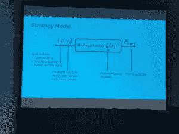
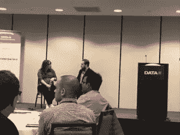
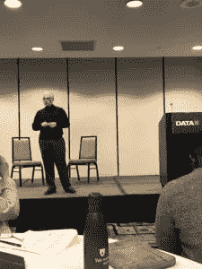
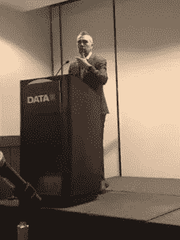
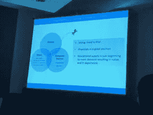

# 来自纽约市 DATAx 会议 7 场会议的见解(2018 年 12 月)

> 原文：<https://towardsdatascience.com/insights-from-7-sessions-of-the-datax-conference-in-nyc-dec-2018-d6265702dbbd?source=collection_archive---------20----------------------->

纽约 DATAx 大会(创新企业峰会)于 2018 年 12 月 12 日和 13 日举行。该活动分为五个平行的赛道会议，侧重于不同的领域，并允许参与者从一个赛道流向另一个赛道。虽然我不能参加每一次会议，但这里有一些我听过的精彩演讲。

# 让数据变得有用

## 凯西·科兹尔科夫，谷歌首席决策科学家

Cassie Kozyrkov 提供了一些可行的建议，让数据科学家在产生业务影响方面更加有用。本次演讲的几个要点包括:

激励你的全体员工查看信息是很重要的；使其易于访问并打破孤岛。

严谨应该从决策者开始。她讨论了学术界如何教授使用最复杂工具的技能，这在多年的实践后成为一个难以打破的习惯，所以当这些人被商业企业聘用时，他们不会神奇地改变他们的思维模式(他们还不知道什么对商业价值来说是重要的)。这意味着他们可能会在错误的项目上投入精力。她建议先对数据进行粗略的扫描，只有当决策者认为这项工作有价值时，才进行更深入的挖掘。

按正确的顺序做事。(你可以在她的文章中读到更多信息:“[人工智能的第一步可能会让你吃惊](https://hackernoon.com/the-first-step-in-ai-might-surprise-you-cbd17a35708a)”)

处理应用项目的正确方法是颠倒算法-输入-输出的顺序，就像这样:考虑输出，然后输入，然后算法/模型。确保每个项目的正确阶段都有正确的领导参与。如果他们是独立的个体(在许多组织中，一个人拥有几个或所有这些角色)，那么您将按如下方式传递接力棒:

*   决策者(关注产出)
*   首席分析师(关注输入)
*   首席机器学习工程师(专注于算法/模型)
*   首席统计师(关注绩效)

在她的演讲中听到的另一个关键信息是“拆分你该死的数据”——凯西称之为最佳生活理念，所以她希望这些话会成为她的墓碑

# Airbnb 动态定价的定制回归模型

## 徐航军，高级机器学习软件工程师，Airbnb

杭军描述了 Airbnb 部署的定价策略模型，这是一个分享家居和体验的在线市场。价格优化的目标是帮助在 Airbnb 上分享房屋的房东为他们的房源设定最佳价格。

与定价策略适用于大量相同产品的传统定价问题相比，Airbnb 上没有“相同”的产品，因为他们平台上的每个列表都为他们的客人提供独特的价值和体验。Airbnb 房源的独特性质使得人们很难估算出一条准确的需求曲线，而这条曲线是应用传统的收入最大化定价策略所必需的。

他们使用监督回归模型，以最优价格为标签。如果一个列表没有以 140 美元被预订，他们不应该以更高的价格(比如 160 美元)列出它。另一方面，如果列表的预定价格是 120 美元，那么他们不应该以低于这个价格(比如 110 美元)的价格列出它。这就创造了一个他们试图平衡的最低和最高预订范围。

该公司面临的一些挑战包括处理非常独特的列表和稀疏的数据。

# 数据驱动的产品管理:如何在亚马逊时代建立成功的客户体验

## 丽贝卡·格林，Handy 首席产品官

在今天的零售环境中，两天发货、点击订购和轻松退货已经成为赌注。为了在亚马逊时代保持竞争力，公司必须适应并超越对即时、无缝和端到端客户体验的期望。

Rebecca 谈到了公司如何通过数据驱动的产品管理来满足不断增长的客户期望。她还分享了在当今的商业环境中，构建成功产品的一些设计决策和客户考虑因素。

我从她的演讲中得到的主要启示是“便利是王道”——让你的买家更容易，也会让你更容易！她提供了一些让顾客生活更轻松的公司的例子:Lowes 的虚拟现实可以让你更快地找到商店里的东西。另一个例子是 Sephora 的调查、配色等。当然，亚马逊提高了免费退货和 2 天送货的风险。

她的公司 Handy 让顾客的生活变得更轻松的一种方式是将其服务与其他公司(如销售家具的 Wayfair)无缝集成。Handy 提供家庭服务(其中一项是组装家具)。通过合作，他们简化了流程，并在一个屏幕上提供家具和组装工作(无需单独结账)，并且无需额外的安排，因为 Handy 正好在送货卡车经过的同一天过来。

他们也使用大量的 A/B 测试来看什么对他们的客户有效。例如，他们试图通过使用 2 分钟的视频宣传 Handy 的工作原理，并通过使用 FAQ 文本部分来揭示在购买时刻，购买者更喜欢阅读 FAQ 而不是观看视频。

# 深度学习闪电入门

## 麦格劳-希尔教育公司分析和 R&D 副总裁 Alfred Essa

深度学习是机器学习中发展最快的领域。在他的演讲中，阿尔弗雷德谈到了什么是深度学习？为什么重要？与其他 ML 技术相比，它是如何工作的？然后，他通过构建一个简单的营销深度学习模型得出结论。

阿尔弗雷德从讨论“极端”的含义开始，他提供了一些例子，如跑马拉松(我完全可以理解)——然后他继续谈论深度学习是机器学习的一个极端情况。

我们讨论了深度学习的各个方面，包括:神经元、层、前向传播、损失和成本函数以及反向传播。最终目标是创建一组实现最低损失或误差的网络参数(权重和偏差)。

# 从金融服务部门的人工智能计划中吸取的 10 条经验教训

## Andy Price，金融服务主管，纯存储

数据驱动的用例正在为商业领域的人工智能(AI)等下一代工作流铺平道路，金融服务业也不例外。为了大规模交付人工智能，组织必须考虑几个主要的依赖因素和挑战，这要求他们对人工智能项目对组织内基础设施的技术要求有高层次的理解。Andy 分享了从金融服务领域的人工智能计划中学到的 10 条经验。

1.  不要低估信息安全挑战—访问您需要的内部数据很困难，其他挑战包括将数据放入公共云中。数据来源计划花费的时间比任何人预计的都要长 2-3 倍
2.  工具和框架正在快速发展——不要对工具过于虔诚。你不想 6 个月正确而永远错误。这里遵循的原则是建立在开放标准的基础上，避免供应商锁定——这样您就可以根据需要换入/换出工具
3.  你的计划是战略性的还是战术性的——提前与客户和利益相关者讨论，因为这可能会推动不同的思维过程。想想必须对解决方案进行全面重新设计的含义。如果你不提前考虑战略方向，技术投资可能会被扔掉。如果是战略性的，就这样对待它，并在允许您无中断扩展的基础上进行构建
4.  人工智能通常对概念验证具有挑战性——测试难的东西——尝试打破它——不要在容易的东西上浪费时间。尽可能进行真实世界的测试；了解你的投资能让你走多远(避免意外)。玩具数据集产生玩具结果
5.  记录您的关键能力—您希望为解决方案设计的实际规模水平是多少；多少个 GPU 等等。你可能想对未来进行再投资，但提前记录这一点是值得的
6.  基础架构关键优先级—让 GPU 保持忙碌，让数据科学家忙于数据科学。避免让数据科学家进行系统集成和系统优化/调整。确保基础设施有能力处理混乱因素；针对一切进行了调整，并且能够同时提供不同的数据类型
7.  认识到数据科学的成本-你不希望数据科学家没有生产力。在纽约，一名数据科学家的平均成本是每年 15 万美元。不要吝啬基础设施投资。如果我们相信软件正在吞噬世界，数据是世界上最有价值的资源，人工智能是第四次工业革命，那么让我们相应地行动和投资。
8.  人工智能是一个管道——不仅仅是培训。60-80%的人工智能工作是数据准备，只有 20-40%是训练。大多数组织都专注于培训部分；但所有早期阶段都包括从组织中各个领域的数据科学家的笔记本电脑中收集各种数据集。需要整合，在端到端平台上保持高效和有效
9.  很少有人了解端到端的解决方案。数据科学家了解工具和框架。基础设施必须能够应对挑战。很少有数据科学家懂基础设施，很少有基础设施人不懂数据科学；需要弥合这一差距
10.  在大型组织中，这变得越来越具有挑战性——需要密切协作；公司在各自为政中工作。AIRI 人工智能就绪基础设施—产品闪存刀片—一旦您的 GPU 数量增加，传统存储将无法跟上

# 从金融领域的机器学习(ML)教学中获得的 5 个经验教训

## Meninder (Mike) Purewal，纽约大学主任、数据科学家兼兼职教授

迈克讲述了他从教授 ML 金融课程中学到的五条经验。

1.  教金融领域的 ML 很难——找到理解金融、数学和计算机科学的独角兽几乎是不可能的。最好的办法是找到覆盖几个领域的人，把他们和覆盖其他专业领域的人组成团队。教育供给刚刚开始满足需求
2.  在金融领域教授 ML 很容易——借助谷歌搜索的便利，你可以快速找到代码，并将其复制粘贴到你的控制台上，然后说你是一名数据科学家。这很有吸引力，也很危险，因为大多数人并不完全了解这种东西是如何工作的
3.  期望与现实——在现实中，工作是艰难的，细节是一种折磨。市场上活跃的产品主要是编码规则 vs. AI。让这些东西运转起来是一件苦差事。对高层领导的期望与现实不符
4.  没有太多好的例子可以教——金融文化倾向于保密(信息囤积)。教科书非常缺乏，所以他建议人们使用博客/ LinkedIn 帖子来学习。他被迫使用 Iris 数据集，因为金融数据很少。这导致人们在实际工作之前无法学习
5.  深度&少 vs .浅层&多——在机器学习中，人们可以选择两个方向。他们可以成为专注于研究的专家(深度&少数)，或者进入咨询/管理角色(浅层&人)。两者都有价值，但它们走的是不同的道路。你需要适当地宣传自己，适当地设定学习目标和期望

# 通过负责任的人工智能加速创新

## 普华永道董事兼兼职教授 Jay Chakraborty

我真的很期待这次会议，因为人工智能和数据科学背景下的“伦理”真的是我最关心的问题

对我来说。Jay 在强调一些例子方面做得很好，这些例子说明了为什么在处理机器/数据时我们需要人的因素。他提供的例子包括 Stanislav Petrov——他承认显示俄罗斯受到攻击的数据中存在问题(他意识到美国不会只派 5 枚导弹来攻击俄罗斯；因为这还不够)——他基本上发现了一个系统故障；点击阅读更多关于[的内容。](https://en.wikipedia.org/wiki/Stanislav_Petrov)

另一个例子是对选美冠军的预测(其中包含主要选择白人女性作为潜在获胜者的偏见)。此外，他提到了一个例子，我计划将这个例子纳入我正在开发的数据科学伦理课程中——这是一个决定警察应该巡逻哪些街区的算法——这通常会导致他们巡逻更贫困的街区，并仅仅因为有机会在那个街区发现更多的“犯罪”。

为了释放人工智能的全部潜力来转变您的业务，需要深入了解客户，将社会和道德影响嵌入人工智能设计和模型开发的结构化方法中。他介绍了负责任的人工智能的伟大模型；它代表着治理、可靠、道德、负责和透明。

Jay 还强调了一个事实，即我们需要摆脱使用“黑盒”的借口，开始打开它并记录进入这些模型/算法的一切。

# 结论

总之，DATAx 大会给我提供了几次学习的机会，让我认识了一些真正有趣的人！