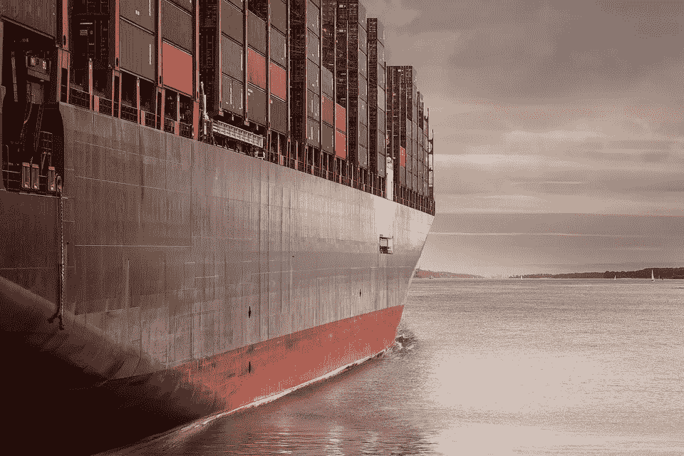

# 智能物流

> 原文：<https://towardsdatascience.com/intelligent-logistics-e85de07c3570?source=collection_archive---------6----------------------->

*【戴上我的公司分析师帽子……】*

**物流领导者开始利用他们的信息物理系统产生的大量数据。通过人工智能，他们发现了更高的效率、更高的性能、更复杂的网络协调和更准确的需求预测。**

物流是一个庞大的行业，已经在全球范围内形成了一个复杂的网络。收入估计为 8 万亿美元，预计到 2024 年将增长到 15.5 万亿美元。与此同时，IDC 预测，到 2020 年，全球人工智能支出将增长至 470 亿美元，相当于 55%的 CAGR。随着人工智能与工业物联网的融合，物流公司现在看到了人工智能的价值。

像供应链的许多部分一样，物流正在经历数字化转型。连接物流价值链会产生更多的数据、更好的互操作性和更强的控制力。现在，它正在被学习系统(深度学习算法的集合)放大，这些系统筛选数据，建立和管理高分辨率模型，微调运营绩效，并预测整个价值链的变化。对于物流运营商来说，这些变化可以实现持续的感知和学习，以及在不断加速的世界中保持敏捷和适应性的能力。

德国物流公司 DHL 认为这是一个 1.9 万亿美元的机会。援引来自能源、安全和技术的压力，他们的物流趋势雷达宣称，“数据驱动和自主供应链的影响为制造、物流、仓储和最后一英里交付方面以前难以想象的优化水平提供了机会，这可能在不到五年的时间内成为现实。”物流正在进入第四次工业革命。

> …围绕不同的地理需求，协调他们的动态供应网络。

**供给&需求**

从库存到交付，该行业一直在持续数字化和自动化。亚马逊现在在其仓库中部署了超过 45，000 台机器人拣货员。学习系统直观地检查新包装，监控货架，为每件商品分配包装，并协调库存从仓库到运输车辆的移动。这种数据、机器人和机器智能的融合已经成为信息物理系统的模板。“我们喜欢将它视为软件、机器学习、计算机算法和人的交响乐，”亚马逊发言人凯利·齐斯曼说。

管理供应和需求可能非常复杂，失误可能意味着错过机会和浪费商品，尤其是易腐商品。Shelf Engine 使用学习系统根据历史需求模式预测订购多少食物。他们帮助零售商 Molly's 增加了 9%的利润。跨国杂货商 Tesco 通过将天气数据输入其预测分析引擎来预测对天气相关食品(如冰淇淋)的需求，节省了 1.4 亿美元。他们使用这些数据来调整每个商店的库存和订单，围绕不同的地理需求来协调他们的动态供应网络。

**从库存到编排**

物流公司必须协调大型供应商、合作伙伴、分包商和车辆网络。这些存在于更大的背景下，如地区需求、全球经济、地缘政治和气候。随着学习系统构建更强大的模型并整合来自世界的信息，它们充当网络指挥者的能力正在增强。ClearMetal 利用预测物流来管理集装箱，解决了这一复杂性。为了降低供应和需求之间的风险，他们跟踪集装箱，评估承运人，并整合关于天气、经济和港口条件的第三方信号，用机器学习对所有这些进行建模。

**引擎盖下**

随着越来越多的组件被连接和感知，越来越多的数据可以输入到学习系统中。罗尔斯·罗伊斯的特伦特·XWB 喷气发动机有数千个传感器，在长途飞行中产生万亿字节的数据。使用微软的 Azure Stream Analytics 和机器智能库，他们可以优化燃油效率并预测维护，从而节省成本并最大限度地减少停机时间。通用运输公司对其机车也采取了同样的做法，同时试图为每天运送 500 万吨货物的美国铁路系统提供仪器。戴姆勒和纳威司达各自在相连的车队中试验了自动驾驶长途卡车——百威英博自动运送了一卡车啤酒(在优步 Otto 无人驾驶设备的帮助下)。百威英博表示，自动卡车运输每年可以在美国节省 5000 万美元。孟买的 ABB 船舶管理展示了许多重工业的路线图。他们正在他们的船上和船之间建立网络，以及连接和自动化操作的服务。这将让他们使用远程控制，然后启动完全自主的系统。ABB 展示了如何利用物理资产获取高分辨率数据，从而为深度分析、预测模型和自我管理奠定基础。

> 这说明了也许是最有价值的机会:降低能源和水的使用，污染和排放，以及工业化的临近。

**含义**

在其关于第四次工业革命的工作中，世界经济论坛宣称“我们正站在一场技术革命的边缘，这场革命将从根本上改变我们的生活、工作和人际交往方式。”物流领域的领导者一直在稳步奠定这一基础，现在正在构建学习系统来理解所有数据。初创公司正试图分拆物流，让大型运营商拥有一些灵活性和撤资的机会，同时也威胁到他们的控制权。这推动了更多的竞争和并购。

自动化、预测和协调复杂、动态的生态系统以提高性能和效率的能力将继续吸引 R&D 并保证季度收益。谷歌已经表明，其 DeepMind 学习系统可以将数据中心的能源成本降低 15%。他们不仅在其数据中心部署了这一解决方案，而且现在他们正在与英国国家电网合作，看看相同的解决方案是否可以降低英国能源足迹的总体负荷。这说明了也许是最有价值的机会:降低能源和水的使用，污染和排放，以及工业化的临近。

**路障**

物流转型面临诸多挑战。人工智能很难，物流是一个庞大而分散的行业，协调着数万家企业。存在相当大的数据和互操作性挑战，但人工智能可以被训练在它们之间进行翻译。该行业厌恶风险，采用速度缓慢，尤其是当网络暴露出安全和漏洞问题时。此外，随着自主系统继续对人类劳动力施加压力，监管反应将会很强烈。在美国，350 万工人驾驶运输车辆。随着物流车队变得自主，劳工危机将会发展，并推动监管机构施加限制。

还有许多挑战有待解决，但人工智能提供的能力太强大了，不容忽视。这是影响所有行业的下一波数字化转型。