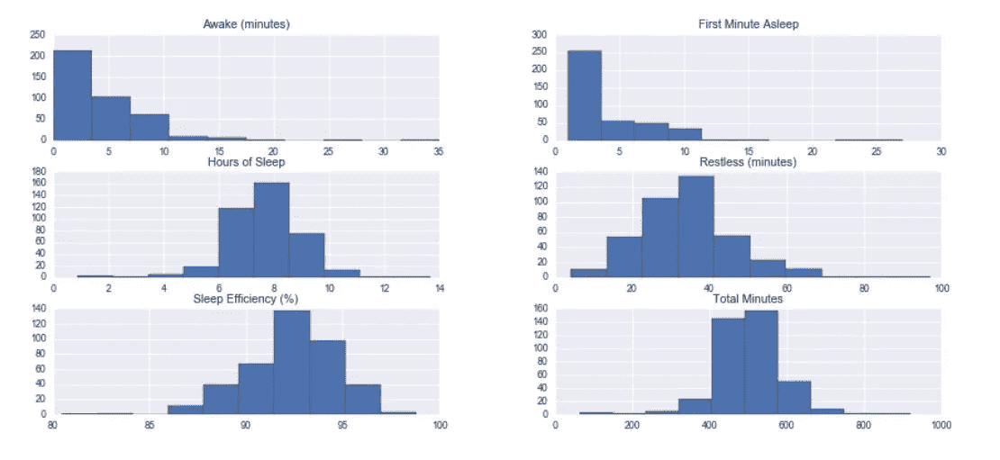
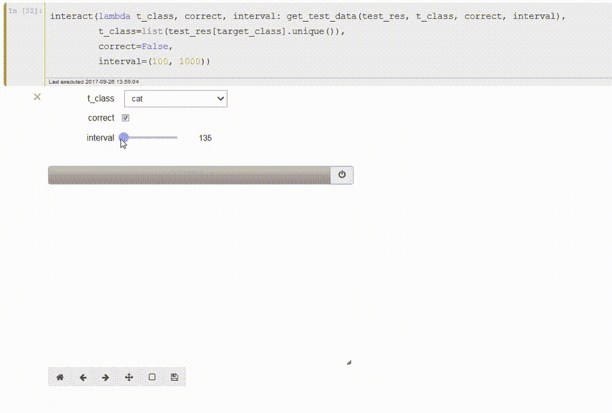

# Jupyter 笔记本中的交互式可视化

> 原文：<https://towardsdatascience.com/interactive-visualizations-in-jupyter-notebook-3be02ab2b8cd?source=collection_archive---------0----------------------->

这篇文章并不详尽地介绍了如何直接从 Jupyter 笔记本上创建交互式内容。*内容*主要是指数据可视化工件，但我们将看到我们可以轻松地扩展到通常的图表之外，为各种场景提供有价值的交互位，从数据探索到动画。

我将从简单介绍数据可视化开始，并更好地定义本文中的交互性的范围和含义。
然后我将提供一个相关工具的快速概述(Plotly 和 ipywidgets)以及一些关于 Jupyter 生态系统的一般性建议。
最后，我将展示一些具体的例子，大部分是指我的个人项目，以及我依靠这些互动片段获得的改进。这最后一部分正是为了在 Jupyter 这样一个令人印象深刻的框架上展示这些工具的能力。这一切都是为了推动你尝试自己的项目，并传播这个词。

# 介绍

数据可视化是成为一名优秀的数据科学家所需的核心技能之一——或者任何其他与数据相关的角色。它既能让您(或团队中的其他人)更好地理解数据集的本质，又能向外部受众(技术和非技术)传达正确的信息。

当搜索“数据可视化”时，最常见的建议编程库之一是 D3.js，但是[一些](https://www.quora.com/Is-d3-js-worth-learning)断言，当你搜索非常个性化/定制化的方法和随之而来的结果时，它是值得深入这样的工具的。如果您的目标是更直接和“标准”的可视化，那么您选择的语言中已经可用的包可能是更好的方法。

对于 Python 生态系统来说，不可避免地从 [Matplotlib](http://matplotlib.org/) 的基础块开始，然后可能扩展到更高级别的替代(例如 [Seaborn](https://seaborn.pydata.org/) 、 [Bokeh](https://bokeh.pydata.org/en/latest/) )。一个额外的[越来越有保障的](https://www.oreilly.com/ideas/the-state-of-jupyter)选择——特别是对于数据科学数字——是使用 [Jupyter 笔记本](http://jupyter-notebook-beginner-guide.readthedocs.io/en/latest/what_is_jupyter.html)。我相信 Jupyter 崛起背后的主要力量和原因之一是它如何将不同的媒体打包在一个简单的解决方案中:你编码，你写作，你可视化。它不仅能让你在工作时变得流畅愉快，还能极大地简化这类工作的分享，无论是出于教育还是协作目的。

就个人而言，结合 Jupyter 的支持，我发现 Matplotlib+Seaborn 组合非常适合我的可视化需求，甚至比 Pandas 的额外[嵌入式绘图功能更好。当需要动画功能时，Matplotlib 1.1 版中的简单动画框架在可用性和结果之间提供了很好的折衷。](https://pandas.pydata.org/pandas-docs/stable/generated/pandas.DataFrame.plot.html)

但在某一点上，人们觉得需要更多的东西。并不是完全转向新工具，只是在必要时依赖它们。在这方面，我个人认为有两种类型的互动:

*   **互动图**:关于当前探索的特定点或区域的实时信息，加上高亮/隐藏特定内容的可能性。
*   **用于内容交互的窗口小部件**:这超越了图形情节，扩展到其他类型的媒体和内容，通常需要一个或多个复杂的 UI 元素来收集外部输入。

对于前者，我现在在使用[plottly](https://plot.ly/python/)中找到了极大的满足感。对于后者，我专门搜索了可以轻松嵌入 Jupyter 的解决方案，这样我几乎可以将我的任何笔记本变成交互式仪表盘。为此，我们将研究 ipywidgets。

# 工具

在讨论之前提到的工具的细节之前，这里有一些我认为值得分享的关于 Python 和 Jupyter 生态系统的个人建议。

**第一个建议**:使用 [Anaconda](https://docs.continuum.io/) (一个 Python 发行版等等)。
**第二个建议**:使用[虚拟环境](http://docs.python-guide.org/en/latest/dev/virtualenvs/)(相当于 Anaconda[)。是关于管理多个独立的 Python 环境。
**第三个建议**:参见](https://conda.io/docs/user-guide/tasks/manage-environments.html) [nb_conda_kernels](https://github.com/Anaconda-Platform/nb_conda_kernels) 从你的 Jupyter 笔记本管理多个环境/内核。
**第四条建议**:用 [Jupyter 扩展](https://github.com/ipython-contrib/jupyter_contrib_nbextensions)定制你的 Jupyter 的****

## Plotly

[Plotly](https://plot.ly/python/) 让创建和分享互动情节变得非常容易。这个库的一个伟大之处在于它为你的图形提供了无缝的网络托管能力。通常情况下，你可以获得一个免费账户，但代价是你托管的一切都将是公开的。但与一些人所说的相反，如果需要的话[你绝对可以完全离线使用 Plotly](https://plot.ly/python/offline/)，直接在笔记本上渲染互动情节，并能够将它们导出为(仍然互动的)HTML 文件。

如果这还不够的话，还有两个特征让这个包更有吸引力:`plot_mpl`和袖扣。
前一种方法执行从纯 matplotlib 图形到交互式 Plotly 图形的直接转换(这种操作还不完美，但正在迅速变得越来越好)。

相反，袖扣是熊猫数据框和图案之间的自动绑定。这种绑定再次保证，只需一次调用，您就可以获得 dataframe 内容的高质量数据可视化，具有自动解析和格式化日期时间值以及推断的色调和列标签管理等优点。

开始使用 Plotly(在一般情况下)就像跑步一样简单

```
pip install plotly
pip install cufflinks
```

然后，您必须为您的每台笔记本电脑选择在线或离线绘图。同时记住`.iplot()`是显示 Jupyter 内部内容的神奇语法。

## ipywidgets

ipywidgets 是关于在你的笔记本中易于构建的交互式图形用户界面。这又是一个在灵活性和可用性之间做出巨大妥协的工具。

在[安装步骤](https://ipywidgets.readthedocs.io/en/stable/user_install.html)之后，真正要做的就是发挥创造力，了解如何在项目中最好地利用新功能。这个想法是让小部件作为你的内容的交互界面，例如滑块、复选框、按钮、文本框等。

当您开始使用时，最令人印象深刻的是[交互功能，](https://ipywidgets.readthedocs.io/en/stable/examples/Using%20Interact.html)，它根据传递的参数自动生成您的小部件(可能有多个组件)。例如，传递带有布尔值的参数会自动生成相应的复选框；取而代之的是，一个值列表被转换成一个下拉小部件。
所有的机制都非常简单，并且在官方文档中有详细的解释，所以让我们转到展示部分。

# 显示优点的东西

现在，为了演示到目前为止所解释的内容，加上一点无耻的自我宣传，这里有一个来自个人项目的例子列表。

包含不同的更复杂的项目的事实实际上是为什么我没有简单地为这个条目写一个笔记本，而是选择了一个老式的文章。然而，你可以在我的 [Github repo](https://github.com/5agado) 中找到所有的项目，一些简单到[自包含和可复制的笔记本](https://github.com/5agado/data-science-learning)

# 示例 1: Fitbit 仪表板

这个例子可能会让我的一些量化自拍伙伴特别感兴趣，或者总的来说，对于那些为了探索和获得洞察力而想要轻松显示个人数据的人来说，不需要太多精细的工作(构建一个完整的仪表板应用程序)，但仍然保证拥有灵活性——可能是变化无常的——需求(是的，这意味着编码)。

我的 Fitbit 睡眠数据就是一个例子，其中我在可能的不同粒度级别(例如，一天、工作日、一年)有不同的统计数据要可视化(例如，睡眠效率、睡眠值计数、入睡的第一分钟)。一种选择是使用 Seaborn factorplot 并一次可视化目标统计数据的子集。



Static Seaborn Factorplot for summary stats

这对于简单的情况有效，但是当内容变得更加混乱时，情节就失去了有效性。例如，转到按月显示工作日统计数据，我们可以得到如下结果


Static weekday stat by month

已经有太多的信息了，如果你不像我一样擅长颜色，就不容易找到数据。如果这是一个打印的情节，它肯定不符合良好的沟通和情节指南。转移到 Plotly 为这种情况提供了一个解决方案，可以通过三种方式进行:

*   将 matplotlib 图形直接传递给`iplot_mpl`方法
*   使用 Plotly 语法从头开始创建您的绘图
*   使用袖扣，直接从你的熊猫数据框中绘图

在这种情况下，最后一个选项是最直接和最精确的，因为原始数据格式只是将工作日转换为目标 stat 的行、月和列，这里是我按月列出的工作日睡眠效率。

综合所有这些，我最终得到了一个我认为相当不错的睡眠数据仪表板。

Demo of Jupyer as dashboard for Fitbit sleep data

# 示例 2:营养数据库

您可能希望有一个快速的界面来访问一些结构化的内容。例如，我在研究营养数据时就这么做了。特别是，我转述了[美国农业部国家营养数据库](https://www.ars.usda.gov/northeast-area/beltsville-md/beltsville-human-nutrition-research-center/nutrient-data-laboratory/docs/sr28-download-files/)。这是一个非常丰富和相对复杂的数据集，但可以很容易地用 Python 和 Pandas 解决。

有人可能会争辩说，这只是数据库范围内的事情，一个合适的 SQL 工具将证明更适合这种情况。这可能是真的，但是我仍然想展示通过 ipywidgets 在 Jupyter 中实现这一点是多么容易，以及对于某些人来说，这最终会成为比单独的数据库系统更好的临时选择，尤其是在数据探索期间。


Interacting with Nutrient Database

在这里，您可以看到我再次简单地依赖于`interact`函数，传递我的原始 Python 函数(参数化的)，加上将自动映射到小部件的参数:

*   *food:* 空列表，转换为文本框
*   *营养素:*数据库中存在的独特营养素的列表，它被转换成一个下拉小部件

# 示例 3:动画

如前所述，一旦你手头有了好的工具，交互性对于各种场景都是很方便的，动画肯定是其中之一。

一个简单的 intslider(由`interact`在传递一个`(min,max,step)`元组时自动生成)，可以极大地帮助探索不同分辨率或复杂性的动画，正如这个模拟[康威的生命游戏](https://en.wikipedia.org/wiki/Conway%27s_Game_of_Life)所示。


Conway’s Game of Life simulation

此外，您可以构建自定义界面来快速浏览您的数据和相关分析结果，就像在这个示例中，我可视化了 CNN 在猫狗数据集上训练的内部图层输出。



CNN Layer Output Heatmap Demo

有许多可视化的框架和工具可用，特别是对于机器学习任务，但有时像上面这样快速而肮脏的解决方案可以节省大量时间，同时提供所有实际需要的信息和功能。

# 结论

所有展示都是使用所列工具提供的非常基本的功能获得的。例如，考虑所有与 ipywidgets 相关的例子都简单地使用了`interact`并对生成的小部件进行类型推断。正如官方文档中的[很好地解释的那样，通过自定义小部件定义和组合可以获得更多。](https://ipywidgets.readthedocs.io/en/stable/examples/Widget%20List.html)

通过这个条目，我想准确地传播这个词，并迅速显示这些工具在简单性和定制化方面的巨大价值。同时，我也对关于数据可视化工具的一般反馈感兴趣，特别是关于可能包含更多边缘领域(如 3D 建模和动画)的框架。

作为最后的赠品，我想强烈推荐[这个库](https://github.com/dunovank/jupyter-themes)，它提供了可选的 Jupyter 主题和额外的视觉定制。