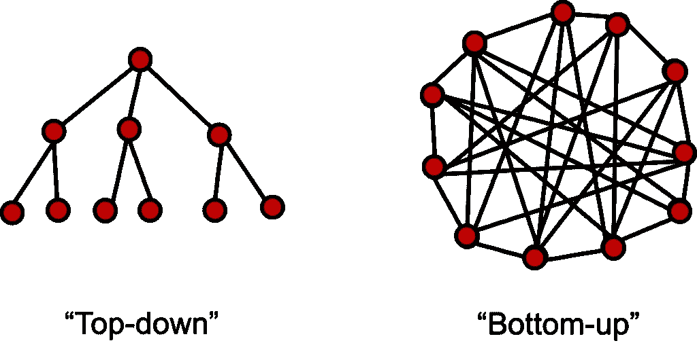
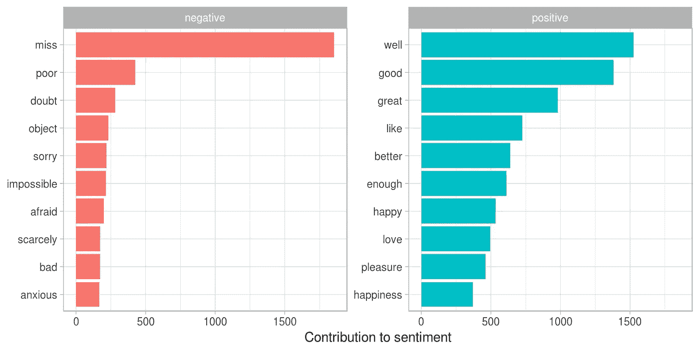
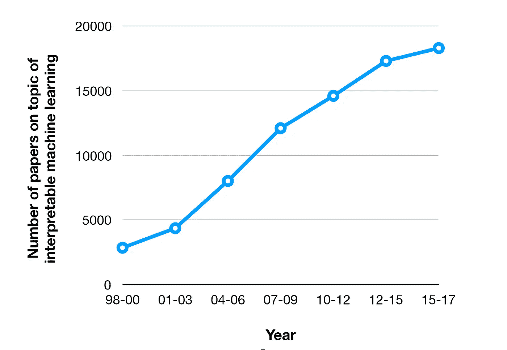

# 解释机器学习模型

> 原文：<https://towardsdatascience.com/interpretability-in-machine-learning-70c30694a05f?source=collection_archive---------2----------------------->

不管您的数据科学解决方案的最终目标是什么，最终用户总是更喜欢可解释和可理解的解决方案。此外，作为一名数据科学家，您将始终受益于模型的可解释性，以验证和改进您的工作。在这篇博文中，我试图解释可解释性在机器学习中的重要性，并讨论一些简单的动作和框架，你可以自己进行实验。

[xkcd](https://xkcd.com/1838/) on Machine Learning

## 为什么机器学习中的可解释性很重要？

在传统统计学中，我们通过调查大量数据来构建和验证假设。我们建立模型来构建规则，这些规则可以整合到我们的心理过程模型中。例如，一家营销公司可以建立一个将营销活动数据与财务数据相关联的模型，以确定什么构成了有效的营销活动。这是一种自上而下的数据科学方法，可解释性是关键，因为它是所定义的规则和流程的基石。因为相关性通常不等于因果性，所以在做出决策和解释决策时，需要对模型有充分的理解。

在自下而上的数据科学方法中，我们将部分业务流程委托给机器学习模型。此外，机器学习使全新的商业理念成为可能。自下而上的数据科学通常对应于手工和费力任务的自动化。例如，制造企业可以在机器上安装传感器，并进行预测性维护。因此，维护工程师可以更高效地工作，并且不需要执行昂贵的定期检查。模型的可解释性对于验证模型所做的事情是否符合您的期望是必要的，它允许与用户建立信任，并简化从手工到自动化过程的转换。

In a top-down process, you iteratively construct and validate a set of hypotheses. In a bottom-up approach, you attempt to automate a process by solving a problem from the bottom-up.

作为一名数据科学家，您通常关心微调模型以获得最佳性能。数据科学通常被框定为:“给定带有标签 y 的数据 X，找出误差最小的模型”。虽然训练性能模型的能力对于数据科学家来说是一项关键技能，但能够放眼全局也很重要。数据和机器学习模型的可解释性是数据科学管道实际“有用性”的关键方面之一，它确保模型与您想要解决的问题保持一致。虽然在构建模型时很容易迷失自己，但能够正确解释您的发现是数据科学过程中必不可少的一部分。

Interpreting models is necessary to verify the usefulness of the model predictions.

## 为什么对你的模型进行深入分析是必要的？

作为一名数据科学家，关注模型可解释性有几个原因。尽管这两者之间有重叠，但它们抓住了可解释性的不同动机:

> 识别并减少偏见。

任何数据集中都可能存在偏差，这取决于数据科学家如何识别并尝试解决它。数据集的大小有限，可能无法代表全部人口，或者数据采集过程可能没有考虑潜在的偏差。偏差通常只有在彻底的数据分析之后或者当模型预测和模型输入之间的关系被分析时才变得明显。如果你想了解更多不同类型的偏见，我强烈推荐下面的视频。请注意，解决偏见没有单一的解决方案，但意识到潜在的偏见是实现可解释性的关键一步。

偏见的其他例子如下:

例如，word2vec 向量包含[性别偏见](http://wordbias.umiacs.umd.edu/)，这是由于它们被训练的语料库中存在固有偏见。当你用这些单词嵌入来训练一个模型时，搜索“技术简介”的招聘人员会把女性简历放在最下面。

例如，当您在小型手动创建的数据集上训练对象检测模型时，通常情况是图像的宽度太有限。需要不同环境、不同闪电条件和不同角度下的各种物体图像，以避免模型只适合数据中的噪声和不重要的元素。

> 说明问题的背景。

在大多数问题中，您使用的数据集只是您试图解决的问题的粗略表示，而机器学习模型通常无法捕捉真实任务的全部复杂性。可解释的模型有助于您理解和考虑模型中包含(不包含)的因素，并在根据模型预测采取措施时考虑问题的背景。

> 提高通用性和性能。

高的可解释性通常会导致模型更好地概括。可解释性不是理解模型中所有数据点的每一个细节。扎实的数据、模型和对问题的理解的结合对于拥有一个表现更好的解决方案是必要的。

> 道德和法律原因。

在金融和医疗保健等行业，审计决策过程并确保其没有歧视或违反任何法律是至关重要的。随着 GDPR 等数据和隐私保护法规的兴起，可解释性变得更加重要。此外，在医疗应用或无人驾驶汽车中，一个不正确的预测就会产生重大影响，因此能够“验证”该模型至关重要。因此，系统应该能够解释它是如何得出给定建议的。

## 解读你的模型

关于模型可解释性的一个常见说法是，随着模型复杂性的增加，模型可解释性下降的速度至少也一样快。特征重要性是解释模型的一个基本(通常是免费的)方法。即使对于深度学习等黑盒模型，也存在提高可解释性的技术。最后，将讨论作为模型分析工具箱的 LIME 框架。

**特征重要性**

*   广义线性模型

广义线性模型( [GLM 的](https://en.wikipedia.org/wiki/Generalized_linear_model))都基于以下原则:
如果你将你的特征 *x* 与模型权重 *w* 进行线性组合，并通过挤压函数 *f* 输入结果，你就可以用它来预测各种各样的反应变量。GLM 最常见的应用是回归(线性回归)、分类(逻辑回归)或泊松过程建模(泊松回归)。训练后获得的权重是特征重要性的直接代表，并且它们提供了模型内部的非常具体的解释。

例如，在构建文本分类器时，您可以绘制最重要的特征，并验证模型是否过度拟合噪声。如果最重要的词不符合您的直觉(例如，名称或停用词)，这可能意味着模型适合数据集中的噪声，并且它不会在新数据上表现良好。

An example of a neat visualisation for text interpretability purposes from [TidyTextMining](https://www.tidytextmining.com/02-sentiment-analysis_files/figure-html/pipetoplot-1.png).

*   兰登森林和 SVM 的

甚至诸如基于树的模型(例如随机森林)的非线性模型也允许获得关于特征重要性的信息。在随机森林中，在训练模型时，特征重要性是免费的，因此这是验证初始假设和识别模型正在学习“什么”的一种很好的方式。基于核的方法中的权重，例如 SVM 的，通常不是特征重要性的很好的代理。核方法的优势在于，您可以通过将特征投影到核空间来捕捉变量之间的非线性关系。另一方面，仅仅把权重看做特征重要性并不能公正地对待特征交互。

By looking at the feature importance, you can identify what the model is learning. As a lot of importance in this model is put into time of the day, it might be worthwhile to incorporate additional time-based features. ([Kaggle](https://www.kaggle.com/general/13285))

*   深度学习

由于参数的剪切数量以及提取和组合特征的复杂方法，深度学习模型因其不可解释性而臭名昭著。由于这类模型能够在许多任务中获得最先进的性能，许多研究都集中在将模型预测与输入联系起来。

The amount of research on interpretable machine learning is growing rapidly ([MIT](http://people.csail.mit.edu/beenkim/papers/BeenK_FinaleDV_ICML2017_tutorial.pdf)).

特别是当转向处理文本和图像数据的更复杂的系统时，很难解释模型实际上在学习什么。目前研究的主要焦点主要是将输出或预测与输入数据联系和关联起来。虽然这在线性模型的背景下相当容易，但对于深度学习网络来说，这仍然是一个未解决的问题。两种主要的方法是基于梯度或基于注意力。

-在基于梯度的方法中，在反向过程中计算的目标概念的梯度被用于产生一个映射，该映射突出了用于预测目标概念的输入中的重要区域。这通常应用于计算机视觉的环境中。

[Grad-CAM](https://arxiv.org/pdf/1610.02391.pdf), a gradient-based method is used in visual caption generation. Based on the output caption, the method determines which regions in the input image were important.

-基于注意力的方法通常用于顺序数据(如文本数据)。除了网络的正常权重，注意力权重被训练为“输入门”。这些注意力权重决定了每个不同元素在最终网络输出中的比重。除了可解释性之外，在例如基于文本的问答环境中的注意力也导致更好的结果，因为网络能够“聚焦”它的注意力。

In question answering with attention, it is possible to indicate which words in the text are most important to determine the answer on a question.

**石灰**

[Lime](https://github.com/marcotcr/lime) 是一个更通用的框架，旨在使“任何”机器学习模型的预测更具可解释性。

为了保持与模型无关，LIME 通过局部修改模型的输入来工作。因此，不是试图同时理解整个模型，而是修改特定的输入实例，并监控对预测的影响。在文本分类的上下文中，这意味着一些单词例如被替换，以确定输入的哪些元素影响预测。

如果你对机器学习的可解释性有任何问题，我很乐意在评论中阅读。如果你想收到我博客的更新，请在 [Medium](https://medium.com/@lars.hulstaert) 或 [Twitter](https://twitter.com/LarsHulstaert) 上关注我！