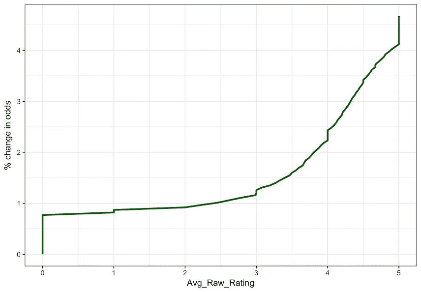

# 具有附加模型的可解释 ML

> 原文：<https://towardsdatascience.com/interpretable-ml-with-additive-models-a3a4100643cc?source=collection_archive---------6----------------------->

今年早些时候，我去听了微软研究院 Rich Caruana 的精彩演讲，他讲述了如何为医学应用构建可解释的 ML 模型。作为可解释 ML 的支持者，Rich Caruana 去年在 NIPS 与 Yann LeCun 在[进行了一场激烈的辩论。这里我总结一下他的想法，并给出自己的解读。](https://www.youtube.com/watch?v=93Xv8vJ2acI)

主要的想法是，我们可以建立一个人类可解释的 ML 模型，通过使它与明确指定的交互相加。那么什么是加法模型呢？想想好的旧回归模型。在简单的回归模型中，一个变量的影响不依赖于其他变量，它们的影响加起来就是总的影响。如果我们能够单独理解每个变量或者稍微理解一下**，我们就能够解释整个模型。然而，在存在相互作用的情况下，这将不再是真实的。**

**[两个变量之间的相互作用](https://en.wikipedia.org/wiki/Interaction_(statistics))是指两个变量的影响相互依赖。交互会使模型更难解释。即使我们理解了每个变量是如何改变模型预测的，当几个变量发生变化时，我们仍然无法计算出模型预测。就像有几种有益的药物，结合起来就变成了毒药。当有许多变量和许多相互作用时，就不可能解开变量的影响。**

**这正是大多数 ML 车型的问题所在。在决策树中，我们可以先用一个变量分裂分支，然后再用另一个变量分裂；这实质上是创造互动。我们可以通过跟随分裂来解释一个小的决策树，但是当树变得更大或者形成一个随机的森林时，这很容易变成一个痛苦。在多层神经网络中，由于每个隐藏单元是输入的非线性组合，因此当通过隐藏层传播时，会隐式地创建交互。**

> **我们可以通过允许每个变量具有更灵活但仍有附加效应来使简单的回归模型更强大。我们不会假设每个变量都有线性效应，而是用任意函数 f 来建模变量的边际效应，为了保持模型的可解释性，我们将显式地添加交互作用；同样，每个交互都可能产生任意效果。**

****

**这不是一个全新的想法，因为它显然类似于[广义加法模型](https://en.wikipedia.org/wiki/Generalized_additive_model)。然而，在 GAMs 中，平滑样条通常用于 *f* 。[在论文](https://www.microsoft.com/en-us/research/wp-content/uploads/2017/06/KDD2015FinalDraftIntelligibleModels4HealthCare_igt143e-caruanaA.pdf)中，里奇·卡鲁阿纳增加了一个更 ML 的转折；函数 *f* 用随机森林建模(针对每个变量)。我认为高斯过程可能同样有效，如果不是更好的话；尽管实际上随机森林更方便。**

****

**我们可以通过查看每个变量的**边际效应**来解释模型。代替读取回归模型系数，模型预测如何作为感兴趣变量的函数而变化的图明确地讲述了一个相当完整的故事。正如我们在上面看到的，呼吸率似乎在 30 到 60 之间有很强的正效应，这种效应在 30 之前不会出现，在 60 以上就会减弱。如果我们有一个简单的回归模型，估计的影响在整个范围内会是适度的正的和线性的。通过更好地模拟每个变量的边际效应，我们可以得到一个更准确的模型。其实这个模型和其他黑箱 ML 模型一样好。**

**最后一部分是我对此的看法。为了更好地模拟边际效应，另一种方法是变量转换或“特征工程”，这是本书中最古老的技巧。根据我的经验，当处理偏斜变量时，标准的预处理方法通常不会很好地工作；而用他们训练出来的 ML 模型会很差。百分点转换可以解决这一问题，因为它强制每个变量不偏不倚，并且在同一尺度上。为了解释这个模型，我们可以像 Rich Caruana 一样进行反向转换(反向百分位数)并绘制边际效应。**

********

**例如，感兴趣的变量是谷歌对本地企业的评级，这在整体上是高度倾斜的，并且在不同的企业类型之间是不同的。直接使用原始评级不会产生好的模型。在执行百分位数转换后，我们可以更好地捕捉在谷歌搜索中被推荐的概率的边际效应。当评分较低时(0 到 3)，几乎没有任何影响。但当评分高于 3 时，随着评分的增加，这种影响实际上会稍大一些。这个结果是有道理的，因为谷歌可能永远不会推荐二星级的企业；在评级较高的企业中，0.1 的增长将产生平局打破效应。**

**归根结底，所有的模型都是错的。很难说变量应该总是有累加效应。但是实践中的大多数 ML 模型都是由人类使用或为人类使用的。重要的是我们能够理解 ML 模型。假设可加性和更好地模拟边际效应肯定会给我们更多可解释的模型。**