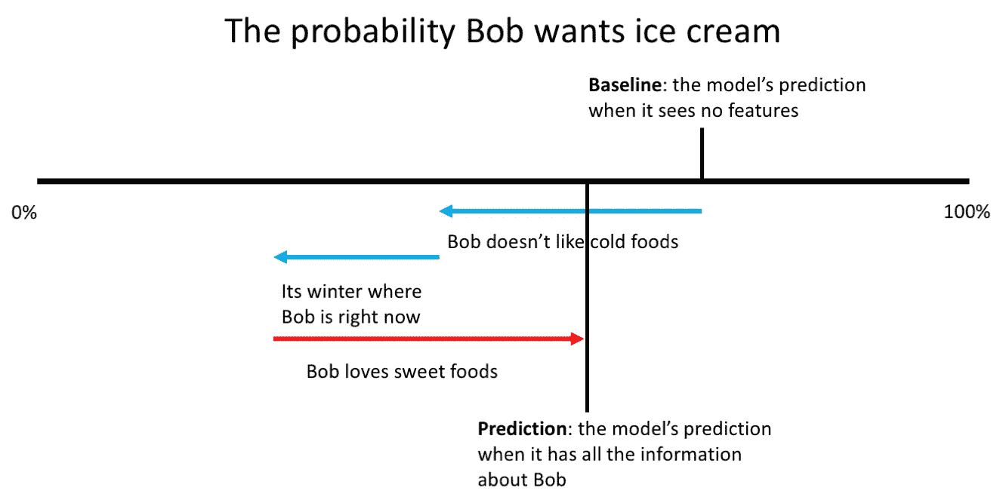
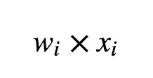
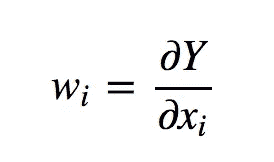
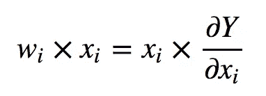
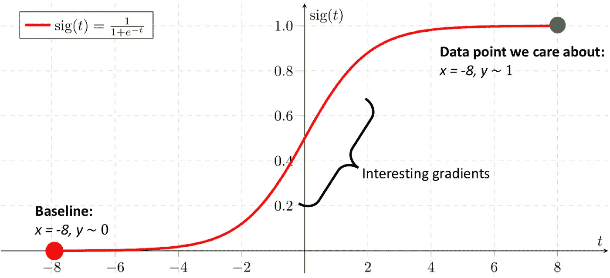
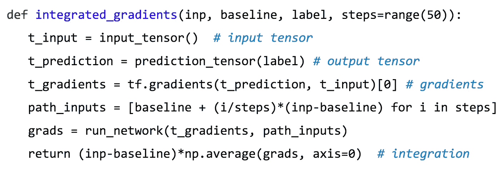
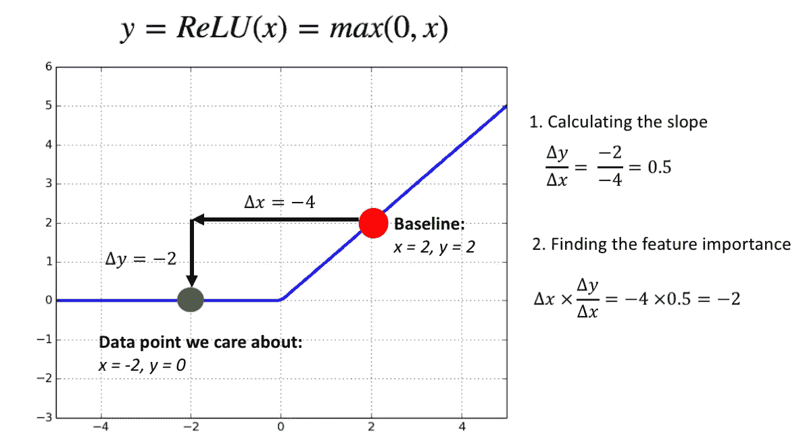

# 可解释神经网络

> 原文：<https://towardsdatascience.com/interpretable-neural-networks-45ac8aa91411?source=collection_archive---------3----------------------->

解释黑盒模型是机器学习中的一个重大挑战，可以显著减少采用该技术的障碍。

在[之前的一篇文章](https://medium.com/@gabrieltseng/interpreting-complex-models-with-shap-values-1c187db6ec83)中，我讨论了使用[形状值](https://github.com/slundberg/shap)解释复杂的机器学习模型。总而言之，对于特定的特征，当模型可以看到该特征时和当它不能看到该特征时，会比较模型对于特定数据点的预测，这种差异的大小告诉我们该特征对于模型的预测有多重要。

在下面的例子中，我们建立了一个模型来预测某人是否想要冰淇淋，它由三个特征组成:他们是否喜欢冷食，他们现在所处的季节以及他们是否喜欢甜食。Shap 值允许我们解释单个数据点的模型输出—在本例中，对于 Bob:

Inspired by the diagrams in the [shap values paper](https://papers.nips.cc/paper/7062-a-unified-approach-to-interpreting-model-predictions.pdf)

这个冰淇淋模型有两点需要注意:首先，当模型看不到特征时，特征的效果与模型预测的基线进行比较。其次，特征重要性的总和(红色和蓝色箭头)是该基线和 Bob 的模型实际预测之间的差异。

不幸的是，虽然某些机器学习算法(如 XGBoost)可以处理空特征值(即看不到某个特征)，但神经网络不能，因此需要一种略有不同的方法来解释它们。迄今为止，最常见的方法是考虑输入相对于预测的梯度。

在这篇文章中，我将讲述使用这些渐变背后的直觉，以及由此产生的两种具体技术:集成渐变和深度提升。

# 使用梯度解释神经网络

可能最难解释的模型——也是我们将用作灵感的模型——是回归。在一个回归中，每个特征 *x* 被分配一个权重 *w* ，这直接告诉我该特征对模型的重要性。

具体来说，对于特定数据点的第 *i* 个特征，该特征对模型输出的贡献为

这个重量 *w* 代表什么？因为回归是

然后

换句话说，分配给第 *i* 个特征的权重告诉我们该特征相对于模型预测的梯度:模型的预测如何随着特征的改变而改变。

方便的是，这个梯度对于神经网络来说很容易计算。因此，与回归一样，一个特性的贡献是

，也许梯度可以用来解释神经网络的输出。

在尝试使用这种方法时，我们会遇到两个问题:

首先，特性的重要性是相对的。对于梯度增强决策树，特征的 shap 值告诉我，相对于没有看到该特征的模型，特征如何改变模型*的预测。由于神经网络不能处理空输入特征，我们需要重新定义一个特征相对于其他东西的影响。*

为了克服这一点，我们将定义一个新的基线:我的输入与什么进行比较？一个例子是 MNIST 数字数据集。因为所有的数字都是白色的，背景是黑色的，所以一个合理的背景应该是全黑的图像，因为这不代表关于数字的任何信息。

Some MNIST digit examples, and a reasonable baseline for them

为其他数据集选择背景要简单得多——例如， [ImageNet](http://www.image-net.org/) 数据集的背景应该是什么？我们稍后将讨论这个问题的解决方案，但是现在让我们假设我们可以为每个数据集找到一个基线。

第二个问题是，使用输出相对于输入的梯度对于线性模型(如回归)很有效，但对于非线性模型则很快失效。为了了解原因，让我们考虑一个仅由一个 [ReLU 激活](https://en.wikipedia.org/wiki/Rectifier_%28neural_networks%29)组成的“神经网络”，其基线输入为 *x=2* 。

现在，让我们考虑第二个数据点，在 *x = -2* ***。***

*ReLU(x=2) = 2* ，而 *ReLU(x=-2) = 0* ，所以我的输入特征 *x = -2* 相对于基线改变了我的模型的输出 2。我的模型输出的这种变化必须归因于 x 的变化，因为它是这个模型的唯一输入特征，但是 ReLU(x)在点 *x = -2* 的梯度是 0！这告诉我 x 对产出的贡献是 0，这显然是一个矛盾。

出现这种情况有两个原因:首先，我们关心函数中的一个有限差(当 *x = 2* 时的函数和当 *x = -2* 时的函数之差)，但是梯度计算的是无穷小的差。其次，ReLU 函数可能会饱和——一旦 *x* 小于 0，它变小多少都无关紧要，因为该函数只会输出 0。正如我们在上面看到的，这导致了不一致的模型解释，其中输出相对于基线发生了变化，但是没有特征被标记为引起了这种变化。

这些不一致正是 Integrated Gradients 和 DeepLIFT 试图解决的问题。他们都认识到，最终，我们关心的不是点 x 的梯度。我们关心当输入从基线改变*时，输出如何从基线*改变*。*

# 集成渐变

积分梯度所采用的方法是提出以下问题:我可以计算什么，它类似于也承认基线存在的梯度？

部分问题在于基线处的梯度(相对于输入的输出)将不同于我测量的输出处的梯度；理想情况下，我会考虑两点的梯度。但是这还不够:考虑一个 [sigmoid 函数](https://en.wikipedia.org/wiki/Sigmoid_function)，其中我的基线输出接近 0，我的目标输出接近 1:

这里，我的基线和数据点的梯度都接近于 0。事实上，所有有趣的——也是信息丰富的——梯度都在两个数据点之间，所以理想情况下，我们也会找到一种方法来捕捉所有这些信息。

这正是积分梯度所做的，通过计算基线和感兴趣点之间的梯度积分。实际上，计算梯度的积分是很难的，因此，相反，它们是使用[赖曼和](https://en.wikipedia.org/wiki/Riemann_sum)来近似的:梯度是在基线和感兴趣的点之间的许多小步长上获得的。

这非常容易实现——事实上，Integrated Gradients 的作者在他们的 [ICML 演讲](https://github.com/ankurtaly/Integrated-Gradients/blob/master/icml_slides.pdf)中演示了一个七行代码的实现:

然而，缺点是，由于我们是在近似一个积分，我们的解释也将是一个近似。此外，这种方法非常耗时；理想情况下，我们的 Reimann 和中的步长较小，因此我们可以非常接近积分，但每一步都需要网络的反向传递。

# 深层提升

采用的方法 [DeepLIFT](https://arxiv.org/abs/1704.02685) 在概念上非常简单，但实现起来很棘手。DeepLIFT 认识到我们关心的不是梯度，它描述了在点*x*T15 处 *y* 如何随着 *x* 改变**而改变，而是*斜率*，它描述了 *y* 如何随着 *x* 与基线**不同**而改变。**

事实上，如果我们考虑斜率而不是梯度，那么我们可以将特征的重要性重新定义为

这是很好的动机，因为我们关心与基线相关的一切。将此应用于我们的网络:

这个方法告诉我们，输入 *x* 的重要性值为-2。或者，换句话说:“与基线相比，输入 *x = -2* 改变了模型的输出-2”。既然事实如此，这种方法就很有意义。

现在，对于每一层，我将计算斜率而不是梯度，其中

Note that the inputs and outputs here are of a certain operation — so here, y and x are the outputs and inputs of (for instance) a certain layer in the network.

DeepLIFT 将这个斜率称为“乘数”，并将其象征性地表示为 *m* 。既然我们已经将梯度重新定义为一个乘数，正常的链式法则(因此也是反向传播法则)就适用了，但是一切都是相对于基线进行的。

Chain rule with multipliers works the same as chain rule with gradients

因此，您现在可以沿着这些乘数反向传播，以找到输入相对于模型输出的斜率，从而轻松定义要素的重要性。

Note that I am calculating the ‘partial slope’ of Y, similar to calculating the [partial derivative](https://en.wikipedia.org/wiki/Partial_derivative).

DeepLIFT 对模型互操作性的方法的问题在于，它重新定义了梯度的计算方式，这意味着你需要非常深入地挖掘大多数深度学习框架的内部来实现它。

其优点是速度快(只需要模型的一次反向传递来计算特征重要性值)且精确(因为与积分梯度不同，没有发生近似)。

# 选择基线

正如所承诺的，我们现在将回到挑选基线。除了一些非常明显的例子(例如上面的 MNIST 例子)，决定基线输入是非常重要的，可能需要领域的专业知识。

手动选取基线的替代方法是考虑已训练模型的先验分布。这可以让我们很好地了解模型在完全没有信息的情况下在想什么。

例如，如果我在 ImageNet 上训练了一个模型，它之前的假设是什么，它看到的一张新照片是一只猫鼬吗？如果 ImageNet 数据集中有 2%的照片是猫鼬，那么模型会认为它看到的新照片有 2%的机会是猫鼬。当它真正看到照片时，它会相应地调整它的预测。衡量输入相对于先前假设的影响是有意义的。

那么，我如何选择一个 2%猫鼬的基线呢？好吧，一个好的方法可能是取数据集的平均值，简单地将数据集中的图像平均在一起。这是在 [shap 库](https://github.com/slundberg/shap)的集成渐变和深度提升实现中使用的方法。方便的是，它消除了作为领域专家为被解释的模型选择合适基线的需要。

# 结论

模型可解释性仍然是机器学习中一个有趣的挑战。最大的问题是，没有一种定量的方法来衡量一种解释是否优于另一种解释；我们所能做的最好的事情就是定义我们希望我们的解释具有什么样的属性(比如特征重要性的总和等于预测与基线的差异)。

希望这篇文章直观地展示了两种强大的解释技术以及它们之间的区别，但是还有很多内容我没有涉及(比如 Integrated Gradients 和 DeepLIFT 的作者在开发他们各自的技术时优化了哪些属性)，所以我鼓励大家看看这些论文。

最后，如果你想试验这些方法， [shap 库](https://github.com/slundberg/shap)有两者的多框架实现。

# 来源/延伸阅读

**综合梯度** : *穆昆德·孙达拉拉詹，安库尔·塔利，奇奇颜*，[深度网络公理化归属](https://arxiv.org/abs/1703.01365)，2017

**DeepLIFT** : *两代情·什里库马尔，佩顿·格林塞德，安舒尔·昆达耶*，[通过传播激活差异学习重要特征](https://arxiv.org/abs/1704.02685)，2017

**SHAP 价值观** : *Scott M. Lundberg，Su-In Lee，* [解释模型预测的统一方法](https://arxiv.org/abs/1705.07874)，2017