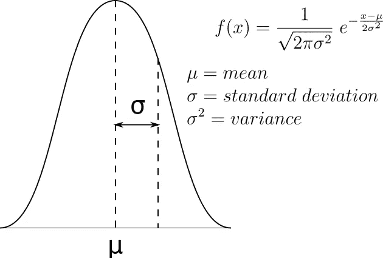
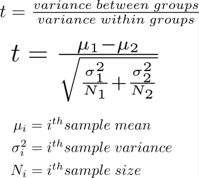
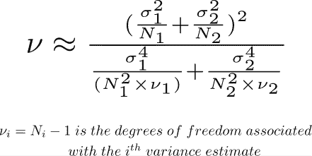
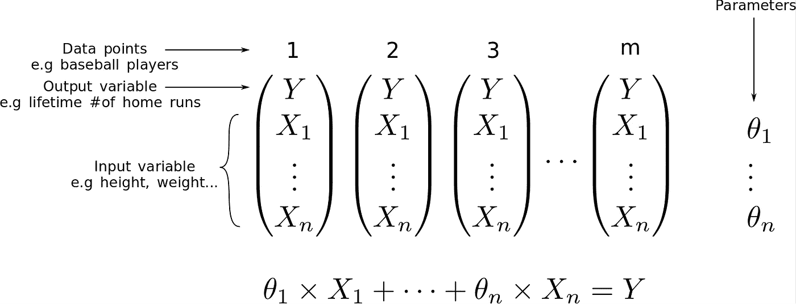
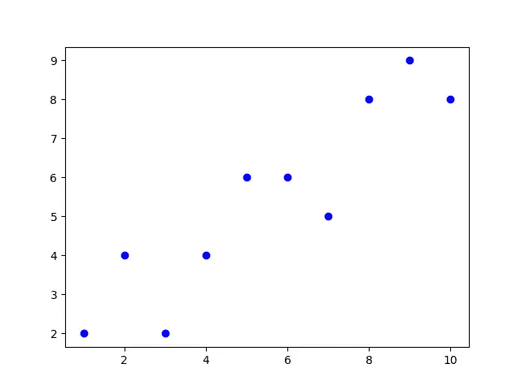
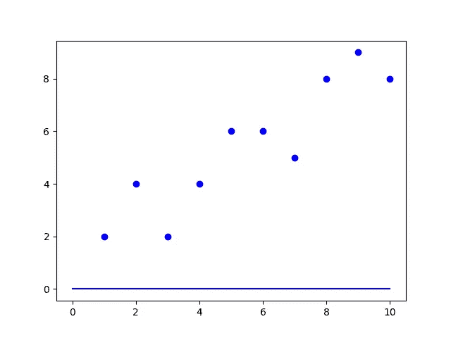
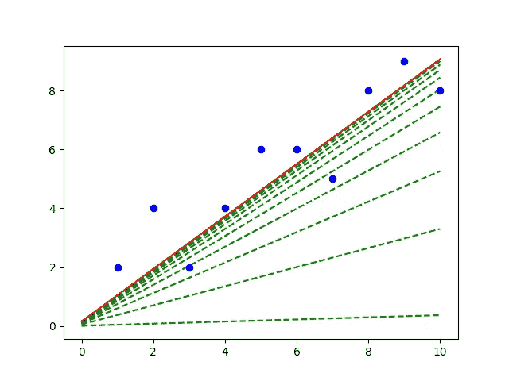

# 数据科学简介

> 原文：<https://towardsdatascience.com/intro-to-data-science-part-3-data-analysis-71a566c3a8c3?source=collection_archive---------3----------------------->

# 第 3 部分:数据分析

*   第一部分:熊猫和熊猫
*   [第二部分:数据争论](https://medium.com/@tiffanysouterre/intro-to-data-science-part-2-data-wrangling-75835b9129b4)


Photo by [Markus Spiske](https://unsplash.com/photos/Skf7HxARcoc?utm_source=unsplash&utm_medium=referral&utm_content=creditCopyText) on [Unsplash](https://unsplash.com/search/photos/data?utm_source=unsplash&utm_medium=referral&utm_content=creditCopyText)

我们将看到统计学和机器学习中分析数据的基本方法。统计使我们能够确保我们正在从数据中进行合理的推断，并检查统计意义，了解置信区间…它们为比较和评估数据提供了一个正式的框架，并使我们能够评估我们的数据集中的感知效果是否反映了整个人群的差异。

在这一部分，我们将看到:

*   正态分布的 t 检验(**韦尔奇检验**)
*   如何处理非正态数据(**夏皮罗-维尔克检验**)，非参数检验(**曼-惠特尼 U 检验**)
*   **线性回归**
*   如何在 Python 中实现**渐变下降**

# 统计检验

您可能用来分析数据的许多统计测试都假设了数据将遵循的概率分布。有许多不同的概率分布，但最常见的是正态分布，它有时也被称为高斯分布或钟形曲线。



Normal distribution

正态分布有两个相关参数。平均值(μ)和标准偏差(σ)。这两个参数插入到概率密度函数中，该函数描述了高斯分布。正态分布关于它的平均值是对称的。了解正态分布将有助于理解我们接下来将看到的参数测试。

# **T 型测试**

我们可能用来比较两组数据的最常见的参数检验之一是 t 检验。t 检验允许检查两组数据之间是否有显著差异。这就是描述统计学和推断统计学的区别。使用描述性统计数据，如平均值，您只能描述我们拥有的样本，但除此之外我们无法进行概括(例如，如果我掷硬币 10 次，得到 7 个正面，而一个朋友得到 5 个正面，这并不意味着我更有可能得到正面，我们也不能说我将总是得到更多正面)。像 t 检验一样，推断统计不仅仅描述我们拥有的样本，还告诉我们可以从我们没有的样本中得到什么。它允许我们超越正在测试的样本进行归纳。t 检验只是测量组间的差异，并将其与组内的差异进行比较。t 值越小，各组越相似，反之，t 值越大，各组越不同。当我们想要比较两个不同的样本检验时，我们进行两个样本的 t 检验。我们将讨论这种称为**韦尔奇 t 检验**的变体，它不假设相等的样本大小或相等的方差。在 Welch 的 t 检验中，我们使用以下等式计算 t 统计量。



我们还想用下面的等式估计自由度的数量(ν)。



一旦我们有了这两个值，我们就可以估计 p 值。p 值是获得至少与实际观察到的一样极端的检验统计的概率。如果 p 值=0.05，这意味着 t 值大于或等于的概率为 5%。t 检验的目标是接受或拒绝一个**零假设**。无效假设是我们试图通过测试来否定的陈述。在进行统计检验时，我们通常设置一个 p-临界值。如果 p 值<是 p 临界的，那么我们将拒绝零假设。

计算 p 值可能很繁琐，幸好在 Python 中有一种简单的方法。让我们把这个应用到一个例子中。我们想确定右手和左手击球手的表现是否有差异。无效假设是“惯用右手和惯用左手的击球手之间没有区别”。

首先，我们需要将棒球数据集加载到熊猫数据帧中

```
 name handedness height weight    avg   HR
0  Brandon Hyde          R     75    210  0.000    0
1   Carey Selph          R     69    175  0.277    0
2  Philip Nastu          L     74    180  0.040    0
3    Kent Hrbek          L     76    200  0.282  293
4   Bill Risley          R     74    215  0.000    0
```

然后我们分割数据来比较我们的两个子集(右手和左手)

```
 name handedness height weight    avg  HR
0     Brandon Hyde          R     75    210  0.000   0
1      Carey Selph          R     69    175  0.277   0
4      Bill Risley          R     74    215  0.000   0
6  Steve Gajkowski          R     74    200  0.000   0
7        Rick Schu          R     72    170  0.246  41 name handedness height weight    avg   HR
2      Philip Nastu          L     74    180  0.040    0
3        Kent Hrbek          L     76    200  0.282  293
9      Tom Browning          L     73    190  0.153    2
13        Tom Brown          L     70    168  0.265   64
15  Floyd Bannister          L     73    190  0.175    0
```

我们使用 ttest_ind()函数执行 t-test。当指定 equal_var = False 时，我们指出我们是否认为两个样本的方差相等。这个 equal_var=false 参数使得 t-test 的这个特定调用等于 Welch 的 t-test。这个函数将返回一个元组。第一个值是数据的 t 值。第二个值是双尾检验的相应 p 值。该函数返回的值假设我们正在执行双边 t 检验，我们只检验两个样本的均值是否不同。

我们选择 p-critical = 0.05，这意味着如果 p-value < 0.05 we would reject the null hypothesis and we could say that there is no significant difference between right-handed and left-handed batters.

```
Ttest_indResult(statistic=-9.935702226242094, pvalue=3.810274225888738e-23)There is a significant differenceFalse
```

# Non-Normal Data

When performing a t-test, we assume that our data is normal. But we can also encounter probability distribution that are not normal. In this case, we have to use other statistical tests. If we are uncertain, we first need to determine whether or not our data is normal. The **shapiro-wilk** 检验测量样本取自正态分布总体的可能性。shapiro()函数返回两个值。第一个是夏皮罗-维尔克检验统计量。第二个值是我们的 p 值，我们应该用解释 t 检验的 p 值的方式来解释它。也就是说，给定该数据来自正态分布的零假设，我们观察到夏皮罗-威尔克检验统计值至少与我们看到的一样极端的可能性有多大？

# 非参数检验

假设我们刚刚确定我们的数据是非正态的，仍然有一些非参数检验，我们可以用来比较两个样本。非参数检验是一种统计检验，它不假设我们的数据来自任何特定的潜在概率分布。一种这样的测试是**曼-惠特尼 U 测试**，它有时也被称为曼-惠特尼威尔科克森测试。这是对两个群体相同的零假设的检验。mannwhitneyu()函数返回两个值，即 Mann-Whitney 检验统计量和该检验的单侧 p 值。

这些只是我们在对数据进行统计测试时可以使用的一些方法。正如您所想象的，有许多其他的方法来处理来自不同概率分布的数据或者看起来不像来自任何概率分布的数据。数据科学家可以执行许多统计程序。但是理解数据集的底层结构是至关重要的，因此，在给定数据的情况下，哪些统计测试是合适的。

既然我们知道分析现有数据，我们就可以看看是否有办法对数据进行预测。

# 机器学习

机器学习是人工智能的一个分支，专注于从大量数据中学习来进行预测的系统的构建。但是统计学和机器学习有什么区别呢？

总之答案是不多。这两个领域越来越多地融合在一起，它们共享许多相同的方法。然而，这两个主题之间有一些重要的哲学差异。一般来说，统计学专注于分析现有数据，得出有效的结论，而机器学习专注于做出预测。这意味着:在统计学中，我们非常关心我们的数据是如何收集的，并使用概率模型得出关于现有数据的结论。例如，我们可能试图回答这样一个问题:从统计学上来说，左撇子击球手比右撇子更好吗？在机器学习的情况下，我们更专注于做出准确的预测，如果有更准确的方法根本不使用概率模型，我们就不太愿意使用概率模型。只要我们的机器学习方法持续做出准确的预测，例如，一个球员会打多少个本垒打，我们就不会太担心模型做出什么假设。

机器学习问题有许多不同的类型，但两个常见的是**监督学习**和**非监督学习**。机器学习通常涉及到针对我们试图解决的问题生成某种类型的模型。我们将把数据输入这个模型，然后试着做出预测。在监督学习中，有标记的输入，我们在其上训练我们的模型。训练我们的模型韦尔奇的测试简单地说就是告诉模型答案是什么样的。监督学习的一个例子是估计一栋新房子的成本，假设我们有许多例子，我们知道一些特征，如平方英尺、房间数量或位置。我们也知道那栋房子卖了多少钱。假设我们知道所有相同的参数，我们可以训练一个模型，然后预测未来的房子会卖多少钱。这是一个回归的例子。

当执行无监督学习时，我们没有任何这样的训练示例。相反，我们有一堆未标记的数据点，我们试图了解数据的结构，通常是通过将相似的数据点聚集在一起。例如，如果我们给一个无监督学习算法提供一堆照片，它可能会将这些照片分成不同的组，比如人的照片、马的照片、建筑物的照片，而不需要事先知道这些组应该是什么。它可能不知道这些群体是人、马还是建筑，但它可以知道这些不同的群体存在。

# 线性回归

回到我们的棒球数据集，我们想要创建一个模型来预测一个不在我们的数据集中的球员一生中的本垒打数。我们可能能够解决这个问题的一个方法是使用线性回归，机器学习的一个基本实现是通过使用梯度下降来执行**线性回归。**

当进行线性回归时，我们通常有许多数据点(下面的图中从 1 到 m)。每个数据点都有一个输出变量(Y)和一些输入变量(X1 到 Xn)。在我们的棒球例子中，Y 代表一生中本垒打的次数，X1 到 Xn 代表他们的身高和体重。



目标是通过将输入变量乘以某组系数(θ1 至θn)来构建一个模型，该模型可预测每个数据点的输出变量的值。我们称每个θ为模型的一个参数或权重。它表明了某个输入变量 X 对于输出变量 y 的预测有多重要。该模型的建立方式是，我们将每个 X 乘以相应的θ，并将它们相加，得到 y。从等式中可以看出，θ越小，θ和 X 的乘积越小，反之亦然。计算θ时，对于在预测 Y 时不太重要的输入 X，θ较小，而对于贡献较大的输入 X，θ较大。最佳等式是最小化我们预测的 Y 和我们观察到的 Y 之间所有数据点的差异的等式。我们需要做的是找到产生最佳预测的θ，这是由于**梯度下降**而最小化这种差异。


为了进行梯度下降，我们首先需要定义以下成本函数 J(θ)。


成本函数旨在衡量我们当前的θ集在数据建模方面的表现。所以我们想最小化成本函数的值。正如我们在上图中看到的，成本函数只是误差平方和的一半。请注意，x 上标 I 代表我们的整个 x 的集合。所以预测的 Y 等于我们在上面看到的两个图中 x 和θ的乘积之和。

那么，我们如何找到θ的正确值来最小化我们的成本函数 J(θ)？梯度下降是一种算法，它对θ进行一些初始猜测，并迭代地改变θ；使得 J(θ)不断变得越来越小，直到它收敛到某个最小值。


# 实现梯度下降算法

现在，让我们实现梯度下降算法的基本功能，以在一个小数据集中找到边界。首先，我们将从 plot_line()函数开始，它将帮助我们绘制和可视化数据。注意 gradient_descent()函数将 alpha 作为参数。Alpha 被称为学习率，它基本上设置了每次迭代的步骤。在更新权重方面迈出大步会让你超越权利等式。另一方面，小步前进会增加达到收敛所需的迭代次数。它通常涉及一个微调过程，以找到正确的平衡。

数据集应该是这样的:



我用蓝色标出了初始化线。这条线通常是随机设置的



每 10 次迭代，我就打印一次成本。请记住，成本应该一直降低，直到达到可能的最低点(收敛)。

```
('\n========== Epoch', 0, '==========')
Cost:  16.004954
('\n========== Epoch', 10, '==========')
Cost:  7.52057727374
('\n========== Epoch', 20, '==========')
Cost:  3.71424722592
('\n========== Epoch', 30, '==========')
Cost:  2.0064263714
('\n========== Epoch', 40, '==========')
Cost:  1.23996949709
('\n========== Epoch', 50, '==========')
Cost:  0.895797093343
('\n========== Epoch', 60, '==========')
Cost:  0.741057191151
('\n========== Epoch', 70, '==========')
Cost:  0.671295578372
('\n========== Epoch', 80, '==========')
Cost:  0.639655519089
('\n========== Epoch', 90, '==========')
Cost:  0.625117716849
```

在这里，我们可以看到不同的步骤，在这些步骤中，直线朝着更好的回归方向更新。您可以随意使用这段代码并调整不同的参数。你可以改变时代，学习率(阿尔法)，改变数据集…

