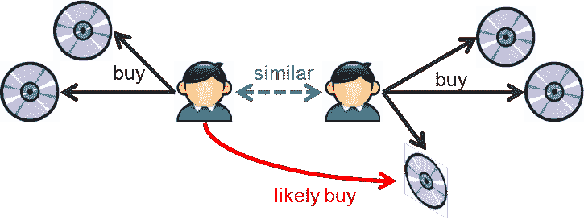
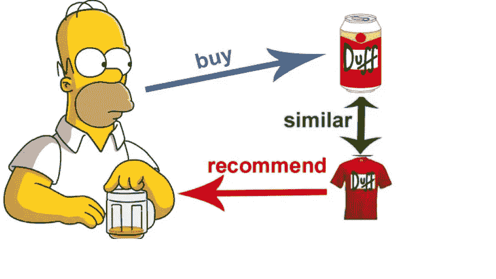

# 推荐系统简介

> 原文：<https://towardsdatascience.com/intro-to-recommender-system-collaborative-filtering-64a238194a26?source=collection_archive---------1----------------------->

## 协同过滤方法:最近邻和矩阵分解

“我们正在离开信息时代，进入推荐时代。”

像许多机器学习技术一样，推荐系统基于用户的历史行为进行预测。具体来说，它是基于过去的经验来预测用户对一组项目的偏好。为了建立推荐系统，最流行的两种方法是基于内容和协同过滤。

**基于内容的**方法需要项目自身特征的大量信息，而不是使用用户的交互和反馈。例如，它可以是电影属性，如类型、年份、导演、演员等。或者可以通过应用自然语言处理提取的文章的文本内容。**协同过滤**，另一方面，除了用户对一组项目的历史偏好之外，不需要其他任何东西。因为它是基于历史数据的，所以这里的核心假设是，过去同意的用户将来也会同意。就用户偏好而言，它通常由两类来表达。**显式评分**，是用户给一个项目的评分，如泰坦尼克号的 5 颗星。这是来自用户的最直接的反馈，表明他们有多喜欢一个项目。**隐性评分**，间接暗示用户偏好，如页面浏览量、点击量、购买记录、是否听某首音乐曲目等等。在这篇文章中，我将仔细研究一下协同过滤，它是推荐系统的一个传统而强大的工具。

# 最近邻域

协同过滤的标准方法被称为**最近邻**算法。有基于用户的 CF 和基于物品的 CF，我们先来看**基于用户的 CF** 。我们有一个 n × m 的收视率矩阵，用户 uᵢ，i = 1，...n 和项目 pⱼ，j=1，…m。现在，如果目标用户 I 没有观看/评价项目 j，我们想要预测评价 rᵢⱼ。该过程是计算目标用户 I 和所有其他用户之间的相似性，选择前 x 个相似用户，并且取这些具有相似性的 x 个用户的评价的加权平均值作为权重。

Source: [https://dzone.com/articles/recommendation-engine-models](https://dzone.com/articles/recommendation-engine-models)

虽然不同的人在给予评级时可能有不同的基线，但有些人倾向于给予高分，有些人即使对项目满意也非常严格。为了避免这种偏差，我们可以在计算加权平均值时减去每个用户对所有项目的平均评分，并将其添加回目标用户，如下所示。

计算相似度的两种方法是**皮尔逊相关**和**余弦相似**。

基本上，这个想法是找到与你的目标用户最相似的用户(最近的邻居),并对他们对某个项目的评分进行加权，作为目标用户对该项目评分的预测。

在对项目和用户本身一无所知的情况下，当两个用户给同一个项目相似的评价时，我们认为他们是相似的。类似地，对于基于**项目的 CF** ，当两个项目从同一个用户收到相似的评级时，我们说它们是相似的。然后，我们将通过计算目标用户对大多数 X 个相似项目的评分的加权平均值来对该用户的项目进行预测。基于项目的 CF 的一个关键优势是稳定性，即给定项目的评分不会随着时间的推移而发生显著变化，这与人类的口味不同。

Source: [https://medium.com/tiket-com-dev-team/build-recommendation-engine-using-graph-cbd6d8732e46](https://medium.com/tiket-com-dev-team/build-recommendation-engine-using-graph-cbd6d8732e46)

这种方法有相当多的局限性。当邻居中没有人评价你试图为目标用户预测的项目时，它不能很好地处理稀疏性。此外，随着用户和产品数量的增长，计算效率也不高。

# 矩阵分解

由于稀疏性和可扩展性是标准 CF 方法面临的两个最大挑战，因此出现了一种更先进的方法，将原始稀疏矩阵分解为具有潜在因子/特征和较少稀疏性的低维矩阵。那就是矩阵分解。

除了解决稀疏性和可伸缩性的问题，还有一个直观的解释为什么我们需要低维矩阵来表示用户的偏好。一位用户给电影《阿凡达》、《地心引力》和《盗梦空间》打了高分。它们不一定是 3 个独立的意见，而是表明该用户可能喜欢科幻电影，并且可能有更多该用户喜欢的科幻电影。与特定电影不同，潜在特征是由更高层次的属性来表达的，在这种情况下，科幻类别是潜在特征之一。矩阵分解最终给我们的是，一个用户与一组潜在特征有多大程度的契合，一部电影与这组潜在特征有多大程度的契合。与标准的最近邻相比，它的优势在于，即使两个用户没有对任何相同的电影进行评级，如果他们分享相似的潜在品味，仍然有可能找到他们之间的相似性，这也是潜在的特征。

要了解一个矩阵如何分解，首先要了解的是**奇异值分解(SVD)** 。基于线性代数，任何实矩阵 R 都可以分解为 3 个矩阵 U、σ和 V。继续使用电影示例，U 是 n × r 用户潜在特征矩阵，V 是 m × r 电影潜在特征矩阵。σ是包含原始矩阵的奇异值的 r × r 对角矩阵，简单地表示特定特征对于预测用户偏好有多重要。

要通过降低绝对值对σ值进行排序，并将矩阵σ截断到前 k 维(k 个奇异值)，我们可以将矩阵重构为矩阵 A。k 的选择应确保 A 能够捕捉原始矩阵 R 内的大部分方差，因此 A 是 R 的近似值，A≈R。A 和 R 之间的差异是期望最小化的误差。这正是主成分分析的思想。

当矩阵 R 稠密时，U 和 V 可以很容易地解析分解。然而，一个电影评级矩阵是超级稀疏的。尽管有一些填补缺失值的插补方法，但我们将求助于一种编程方法来处理这些缺失值，并找到因子矩阵 U 和 V。我们不是通过 SVD 对 R 进行因子分解，而是尝试直接找到 U 和 V，目的是当 U 和 V 相乘时，输出矩阵 R’是 R 的最接近的近似值，而不再是稀疏矩阵。对于推荐系统，这种数值近似通常通过**非负矩阵分解**来实现，因为评级中没有负值。

参见下面的公式。查看特定用户和项目的预测评级，项目 I 被记为向量 qᵢ，而用户 u 被记为向量 pᵤ，使得这两个向量的点积是用户 u 对项目 I 的预测评级

我们如何找到最优的 qᵢ和 pᵤ？像大多数机器学习任务一样，损失函数被定义为最小化错误成本。

rᵤᵢ是来自原始用户项目矩阵的真实评级。优化过程是寻找由向量 pᵤ组成的最优矩阵 p 和由向量 qᵢ组成的最优矩阵 q，以最小化预测收视率 rᵤᵢ'和真实收视率 rᵤᵢ.之间的平方和误差此外，L2 正则化已被添加，以防止用户和项目向量的过度拟合。添加偏差项也很常见，它通常有 3 个主要部分:所有项目的平均评级μ，项目 I 的平均评级减去μ(记为 bᵤ)，用户给出的平均评级 u 减去 u(记为 bᵢ).

# **优化**

一些优化算法已被广泛用于解决非负因式分解。**备选最小二乘法**就是其中之一。由于在这种情况下损失函数是非凸的，所以没有办法达到全局最小值，但它仍然可以通过找到局部最小值来达到很好的近似。替代的最小二乘法是保持用户因子矩阵不变，通过对损失函数求导并将其设置为 0 来调整项目因子矩阵，然后在调整用户因子矩阵的同时设置项目因子矩阵不变。通过来回切换和调整矩阵来重复该过程，直到收敛。如果您应用 Scikit-learn NMF 模型，您将看到 ALS 是默认的求解器，也称为坐标下降。Pyspark 还提供了非常简洁的分解包，为 ALS 本身提供了更多的调整灵活性。

# 一些想法

协同过滤为推荐系统提供了强大的预测能力，同时需要最少的信息。然而，它在某些特定情况下有一些限制。

首先，潜在特征所表达的潜在品味实际上是不可解释的，因为元数据没有与内容相关的属性。以电影为例，在我的例子中，它不一定是像科幻那样的类型。可以是配乐有多励志，剧情有多好等等。协同过滤缺乏透明度和这一级别的信息的可解释性。

另一方面，协同过滤面临冷启动。当一个新的项目出现时，直到它必须被大量的用户评级，该模型才能够做出任何个性化的推荐。类似地，对于尾部没有获得太多数据的项目，模型倾向于给它们较少的权重，并通过推荐更受欢迎的项目来产生受欢迎程度的偏差。

使用集成算法来构建更全面的机器学习模型通常是一个好主意，例如通过添加一些可解释的关键词维度来组合基于内容的过滤，但我们应该始终考虑模型/计算复杂性和性能改善有效性之间的权衡。