# 介绍深度学习和神经网络——新手的深度学习(1)

> 原文：<https://towardsdatascience.com/introducing-deep-learning-and-neural-networks-deep-learning-for-rookies-1-bd68f9cf5883?source=collection_archive---------0----------------------->

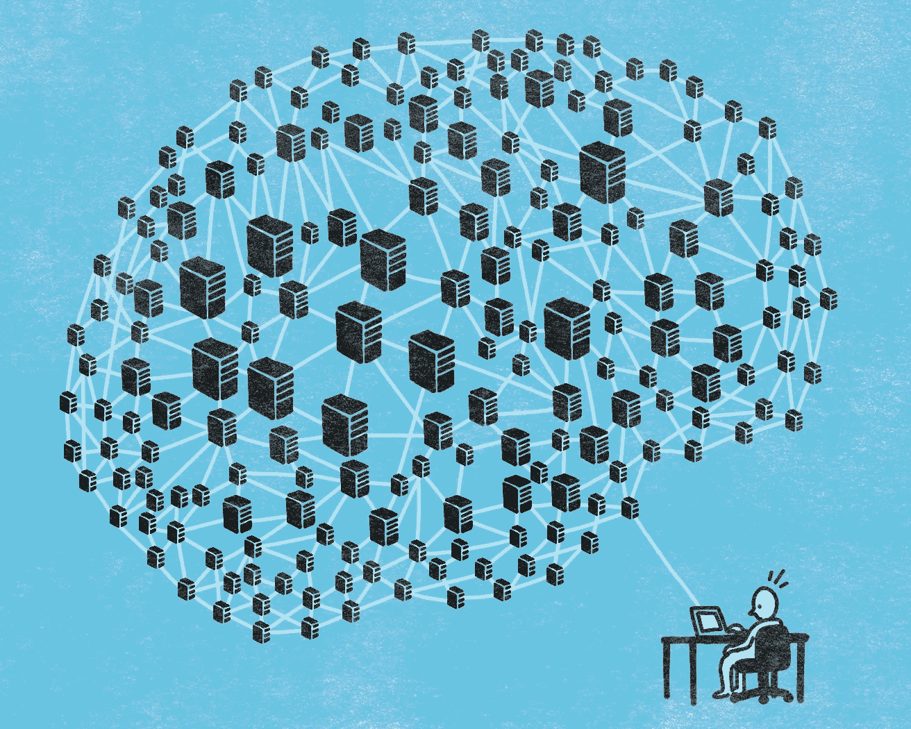

Source: Allison Linn, Microsoft

*关注我的* [*推特*](https://twitter.com/nahuakang) *了解更多关于深度学习创业公司的生活。*

欢迎来到我的系列**菜鸟深度学习**的第一篇帖子，作者是我，一个菜鸟。我是作为*强化学习*策略来写的，以便更好地处理和消化知识。但是如果你是深度学习的新手，那么这也适合你，因为我们可以像新手一样一起学习！

(*你也可以在我的网站* *上阅读* [*这篇帖子，该网站支持 LaTeX with MathJax*](http://nahuakang.com/2017/06/21/deep-learning-for-rookies-1/)

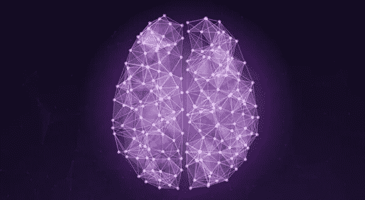

Source: deepinstinct.com

深度学习可能是目前最热门的技术话题之一。大公司和年轻的创业公司都在这个奇特的领域淘金。如果你认为大数据很重要，那么你应该关心深度学习。[经济学家](https://medium.com/u/bea61c20259e?source=post_page-----bd68f9cf5883--------------------------------)说[数据是 21 世纪的新石油](http://www.economist.com/news/briefing/21721634-how-it-shaping-up-data-giving-rise-new-economy)。如果数据是原油，数据库和数据仓库是在互联网上挖掘和抽取数据的钻机，那么就把深度学习想象成炼油厂，最终把原油变成所有有用和有洞察力的最终产品。地下可能隐藏着许多“化石燃料”，市场上有许多钻机和泵，但是没有合适的提炼工具，你将得不到任何有价值的东西。这就是为什么深度学习很重要。这是数据驱动的大图景的一部分。

好消息是，我们不会用完数据，我们的“精炼机”越来越好。今天，在网上做任何事情都会产生数据。因此，与石油不同，数据是“可持续的”,并且在“爆炸式”增长。与此同时，只要数据不是垃圾，深度学习就不会有垃圾。因此，数据越多越好。(查看 [Trent McConaghy](https://medium.com/u/f1cb98e196bc?source=post_page-----bd68f9cf5883--------------------------------) 在[区块链上的帖子，为 AI](https://blog.bigchaindb.com/blockchains-for-artificial-intelligence-ec63b0284984) 提供解决方案，让数据拥有声誉！).

此外，这个“炼油厂”正在改善软件和硬件。深度学习算法在过去几十年中得到了改善，世界各地的开发人员为开源框架做出了贡献，如 TensorFlow、Theano、Keras 和 Torch，所有这些都使人们可以轻松地构建深度学习算法，就像玩乐高积木一样。由于世界各地游戏玩家的需求，GPU(图形处理单元)使我们能够利用深度学习算法以省时的方式构建和训练模型，并取得令人印象深刻的结果！所以，对于所有不喜欢你的孩子玩游戏的父母来说:游戏也有好的一面…

# 深度学习:秘方

你可能已经读过新闻，知道深度学习是许多令人兴奋的发展背后的秘方，并使我们许多最疯狂的梦想甚至噩梦成真。谁会想到 DeepMind 的 AlphaGo 可以在最深的棋盘游戏中击败最好的围棋选手之一 Lee Sedol，这种游戏号称比整个宇宙中的原子还多。很多人，包括我，都没想到会这样。这似乎是不可能的。但它现在就在这里。深度学习正在最具挑战性的棋盘游戏中击败我们。AI 什么时候觉醒？有些人认为这很快就会发生。

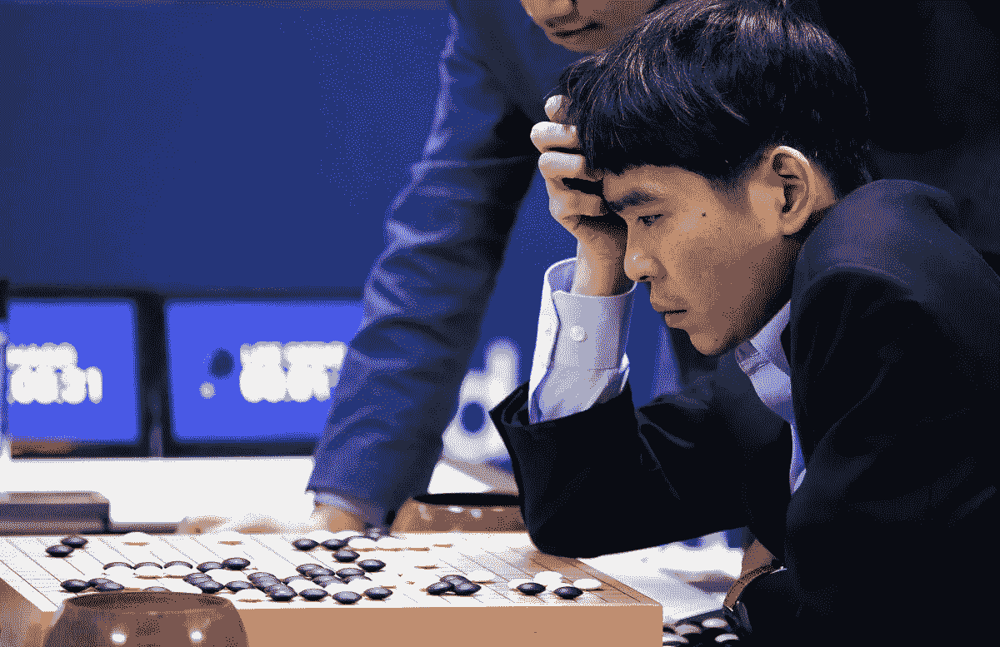

Lee Sedol vs. AlphaGo in 2016, Source: The New Yorker

我们还没有谈到由深度学习驱动的其他令人印象深刻的应用程序，如谷歌翻译和 Mobileye 的自动驾驶。你说吧。我是不是忘了提到[深度学习在诊断癌症方面也打败了医生](http://www.newyorker.com/magazine/2017/04/03/ai-versus-md)？深度学习擅长许多错误率低于人类的任务！不仅仅是自动化那些无聊的东西，还有有趣的东西。唉，我们凡人…

> 亲爱的总统先生，不是外国人。是自动化。

以下是深度学习在真实情况下可以执行的一般任务的简短列表:

1.  识别人脸(或更一般的图像分类)
2.  阅读手写数字和文本
3.  识别语音(不再需要自己抄写采访)
4.  翻译语言
5.  玩电脑游戏
6.  控制自动驾驶汽车(和其他类型的机器人)

还有更多。暂停一下，想象一下深度学习可以实现的所有事情。这是惊人的，也许有点可怕！

# 区别:人工智能、机器学习和深度学习

好吧，等一下。你可能已经在你的社交媒体新闻中看到过像人工智能( **AI** )、机器学习( **ML** )和深度学习( **DL** )这样的术语满天飞。都有什么区别？他们指的是同一件事还是什么？问得好。在我们深入到深度学习之前，重要的是逐步建立这些术语的概念框架。

粗略地说，下图展示了这三个概念之间的关系。深度学习是机器学习的一个子领域，机器学习是人工智能的一个子领域。奥菲尔·萨姆森和 T2 都写过关于他们的好故事。检查这里的[和这里的](https://medium.com/towards-data-science/deep-learning-weekly-piece-the-differences-between-ai-ml-and-dl-b6a203b70698)和。

Source: Nvidia

先来讨论一下包罗万象的 AI。你可能已经知道了图灵测试。如果一个人在向计算机提出一些书面问题后，不能分辨出这些书面回答是来自另一个人还是计算机，那么计算机就通过了图灵测试。根据*人工智能:现代方法*，Peter Norvig 和 Stuart Russell 定义了计算机为了通过图灵测试必须具备的 4 种能力:

*   **自然语言处理:**用英语成功交流
*   **知识表示:**存储计算机读取的内容
*   **自动推理:**利用存储的知识回答问题并得出新的结论
*   **机器学习:**适应新环境，识别新模式

啊，有个术语叫“机器学习”！ML 是关于用数据集训练学习算法，如线性回归、KNN、K-Means、决策树、随机森林和 SVM，以便算法可以学习适应新的情况，并找到可能有趣和重要的模式。同样，ML 是数据驱动的。学习算法有很多奇怪的术语？别担心，我也不全认识。所以以后我们一起学习。

对于训练 ML，数据集可以被标记，例如，它带有一个“答题卡”，告诉计算机什么是正确的答案，比如哪些电子邮件是垃圾邮件，哪些不是。这被称为**监督学习**，并且像线性回归和 KNN 这样的算法被用于这样的监督**回归**或**分类**。其他数据集可能没有被标记，您实际上是在告诉算法(如 K-Means)将它在没有任何答案的情况下找到的或**聚类**模式与**相关联。这叫做**无监督学习**。这里有一个[关于栈溢出的监督与非监督学习](https://stackoverflow.com/a/1854449/6297414)的很好的答案，这里也有一个[来自](http://oliviaklose.com/machine-learning-2-supervised-versus-unsupervised-learning/) [Olivia Klose](https://medium.com/u/2b6a75cd1519?source=post_page-----bd68f9cf5883--------------------------------) 博客的关于监督与非监督的帖子。**

Source: [http://oliviaklose.com/](http://oliviaklose.com/)

Norvig 和 Russell 还提到了另一项名为**总图灵测试**的测试，该测试通过物理模拟进一步检验了计算机的感知能力。要通过这一关，计算机需要:

*   **计算机视觉:**感知周围的物体
*   **机器人学:**操纵物体并四处移动

那么 DL 现在怎么样了？还记得上一节深度学习擅长的一般任务吗？像人脸或手写文本识别这样的事情与计算机视觉有关，因为你要将图形输入计算机进行分析。其他任务如语言翻译或语音识别与自然语言处理(NLP)有关。因此，DL 是 ML 的一个分支，因为它也有一套学习算法，可以对数据进行训练和学习，更具体地说 **DL 由神经网络**驱动。此外，DL 可以在机器学习领域之外执行，并帮助其他领域，如计算机视觉和 NLP，以便有希望人工智能有一天可以通过图灵测试和总图灵测试！

但是神经网络到底是什么？它是在模仿真实神经元细胞的行为吗？还是某种神奇的黑盒子？对于你们中的一些人来说，到目前为止提供的信息可能有点太多了，所以让我们休息一下，查看一些免费的在线资源，看看哪些适合你:)之后，我们将直接进入神经网络。

# 中途奖金:宝贵的资源

神经网络和 DL 往往隐藏在一层神秘的面纱后面。所有与该主题相关的技术术语可能会让初学者感到非常困惑。由于 DL 将在未来自动化许多任务并取代许多工人，我个人认为我们都保持开放的心态和好奇心来学习新技术是很重要的。DL 可以代替从事手工重复性工作的工人。但是 DL 不能代替科学家或工程师构建和维护 DL 应用程序。

目前，互联网上已经有许多关于这个主题的很棒的课程、教程和书籍，例如(不详尽或按特定顺序):

1.  迈克尔·尼尔森的[神经网络和深度学习](http://neuralnetworksanddeeplearning.com/)
2.  杰弗里·辛顿的[用于机器学习的神经网络](https://www.coursera.org/learn/neural-networks)
3.  古德费勒、本吉奥、库维尔的[深度学习](http://www.deeplearningbook.org/)
4.  伊恩·特拉斯克的[摸索深度学习](https://www.manning.com/books/grokking-deep-learning)，
5.  Francois Chollet 的[用 Python 进行深度学习](https://www.manning.com/books/deep-learning-with-python)
6.  [Udacity](https://medium.com/u/2929690a28fb?source=post_page-----bd68f9cf5883--------------------------------) 的[深度学习纳米学位](https://www.udacity.com/course/deep-learning-nanodegree-foundation--nd101)(不免费但高质量)
7.  [Udemy 的深度学习 A-Z](https://www.udemy.com/deeplearning/learn/v4/overview)($ 10-$ 15)
8.  斯坦福的 [CS231n](http://cs231n.stanford.edu/index.html) 和 [CS224n](http://web.stanford.edu/class/cs224n/)
9.  Siraj Raval 的 YouTube 频道

这个清单还在继续。大卫·文丘里为[自由代码营](https://medium.com/u/8b318225c16a?source=post_page-----bd68f9cf5883--------------------------------)写了一篇文章，列出了更多的资源。点击查看[。](https://medium.freecodecamp.com/every-single-machine-learning-course-on-the-internet-ranked-by-your-reviews-3c4a7b8026c0)

在自我教育的时代，我们真的很幸运。顺便问一下，你听说过那个来自芝加哥的高中生阿布·卡德吗？这个孩子自学了机器学习和深度学习框架 Tensorflow，并帮助将[乳腺癌的诊断提高到 93%-99%的实时准确率](http://chicagoinno.streetwise.co/2016/07/13/this-chicago-high-school-student-uses-artificial-intelligence-to-make-smarter-breast-cancer-diagnoses/)！他登上了谷歌 I/O 2017。下面是一个来自谷歌的关于他的故事的鼓舞人心的视频。

Source: Google

# 感知机:数字逻辑的前奏

好吧，我希望阿布·卡迪尔的故事让你对学习感到兴奋！让我们进入这篇文章的第二个主题:神经网络介绍。中国古代哲学家老子曾经说过:

> “千里之行，始于足下。”

所以我们将用一个非常简单的神经网络来开始和结束这篇文章。听起来很酷？神奇吧。

尽管有了新的名声，神经网络领域一点也不新鲜。1958 年，美国心理学家弗兰克·罗森布拉特(Frank Rosenblatt)试图建造一台“像人脑一样感知、识别、记忆和反应的机器”，并将这台机器称为“感知机”。但是罗森布拉特并没有凭空发明感知机。实际上，他站在巨人的肩膀上，从沃伦麦卡洛克和沃尔特皮茨在 20 世纪 40 年代的作品中获得了灵感。天哪，这使得神经网络，或者更具体地说，感知器，成为这个快速变化的技术世界中的恐龙。

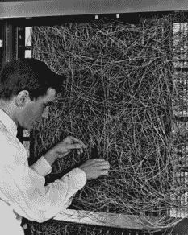

Rosenblatt and Perceptron, Source: The New Yorker

所以我们来看看什么是感知机。首先，看看下面的神经元细胞:**树突**是神经细胞的延伸(在图的左下角)。它们接收信号，然后将信号传输到细胞体，细胞体处理刺激并决定是否向其他神经元细胞触发信号。如果这个细胞决定触发信号，细胞体上称为**轴突**的延伸将触发轴突末端向其他细胞的化学传输。在这里你不需要记住任何东西。我们不是在研究神经科学，所以对它如何工作有一个模糊的印象就足够了。

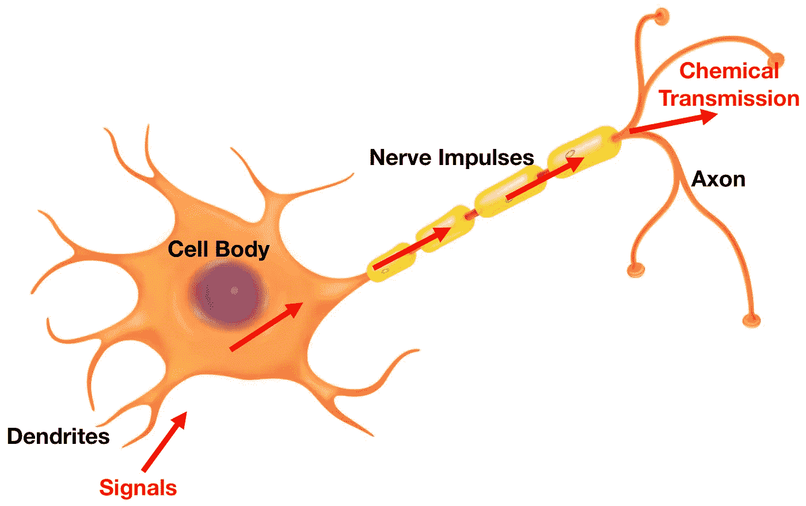

Original Source: thinglink.com

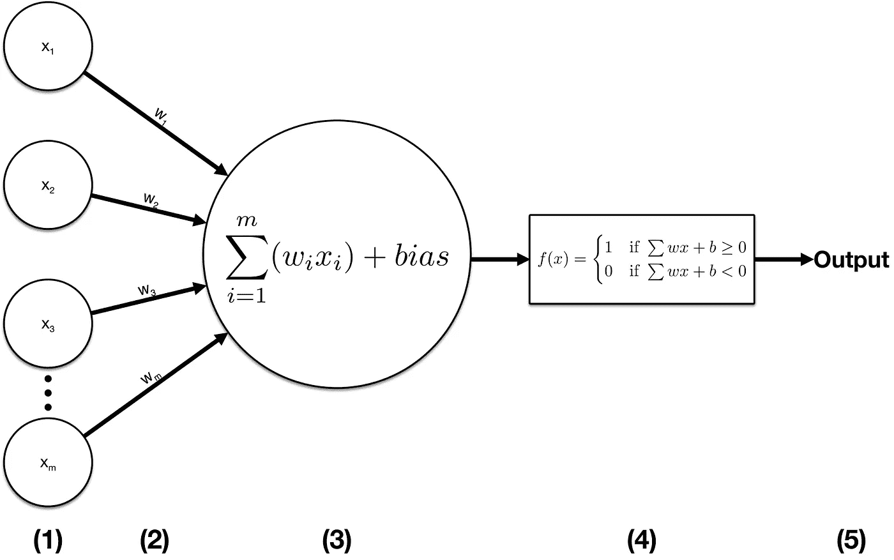

A Single Perceptron

现在，上图是一个感知器的样子。很像上面的神经细胞图，对吧？确实如此。感知器和其他神经网络的灵感来自我们大脑中的真实神经元。请注意，它只是受到*的启发*，并不完全像真正的神经元一样工作。感知器处理数据的过程如下:

1.  在左侧，你有带下标 *1，2，…，m* 的 *x* 的神经元(小圆圈)携带**数据输入。**
2.  我们将每个输入乘以一个权重 w，也标有下标 1，2，…，m，沿着箭头(也称为突触)到中间的大圆圈。于是 *w1 * x1* ， *w2 * x2* ， *w3 * x3* 等等。
3.  一旦所有的输入都乘以一个权重，我们将所有的输入相加，并加上另一个预先确定的数字，称为**偏差。**
4.  然后，我们将结果进一步向右推。现在，我们在矩形中有了这个**阶跃函数**。它的意思是，如果步骤 3 的结果是等于或大于 0 的任何数字，那么我们得到 1 作为输出，否则，如果结果小于 0，我们得到 0 作为输出。
5.  **输出**为 1 或 0。

请注意，或者，如果您将 bias 移动到激活函数中等式的右侧，如 *sum(wx) ≥ -b* ，则此 *-b* 称为**阈值**。因此，如果输入和权重之和大于或等于阈值，则激活触发 1。否则，激活结果为 0。选择有助于你更好理解的，因为这两种表达方式是可以互换的。

Illustration of using Threshold Value instead of Bias

我在下面添加了另一个感知器图，这次每一步都用了颜色。完全理解它并记住每一步发生的事情非常重要，因为当我们谈论更复杂的神经网络结构时，我们将忽略未来图表中的中间步骤:

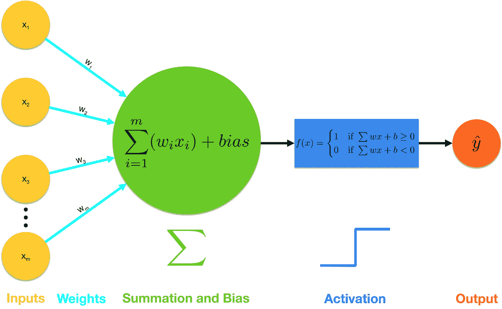

Procedures of a Perceptron labeled in colors

1.  **输入**被输入感知器
2.  **权重**乘以每个输入
3.  **求和**然后加上**偏置**
4.  **激活功能**被应用。注意，这里我们使用阶跃函数，但是还有其他更复杂的激活函数，如 **sigmoid、双曲正切( *tanh* )、整流器( *relu* )和更多的**。不要担心，我们将在未来涵盖其中的许多内容！
5.  **输出**要么触发为 1，要么不触发为 0。注意我们用 ***y 帽*** 来标注我们的感知器模型产生的输出

将来，我们有时可能会简化我们的感知器如下，而不提及步骤 3 和 4。我们刚刚谈到的这种感知器也是一种**单层感知器**，因为我们直接将输入处理成输出，中间没有任何多层神经元:

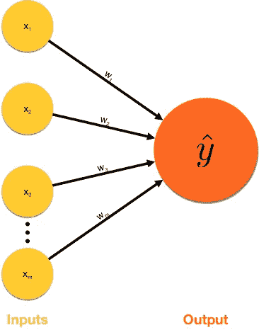

Simplified Representation of Perceptron

# **感知器:直觉**

好吧，你现在知道感知器是怎么工作的了。这只是一些机械的乘法，接着是求和，然后是一些激活……瞧，你得到了一个输出。是啊，这怎么会接近人类大脑中的神经元呢？

为了理解感知机，让我们看一个不一定真实的简单例子。假设你看了我的帖子后很有动力**你需要决定是否学习 DL**。有 3 个因素会影响你的决定:

1.  如果掌握 DL 后你会赚更多的钱(是:1，否:0)
2.  相关的数学和编程容易吗(是:1，否:0)
3.  您可以立即在 DL 上工作，而不需要昂贵的 GPU(是:1，否:0)

我们使用 *x1、x2、*和 *x3* 作为每个因素的输入变量，并为每个因素分配一个二进制值(1 或 0 ),因为答案只是简单的“是”或“否”。假设到目前为止你真的很喜欢 DL，并且你愿意克服你一生对数学和编程的恐惧。你也有一些储蓄，现在投资一个昂贵的 Nvidia GPU 来训练你的 DL 模型。假设这两个因素同等不重要，因为你可以在它们之间做出妥协。但是，你花了那么多时间和精力学 DL，真的是想赚更多的钱。所以有了高预期的投资回报，如果事后赚不到更多的$$$就不会把宝贵的时间浪费在 DL 上。

在了解了你的决策偏好后，让我们假设你在学习 DL 后有 100%的概率赚更多的钱，因为市场上有很多需求，但供应却很少。所以 *x1 = 1* 。假设数学和编程超级难。所以 *x2 = 0* 。最后，假设你必须有 Titan X 这样强大的 GPU，那么 *x3 = 0* 。好了，我们已经准备好输入，也可以初始化权重。我们选 *w1 = 6，w2 = 2，w3 = 2* 。**权重越大，对应的输入越有影响力**。所以既然你决定学 DL 最看重钱， *w1 > w2* 和 *w1 > w3* 。

我们将假设阈值 *threshold = 5，*这相当于说偏置项 *bias = -5* 。我们把它们加起来，加上偏差项。关于使用感知器来确定你是否会学习 DL 的过程，请检查以下内容。

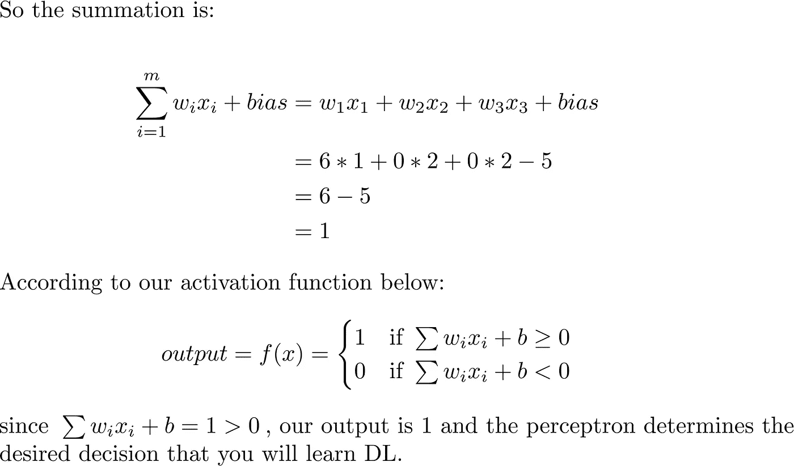

注意阈值为 5，我们只有赚更多的钱才会学习深度学习。就算数学既轻松( *x2 = 1* )又不需要花钱买 GPU ( *x3 = 1* )，以后赚不到更多的钱还是不会去学 DL。请参见下图:

现在你知道偏差/阈值的诀窍了。这个 5 的高阈值意味着感知器必须满足你的主导因素才能触发 1 的输出。否则，输出将为 0。

有趣的是:改变权重和阈值/偏差将导致不同的可能决策模型。例如，如果我们将阈值从 *threshold = 5* 降低到 *threshold = 3，*那么输出为 1 的可能性更大。现在，对于*输出= 1* 的*最低要求*为:

1.  你以后会赚更多的钱，所以 *x1 = 1* 保证你学习 DL*的决定，而不管到 *x2* 和 *x3* 的值*
2.  或者说，数学很容易，不需要买 GPU，所以 *x2 = x3 = 1* 也保证了你决定学习 DL 而不管值到 *x1*

为什么你可能已经知道了；)以下是解释:

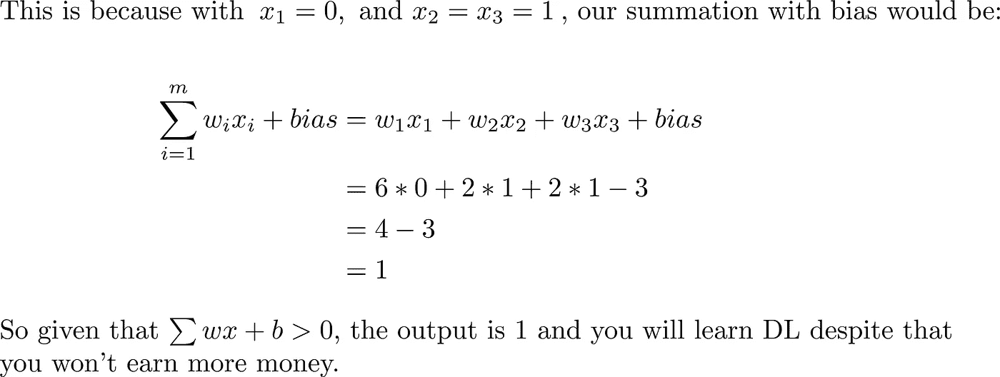

没错。现在门槛降低了，所以其他两个因素可以激励你学习 DL，即使你赚更多钱的前景已经消失。现在，我鼓励你玩玩权重 *w1、w2 和 w3* ，看看你学习 DL 的决定会如何相应地改变！

# 感知机:在行动中学习

为什么要在这个例子中摆弄砝码呢？因为这有助于你理解感知器是如何学习的。现在，我们将使用这个例子以及输入和权重来说明单层感知器，并看看尽管它有局限性，但它能实现什么。

在一个真实的 DL 模型中，我们被给予输入数据，我们不能改变它。同时，在你训练你的神经网络模型之前，偏置项被初始化。假设我们假设偏差是 7。现在，让我们假设以下输入数据，以便(1)。你会赚更多的钱。DL 的数学和编程会很难，还有(3)。是的，你必须花 1400 美元买一个 GPU 来处理 DL，而且*最重要的是，* ***我们假设你实际上想要学习深度学习，*** *我们将其命名为* ***期望输出*** *以了解感知机应该如何正确预测或确定*:

让我们进一步假设我们的权重初始化如下:

因此，对于输入数据、偏置和输出标签(所需输出):

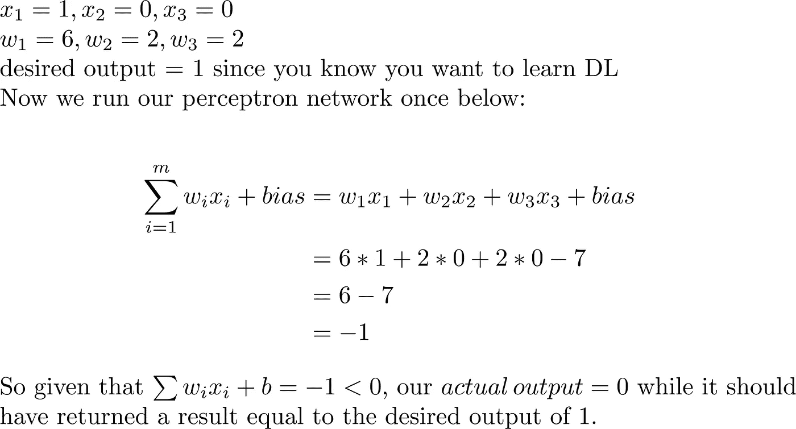

好的，我们知道你的神经网络的实际输出与你想要研究 DL 的真实决定不同。那么，考虑到实际输出和期望输出之间的差异，神经网络应该做些什么来帮助自己学习和改进呢？是的，我们不能改变输入数据，我们现在已经初始化了我们的偏差。所以我们唯一能做的就是告诉感知器调整权重！如果我们告诉感知器将 *w1* 增加到 7，而不改变 *w2* 和 *w3* ，那么:

调整权重是我们感知机学习过程的关键。并且具有阶跃函数的单层感知器可以利用下面列出的学习算法在处理每组输入数据之后调整权重。尝试用这个算法自己更新权重:)这差不多就是单层感知器的学习方式。

顺便说一下，现在我们已经完成了这个不太现实的例子，我可以告诉你，你不需要买一个 GPU。如果你作为初学者训练较小的数据集，你很可能不需要 GPU。然而，当你开始用大量图像文件训练更大的数据集时，你可以使用云服务，如 [AWS](https://aws.amazon.com/) 、 [Floyd](https://www.floydhub.com/) ，可能还有[谷歌 TPU](https://cloud.google.com/tpu/) 。

此外，DL 的数学并不简单，但也不是不可逾越的。大多数情况下，我们只会遇到一些矩阵运算和基本的微积分。但是记住，没有什么能让你脱颖而出的东西是容易学的。这里有一段引自*的话*:

> “做我们知道如何做好的事情是令人愉快的，这与刻意练习的要求正好相反。我们应该坚持寻找我们不擅长的，而不是做我们擅长的。然后，我们确定那些会让我们变得更好的痛苦、困难的活动，并一遍又一遍地做这些事情。如果导致伟大的活动既容易又有趣，那么每个人都会去做，他们不会区分最好的和其他的。”

所以对于那些像我一样害怕数学和编程的人，我希望这句话能给你一些勇气，让你继续学习和实践:)

# 感知器:局限性

尽管公众早期有一些感觉，但由于其局限性，感知器的受欢迎程度悄悄地消失了。1969 年，马文·明斯基和西蒙·派珀特讨论了这些限制，包括感知器无法学习 XOR(异或)门(因此基本上一个具有阶跃函数的 ***单层*感知器**无法理解天气必须要么热要么冷，但不能同时热和冷的逻辑)。这些逻辑门，比如 And、OR、NOT、XOR，都是非常重要的概念，为你的计算机提供动力；)TutorialsPoint 有一个逻辑门列表，如果你想了解更多。在这里勾选。

当然，后来人们意识到 ***多层*感知器**能够学习异或门的逻辑，但它们需要一种叫做 ***反向传播*** 的东西，以便网络从试验和错误中学习。毕竟，记住深度学习神经网络是数据驱动的。如果我们有一个模型，而它的实际输出与**期望输出不同，**我们需要一种方法，沿着神经网络反向传播误差信息，告诉权重调整并以某个值修正它们自己，以便在一轮又一轮的测试后，模型的实际输出逐渐接近期望输出。

事实证明，对于涉及不能从输入的**线性组合**中产生的输出的更复杂的任务(因此输出是非线性的或不可线性分离的)，阶跃函数将不起作用，因为它不支持反向传播，这要求所选择的激活函数具有有意义的导数。

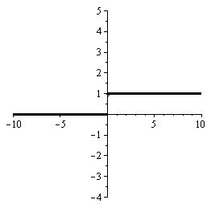

Source: mathnotes.org

某微积分讲:阶跃函数是一个**线性激活函数**，其导数对于除零点以外的所有输入点都为零。在零点，导数是未定义的，因为函数在零点是不连续的。所以虽然这是一个非常简单和容易的激活功能，但它不能处理更复杂的任务。继续阅读，你会发现更多。

# 线性与非线性

什么！？那么什么是**线性组合**？还有为什么感知器学不会异或门？这越来越令人困惑了。没问题，这里有一个解释:

想一想我们之前的例子。用 3 个二进制输入来表示你在学习 DL 后是否赚了更多的钱，如果涉及的数学和编程容易与否，如果你可以在不投资昂贵的硬件的情况下学习 DL，我们总共有 *2 = 8* 组可能的输入和输出。利用权重( *w1 = 6，w2 = 2，w3 = 2)，*和 *bias = -5，*我们得到了下面的一组( *x1，x2，x3* ):

1.  (1，0，0)-> sum+bias = 6–5 = 1，期望输出= 1
2.  (1，1，0)-> sum+bias = 8–5 = 3，所需输出= 1
3.  (1，1，1) ->总和+偏差= 10–5 = 5，期望输出= 1
4.  (1，0，1)-> sum+bias = 8–5 = 3，所需输出= 1
5.  (0，1，1)-> sum+bias = 4–5 =-1，期望输出= 0
6.  (0，1，0)-> sum+bias = 2–5 =-3，期望输出= 0
7.  (0，0，1)-> sum+bias = 2–5 =-3，期望输出= 0
8.  (0，0，0)-> sum+bias = 0–5 =-5，期望输出= 0

因此，从字面上看，如果我们从随机权重开始，而不是从( *w1 = 6，w2 = 2，w3 = 2* )的随机权重开始，我们的感知机将尝试学习调整并找到理想的权重( *w1 = 6，w2 = 2，w3 = 2* )，这将正确地将每组( *x1，x2，x3* )的实际输出匹配到期望的输出。其实我们可以在一个 3D 空间里用一个平面把这 8 个可能的集合分开，比如 *x1 = 0.5* 的平面。这种类型的分类问题，你可以画一个平面来分隔不同的输出(或在 2D 为输出画一条线)，这是我们的单层感知器可以解决的问题。

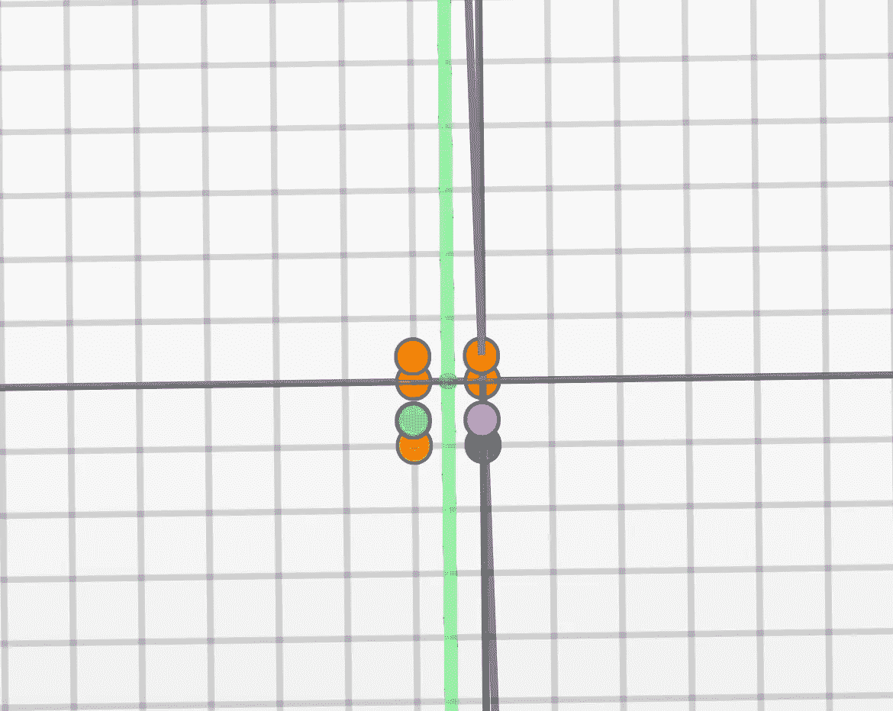

A plane separating the 4 sets to the left from the 4 to the right

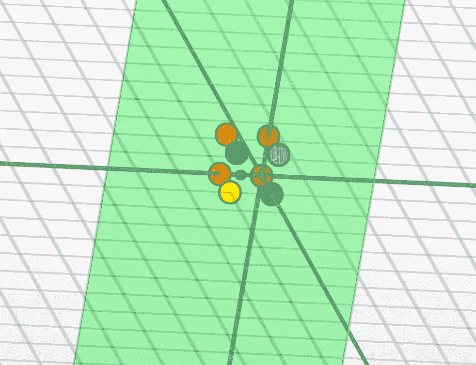

A Plane separating the 4 sets to the left from the 4 to the right

希望你能想象一下上面 8 组输入分开的平面。由于( *x1，x2，x3* )的集合涉及一个三维空间，这可能有点挑战性。但一般来说，具有线性激活函数的单层感知器可以学习分离一个数据集，就像下图中的图表 A，可以用一条 *y = ax + b* 的线来分离。但是，如果数据集只能像图表 B 那样被一个圆非线性地分开，我们的感知机将会表现得很糟糕。

Source: Sebastian Raschka

为什么会这样呢？我从栈溢出为你复制粘贴一个报价。你也可以在这里查看答案[和](https://stackoverflow.com/a/35919708/6297414)。

> 激活函数不可能是线性的，因为具有线性激活函数的神经网络仅在一层深度有效，不管它们的结构有多复杂。网络输入通常是线性变换(输入*权重)，但是现实世界和问题是非线性的。为了使输入数据非线性，我们使用称为激活函数的非线性映射。激活函数是决定特定神经特征存在的决策函数。它映射在 0 和 1 之间，其中 0 表示该特征不存在，而 1 表示该特征存在。不幸的是，权重中发生的小变化不能反映在激活值中，因为它只能取 0 或 1。因此，非线性函数在这个范围内必须是连续的和可微的。神经网络必须能够接受从-无穷大到+无穷大的任何输入，但在某些情况下，它应该能够将其映射到范围在{0，1}或{-1，1}之间的输出，因此需要激活函数。激活函数中需要非线性，因为它在神经网络中的目的是通过权重和输入的非线性组合产生非线性决策边界。”-用户 7479

那么为什么具有阶跃函数的单层感知器不能学习异或门呢？看看下面的图表。左边是 XOR 逻辑图，右边是来自 XOR 门的 2 个不同结果(1 和 0)的笛卡尔表示。

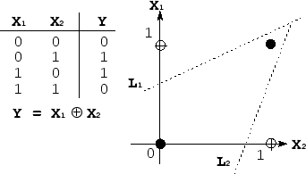

Source: [https://stackoverflow.com/a/35919708/6297414](https://stackoverflow.com/a/35919708/6297414)

事实上，我们不可能用一条直线来区分白点和黑点。我们需要更强大的东西来让神经网络学习 XOR 门逻辑。我很快会写更多关于这个话题的文章。

# 概述

深度学习是一个令人兴奋的领域，它正在迅速改变我们的社会。我们应该关心深度学习，至少了解它的基础知识是很有趣的。我们还介绍了一个非常基本的神经网络，称为(单层)感知器，并了解了感知器的决策模型是如何工作的。

我们的单层感知器加上一个阶跃函数对于简单的线性可分二分类工作良好。但仅此而已…因为它对涉及非线性输出的更复杂的问题不太适用。我知道这听起来有点令人失望，但我们接下来将详细介绍它们！

接下来将是一个关于神经网络的[新帖子](https://medium.com/towards-data-science/multi-layer-neural-networks-with-sigmoid-function-deep-learning-for-rookies-2-bf464f09eb7f)和**隐藏层**(听起来很棒吧？)和一个名为**s 形函数**的新激活函数。如果空间允许，我们将触及**梯度下降**和**反向传播**，这是智能神经网络要学习的关键概念。敬请关注([这里是第二个帖子](https://medium.com/towards-data-science/multi-layer-neural-networks-with-sigmoid-function-deep-learning-for-rookies-2-bf464f09eb7f)的链接) :)

现在，祝贺你跟帖到目前为止，你已经学到了很多！保持动力，我希望你在深度学习中获得乐趣！如果你迫不及待地想看我的文章，请查看以下免费资源，了解更多信息:

 [## 神经网络和深度学习

### 我们专注于手写识别，因为这是学习神经系统的一个极好的原型问题…

neuralnetworksanddeeplearning.com](http://neuralnetworksanddeeplearning.com/chap1.html)  [## 用于视觉识别的 CS231n 卷积神经网络

### 斯坦福 CS231n 课程材料和笔记:视觉识别的卷积神经网络。

cs231n.github.io](http://cs231n.github.io/) 

享受学习！

你喜欢这次阅读吗？别忘了关注我的 [*推特*](https://twitter.com/nahuakang) *！*