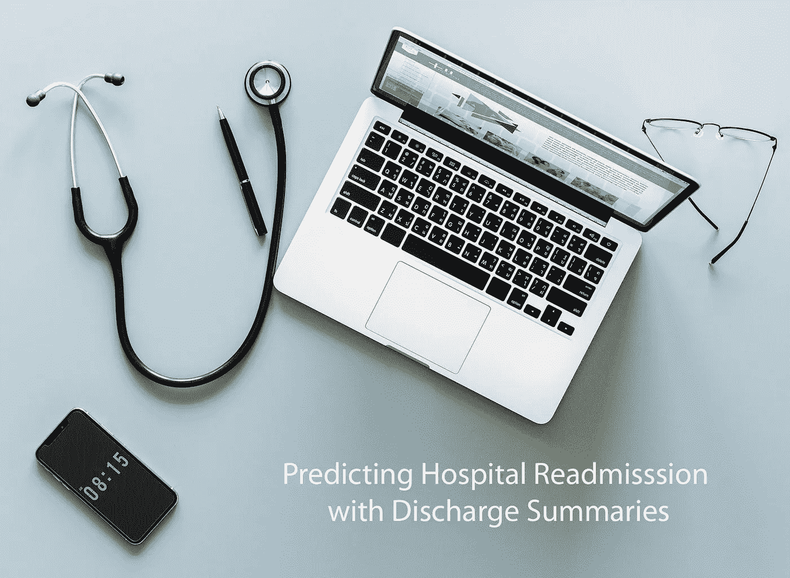
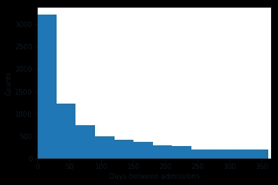
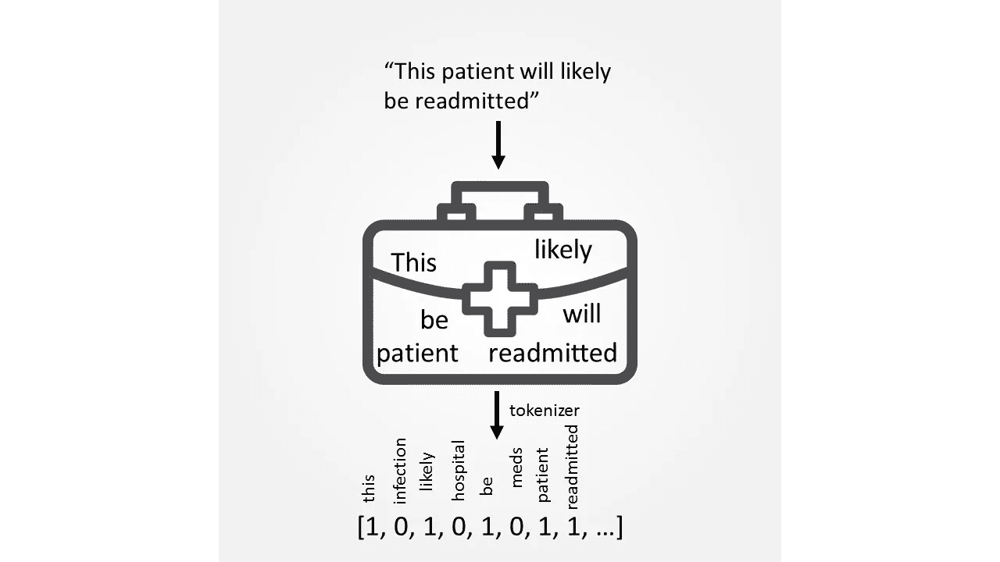
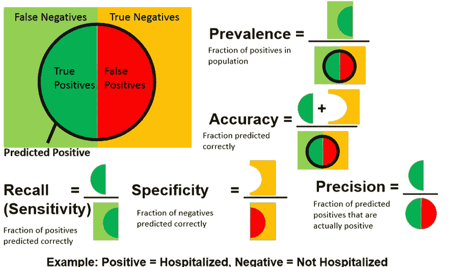
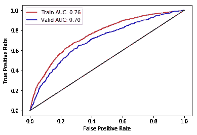
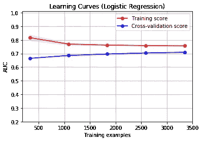
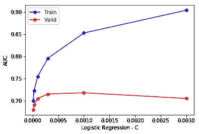
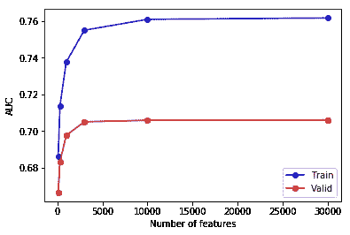
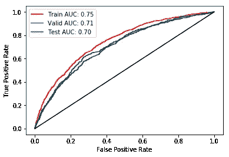

# 临床自然语言处理导论:用出院总结预测医院再入院

> 原文：<https://towardsdatascience.com/introduction-to-clinical-natural-language-processing-predicting-hospital-readmission-with-1736d52bc709?source=collection_archive---------1----------------------->



医生总是写下关于他们病人的临床记录——最初，这些记录写在纸上，锁在柜子里。对数据科学家来说幸运的是，医生现在可以在电子病历中输入他们的笔记。这些笔记代表了大量的知识和见解，可用于使用自然语言处理(NLP)的预测模型，以改善患者护理和医院工作流程。作为一个例子，我将向您展示如何通过出院总结来预测再次入院。

本文面向对医疗数据科学感兴趣的人。完成本教程后，您将学习

*   如何为机器学习项目准备数据
*   如何使用词袋方法预处理非结构化笔记
*   如何建立一个简单的预测模型
*   如何评估你的模型的质量
*   如何决定改进模型的下一步

我最近读了 Rajkomar 等人的伟大论文“电子健康记录的可扩展和精确的深度学习”(论文发表于[https://arxiv.org/abs/1801.07860](https://arxiv.org/abs/1801.07860))。作者利用医院数据建立了许多最先进的深度学习模型，以预测住院死亡率(AUC = 0.93-0.94)、30 天计划外再入院(AUC = 0.75-76)、延长住院时间(AUC = 0.85-0.86)和出院诊断(AUC = 0.90)。AUC 是一个数据科学性能指标(下面将详细介绍),越接近 1 越好。很明显，预测再入院是最困难的任务，因为它的 AUC 较低。我很好奇，如果将流量自由文本摘要与简单的预测模型结合使用，我们可以得到多好的模型。

如果你想在 Jupyter 笔记本上跟随 Python 代码，请随意从我的 [github](https://github.com/andrewwlong/mimic_bow) 下载代码。

# 模型定义

这篇博文将概述如何建立一个分类模型，利用自由文本的出院总结来预测哪些患者有 30 天无计划再入院的风险。

# 数据集

我们将利用 MIMIC-III(重症监护医疗信息集市 III)数据库。这个令人惊叹的免费医院数据库包含了 2001 年至 2012 年马萨诸塞州波士顿贝丝以色列女执事医疗中心收治的超过 50，000 名患者的去身份数据。为了访问该项目的数据，您需要通过此链接请求访问权限(【https://mimic.physionet.org/gettingstarted/access/】T4)。

在本项目中，我们将利用以下 MIMIC III 表格

*   入院—包含入院和出院日期的表格(每个入院都有一个唯一的标识符 HADM_ID)
*   NOTEEVENTS —包含每次住院的所有注释(与 HADM_ID 的链接)

为了保持匿名，每个患者的所有日期都被转移到很远的将来，但是患者的两个连续事件之间的时间被保存在数据库中。这一点很重要，因为它保持了特定患者两次住院之间的时间。

由于这是一个受限制的数据集，我不能公开分享原始患者数据。因此，我将只向您展示人为的单个患者数据或汇总描述。

# 步骤 1:为机器学习项目准备数据

我们将按照以下步骤为我们的机器学习项目准备来自录取和 NOTEEVENTS 模拟表的数据。


首先，我们使用 pandas 数据帧加载录取表:

```
# set up notebook
import pandas as pd
import numpy as np
import matplotlib.pyplot as plt# read the admissions table
df_adm = pd.read_csv('ADMISSIONS.csv')
```

该表中感兴趣的主要列有:

*   SUBJECT_ID:每个主题的唯一标识符
*   HADM_ID:每次住院的唯一标识符
*   入院时间:入院日期，格式为 YYYY-MM-DD hh:mm:ss
*   出院时间:相同格式的出院日期
*   死亡时间:相同格式的死亡时间(如果存在)
*   入院类型:包括择期、急诊、新生儿、急症

下一步是将日期从字符串格式转换成日期时间。我们使用`errors = ‘coerce’`标志来考虑缺失的日期。

```
# convert to dates
df_adm.ADMITTIME = pd.to_datetime(df_adm.ADMITTIME, format = '%Y-%m-%d %H:%M:%S', errors = 'coerce')
df_adm.DISCHTIME = pd.to_datetime(df_adm.DISCHTIME, format = '%Y-%m-%d %H:%M:%S', errors = 'coerce')
df_adm.DEATHTIME = pd.to_datetime(df_adm.DEATHTIME, format = '%Y-%m-%d %H:%M:%S', errors = 'coerce')
```

下一步是获取下一个计划外入院日期(如果存在)。这将遵循几个步骤，我将向您展示一个人造病人会发生什么。首先，我们将按照入院日期对数据帧进行排序

```
# sort by subject_ID and admission date
df_adm = df_adm.sort_values(['SUBJECT_ID','ADMITTIME'])
df_adm = df_adm.reset_index(drop = True)
```

对于单个患者，数据帧可能是这样的:


我们可以使用 groupby shift 操作符来获取每个 SUBJECT_ID 的下一个许可(如果存在的话)

```
# add the next admission date and type for each subject using groupby
# you have to use groupby otherwise the dates will be from different subjects
df_adm['NEXT_ADMITTIME'] = df_adm.groupby('SUBJECT_ID').ADMITTIME.shift(-1)# get the next admission type
df_adm['NEXT_ADMISSION_TYPE'] = df_adm.groupby('SUBJECT_ID').ADMISSION_TYPE.shift(-1)
```


注意上一次录取没有下一次录取。

但是，我们要预测计划外的再次录取，所以我们应该过滤掉选修的下一次录取。

```
# get rows where next admission is elective and replace with naT or nan
rows = df_adm.NEXT_ADMISSION_TYPE == 'ELECTIVE'
df_adm.loc[rows,'NEXT_ADMITTIME'] = pd.NaT
df_adm.loc[rows,'NEXT_ADMISSION_TYPE'] = np.NaN
```


然后回填我们移除的值

```
# sort by subject_ID and admission date
# it is safer to sort right before the fill in case something changed the order above
df_adm = df_adm.sort_values(['SUBJECT_ID','ADMITTIME'])# back fill (this will take a little while)
df_adm[['NEXT_ADMITTIME','NEXT_ADMISSION_TYPE']] = df_adm.groupby(['SUBJECT_ID'])[['NEXT_ADMITTIME','NEXT_ADMISSION_TYPE']].fillna(method = 'bfill')
```


然后我们可以计算下一次入院的天数

```
df_adm['DAYS_NEXT_ADMIT']=  (df_adm.NEXT_ADMITTIME - df_adm.DISCHTIME).dt.total_seconds()/(24*60*60)
```

在我们 58976 例住院患者的数据集中，有 11399 例再次入院。对于那些再次入院的患者，我们可以绘制入院间隔天数的直方图。



现在我们已经准备好处理 NOTEEVENTS.csv 了

```
df_notes = pd.read_csv("NOTEEVENTS.csv")
```

感兴趣的主要列有:

*   主题 ID
*   HADM_ID
*   类别:包括“出院总结”、“回波”、“心电图”、“护理”、“医生”、“康复服务”、“病例管理”、“呼吸”、“营养”、“常规”、“社会工作”、“药房”、“咨询”、“放射科”、“T1”、“护理/其他”
*   正文:我们的临床笔记专栏

由于我不能显示单个音符，我将在这里描述它们。数据集有 2，083，180 行，表明每次住院都有多个记录。在注释中，为了保密，日期和 PHI(姓名、医生、地点)已被转换。还有特殊字符，如\n(换行符)、数字和标点符号。

由于每次住院都有多张票据，我们需要选择使用哪种票据。为了简单起见，让我们使用放电摘要，但是如果我们愿意，我们可以通过连接它们来使用所有的注释。

```
# filter to discharge summary
df_notes_dis_sum = df_notes.loc[df_notes.CATEGORY == 'Discharge summary']
```

由于下一步是合并入院表上的记录，我们可能会假设每次入院都有一个出院总结，但我们可能应该检查一下。我们可以用一个 assert 语句来检查这一点，结果失败了。


在这一点上，您可能想要研究为什么有多个摘要，但是为了简单起见，让我们只使用最后一个

```
df_notes_dis_sum_last = (df_notes_dis_sum.groupby(['SUBJECT_ID','HADM_ID']).nth(-1)).reset_index()
assert df_notes_dis_sum_last.duplicated(['HADM_ID']).sum() == 0, 'Multiple discharge summaries per admission'
```

现在我们准备合并录取和注释表。我使用左合并来解决音符丢失的问题。在很多情况下，合并后会得到多行(尽管我们在上面已经处理过了)，所以我喜欢在合并后添加 assert 语句

```
df_adm_notes = pd.merge(df_adm[['SUBJECT_ID','HADM_ID','ADMITTIME','DISCHTIME','DAYS_NEXT_ADMIT','NEXT_ADMITTIME','ADMISSION_TYPE','DEATHTIME']],
                        df_notes_dis_sum_last[['SUBJECT_ID','HADM_ID','TEXT']], 
                        on = ['SUBJECT_ID','HADM_ID'],
                        how = 'left')
assert len(df_adm) == len(df_adm_notes), 'Number of rows increased'
```

10.6 %的录取通知书丢失了(`df_adm_notes.TEXT.isnull().sum() / len(df_adm_notes)`)，所以我进一步调查了一下

```
df_adm_notes.groupby('ADMISSION_TYPE').apply(lambda g: g.TEXT.isnull().sum())/df_adm_notes.groupby('ADMISSION_TYPE').size()
```

并发现 53%的新生儿入院缺少出院小结，而其他新生儿的这一比例为 4%。在这一点上，我决定取消新生入学。最有可能的是，这些失踪的新生儿入院记录的出院总结存储在模拟数据集之外。

对于这个问题，我们要对未来 30 天内是否会收治一个病人进行分类。因此，我们需要创建一个带有输出标签的变量(1 =重新接纳，0 =不重新接纳)

```
df_adm_notes_clean['OUTPUT_LABEL'] = (df_adm_notes_clean.DAYS_NEXT_ADMIT < 30).astype('int')
```

快速计数阳性和阴性结果为 3004 个阳性样本，48109 个阴性样本。这表明我们有一个不平衡的数据集，这在医疗保健数据科学中是常见的。

准备数据的最后一步是将数据分成训练集、验证集和测试集。为了获得可重复的结果，我让 random_state 始终为 42。

```
# shuffle the samples
df_adm_notes_clean = df_adm_notes_clean.sample(n = len(df_adm_notes_clean), random_state = 42)
df_adm_notes_clean = df_adm_notes_clean.reset_index(drop = True)# Save 30% of the data as validation and test data 
df_valid_test=df_adm_notes_clean.sample(frac=0.30,random_state=42)df_test = df_valid_test.sample(frac = 0.5, random_state = 42)
df_valid = df_valid_test.drop(df_test.index)# use the rest of the data as training data
df_train_all=df_adm_notes_clean.drop(df_valid_test.index)
```

由于患病率如此之低，我们希望防止模型总是预测为阴性(非再入院)。为此，我们有几个选项来平衡训练数据

*   对底片进行子采样
*   过度采样阳性
*   创建合成数据(如 SMOTE)

由于我没有对您计算机的 RAM 大小做出任何限制，我们将对负面数据进行子采样，但我鼓励您尝试其他技术，如果您的计算机或服务器可以处理它，看看您是否可以获得改进。(如果你尝试这样做，请在下面发表评论！)

```
# split the training data into positive and negative
rows_pos = df_train_all.OUTPUT_LABEL == 1
df_train_pos = df_train_all.loc[rows_pos]
df_train_neg = df_train_all.loc[~rows_pos]# merge the balanced data
df_train = pd.concat([df_train_pos, df_train_neg.sample(n = len(df_train_pos), random_state = 42)],axis = 0)# shuffle the order of training samples 
df_train = df_train.sample(n = len(df_train), random_state = 42).reset_index(drop = True)
```

# 步骤 2:使用词袋方法对非结构化笔记进行预处理

现在，我们已经创建了具有标签和注释的数据集，我们需要预处理我们的文本数据，以将其转换为对机器学习模型有用的东西(例如数字)。我们将使用单词袋(BOW)方法。

BOW 基本上将笔记分解成单个单词，并计算每个单词出现的次数。你的数字数据就变成了一些单词的计数，如下所示。BOW 是做 NLP 分类最简单的方法。在我读过的大多数博客文章中，对于 NLP 分类任务，更高级的技术很难胜过 BOW。



在这个过程中，需要做出的选择很少

*   如何对单词进行预处理
*   如何统计单词
*   使用哪些单词

没有适合所有 NLP 项目的最佳选择，所以我建议在构建自己的模型时尝试一些选项。

您可以用两种方式进行预处理

*   修改原始数据帧文本列
*   作为管道的一部分进行预处理，这样就不会编辑原始数据

我将向您展示如何做到这两个，但我更喜欢第二个，因为它需要大量的工作才能达到这一点。

让我们定义一个函数，通过用空格填充缺失的注释并删除换行符和回车符来修改原始数据帧

```
def preprocess_text(df):
    # This function preprocesses the text by filling not a number and replacing new lines ('\n') and carriage returns ('\r')
    df.TEXT = df.TEXT.fillna(' ')
    df.TEXT = df.TEXT.str.replace('\n',' ')
    df.TEXT = df.TEXT.str.replace('\r',' ')
    return df# preprocess the text to deal with known issues
df_train = preprocess_text(df_train)
df_valid = preprocess_text(df_valid)
df_test = preprocess_text(df_test)
```

另一种选择是作为管道的一部分进行预处理。这个过程包括使用一个标记器和一个矢量器。记号赋予器将单个音符分解成单词列表，矢量器获取单词列表并对单词进行计数。

我们将使用`nltk`包中的`word_tokenize`作为默认的记号赋予器，它基本上基于空格和一些标点符号来分解注释。下面显示了一个示例:

```
import nltk
from nltk import word_tokenize
word_tokenize('This should be tokenized. 02/02/2018 sentence has stars**')
```

带输出:

```
[‘This’, ‘should’, ‘be’, ‘tokenized’, ‘.’, ‘02/02/2018’, ‘sentence’,
 ‘has’, ‘stars**’]
```

默认情况下，一些标点符号被分开，数字留在句子中。我们将编写自己的记号赋予器函数来

*   用空格替换标点符号
*   用空格替换数字
*   小写所有单词

```
import string
def tokenizer_better(text):
    # tokenize the text by replacing punctuation and numbers with spaces and lowercase all words

    punc_list = string.punctuation+'0123456789'
    t = str.maketrans(dict.fromkeys(punc_list, " "))
    text = text.lower().translate(t)
    tokens = word_tokenize(text)
    return tokens
```

有了这个标记符，我们就可以从原来的句子中得到

```
['this', 'should', 'be', 'tokenized', 'sentence', 'has', 'stars']
```

你可以做的另外的事情将会是词汇化或词干化，但是那是更高级的，所以我将跳过它。

既然我们有了将自由文本转换成令牌的方法，我们就需要一种方法来计算每个流量摘要的令牌数。我们将使用 scikit-learn 包中内置的`CountVectorizer` 。这个矢量器只是计算每个单词在笔记中出现的次数。还有一个`TfidfVectorizer` ，它考虑了单词在所有笔记中的使用频率，但对于这个项目，让我们使用更简单的一个(我在第二个项目中也得到了类似的结果)。

例如，假设我们有 3 个音符

```
sample_text = ['Data science is about the data', 'The science is amazing', 'Predictive modeling is part of data science']
```

本质上，您可以使用 CountVectorizer 来学习数据中的单词，并转换数据以创建每个单词的计数。

```
from sklearn.feature_extraction.text import CountVectorizer
vect = CountVectorizer(tokenizer = tokenizer_better)
vect.fit(sample_text)# matrix is stored as a sparse matrix (since you have a lot of zeros)
X = vect.transform(sample_text)
```

矩阵 X 将是一个稀疏矩阵，但是如果你把它转换成一个数组(`X.toarray()`，你会看到这个

```
array([[1, 0, 2, 1, 0, 0, 0, 0, 1, 1],
       [0, 1, 0, 1, 0, 0, 0, 0, 1, 1],
       [0, 0, 1, 1, 1, 1, 1, 1, 1, 0]], dtype=int64)
```

其中有 3 行(因为我们有 3 个音符)和每个单词的计数。您可以看到带有`vect.get_feature_names()`的列名

```
['about', 'amazing', 'data', 'is', 'modeling', 'of', 'part', 'predictive', 'science', 'the']
```

我们现在可以在临床笔记上安装 CountVectorizer。只使用训练数据是很重要的，因为您不希望包含在验证和测试集中出现的任何新单词。有一个名为 max_features 的超参数，您可以设置它来限制矢量器中包含的单词数量。这将使用前 N 个最常用的单词。在第 5 步中，我们将对此进行调整以查看其效果。

```
# fit our vectorizer. This will take a while depending on your computer. from sklearn.feature_extraction.text import CountVectorizer
vect = CountVectorizer(max_features = 3000, tokenizer = tokenizer_better)# this could take a while
vect.fit(df_train.TEXT.values)
```

我们可以看看最常用的词，我们会发现这些词中的许多可能不会为我们的模型增加任何价值。这些词被称为停用词，我们可以用 CountVectorizer 轻松地(如果我们想的话)删除它们。不同的自然语言处理语料库都有常用的停用词列表，但是我们将根据下面的图片来创建自己的停用词列表。


```
my_stop_words = ['the','and','to','of','was','with','a','on','in','for','name',                 'is','patient','s','he','at','as','or','one','she','his','her','am',                 'were','you','pt','pm','by','be','had','your','this','date',                'from','there','an','that','p','are','have','has','h','but','o',                'namepattern','which','every','also']
```

如果您愿意，可以随意添加自己的停用词。

```
from sklearn.feature_extraction.text import CountVectorizer
vect = CountVectorizer(max_features = 3000, 
                       tokenizer = tokenizer_better, 
                       stop_words = my_stop_words)
# this could take a while
vect.fit(df_train.TEXT.values)
```

现在我们可以把笔记转换成数字矩阵。在这一点上，我将只使用训练和验证数据，所以我还不想看它如何在测试数据上工作。

```
X_train_tf = vect.transform(df_train.TEXT.values)
X_valid_tf = vect.transform(df_valid.TEXT.values)
```

我们还需要我们的输出标签作为单独的变量

```
y_train = df_train.OUTPUT_LABEL
y_valid = df_valid.OUTPUT_LABEL
```

从滚动条的位置可以看出……和往常一样，为预测模型准备数据需要花费 80%的时间。

# 第三步:建立一个简单的预测模型

我们现在可以建立一个简单的预测模型，该模型利用我们的词汇输入，预测患者是否会在 30 天内再次入院(是= 1，否= 0)。

这里我们将使用逻辑回归模型。逻辑回归是 NLP 任务的一个很好的基线模型，因为它可以很好地处理稀疏矩阵并且是可解释的。我们有一些额外的选择(称为超参数),包括 C 和 penalty，C 是正则化系数，penalty 告诉我们如何测量正则化。正则化本质上是一种试图最小化过度拟合的技术。

```
# logistic regression
from sklearn.linear_model import LogisticRegression
clf=LogisticRegression(C = 0.0001, penalty = 'l2', random_state = 42)
clf.fit(X_train_tf, y_train)
```

我们可以用拟合的模型计算每个样本的再入院概率

```
model = clf
y_train_preds = model.predict_proba(X_train_tf)[:,1]
y_valid_preds = model.predict_proba(X_valid_tf)[:,1]
```

# 步骤 4:评估模型的质量

在这一点上，我们需要衡量我们的模型表现如何。有几种不同的数据科学性能指标。如果你感兴趣，我写了另一篇[博文](/data-science-performance-metrics-for-everyone-4d68f4859eef)详细解释了这些。由于这篇文章很长，我将开始展示结果和数据。您可以查看 github 帐户中生成这些数字的代码。



对于预测为阳性的阈值 0.5，我们得到以下性能


对于当前选择的超参数，我们确实有一些过度拟合。需要指出的一点是，两组数据的精度之间的主要差异是由于我们平衡了训练集，而验证集是原始分布。目前，如果我们列出一份预计会再次入院的患者名单，我们会发现他们是我们随机选择患者的两倍(精确度与患病率)。

上面没有显示的另一个性能指标是 AUC 或 ROC 曲线下面积。我们当前模型的 ROC 曲线如下所示。实际上，ROC 曲线允许您在改变您定义的预测阳性与预测阴性的阈值时，看到真阳性率和假阳性率之间的权衡。



# 步骤 5:改进模型的后续步骤

此时，您可能想在测试集上计算性能，看看自己做得如何。但是等等！我们做了许多选择(下面是几个)，我们可以改变这些选择，看看是否有改进:

*   我们应该花时间获取更多数据吗？
*   如何标记—我们应该使用词干吗？
*   如何向量化—我们应该改变字数吗？
*   如何正则化逻辑回归——我们应该改变 C 还是惩罚？
*   用哪个型号？

当我试图改进我的模型时，我阅读了许多其他博客帖子和文章，以了解人们如何解决类似的问题。当你这样做的时候，你开始看到可视化数据的有趣方式，我强烈推荐你在自己的项目中坚持使用这些技术。

对于使用 BOW+逻辑回归的 NLP 项目，我们可以绘制最重要的单词，看看我们是否可以获得任何洞察力。对于这一步，我借用了[洞察数据科学](https://www.insightdatascience.com/)的[篇不错的 NLP 文章](https://blog.insightdatascience.com/how-to-solve-90-of-nlp-problems-a-step-by-step-guide-fda605278e4e)中的代码。当你看最重要的单词时，我看到两件直接的事情:

*   哎呀！我忘了排除那些因为‘过期’出现在负面清单中而死亡的病人。目前，我将忽略这一点，并在下面修复它。
*   还有一些我们可能应该删除的其他停用词('应该'，'如果'，'它'，'一直'，'谁'，'期间'，' x ')


当我们想要改进模型时，我们希望以数据驱动的方式进行。你可以花很多时间在“预感”上，那不会以失败告终。要做到这一点，建议选择一个用于决策单一性能指标。对于这个项目，我将选择 AUC。

对于上面的第一个问题，我们可以绘制一条学习曲线来了解添加更多数据的影响。吴恩达有一套很棒的 [Coursera](https://www.coursera.org/specializations/deep-learning?utm_source=gg&utm_medium=sem&campaignid=904733485&adgroupid=54215108588&device=c&keyword=andrew%20ng&matchtype=p&network=g&devicemodel=&adpostion=1t1&creativeid=231631799402&hide_mobile_promo&gclid=CjwKCAjwi6TYBRAYEiwAOeH7GeXWns0WX-unoWb9Sjr-fQPQOEGlzN1jrQbqqazh6Iuvvy2JOjbLbhoCibEQAvD_BwE) 课程，讨论高偏差和高方差模型。



first learning curve with C = 0.0001

我们可以看到，我们有一些过度拟合，但添加更多的数据可能不会大幅改变验证集的 AUC。知道这一点很好，因为这意味着我们不应该花几个月的时间来获取更多的数据。

我们可以做的一些简单的事情是尝试看看我们的一些超参数(`max_features`和`C`)的影响。我们可以运行网格搜索，但是因为我们这里只有两个参数，我们可以分别查看它们，看看效果。



Effect of C



Effect of max_features

我们可以看到，增加 C 和 max_features 会导致模型很快过度拟合。我选择 C = 0.0001，max_features = 3000，此时验证集开始趋于平稳。

在这一点上，你可以尝试一些其他的事情

*   将子采样改为过采样
*   向记号赋予器添加词干或词汇化
*   测试几种不同的 sci-kit 学习模型
*   连接所有的注释，而不是最后的出院小结
*   尝试 LSTMs 等深度学习方法
*   查看您认为错误的出院总结

# 步骤 6:完成你的模型并测试它

我们现在将使用超参数选择来拟合我们的最终模型。我们也将排除死于再平衡的患者。

```
rows_not_death = df_adm_notes_clean.DEATHTIME.isnull()df_adm_notes_not_death = df_adm_notes_clean.loc[rows_not_death].copy()
df_adm_notes_not_death = df_adm_notes_not_death.sample(n = len(df_adm_notes_not_death), random_state = 42)
df_adm_notes_not_death = df_adm_notes_not_death.reset_index(drop = True)# Save 30% of the data as validation and test data 
df_valid_test=df_adm_notes_not_death.sample(frac=0.30,random_state=42)df_test = df_valid_test.sample(frac = 0.5, random_state = 42)
df_valid = df_valid_test.drop(df_test.index)# use the rest of the data as training data
df_train_all=df_adm_notes_not_death.drop(df_valid_test.index)assert len(df_adm_notes_not_death) == (len(df_test)+len(df_valid)+len(df_train_all)),'math didnt work'# split the training data into positive and negative
rows_pos = df_train_all.OUTPUT_LABEL == 1
df_train_pos = df_train_all.loc[rows_pos]
df_train_neg = df_train_all.loc[~rows_pos]# merge the balanced data
df_train = pd.concat([df_train_pos, df_train_neg.sample(n = len(df_train_pos), random_state = 42)],axis = 0)# shuffle the order of training samples 
df_train = df_train.sample(n = len(df_train), random_state = 42).reset_index(drop = True)# preprocess the text to deal with known issues
df_train = preprocess_text(df_train)
df_valid = preprocess_text(df_valid)
df_test = preprocess_text(df_test)
my_new_stop_words = ['the','and','to','of','was','with','a','on','in','for','name',              'is','patient','s','he','at','as','or','one','she','his','her','am',                 'were','you','pt','pm','by','be','had','your','this','date',                'from','there','an','that','p','are','have','has','h','but','o',                'namepattern','which','every','also','should','if','it','been','who','during', 'x']from sklearn.feature_extraction.text import CountVectorizervect = CountVectorizer(lowercase = True, max_features = 3000, 
                       tokenizer = tokenizer_better,
                      stop_words = my_new_stop_words)# fit the vectorizer
vect.fit(df_train.TEXT.values)X_train_tf = vect.transform(df_train.TEXT.values)
X_valid_tf = vect.transform(df_valid.TEXT.values)
X_test_tf = vect.transform(df_test.TEXT.values)y_train = df_train.OUTPUT_LABEL
y_valid = df_valid.OUTPUT_LABEL
y_test = df_test.OUTPUT_LABELfrom sklearn.linear_model import LogisticRegressionclf=LogisticRegression(C = 0.0001, penalty = 'l2', random_state = 42)
clf.fit(X_train_tf, y_train)model = clf
y_train_preds = model.predict_proba(X_train_tf)[:,1]
y_valid_preds = model.predict_proba(X_valid_tf)[:,1]
y_test_preds = model.predict_proba(X_test_tf)[:,1]
```

这会产生以下结果和 ROC 曲线。



# 结论

恭喜你！你建立了一个简单的 NLP 模型(AUC = 0.70)来预测基于医院出院总结的再入院，这个模型仅比使用所有医院数据的最先进的深度学习方法(AUC = 0.75)稍差。如果你有任何反馈，请在下面留下。

如果你对医疗保健领域的深度学习 NLP 感兴趣，我推荐阅读 https://arxiv.org/abs/1711.10663[的 Erin Craig 的文章](https://arxiv.org/abs/1711.10663)

# 参考

利用电子健康记录进行可扩展和精确的深度学习。拉杰科马尔 A，柳文欢 E，陈 K，等数字医学(2018)。DOI:10.1038/s 41746–018–0029–1。地点:【https://www.nature.com/articles/s41746-018-0029-1 

MIMIC-III，一个免费的重症监护数据库。Johnson AEW，Pollard TJ，Shen L，Lehman L，Feng M，Ghassemi M，Moody B，Szolovits P，LA 和 Mark RG。科学数据(2016)。DOI: 10.1038/sdata.2016.35 可在:[http://www.nature.com/articles/sdata201635](http://www.nature.com/articles/sdata201635)获得