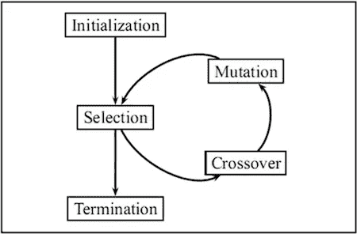
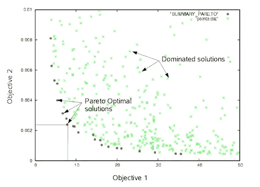
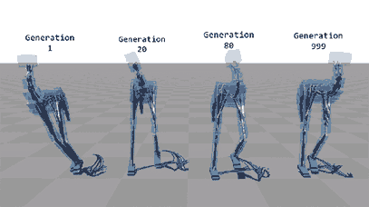

# 进化算法简介

> 原文：<https://towardsdatascience.com/introduction-to-evolutionary-algorithms-a8594b484ac?source=collection_archive---------0----------------------->

## 自然选择最优化

Photo by [Daniele Levis Pelusi](https://unsplash.com/@yogidan2012?utm_source=medium&utm_medium=referral) on [Unsplash](https://unsplash.com?utm_source=medium&utm_medium=referral)

进化算法是一种基于启发式的方法，用于解决多项式时间内无法轻松解决的问题，例如经典的 NP 难问题，以及其他任何需要太长时间才能彻底处理的问题。当单独使用时，它们通常应用于组合问题；然而，遗传算法经常与其他方法一起使用，作为一种快速的方法，为另一种算法找到某种程度上最佳的开始位置。

假设你熟悉自然选择的过程，那么进化算法(进一步称为 **EA** )的前提非常简单。一个进化算法包含四个步骤:**初始化、选择、遗传算子和终止**。这些步骤大致对应于自然选择的一个特定方面，并提供了简单的方法来模块化这种算法类别的实现。简而言之，在进化过程中，更适合的成员会生存和繁殖，而不适合的成员会死去，不会为下一代的基因库做出贡献，就像自然选择一样。

# 语境

在本文的范围内，我们通常将问题定义为:我们希望找到使某个适应度函数最大化的元素的最佳组合，并且一旦我们已经运行了某个最大迭代次数的算法，或者我们已经达到了某个适应度阈值，我们将接受最终的解决方案。这种场景显然不是使用 EA 的唯一方式，但是它确实包含了离散情况下的许多常见应用程序。

# 初始化

为了开始我们的算法，我们必须首先创建解的初始**群体**。群体将包含问题的任意数量的可能解决方案，通常称为**成员**。它通常是随机创建的(在问题的约束范围内)，或者，如果任务的一些先验知识是已知的，大致围绕被认为是理想的东西。群体包含广泛的解决方案是很重要的，因为它本质上代表一个基因库；因此，如果我们希望在算法的过程中探索许多不同的可能性，我们应该致力于让许多不同的基因存在。

# 选择

一旦群体被创建，群体的成员现在必须根据**适应度函数**被评估。适应度函数是一种函数，它接受成员的特征，并输出解决方案可行性的数字表示。创建适应度函数通常非常困难，找到一个准确表示数据的好函数非常重要；这是非常具体的问题。现在，我们计算所有成员的适应度，并选择一部分得分最高的成员。

## **多目标函数**

EAs 还可以扩展到使用多种健身功能。这使过程有些复杂，因为当使用多个适应度函数时，我们不是能够识别单个最佳点，而是以一组最佳点结束。最优解的集合被称为**帕累托边界**，并且包含同样最优的元素，在这个意义上，没有一个解优于边界中的任何其他解。一个**决策器**随后被用于根据问题的上下文或其他一些度量来缩小单一解决方案的范围。

# 遗传算子

这一步真的包括两个子步骤:**交叉和变异**。选择顶级成员(通常是前 2 名，但这个数字可以变化)后，这些成员现在用于在算法中创建下一代。使用被选择的父母的特征，新的孩子被创造出来，它是父母的品质的混合物。根据数据的类型，这样做通常很困难，但通常在组合问题中，可以混合组合并从这些输入中输出有效的组合。现在，我们必须将**新的遗传物质**引入这一代。如果我们不做这关键的一步，我们将很快陷入局部极值，无法获得最佳结果。这一步是突变，而我们做到这一点，非常简单，通过改变一小部分孩子，使他们不再完美地反映父母的基因子集。突变通常是随机发生的，因为儿童接受突变的机会以及突变的严重程度是由概率分布决定的。

# 结束

最终，算法必须结束。这通常发生在两种情况下:或者算法已经达到某个**最大运行时间**，或者算法已经达到某个**性能阈值**。此时，选择并返回最终解决方案。

# 例子

现在，为了说明这一过程的结果，我将展示一个 EA 运行的例子。下面的 gif 展示了几代恐龙通过优化身体结构和施加肌肉力量来学习行走。从左到右，世代增加，因此越靠右，行走过程越优化。尽管早期的恐龙不能行走，但 EA 能随时间通过突变和交叉将恐龙进化成能行走的形态。

