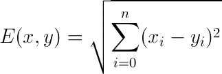
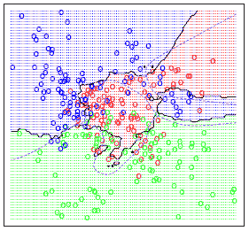

# k 近邻介绍

> 原文：<https://towardsdatascience.com/introduction-to-k-nearest-neighbors-3b534bb11d26?source=collection_archive---------3----------------------->

## 什么是 k 近邻(kNN)，一些有用的应用，以及它是如何工作的


**k-最近邻(kNN)** 分类方法是机器学习中最简单的方法之一，也是向你介绍机器学习和分类的一个很好的方式。在最基本的层面上，本质上是通过在训练数据中找到最相似的数据点进行分类，并基于它们的分类做出有根据的猜测。虽然理解和实现起来非常简单，但这种方法已经在许多领域得到了广泛的应用，例如在**推荐系统**、**语义搜索**和**异常检测**中。

正如我们在任何机器学习问题中需要的那样，我们必须首先找到一种方法将数据点表示为特征向量。特征向量是我们对数据的数学表示，并且由于我们数据的期望特征可能不是固有的数值，因此可能需要预处理和特征工程来创建这些向量。给定具有 **N** 个独特特征的数据，特征向量将是长度为 **N** 的向量，其中向量的条目 **I** 表示特征 **I** 的数据点的值。因此，每个特征向量可以被认为是 R^N 中的一个点。

现在，与大多数其他分类方法不同，kNN 属于**懒惰学习**，这意味着在分类之前没有**明确的训练阶段。相反，任何概括或抽象数据的尝试都是在分类的基础上进行的。虽然这确实意味着一旦我们有了数据，我们就可以立即开始分类，但这种类型的算法存在一些固有的问题。我们必须能够将整个训练集保存在内存中，除非我们对数据集应用某种类型的约简，并且执行分类在计算上可能是昂贵的，因为算法解析每个分类的所有数据点。**由于这些原因，kNN 倾向于在没有很多特征的较小数据集上工作得最好。****

一旦我们形成了我们的训练数据集，它被表示为一个 **M** x **N** 矩阵，其中 **M** 是数据点的数量， **N** 是特征的数量，我们现在可以开始分类了。对于每个分类查询，kNN 方法的要点是:

```
**1.** Compute a distance value between the item to be classified and every item in the training data-set**2.** Pick the k closest data points (the items with the k lowest distances)**3.** Conduct a **“majority vote”** among those data points — the dominating classification in that pool is decided as the final classification
```

在进行分类之前，必须做出两个重要的决定。一个是将要使用的 **k** 的值；这可以任意决定，或者您可以尝试**交叉验证**来找到一个最佳值。接下来，也是最复杂的，是将要使用的**距离度量**。

有许多不同的方法来计算距离，因为它是一个相当模糊的概念，并且要使用的适当度量总是由数据集和分类任务来确定。然而，两个流行的是**欧几里德距离**和**余弦相似度**。

欧几里德距离大概是你最熟悉的一个；它本质上是通过从要分类的点中减去训练数据点而获得的向量的幅度。



General formula for Euclidean distance

另一个常见的度量是余弦相似性。余弦相似度不是计算大小，而是使用两个向量之间的方向差异。


General formula for Cosine similarity

选择一个度量标准通常很棘手，最好使用交叉验证来决定，除非您事先有一些明确的见解，可以导致使用一个而不是另一个。例如，对于像单词向量这样的东西，您可能希望使用余弦相似度，因为单词的方向比分量值的大小更有意义。通常，这两种方法会在大致相同的时间内运行，并且会受到高维数据的影响。

在完成上述所有工作并决定一个度量标准后，kNN 算法的结果是一个将 **R^N** 划分为多个部分的决策边界。每一个部分(下面有明显的颜色)代表分类问题中的一个类别。边界不需要用实际的训练示例来形成，而是使用距离度量和可用的训练点来计算。通过将 **R^N** 分成(小)块，我们可以计算该区域中假设数据点的最可能类别，因此我们将该块着色为在该类别的区域中。



这些信息是开始实现算法所需要的全部，这样做应该相对简单。当然，有许多方法可以改进这个基本算法。常见的修改包括加权和特定的预处理，以减少计算和减少噪声，例如用于特征提取和维数减少的各种算法。此外，kNN 方法也被用于回归任务，尽管不太常用，其操作方式与通过平均的分类器非常相似。