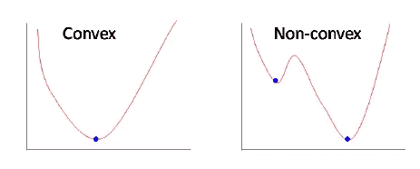
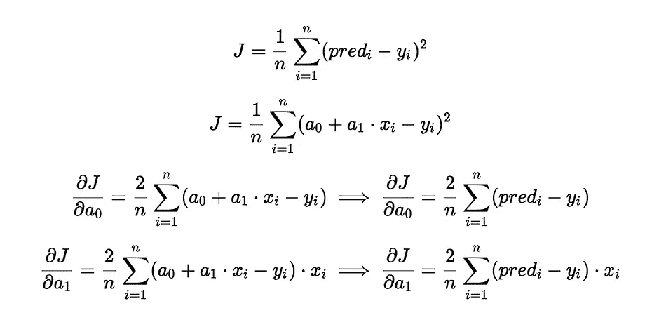
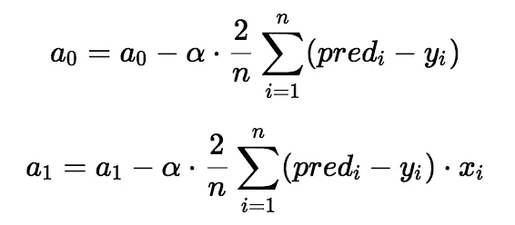
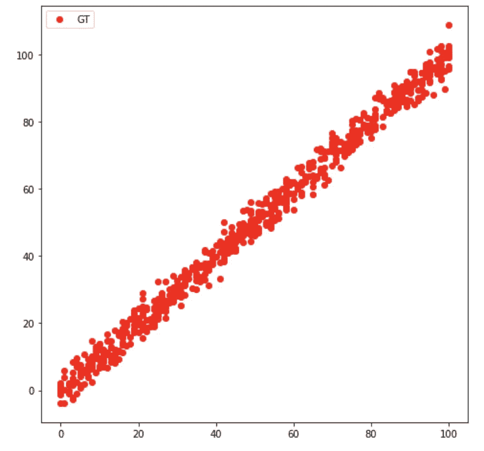
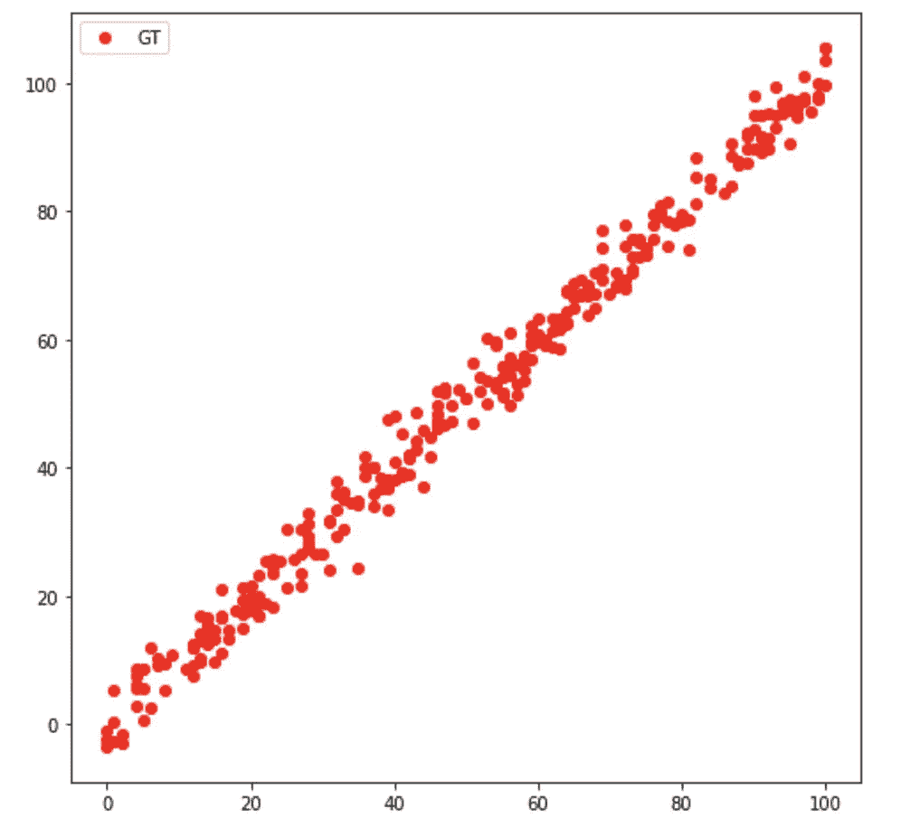
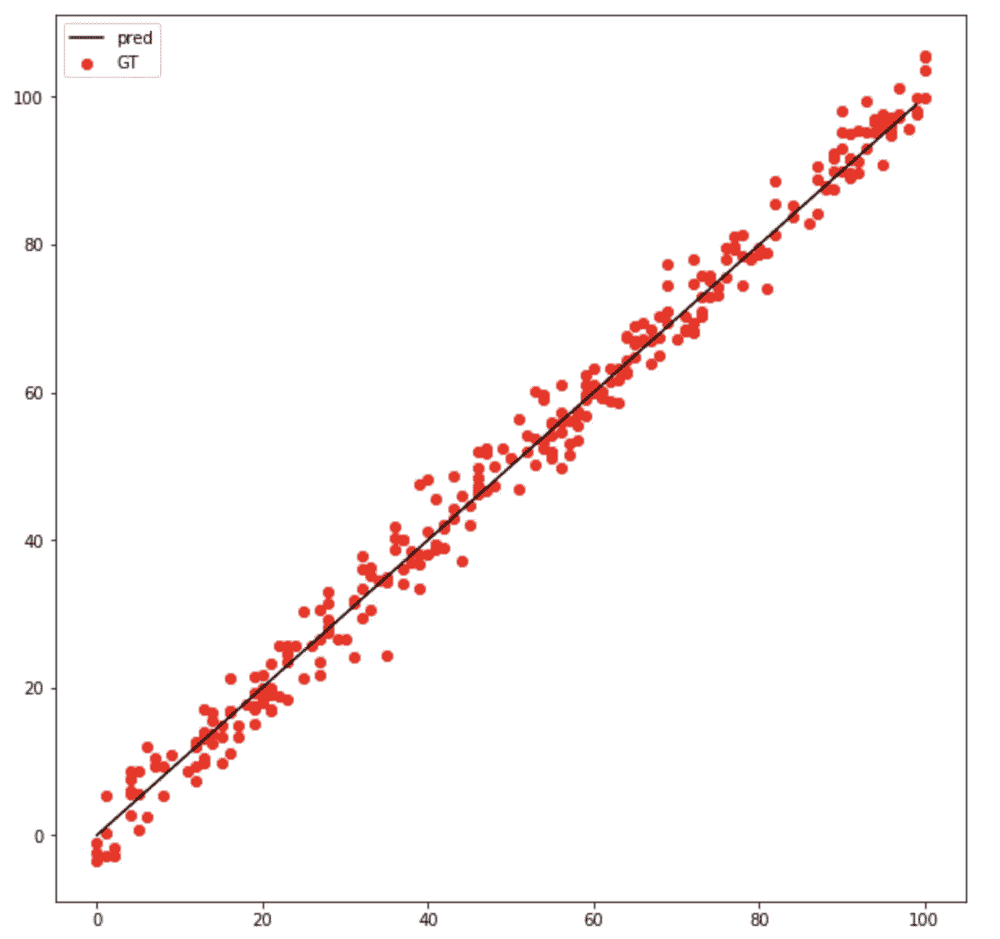

# 机器学习算法简介:线性回归

> 原文：<https://towardsdatascience.com/introduction-to-machine-learning-algorithms-linear-regression-14c4e325882a?source=collection_archive---------0----------------------->

## 从头开始构建您自己的模型


人工智能最近变得流行起来。不同学科的人都在尝试应用人工智能来简化他们的任务。例如，经济学家正在使用人工智能预测未来的市场价格以获取利润，医生使用人工智能对肿瘤进行分类，气象学家使用人工智能预测天气，人力资源招聘人员使用人工智能检查申请人的简历以验证申请人是否符合工作的最低标准，等等。人工智能这种无处不在的使用背后的推动力是机器学习算法。对于任何想学习最大似然算法但还没有涉足的人来说，你来对地方了。每个机器学习爱好者开始使用的基本算法是线性回归算法。因此，我们将做同样的事情，因为它为我们建立和学习其他 ML 算法提供了一个基础。

## 什么是线性回归？？

在了解什么是线性回归之前，让我们习惯于回归。回归是一种基于独立预测值对目标值建模的方法。这种方法主要用于预测和找出变量之间的因果关系。回归技术的主要区别在于自变量的数量以及自变量和因变量之间的关系类型。


Linear Regression

简单线性回归是一种回归分析，其中自变量的数量为 1，自变量(x)和因变量(y)之间存在线性关系。上图中的红线被称为最佳拟合直线。根据给定的数据点，我们试图绘制一条线，最好地模拟这些点。该线可以基于如下所示的线性方程进行建模。

```
y = a_0 + a_1 * x      ## Linear Equation
```

线性回归算法的目的是找到 A0 和 a1 的最佳值。在继续讨论算法之前，让我们先来看看两个重要的概念，为了更好地理解线性回归，你必须知道这两个概念。

## 价值函数

成本函数帮助我们计算出 a_0 和 a_1 的最佳可能值，这将为数据点提供最佳拟合线。因为我们想要 a_0 和 a_1 的最佳值，所以我们将这个搜索问题转化为最小化问题，我们希望最小化预测值和实际值之间的误差。


Minimization and Cost Function

我们选择上面的函数来最小化。预测值和地面真实值之间的差异测量误差差。我们对所有数据点的误差差求平方并求和，然后将该值除以数据点的总数。这提供了所有数据点的平均平方误差。因此，该成本函数也被称为均方误差(MSE)函数。现在，使用这个 MSE 函数，我们将改变 a_0 和 a_1 的值，使 MSE 值稳定在最小值。

## 梯度下降

理解线性回归需要的下一个重要概念是梯度下降。梯度下降是一种更新 A0 和 a1 以降低成本函数(MSE)的方法。想法是我们从 A0 和 a1 的一些值开始，然后我们迭代地改变这些值以降低成本。梯度下降帮助我们了解如何改变这些值。


Gradient Descent

打个比方，想象一个 U 形的坑，你站在坑的最高点，你的目标是到达坑的底部。有一个难题，你只能走不连续的几步才能到达底部。如果你决定一次迈出一步，你最终会到达深渊的底部，但这需要更长的时间。如果你每次选择走更长的步，你会更快到达，但是，有可能你会越过坑的底部，而不是正好在底部。在梯度下降算法中，你走的步数就是学习率。这决定了算法多快收敛到最小值。



Convex vs Non-convex function

有时，成本函数可以是非凸函数，在这种情况下，您可能会陷入局部最小值，但对于线性回归，它始终是凸函数。

你可能想知道如何使用梯度下降来更新 a_0 和 a_1。为了更新 a_0 和 a_1，我们从成本函数中取梯度。为了找到这些梯度，我们对 a_0 和 a_1 求偏导数。现在，为了理解下面的偏导数是如何得到的，你需要一些微积分，但是如果你不需要，也没关系。你可以照原样接受。



偏导数是梯度，它们用于更新 A0 和 a1 的值。Alpha 是学习率，它是一个必须指定的超参数。较小的学习率可以让你更接近最小值，但需要更多的时间来达到最小值，较大的学习率收敛更快，但有可能超过最小值。

## 密码

让我们来看看代码。我们有两个选择，我们可以使用 scikit learn 库导入线性回归模型并直接使用它，或者我们可以根据上面的等式编写自己的回归模型。与其两个选一个，不如两个都做:)

在线上有许多数据集可用于线性回归。我用的是这个[链接](https://www.kaggle.com/andonians/random-linear-regression/data)里的那个。让我们将训练和测试数据可视化。



Training(left) and Testing(right) data

让我们从两种方法中最简单的开始，即使用 scikit learn 库来构建我们的线性回归模型。

我们使用熊猫图书馆来读取训练和测试文件。我们检索自变量(x)和因变量(y ),由于我们只有一个特征(x ),我们对它们进行整形，以便可以将它们输入到线性回归模型中。

我们使用 scikit learn 导入线性回归模型。我们根据训练数据拟合模型，并预测测试数据的值。我们使用 [R2 分数](http://blog.minitab.com/blog/adventures-in-statistics-2/regression-analysis-how-do-i-interpret-r-squared-and-assess-the-goodness-of-fit)来衡量我们模型的准确性。


R2 score on testing data

现在，让我们从上面的等式建立我们自己的线性回归模型。我们将只使用 numpy 库进行计算，使用 R2 分数进行度量。

我们为 a_0 和 a_1 初始化值 0.0。对于 1000 个时期，我们计算成本，并使用成本计算梯度，并使用梯度更新 a_0 和 a_1 的值。经过 1000 个历元后，我们会得到 A0 和 a1 的最佳值，因此，我们可以用公式表示最佳拟合直线。

测试集包含 300 个样本，因此我们必须将 A0 和 a1 从 700 x1300 x1 整形。现在，我们可以使用该方程来预测测试集中的值，并获得 R2 分数。


R2 score on testing data

我们可以观察到与前面方法相同的 R2 分数。我们还绘制了回归线以及测试数据点，以更好地直观了解我们的算法有多好。



Regression line — Test data

## 结论

线性回归是每个机器学习爱好者都必须知道的算法，也是想学习机器学习的人的正确起点。这确实是一个简单但有用的算法。我希望这篇文章对你有帮助。