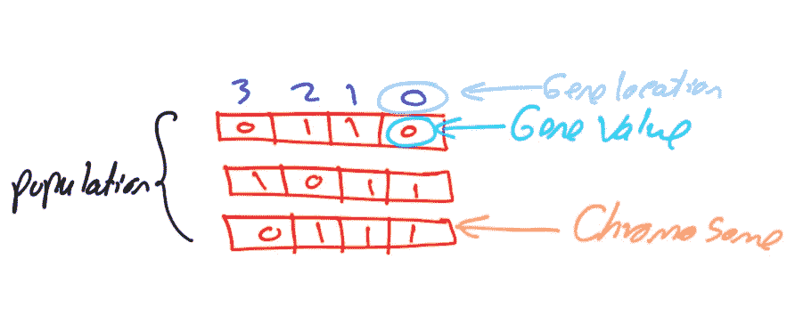
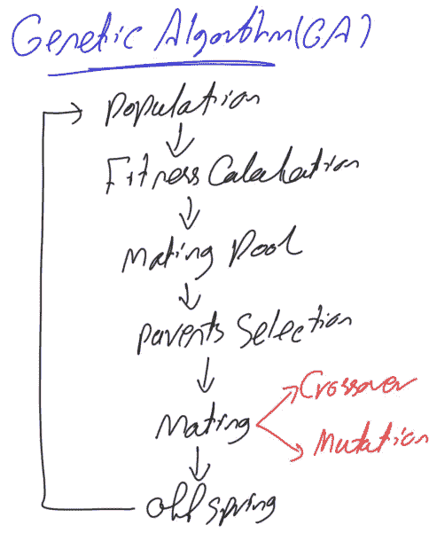

# 遗传算法优化导论

> 原文：<https://towardsdatascience.com/introduction-to-optimization-with-genetic-algorithm-2f5001d9964b?source=collection_archive---------1----------------------->

为机器学习任务选择最佳参数是具有挑战性的。一些结果可能不是因为数据有噪声或者所使用的学习算法弱，而是因为参数值的错误选择。本文简要介绍了进化算法，并描述了一种最简单的基于随机的进化算法&遗传算法。

From Pixabay by [qimono](https://pixabay.com/en/users/qimono-1962238/)

# **简介**

假设一位数据科学家将一个图像数据集划分为多个类别，并且要创建一个图像分类器。在数据科学家研究了数据集之后，K-最近邻(KNN)似乎是一个不错的选择。为了使用 KNN 算法，有一个要使用的重要参数是 k。假设选择了初始值 3。科学家从选定的 K=3 开始 KNN 算法的学习过程。生成的训练模型达到了 85%的分类准确率。这个百分比可以接受吗？换句话说，我们能得到比目前更好的分类精度吗？在进行不同的实验之前，我们不能说 85%是最佳精度。但是要做另一个实验，我们必须改变实验中的一些东西，比如改变 KNN 算法中使用的 K 值。我们不能肯定地说 3 是在这个实验中使用的最佳值，除非尝试对 K 应用不同的值并注意分类准确度如何变化。问题是“如何找到使分类性能最大化的 K 的最佳值？”这就是所谓的优化。

在最优化中，我们从实验中使用的变量的某种初始值开始。因为这些值可能不是最好的，所以我们应该改变它们，直到得到最好的值。在某些情况下，这些值是由复杂的函数生成的，我们无法轻松地手动求解。但是进行优化是非常重要的，因为分类器可能产生差的分类精度，这不是因为例如数据有噪声或者所使用的学习算法弱，而是由于学习参数初始值的差的选择。因此，运筹学(OR)研究人员提出了不同的优化技术来完成这种优化工作。根据[1]，优化技术分为四个主要类别:

1.  约束优化
2.  多模态优化
3.  多目标优化
4.  组合最优化

观察各种自然物种，我们可以注意到它们是如何进化和适应环境的。我们可以从这种已经存在的自然系统及其自然进化中受益，来创造我们的人工系统做同样的工作。这叫仿生学。例如，飞机是基于鸟类如何飞行，雷达来自蝙蝠，潜艇是基于鱼类发明的，等等。因此，一些优化算法的原理来自自然。比如遗传算法(GA)，其核心思想来自查尔斯·达尔文的自然进化论“适者生存”。

在进入遗传算法工作的细节之前，我们可以对进化算法有一个总体的了解。

# **进化算法**

我们可以说，优化是使用进化算法(EAs)执行的。传统算法和进化算法的区别在于进化算法不是静态的，而是动态的，因为它们可以随着时间的推移而进化。

进化算法有三个主要特征:

1.  **基于群体的**:进化算法是优化一个过程，在这个过程中，当前的解决方案是不好的，以产生新的更好的解决方案。从中产生新解的当前解的集合称为群体。
2.  **健身导向**:如果有几个方案，怎么说一个方案比另一个方案好？从适应度函数计算出的每个单独的解决方案都有一个相关的适应度值。这样的适应值反映了解决方案有多好。
3.  **变异驱动**:如果根据每个个体计算出的适应度函数，在当前种群中没有可接受的解，我们就要做出一些东西来生成新的更好的解。因此，单个解决方案将经历许多变化以生成新的解决方案。

我们将转到正式发布并应用这些条款。

# **遗传算法**

遗传算法是一种基于随机的经典进化算法。这里的随机是指为了使用 GA 找到一个解决方案，对当前解决方案进行随机更改以生成新的解决方案。请注意，遗传算法可以被称为简单遗传算法(SGA)，因为它比其他进化算法简单。

遗传算法是基于达尔文的进化论。这是一个缓慢渐进的过程，通过做出微小而缓慢的改变来实现。此外，遗传算法缓慢地对其解进行细微的改变，直到得到最佳解。

## **下面是遗传算法工作原理的描述:**

GA 处理由一些解组成的群体，其中群体大小(popsize)是解的数量。每个解决方案都被称为个体。每个溶液都有一条染色体。染色体被表示为定义个体的一组参数(特征)。每条染色体都有一组基因。每个基因都以某种方式表示，比如表示为一串 0 和 1，如图 1 所示。

**Figure 1\. Chromosome and gene.**

而且，每个个体都有一个适合度值。为了选择最佳个体，使用适应度函数。适应度函数的结果是代表解的质量的适应度值。适应值越高，解决方案的质量越高。基于质量的最佳个体的选择被用于产生所谓的交配池，其中质量较高的个体在交配池中被选择的概率较高。

交配池中的个体被称为父母。从交配池中选出的每两个父母将产生两个后代(孩子)。仅仅通过优质个体的交配，就有望获得比其父母更优质的后代。这将杀死不良个体，防止产生更多的不良个体。通过不断选择和交配高质量的个体，将有更高的机会只保留个体的良好特性，而忽略不好的特性。最后，这将以期望的最优或可接受的解决方案结束。

但是目前使用所选择的父母产生的后代仅仅具有其父母的特征，而没有更多变化。没有新的东西加入其中，因此它的双亲中的同样的缺点实际上会存在于新的后代中。为了克服这样的问题，一些变化将被应用于每个后代以产生新的个体。所有新生成的个体的集合将是替换先前使用的旧群体的新群体。每创造一个群体称为一代。新人口取代旧人口的过程称为更替。图 2 总结了 GA 的步骤。

**Figure 2\. Genetic algorithm steps.**

要全面了解 GA，需要回答两个问题:

1.  两个后代是如何从双亲中产生的？
2.  每一个后代是如何稍微改变成为一个个体的？

这些问题我们以后再来回答。

# **染色体表示和评估**

染色体有不同的表示法，选择正确的表示法要视具体问题而定。好的表示使搜索空间更小，从而更容易搜索。

可用于染色体的表示包括:

**二进制**:每个染色体被表示为一串 0 和 1。

**排列**:适用于排序问题，如旅行商问题。

**值**:实际值按原样编码。

例如，如果我们用二进制编码数字 7，它可能如图 3 所示。

**Figure 3\. Binary encoding example.**

上述染色体的每一部分被称为基因。每个基因都有两种特性。第一个是它的值(等位基因),第二个是在染色体内的位置(基因座),它是高于它的值的数字。

每条染色体有两种表现形式。

1.  **基因型**:代表染色体的一组基因。
2.  **表现型**:染色体的实际物理表现。

在上面的例子中，0111 的二进制是基因型，7 是表型表示。

在用正确的方式表示每个染色体后，用来搜索空间，接下来是计算每个个体的适应值。假设我们示例中使用的适应度函数为:

f(x)=2x+2

*其中 x 是染色体值*

那么前一个染色体的适应值是:

f(7)=2(7)+2=16

计算染色体适应值的过程称为评估。

# **初始化**

在获得如何表示每个个体之后，下一步是通过在群体中选择适当数量的个体来初始化群体。

# **选择**

下一步是从交配池的种群中选择一些个体。基于先前计算的适应值，基于阈值的最佳个体被选择。在这一步之后，我们将结束选择交配池中种群的子集。

# **变异算子**

基于交配池中选择的个体，选择亲本进行交配。每两个亲本的选择可以通过依次选择亲本(1-2、3-4 等)来进行。另一种方法是随机选择父母。

对于每两个选定的父代，都有许多变异运算符要应用，例如:

1.  交叉(重组)
2.  变化

图 4 给出了这些操作符的一个例子。

**Figure 4\. Crossover and mutation.**

# **交叉**

遗传算法中的交叉与自然变异一样产生新的一代。通过改变老一代父母，新一代的后代携带父母双方的基因。每个父母携带的基因数量是随机的。记住 GA 是基于随机的 EA。有时后代从父母一方获得一半基因，从另一方获得另一半基因，有时这种百分比会发生变化。对于每两个亲本，通过选择染色体中的随机点并交换亲本该点前后的基因来进行交叉。产生的染色体就是后代。因此算子被称为单点交叉。

请注意，交叉很重要，没有它，后代将与其父代相同。

# **突变**

下一个变异算子是变异。对于每个后代，选择一些基因并改变其值。突变因染色体表现形式而异，但如何应用突变取决于您。如果编码是二进制的(即每个基因的值空间只有两个值 0 和 1)，则翻转一个或多个基因的位值。

但如果基因值来自 1、2、3、4、5 等两个以上值的空间，那么二元突变就不适用，我们应该另寻他法。一种方法是从如图 5 所示的一组值中选择一个随机值。

**Figure 5\. Mutation by randomly updating some genes.**

请注意，如果没有突变，后代将具有其父母的所有特性。为了给这样的后代增加新的特征，基因发生了突变。但是因为突变是随机发生的，所以不建议增加应用于突变的基因数量。

突变后的个体称为突变体。

# 参考

[1]艾本、阿戈斯顿和詹姆斯·史密斯。进化计算导论。第 53 卷。海德堡:施普林格，2003 年。

原文在 LinkedIn 可在此链接:[https://www . LinkedIn . com/pulse/introduction-optimization-genetic-algorithm-Ahmed-gad](https://www.linkedin.com/pulse/introduction-optimization-genetic-algorithm-ahmed-gad)

在 KDnuggets 上也分享到了这个链接:[https://www . kdnugges . com/2018/03/introduction-optimization-with-genetic-algorithm . html](https://www.kdnuggets.com/2018/03/introduction-optimization-with-genetic-algorithm.html)

联系作者:

领英:【https://linkedin.com/in/ahmedfgad 

电子邮件:ahmed.f.gad@gmail.com