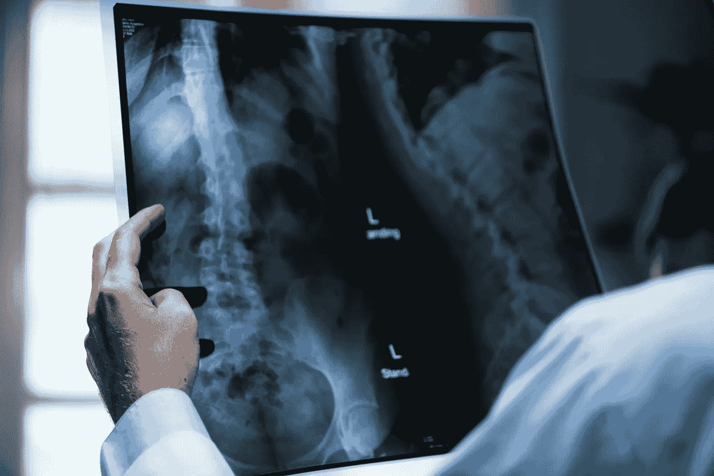

# 介绍我们的放射学/人工智能系列

> 原文：<https://towardsdatascience.com/introduction-to-our-radiology-ai-series-51d0e54cd3b9?source=collection_archive---------17----------------------->

Photo by [rawpixel](https://unsplash.com/photos/XNRHhomhRU4?utm_source=unsplash&utm_medium=referral&utm_content=creditCopyText) on [Unsplash](https://unsplash.com/search/photos/healthcare?utm_source=unsplash&utm_medium=referral&utm_content=creditCopyText)

**放射科医生的机器学习介绍— 10 部分系列**

**第一部**

*作者:* [*达尼洛*](https://www.linkedin.com/in/danilo-pena-01010/)*[*泰·瓦雄*](https://www.linkedin.com/in/tyvachon/)*

**编辑:* [*迈克尔博士*](https://www.linkedin.com/in/michael-doxey-md-73508916a/)*

*在 2017 年，Kaggle 数据科学碗旨在使用机器学习和人工智能来抗击美国男性和女性癌症死亡的主要原因。参赛者被要求使用成千上万张高分辨率肺部 CT 图像的数据集来创建新的肺癌检测算法。这些算法是为了提高诊断和减少假阳性率。*

*在 394 个参赛队中，哪个队获得了头奖？一个由中国清华大学医学和计算机科学系成员组成的团队。*

*诸如此类的比赛是将国际人才与全球问题结合起来的好方法。这种团队合作的风格仅仅是通过医学专业人员和计算机科学之间的互动，在我们的领域内的无限发展潜力的皮毛。*

*在放射学培训中，我们了解到一个 3 厘米长、呈毛刺状、软组织变薄的肺部肿块很有可能是癌症。同样，一个 5 毫米的光滑钙化结节患癌的概率也很低。*

*然而，我们也知道许多肺结节介于我们准确预测恶性肿瘤的能力之间。弗莱舍纳协会非常努力地在 2017 年更新了后续标准，提供了一个解决方案，其中包括大小和密度的变化。然而，我们仍然不能看着一个 8 毫米的边缘稍微不规则的结节就说它有多大可能是癌症。*

*为了使 Kaggle 竞赛更进一步，Fleischner 标准(或其替代标准)非常有可能是非常可定制的，肺结节跟踪将得到改善。我们将在第 2 篇文章中对此进行更深入的探讨。*

*这些团队在脸书的面部识别背后使用了类似的技术。你有没有想过他们怎么能确定你照片里的人是谁？这项技术被称为**深度学习**，是机器学习的子集，也是人工智能的子集，我们也会在第 3、5、6 篇文章中更深入地探讨这些话题。*

*这些努力证明了开源社区，以及人们如何决心通过合作和共享数据来找到重要问题的新颖解决方案。*

*让我们采取相反的观点，机器学习和人工智能可能预示着放射学专业的过时。我想起了杰弗里·辛顿教授。*

*杰弗里·辛顿是个非常聪明的家伙，但他缺乏关于放射学专业的细微差别的医学训练，如图像引导活检、肿瘤板和与我们外科同事的讨论等。，也许让他对我们的职业只有一个肤浅的看法。放射科医生的工作将随着新工具的出现而改变，但只要我们继续帮助我们的临床同事，他们的工作就会一直存在。*

*Kaggle 竞赛的结果也得益于时间和可用资源。由于巨大的视频游戏市场，我们第一次有了经济高效的高性能计算，称为图形处理单元(GPU)。详见第三条。另一个我们可能想当然的领域是语音识别。虽然我们可能看到也可能看不到每天的改善，但在过去的十年里，情况确实有所改善。详见第 4 条。*

*这个难题的另一个非常重要的部分是数据。大量数据。大量数据被正确标记。美国放射学院(ACR)和斯坦福大学目前正在进行这方面的研究。详见第五条。(或者 7)。*

*计算机科学家和医学专家的合作团队在开发改变领域的算法方面有着惊人的潜力。但是，当我们谈论将这些技术融入我们的日常工作流程，或者在隐私或数据管理的背景下，请注意。详见第八条。*

*在我们继续之前，我们想正式介绍一下我们自己。*

*[泰·瓦雄](https://www.linkedin.com/in/tyvachon/)*

*这是旨在指导我的同事的 10 篇系列文章中的第一篇。自 2012 年以来，我一直在跟踪人工智能和医疗应用的发展，并追随德雷耶博士和米哈尔斯基博士等伟大的导师。信息学，尤其是医学图像的利用，是我背景的很大一部分。在海军陆战队担任飞行外科医生后，我在美国海军接受了放射学培训。我的最后一次海军之旅是在冲绳，包括一次放射科主任之旅，之后我完成了我的海军使命，并作为天使投资人、企业家、信息学顾问和咨询顾问返回圣地亚哥。在撰写本文时，我还没有关于这个系列的相关财务披露。”*

*达尼洛·佩纳*

*“我有化学工程背景，做过两年工程师。在工作期间，我意识到我需要对社会产生更大的影响，我也想学习编码。因此，我申请了学校，被录取了，然后辞去了工作。我目前是休斯顿德克萨斯大学健康科学中心的生物医学信息学硕士生，也是艾伯特-史怀哲研究员。我总是在学习，我很高兴能帮助别人学习我所知道的。我希望通过这一系列文章，从医疗领域到机器学习领域的人们，乃至普通人，都可以利用这些信息来了解放射学的当前格局及其与人工智能技术进步的关系。”*

*我们相信，通过我们不同但互补的技能组合，我们可以在这个令人兴奋的领域教育他人。*

*既然你对我们有所了解，你可能会问**为什么**你要花时间在我们的系列节目上。*

*在本系列中，我们将从慢开始，回顾关键术语。我们还将讨论足够多的近期历史进展，以提供背景和应对新趋势。如果你更高级一点，请在评论中提供来自个人经历的清晰想法。当然，如果你注意到任何错误的文字，我们也会虚心审查这些评论。*

*本系列并不打算面面俱到，但这些文章旨在为放射学和人工智能提供公平的竞争环境。这个领域变化很快，有很多移动的部分。我们正在尽自己的一份力量通过这一过程进行教育和学习。*

*加入我们一组有趣的文章，这些文章由一位经验丰富的放射科医生策划，他专注于技术，是一名对理解 ML 和 AI 将如何影响下一代医疗保健感兴趣的学生。*

*[第二部分——放射学和人工智能将如何走到一起](/how-radiology-and-ai-will-come-together-36e48bb56870)*