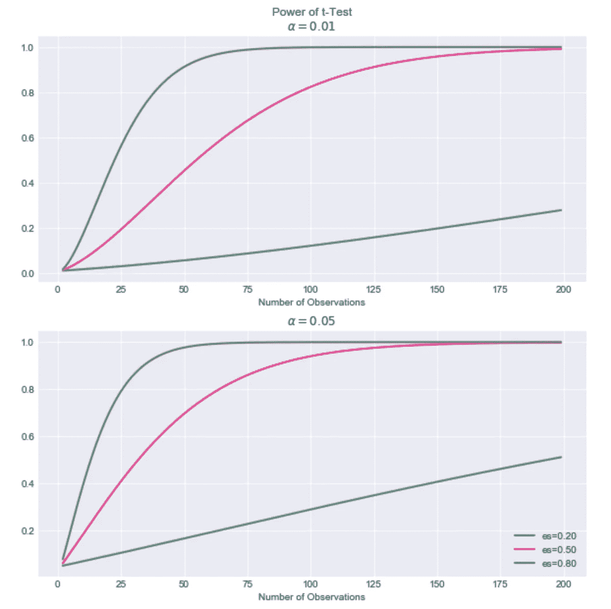
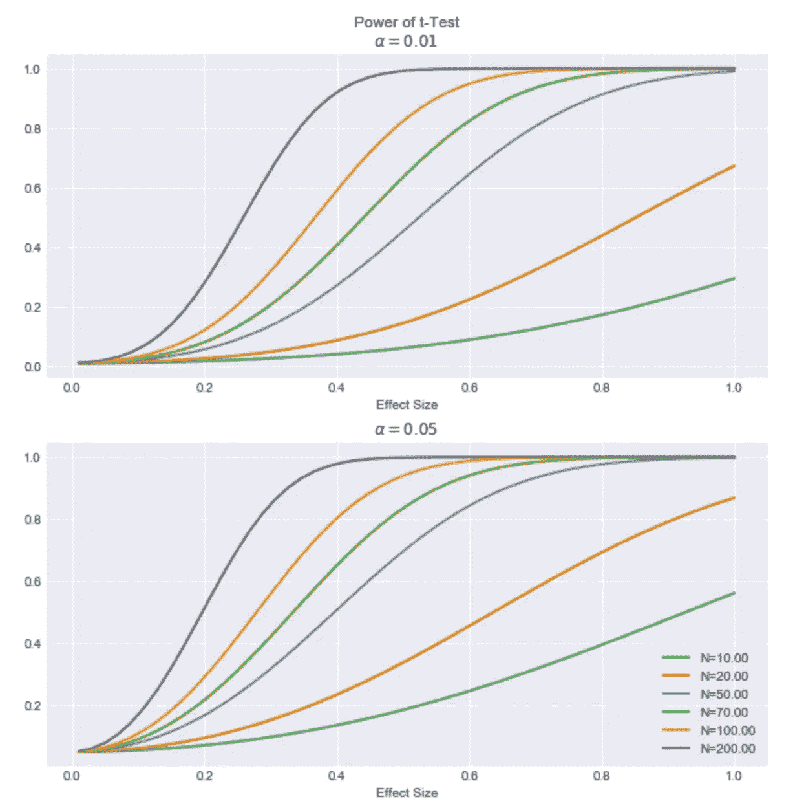
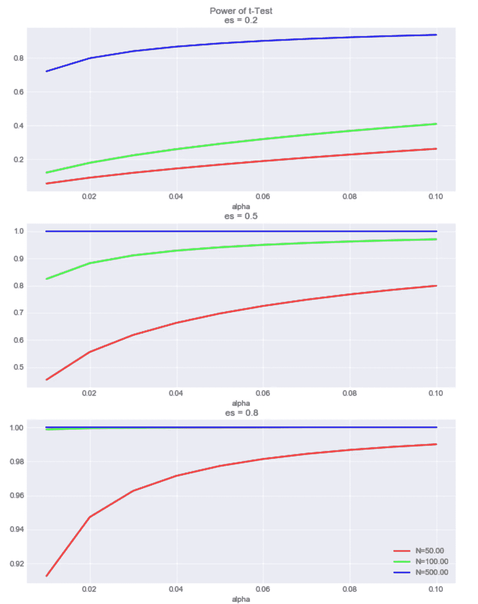

# Python 中的功耗分析简介

> 原文：<https://towardsdatascience.com/introduction-to-power-analysis-in-python-e7b748dfa26?source=collection_archive---------2----------------------->

Source: unsplash.com

## 了解概念的重要性，如显著性水平、效应大小、统计功效和样本大小

如今，许多公司——网飞(T1)、亚马逊(Amazon)、T2()、优步(T3)，但也有一些规模较小的——不断进行实验(A/B 测试)，以测试新功能并实现那些用户认为最好的功能，最终带来收入增长。数据科学家的角色是帮助评估这些实验，换句话说，验证这些测试的结果是否可靠，是否可以/应该在决策过程中使用。

在本文中，我介绍了功耗分析。简而言之，权力是用来报告从实验结果中得出的结论的可信度。它还可以用于估计实验所需的样本量，*，即*，在给定的置信度下，我们应该能够检测到一个效应的样本量。实际上，人们可以理解许多事情，例如，在一个组内更频繁的转换，以及在网上商店中经历某一注册流程的顾客的更高的平均花费，等等。

首先，我介绍了一些理论，然后用 Python 实现了一个功耗分析的例子。你可以在文末找到我回购的链接。

# **简介**

为了理解功效分析，我认为理解三个相关概念是很重要的:显著性水平、I/II 类错误和效应大小。

在假设检验中， [**显著性水平**](https://en.wikipedia.org/wiki/Statistical_significance) (通常表示为希腊字母 alpha)是拒绝零假设(H0)的概率，当它实际上为真时。与显著性水平密切相关的指标是*p*-值，它是在 H0 为真的情况下，获得至少是极端结果(离零假设更远的结果)的概率。这在实践中意味着什么？在从总体中随机抽取样本的情况下，观察到的效应可能仅仅是由于抽样误差而产生的。

当相关的*p*-值小于所选的α时，实验结果(或例如线性回归系数)在统计上是显著的。显著性水平应在设置研究之前指定，并取决于研究领域/业务需求。

第二个值得一提的概念是在统计测试假设时我们可能犯的**种错误**。当我们拒绝一个真正的 H0 时，我们谈论的是一个**I 型错误**(假阳性)。这是与显著性水平相关的误差(见上文)。另一种情况发生在我们未能拒绝假 H0 时，这被认为是一个**II 型错误**(假阴性)。你可以从混乱矩阵中回忆起这些概念！

Types of error in a nutshell :)

最后要考虑的是 [**效应大小**](https://en.wikipedia.org/wiki/Effect_size) ，这是一种现象在人群中出现的量化幅度。根据具体情况，可以使用不同的指标来计算效果大小，例如:

*   皮尔逊相关
*   回归系数
*   两组之间均值的差异，例如 Cohen 的 *d*

我在另一篇文章的[中描述了效果大小的各种度量。](/a-definitive-guide-to-effect-size-9bc93f00db86)

# **统计能力**

现在我们已经修改了与功效分析相关的关键概念，我们终于可以谈论统计功效了。**假设检验的统计功效**简单来说就是当备选项事实上为真时，给定检验正确拒绝零假设(这意味着与接受 H1 相同)的概率。

更高的实验统计能力意味着犯第二类错误的概率更低。这也意味着当存在要检测的效应时，检测到效应的概率更高(真阳性)。这可以用下面的公式来说明:

Power = Pr(拒绝 H0 | H1 为真)= 1 - Pr(拒绝 H0 失败| H0 为假)

在实践中，功率太小的实验结果会导致错误的结论，进而影响决策过程。这就是为什么只能考虑具有可接受功率水平的结果。设计 80%功效水平的实验是很常见的，这相当于犯第二类错误的概率为 20%。

# **功率分析**

功耗分析基于以下构建模块:

*   显著性水平
*   效果大小
*   力量
*   样本量

我以前没有讨论过样本大小，因为这是不言自明的。唯一值得一提的是，一些测试联合考虑两组的样本量，而对于另一些测试，样本量必须单独指定(在它们不相等的情况下)。

这四个指标是相互关联的。例如:降低显著性水平会导致功效降低，而较大的样本会使效果更容易检测。

功率分析的思想可以归结为以下几点:通过四个度量中的三个，我们估计缺少的一个。这在两个方面很方便:

*   当我们设计一个实验时，我们可以假设什么样的显著性水平、功效和效果大小是我们可以接受的，并且——因此——估计我们需要收集多大的样本来进行这样的实验以产生有效的结果。
*   当我们验证一个实验时，我们可以看到，在给定所用样本大小、效应大小和显著性水平的情况下，从商业角度来看，犯第二类错误的概率是否可以接受。

除了为给定指标计算一个值之外，我们还可以通过多次执行功效分析(针对组件的不同值)并在图上显示结果来执行一种敏感性分析。这样我们可以看到——例如——必要的样本量是如何随着显著性水平的增加或减少而变化的。这自然可以扩展到 3 个度量的 3D 平面。

**Python 中的例子**

在本例中，我对独立双样本 t 检验(样本大小和方差相等)的情况进行了功效分析。库`statsmodels`包含对一些最常用的统计测试进行功耗分析的函数。

让我们从一个简单的例子开始，假设我们想知道我们的实验需要收集多大的样本，如果我们接受 80%的功效水平，5%的显著性水平和预期的效应大小为 0.8。

首先，我们导入所需的库。

然后，我们需要运行以下命令，并达到所需的样本大小 25。

做了这些之后，是时候更进一步了。我们希望看到当我们修改其余的构建模块时，功率如何变化。为此，我们绘制了功率与其他参数的关系。我从检查样本大小如何影响功效开始分析(同时将显著性水平和效应大小保持在特定水平)。我已经选择了[0.2，0.5，0.8]作为考虑的效果大小值，因为它们对应于小/中/大的阈值，如在[科恩的 *d*](https://en.wikipedia.org/wiki/Effect_size#Cohen's_d) 的情况中所定义的。

从图中，我们可以推断，样本/效果大小的增加会导致功效的增加。换句话说，样本越大，功率越高，保持其他参数不变。下面，我还在 x 轴上展示了两个剩余构建模块的图，结果不言自明。

Power vs. effect size

Power vs. significance level

最后，我想把分析扩展到三个方面。为此，我将显著性水平固定在 5%(这是实践中经常使用的)，并创建一个可能的样本和效应大小组合的网格。然后我需要获得每个组合的功率值。为此，我使用 NumPy 的`meshgrid`和`vectorize`。

为了创建 3d 情节，我选择了`plotly`，因为它很容易快速获得好的，互动的情节，然后可以嵌入到这个帖子中。在代码中，我使用`plotly`的离线模式，不需要注册。如果你想创建可以共享/嵌入的图形，你必须在这里创建一个免费账户[来获得一个 API 密匙。](https://plot.ly/#/)

# 结论

总的来说，功耗分析现在主要用于 A/B 测试，在计划实验/研究或评估结果时都可以使用。由于许多公司使用[频率主义方法](https://en.wikipedia.org/wiki/Frequentist_inference)进行假设检验，知道如何进行权力分析以及如何展示其含义无疑是件好事。

一如既往，我们欢迎任何建设性的反馈。可以在 [Twitter](https://twitter.com/erykml1?source=post_page---------------------------) 或者评论里联系我。文章的代码可以在[这里](https://github.com/erykml/medium_articles/blob/master/Statistics/power_analysis.ipynb)找到。

喜欢这篇文章吗？成为一个媒介成员，通过无限制的阅读继续学习。如果你使用[这个链接](https://eryk-lewinson.medium.com/membership)成为会员，你将支持我，不需要你额外付费。提前感谢，再见！