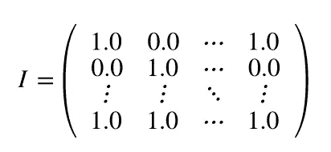
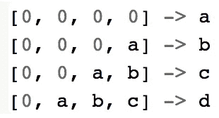
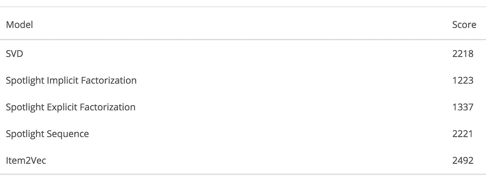

# 推荐系统介绍。第 2 部分(神经网络方法)

> 原文：<https://towardsdatascience.com/introduction-to-recommender-system-part-2-adoption-of-neural-network-831972c4cbf7?source=collection_archive---------1----------------------->


# 1.介绍

在我本系列的上一篇博文: [*推荐系统介绍。第一部分(协同过滤，奇异值分解)*](https://hackernoon.com/introduction-to-recommender-system-part-1-collaborative-filtering-singular-value-decomposition-44c9659c5e75) ，我谈到了协同过滤(CF)和奇异值分解(SVD)如何用于构建推荐系统。随着神经网络的兴起，你可能会好奇我们如何利用这种技术来实现推荐系统。这篇博文将介绍由 PyTorch 支持的推荐系统框架 Spotlight，以及我借用单词嵌入的思想创建的 Item2vec。最后，我将比较我讨论过的模型的性能。

# **2。聚光灯**


Spotlight 是一个实现良好的 python 框架，用于构建推荐系统。它包含两大类模型，因子分解模型和序列模型。前者利用了 SVD 背后的思想，将**效用矩阵**(记录用户和项目之间交互的矩阵)分解成用户和项目矩阵的两个潜在表示，并将它们馈入网络。后者是用长短期记忆(LSTM)和一维卷积神经网络(CNN)等时间序列模型建立的。由于 Spotlight 的后端是 PyTorch，所以在使用之前，请确保您已经安装了正确版本的 PyTorch。

## 相互作用

效用矩阵被称为聚光灯下的交互。为了创建隐式交互，我们为所有用户-项目交互对指定用户和项目的 id。额外的评级信息将这种交互转变为明确的交互。

## 因子分解模型

因式分解模型包含隐式或显式的交互。为了便于说明，我们将使用隐式方法。



Implicit Feedback ([https://github.com/maciejkula/netrex/](https://github.com/maciejkula/netrex/blob/master/examples/readme.nbconvert.ipynb))

它的思想与 SVD 非常相似，在 SVD 中，用户和项目被映射到一个潜在的空间中，这样它们就可以直接进行比较。本质上，我们使用两个嵌入层来分别表示用户和项目。目标是我们传入的交互(效用矩阵)。为了计算用户-项目对的分数，我们获取该用户和项目的潜在表示的点积，并将其传递给 sigmoid 激活函数。通过计算所有用户-项目对相对于真实交互的损失(稍后将详细介绍),我们可以反向传播并优化嵌入层。网络结构如下图所示。


Neural Network Structure ([https://github.com/maciejkula/netrex/](https://github.com/maciejkula/netrex/blob/master/examples/readme.nbconvert.ipynb))

我们只需要几行代码来用 Spotlight 训练这样的模型，它看起来非常类似于 scikit-learn toolkit:

## 顺序模型

顺序模型将推荐问题视为顺序预测问题。给定过去的交互，我们想知道在下一个时间步骤中用户最有可能喜欢哪个项目。例如，假设用户 A 与 id 顺序为[2，4，17，3，5]的项目进行交互。那么我们将有下面的扩展窗口预测。

```
[2] -> 4
[2, 4] -> 17
[2, 4, 17] -> 3
[2, 4, 17, 3] -> 5
```

左边的数组存储过去的交互，而右边的整数表示用户 A 接下来将要交互的项目。

为了训练这样的模型，我们简单地将原始交互对象转换成顺序交互对象。剩下的都一样。

注意 *to_sequence()* 函数在长度不够长的序列前面填充零，以确保每个序列都具有相同的长度。



因此，id 为 0 的项目应该被更改为其他任意未使用的 id 号，以便此功能能够工作。

## 损失函数的选择

当指定模型时，我们可以灵活地改变损失函数。不同损失函数的模型在性能上可能有显著差异。我将简要描述 Spotlight 中定义的两种主要类型的损失函数。

*   “逐点”:与其他形式的损失函数相比，这是最简单的形式。由于样本的稀疏性(效用矩阵中有很多 0)，将所有项目都考虑进去在计算上是不可行的。因此，不是计算给定用户的所有项目的损失，我们只考虑随机选择的一部分否定样本(用户没有与之交互的项目)和所有肯定样本。
*   “bpr”:贝叶斯个性化排名(BPR)给每个用户的每个项目一个排名。它试图确保正样本的等级高于负样本的等级，公式如下。


ranking loss

现在，您已经了解了如何使用 Spotlight 构建推荐系统。它使用起来非常简单，并且有足够的灵活性来满足你的需求。虽然对于大多数问题，序列模型优于因式分解模型，但训练序列模型需要更长的时间。此外，在应用序列模型时，如果数据没有明确的序列相关性，也不会有很大帮助。

# 3.项目 2Vec

Item2Vec 的想法是上个月我参加一个竞赛时产生的，[国际数据分析奥林匹克](http://idao.world/) (IDAO)。它提出的挑战要求参与者为 Yandex 建立一个推荐系统。因为那时我正在学习 Word2Vec，所以我想类似的概念也可以用在推荐系统中。我不确定是否有论文或文章指出过这个想法，但是我没有看到 Word2Vec 的概念在这个领域有类似的应用。Word2Vec 背后的大致思想是，我们利用分布式表示来编码每个单词。也就是说，每个单词由该单词周围的其他单词所确定的向量来表示。如果你想了解更多关于 Word2Vec 的内容，可以参考我之前的博文: [*Word2Vec 和 FastText 用 Gensim*](/word-embedding-with-word2vec-and-fasttext-a209c1d3e12c) 进行单词嵌入。类似地，我试图使用分布式表示，根据用户在交互之前和之后交互的项目，对每个项目进行编码。

对于每个用户，我首先按照时间顺序创建了一个条目列表。然后，在这些项目列表上训练 Gensim 的 Word2Vec 模型。经过训练的项目向量存储在磁盘中，以便我们可以加载它供以后使用。

之后，我们将训练好的项目向量加载到嵌入矩阵中。

然后，我们定义了预测用户未来交互的模型。基本上，它是由 CuDNN 加速的 GRU 模型。如果你没有英伟达 GPU，也不用担心。你可以简单的把 CuDNNGRU 换成 GRU。

请注意，at 我将预训练的嵌入矩阵加载到模型的嵌入层中，并通过将 trainable 设置为 false 来冻结它。

# 4.表演

我已经在 IDAO 的公共电路板测试集上测试了我在本系列的两个部分中提到的一些模型。下表显示了它们各自的公开委员会分数。



Public Board Score

看起来基于神经网络的模型不一定能打败传统的推荐系统构建方法。虽然易于理解和实现，但 SVD 的得分与需要更长时间训练的 Spotlight 序列模型相当。令人惊讶的是，Item2Vec 是我测试过的所有型号中最好的型号。诚然，我们不能只用一个测试集来判断所有这些模型。这让你大致了解每个模型有多好。

# 5.结论

我已经讨论了在 Spotlight toolkit 中实现的两种类型的模型和我自己创建的依赖于 Word2Vec 概念的 Item2Vec。我还基于 IDAO 的公共电路板测试集比较了我提到的模型。事实证明，SVD 是推荐系统的有效解决方案，Item2Vec 已经证明了它能够更准确地推荐项目。如果你对这篇文章有任何问题，请不要犹豫，在下面留下你的评论或者给我发电子邮件:khuangaf@connect.ust.hk。如果你喜欢这篇文章，请确保你在 [twitter](https://twitter.com/steeve__huang) 上关注我，以获得更多机器学习/深度学习博文！