# 你需要知道的数据科学概念！第一部分

> 原文：<https://towardsdatascience.com/introduction-to-statistics-e9d72d818745?source=collection_archive---------0----------------------->

这是 5 篇系列文章的第一篇，将概述数据科学中的一些核心概念:


值得注意的是，我们将涵盖上图中的统计桶，并试图使其尽可能直观和数学化。

我的背景是南部和东部非洲的大型制药公司、学术界(牛津大学物理和理论化学系的博士)和“为社会公益服务的数据科学”行业。

这一系列帖子旨在介绍并快速发展数据科学和数据分析中的一些核心概念，并特别关注我觉得在其他材料中被忽略或简单处理的领域。因此，这些帖子将适合希望重温统计理论的数据科学家，希望获得全面培训材料的数据分析师，以及希望从数据和员工那里提出更好问题的数据经理。

我们将在本系列中讨论的一些主题包括:

*   *功率和样本量计算的非参数方法*
*   *A/B 测试(又名随机试验)的设计和分析*
*   *如何有效探索数据趋势*
*   *如何实施、评估和改进线性模型*

这些帖子改编自我为国际非政府组织 One Acre Fund 开发的一系列培训材料，One Acre Fund 为东非的小农提供小额贷款。

# 这篇文章的目的(#1):

*   理解是什么决定了分布的形状。
*   理解非正态性如何影响假设检验和功效计算
*   了解如何使用蒙特卡罗方法进行非参数样本容量/功效计算

这些帖子是用 R-markdown 制作的，它允许在一个地方呈现 R 代码、文本写作和结果。R-markdown 对于编写报告特别有用，因为它使分析透明且可重复。

# 动机:

统计学本质上是对分布的研究。分布是将一个值的频率与观察到的实际值联系在一起的一种方式。你可以想象一下，例如，如果我们在测量员工的身高，我们可能会发现大多数人的身高在 1.5 到 1.8 米之间，但也会有一些人比这更高或更矮。当我们谈论这样的数据时，我们实际上是在谈论分布:

```
set.seed(111)
hist(rnorm(1000, mean=1.75, sd=0.5), xlab="Employee height (m)", main="Employee height", breaks=c(0,0.5,1,1.5,2,2.5,3,3.5,4),col="black")
```

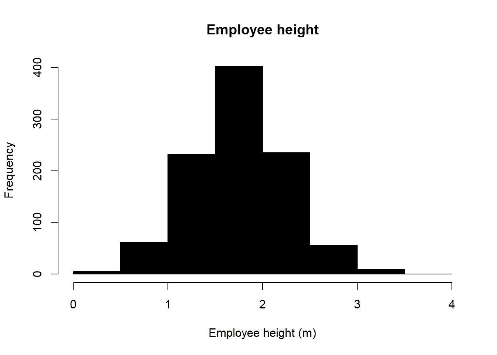

上面的柱状图是我们用图形的方式表述的；我们有沿 X 轴的观察值(这些值被分组为“箱”)和沿 Y 轴的计数或频率(即我们观察该值的次数)。有时我们也可以绘制沿 Y 轴的观察的*概率。*

阅读上面的直方图，我们可以说最常见的身高是 1.5 到 2 米，在更极端的值下频率会降低(例如，0.5-1 米和 2.5-3 米的人比 1.5-2 米的人少)。更具体地说，通过阅读 X~Y 轴，我们可以说大约有 400 人身高 1.5 到 2 米，大约有 200 人身高 2 到 2.5 米。

每一项分析都必须从理解底层数据及其分布开始。分布的*形状*将决定:

*   我们使用的分析方法(我们应该使用 T 检验，还是韦尔奇检验？)
*   样本量(我们需要多少个人才能发现一个效应？)
*   我们的误差大小(数据有多分散？)
*   统计显著性(即干预/产品是否成功，其效果有多大)

> **最终，这种分布将决定我们是否能为我们测试的干预赋予意义和因果关系。**

# 正态分布

上面的直方图来自正态分布，这是你将看到的最常见的分布之一。让我们更深入地研究一下这个分布。在正态分布中(也只有正态分布),我们期望我们的均值**和**中值位于分布的中心(最高点),我们同样期望分布关于均值大致对称，如下所示:

```
#lets generate some example normal distributions 
set.seed(111)# by setting a seed we can make sure that R draws random numbers reproducibly
#simulate a random normal distribution
norm1 <- rnorm(20000, mean=0,sd=1)

normdf <- data.frame("val"=norm1, "flag"=0)

#which is a logical, it will evaulate a condition: here "which val is greater than 1sd of norm OR less than -1sd of norm"
# note that | means OR and & means and
sd2 <- which( normdf$val > 1* sd(norm1) | normdf$val <  -1*sd(norm1) )
sd3 <- which( normdf$val > 2*sd(norm1) | normdf$val <  -2*sd(norm1) )
sd1 <- which( normdf$val < 1*sd(norm1) & normdf$val > -1*sd(norm1) )

#now lets use the index made above to reset the values in flag to the following
normdf$flag[sd1] <- "Within 1 SD"
normdf$flag[sd2] <- "Within 2 SD"
normdf$flag[sd3] <- "Within 3 SD"
normdf$flag <- as.factor(normdf$flag)

#lets plot these...
#as a histogram
ggplot(normdf, aes(x=val, fill=flag)) + geom_histogram(binwidth=.5, bins=100, alpha=1, breaks=c(-Inf,min(subset(normdf, flag=="Within 3 SD")$val),min(subset(normdf, flag=="Within 2 SD")$val),min(subset(normdf, flag=="Within 1 SD")$val), max(subset(normdf, flag=="Within 1 SD")$val), max(subset(normdf, flag=="Within 2 SD")$val),max(subset(normdf, flag=="Within 3 SD")$val), Inf)) + geom_vline(aes(xintercept = mean(val), colour="Mean & Median"),color='black',size=2) + geom_text(aes(x=mean(norm1)-0.6,y=15000,label="Mean & \n Median")) + xlab("Value of observation") + ylab("Number of observations")
```

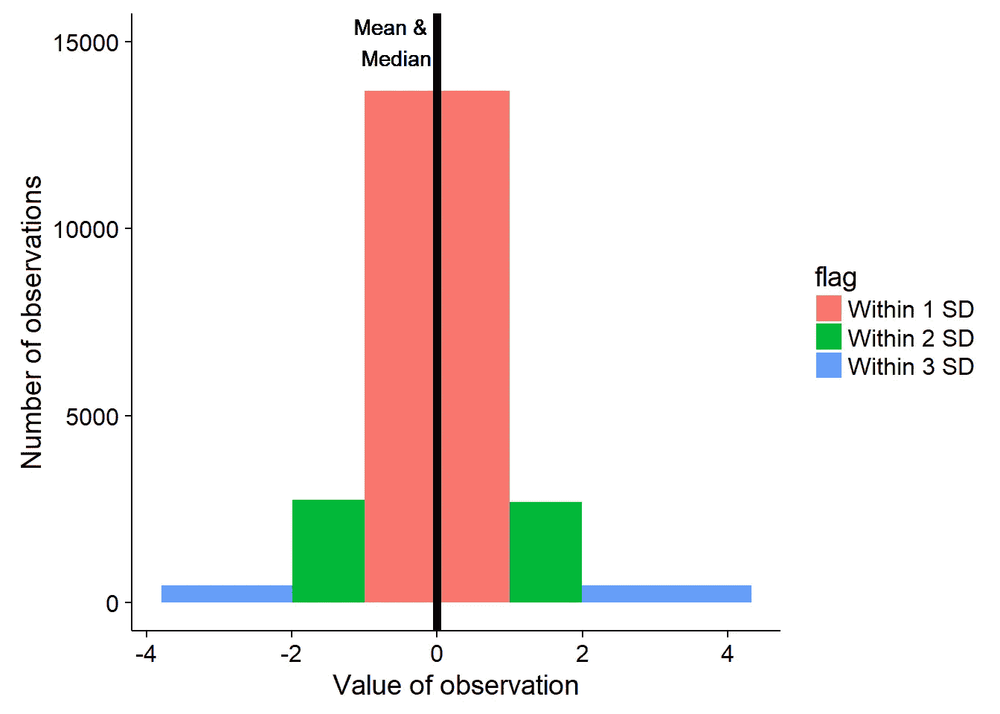

正态分布由两个指标定义，均值和标准差。对于正态分布，我们预计 68%的值位于 1 个标准差内，95%位于 2 个标准差内，99.7%位于 3 个标准差内(如上)。

请注意，分布的标准偏差与分布的宽度成比例。

> 当我们展示分布时，我们的目标是**使图表尽可能简单，同时仍然忠实于数据**。

# 呈现数据

我们可以用其他格式呈现分布，而不仅仅是直方图:

```
#
#histo
p1 <- ggplot(normdf, aes(x=val)) +  geom_histogram(binwidth=.5, colour="black", fill="white") + ggtitle("Histogram")

#density
p2 <-ggplot(normdf, aes(x=val)) + geom_density() + ggtitle("Density plot") 

#boxplot
#the theme argument removes the x-axis as we have no information to show here
p3 <- ggplot(normdf, aes(x=1, y=val)) + geom_boxplot() + ggtitle("Boxplot") + xlab("")  + theme(axis.title.x=element_blank(),
        axis.text.x=element_blank(),
        axis.ticks.x=element_blank())
#p3 <- ggdraw(add_sub(p3, "Boxplot"))

#finally a beeswarm plot
library(ggbeeswarm)

p4 <- ggplot(normdf) +  geom_beeswarm(aes(x=1,y=val)) + ggtitle("Beeswarm") + theme(axis.title.x=element_blank(),
        axis.text.x=element_blank(),
        axis.ticks.x=element_blank())

#this is a funtion defined in the first block which allows us to put more than one graph on the same page
multiplot(p1,p2,p3,p4, cols=2)
```

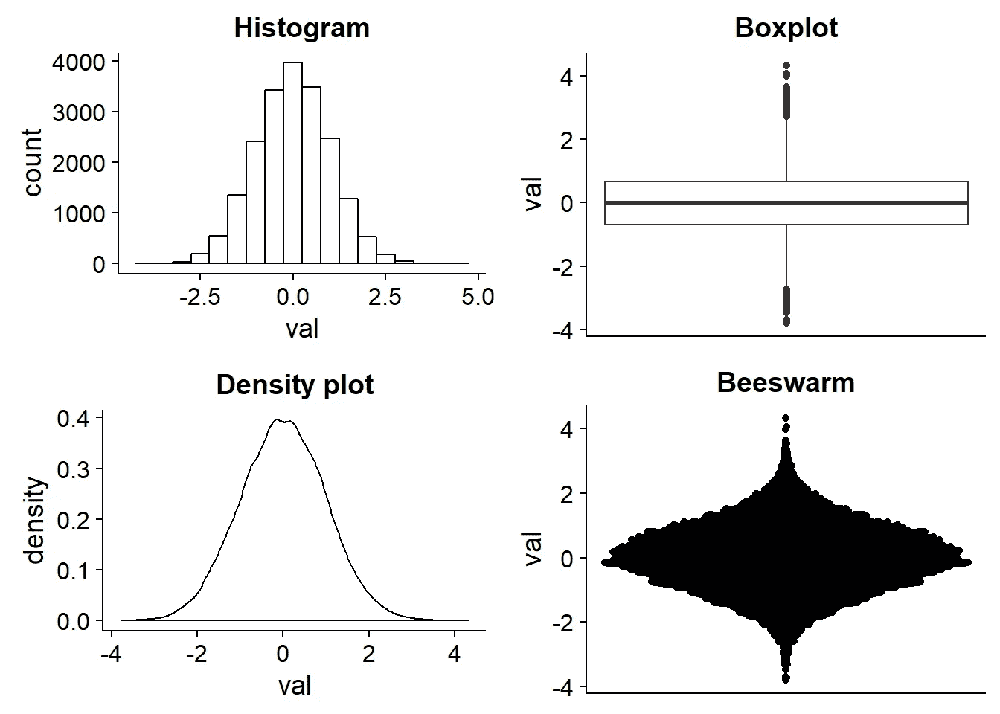

我们以不同的方式展示了上述完全相同的数据:

*   我们熟悉的**直方图**(左上)。请注意，改变直方图的条柱数量(即我们需要多少条柱)会极大地改变我们对数据的理解。
*   **盒状图**(右上)在 Y 轴上有我们的值，粗中心线代表中间值，上下盒边界代表第一和第三个四分位数(分别)，从盒中伸出的“胡须”代表最大值和最小值，最后点是(假定的)异常值。箱形图信息丰富，但可能隐藏聚类数据。
*   **密度图**类似于我们的直方图。但是，密度图被平滑，y 轴现在表示总计数的分数(从 0 到 1 ),而不是实际计数。密度图下的面积总和为 1。
*   **蜂群**图显示了数据框中的每个数据点。图的宽度与观察值的数量成正比，我们可以知道分布的正态性，因为图在 0(我们的平均值)附近较厚，然后在平均值的北部和南部对称地变小。虽然箱线图可以隐藏聚类，密度和直方图依赖于良好的箱宽度，但蜂群可以清楚地显示聚类数据，但看起来有点难看。

为了说明这一点，让我们展示一些聚类数据(也称为二项式分布，注意这不同于正态分布):

```
#
#lets make two seperate distributions and join them:
set.seed(122)
nor1 <- rnorm(200, mean=0,sd=0.8)
nor2 <- rnorm(50, mean=4,sd=0.7)

clusterdf <- data.frame("val"=c(nor1,nor2), "flag"=0)

# a beeswarm plot

p4 <- ggplot(clusterdf) +  geom_beeswarm(aes(x=1,y=val)) + ggtitle("Beeswarm") + theme(axis.title.x=element_blank(),
        axis.text.x=element_blank(),
        axis.ticks.x=element_blank())

#histo
p1 <- ggplot(clusterdf, aes(x=val)) +  geom_histogram(binwidth=.5, colour="black", fill="white") + ggtitle("Histogram")

#density
p2 <-ggplot(clusterdf, aes(x=val)) + geom_density() + ggtitle("Density plot") 

#boxplot
#the theme argument removes the x-axis as we have no information to show here
p3 <- ggplot(clusterdf, aes(x=1, y=val)) + geom_boxplot() + ggtitle("Boxplot") + xlab("")  + theme(axis.title.x=element_blank(),
        axis.text.x=element_blank(),
        axis.ticks.x=element_blank())
#p3 <- ggdraw(add_sub(p3, "Boxplot"))

#this is a funtion defined in the first block which allows us to put more than one graph on the same page
multiplot(p4,p1,p2,p3, cols=2)
```


从蜂群中我们可以看到，在~0 附近有一个很大的数据集群，但在~4 附近也有一个较小的集群。密度图和直方图显示了这一点，但如果我们只检查箱形图，我们将无法清楚地看到这一点。

最后，改变密度图或直方图的条块也可以改变我们对数据的解释:

```
#density
p1 <-ggplot(clusterdf, aes(x=val)) + geom_density(bw=0.05) + ggtitle("Density plot 1") 
p2 <-ggplot(clusterdf, aes(x=val)) + geom_density(bw=0.2) + ggtitle("Density plot 2") 
p3 <-ggplot(clusterdf, aes(x=val)) + geom_density(bw=2) + ggtitle("Density plot 3") 
p4 <-ggplot(clusterdf, aes(x=val)) + geom_density(bw=6) + ggtitle("Density plot 4") 

multiplot(p1,p3,p2, p4, cols=2)
```


即使数据是相同的，我们对数据的解释也会根据我们检查的图而发生巨大的变化！我们如何从图 4 中了解我们的数据？图 1 可能太详细，而图 3 和图 4 太不详细(注意图 4 完全隐藏了第二组数据)。

剧情 2 **既简单又符合数据**。因此，这是这里最好的情节。请注意，找出最佳图的唯一方法是检查基础数据。因此，我建议在制作数据的简化版本之前，使用蜜蜂群或具有小区间宽度(或高区间数)的密度图，首先尽可能详细地检查数据。

# 有效地比较分布

通常我们会想要比较分布，看看是否有明显的差异，例如当比较治疗组和对照组时。我的首选方法是使用密度图或箱线图。让我们看看下面的一些例子，在这些例子中，我们测量了一种处理方法对卢旺达农民采用化肥的影响:

```
 #lets make some data
set.seed(122)
nor1 <- data.frame("val"=rnorm(50, mean=0.6,sd=0.15), "Group"="Control")
nor2 <- data.frame("val"=rnorm(50, mean=0.8,sd=0.1), "Group"="Treated")

#bind the data by rows (e.g. stack one ontop of the other)
dat <- rbind(nor1,nor2)

#Density plots with semi-transparent fill
g1 <- ggplot(dat, aes(x=val, fill=Group)) + geom_density(alpha=.3, bw=0.1) + xlab("Fertilizer adoption")

# boxplot and remove redundant legend. 
g2 <- ggplot(dat, aes(x=Group, y=val, fill=Group)) + geom_boxplot() +
    guides(fill=FALSE) + ylab("Fertilizer adoption")

g3 <- ggplot(dat, aes(x=val, fill=Group)) + geom_histogram(alpha=.3, bw=0.1) + xlab("Fertilizer adoption")

g4 <- ggplot(dat, aes(x=val, fill=Group)) + geom_beeswarm(aes(x=0, y=val, colour=Group)) + ylab("Fertilizer adoption") + theme(axis.title.x=element_blank(),
        axis.text.x=element_blank(),
        axis.ticks.x=element_blank())

multiplot(g1,g2,g3,g4, cols=2)
```


我们可以看到，密度图和箱线图对于观察组间差异非常有用。然而，蜂群图和直方图过于繁忙，无法快速得出结论(尽管它们在其他场景中很有用，例如查看异常值)。因此，这些数据应该以密度图或箱线图的形式呈现，以满足我们的标准，即**易读但真实的数据**。

# 显著和非显著差异

所以我们现在有了治疗组和对照组的描述图。

```
ggplot(dat, aes(x=val, fill=Group)) + geom_density(alpha=.3, bw=0.1) + xlab("Fertilizer adoption")
```

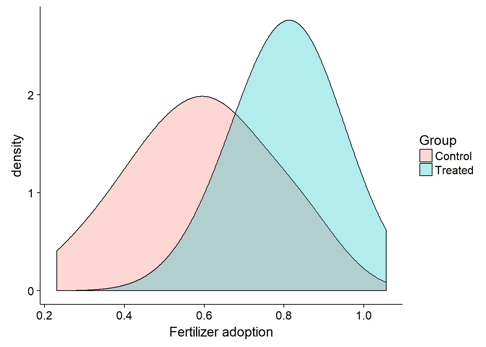

这两组看起来不同，但是我们怎么能更确定，我们怎么能量化我们的不确定性呢？

# 假设检验

统计测试的存在是因为我们只有一个**人口**的**样本**(见词汇表)。例如，我们可以在随机试验中测量东非农民样本的肥料使用情况。但是我们正试图推断出一些关于**所有**东非农民的情况(即从我们的样本中归纳出全部人口)。我们希望能够了解对实际人群的影响，这样我们就可以对项目干预做出决定；*因此我们想要比较人口，但是我们只有样本*。假设检验允许我们在给定一些关键假设的情况下检验潜在人群的差异。

假设检验有某些潜在的假设。常用测试的一些示例假设如下:

*   **T 检验**:假设正态分布。该测试是在 20 世纪 50 年代针对小样本量进行的，现在有了更可靠的测试，应该使用
*   **配对 T 检验**:T 检验(同上)，但用于测量治疗前后的**同一受试者**(例如，在一次散发传单活动前后测量农民种植依从性)
*   **双样本 T 检验:**用于**两个不同组**的 T 检验，例如比较接受治疗的农民和对照农民的玉米产量。
*   **Welch 检验:**对 T 检验的改进，对不等方差更稳健(例如，对密度图宽度不同的样本更稳健)。我们可以在 t.test() R 函数中调用带有参数“var.equal=FALSE”的 Welch 测试。请注意，韦尔奇检验仅对正态分布数据有效(如 T 检验)。

我们如何知道何时使用每个测试？我们如何检验这些测试的假设？

# 常态假设

许多假设检验和样本量计算都假设数据是正态分布的(记住，这意味着数据关于平均值是对称的)。然而，我们经常希望对非正态数据进行假设检验。我们将很快检查非正态数据的假设检验，但是首先，我们如何知道我们的数据是否正态分布？这里有许多方法，我将介绍两种比较常见的方法。

让我们来看看下面的数据集:

```
#
#lets make some data
set.seed(122)
dat <- data.frame("val"=rnorm(100, mean=0.6,sd=0.15))

#this lets us plot graphs next to each other
par(mfrow = c(1, 2))

#this is a simple histogram
# i call the column named "val" from dataframe named "dat" with the $val addition
hist(dat$val, main="Data A", xlab="values")

hist(log(dat$val), main="Data B",xlab="values")
```

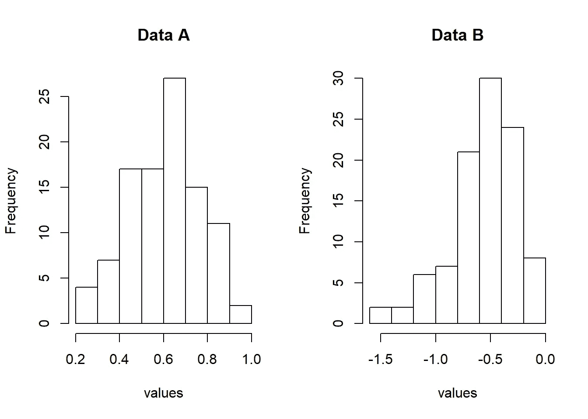

希望很明显，数据 A 可能是正常的，但数据 B 看起来肯定是非正常的(注意明显的不对称)！

为了更彻底地检验正态性，我们可以绘制一个理想的正态分布，然后将我们的数据放在上面(这被称为 QQ 图)，然后计算关系之间的 R 平方:

```
#
#plot data against ideal normal
#note that the subset command means we will only take the val column of data with Group=="Control"
# subset(dat, Group=="Treated") would return the whole dataframe where the column "Group" is equal to "Treated", adding the $val allows us to access the val column directly
par(mfrow = c(1, 2))

qqnorm(dat$val, main="QQ plot A")
qqline(dat$val)

qqnorm(log(dat$val), main="QQ plot B")
qqline(log(dat$val))
```

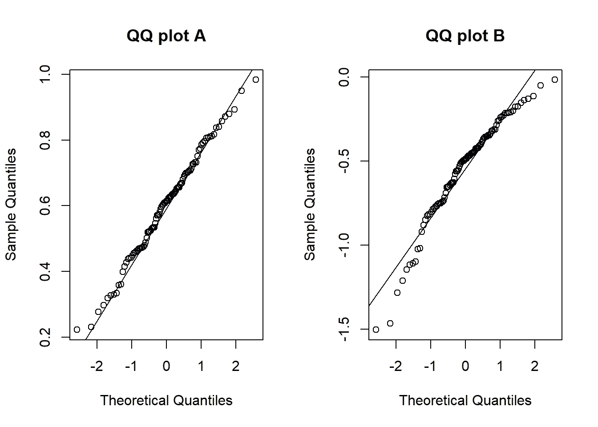

```
#get Rsquared
qn=qqnorm(log(dat$val), plot.it=FALSE)
rsq_B <- cor(qn$x,qn$y)

#get Rsquared
qn=qqnorm(dat$val, plot.it=FALSE)
rsq_A <- cor(qn$x,qn$y)
```

QQ 图将完美的正态分布绘制为一条实对角线，然后将我们的实际数据作为标记(圆圈)放在其上。

从图中我们可以看出，我们的数据 A 很好地遵循了正态(实斜线)分布。然而，检查图 B 中的数据，我们可以看到与正常线的实质性偏差，这些偏差显然不是随机的，而是遵循一个趋势(随机偏差在线的任一侧出现的次数相同)。

为了量化这一点，我们可以提取 R 平方(我们将在后面的课程中了解更多关于 R 平方的内容，但它本质上是在 0 到 1 的范围内测量我们的点与对角线的接近程度)。A 和 B 的 R 平方值分别为 0.997 和 0.974。查看数据就足以认识到曲线 B 是非正态的，但是我们也可以选择一个截止值，例如 R 的平方为 0.975，并将低于这个值的任何值称为非正态，将高于这个值的任何值称为正态。

另一种方法是使用夏皮罗检验，它将对我们的数据是否正常进行假设检验:

```
shapiro.test(dat$val)
```


这里的关键部分是 P 值，数据 a 的 P 值为 0.84 值越高，分布越正态。通常我们会使用 0.1 的 P 值临界值来确保正态性。因此，任何 p 值为<0.1 we would class as non-normal. This approach is complementary to the above, and I would recommend both plotting a QQ-plot (as above) **和**的数据都要进行夏皮罗检验(并在任何报告中报告这两个值)。

让我们看看一些非正态(特别是对数正态)数据的 QQ 图和夏皮罗测试:

```
non_norm <- log(rnorm(75, mean=5,sd=3))

par(mfrow = c(1, 2))
hist(non_norm, main="Histogram of log-normal data", xlab="Values")
qqnorm(non_norm, main="QQ plot for log-normal data")
qqline(non_norm)
```

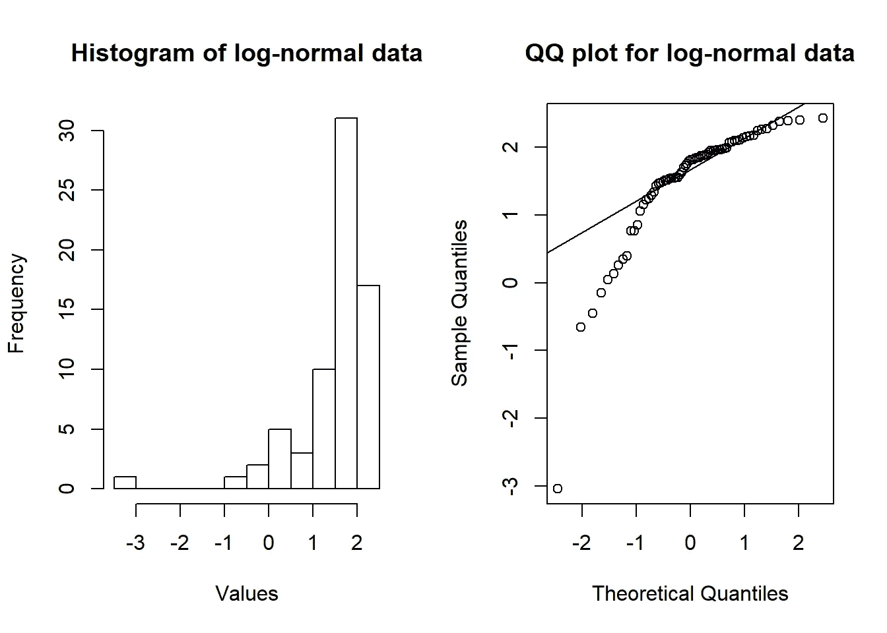

上述分布的夏皮罗测试 P 值为 2.4e-09，QQ 图显示了与正常线的*系统偏差*。这强烈表明我们的数据 B 是非正态的。

# 假设检验正态分布

一旦我们确信我们的数据是正态分布的(我们稍后将处理非正态数据)，我们就可以进行一些假设检验。T-test 通常被用作“go-to”假设检验，但这里我想说服您使用 Welch 检验(记住，要访问 R 中的 Welch 检验，我们调用 t.test()函数，但添加参数 **var.equal=FALSE** )。韦尔奇检验更适合于我们在现实世界中经常遇到的不等样本量和不等方差的情况。

下面，我运行了一个模拟来演示在方差数据不相等的情况下使用 T-test 优于 Welch tests 的危险性:

```
#set up vars
nSims <- 20000 #number of simulations
p1 <-c()
p2 <- c()

#create variables for dataframe
catx<-rep("x",38)
caty<-rep("y",22)
condition<- c(catx,caty)

#run simulations
for(i in 1:nSims){ #for each simulated experiment
  sim_a<-rnorm(n = 38, mean = 0, sd = 1.11) #simulate participants condition a
  sim_b<-rnorm(n = 22, mean = 0, sd = 1.84) #simulate participants condition b
  p1[i]<-t.test(sim_a,sim_b, alternative = "two.sided", var.equal = TRUE)$p.value #perform the t-test and store p-value
  p2[i]<-t.test(sim_a,sim_b, alternative = "two.sided", var.equal = FALSE)$p.value #perform the Welch test and store p-value
}

par(mfrow = c(1, 2))
hist(p1, main="Histogram of t-test p-values ", xlab=("Observed p-value"))
hist(p2, main="Histogram of Welch's p-values", xlab=("Observed p-value"))
```


我们在这里绘制了多次运行模拟后从两次测试中得出的 P 值直方图。我们会记得 p 值是*组间差异纯粹是偶然观察到的概率(即组间没有真正的差异)*。这里的两个总体具有相同的均值，这意味着我们应该接受零假设，拒绝替代假设(见术语表)。

正如我们所知，人群之间没有真正的差异，我们应该接受零假设，并看到一个平坦的 p 值分布(我们应该看到一个 p 值为<0.05 5% of the time by definition, as a p-value of 0.05 implies a 5% chance of a false result in frequentist statistics). Note that in a real situation we wouldn’t already know if there was or was not a difference between populations!

We see that the right hand histogram of the Welch test results is flat (this is good, it matches what we know about the data). However, the T-test (left hand histogram) performs very poorly here and reports more smaller p-values. This means the chances of us wrongly concluding that *那里* ***是*** *)组之间的显著差异*要高得多。准确地说，如果我们在这里使用 T 检验而不是韦尔奇检验，我们有 72 %的可能做出不正确的结论！！！这可能导致接受实际上没有效果的程序或产品创新，浪费时间和金钱。

这个故事的寓意是**在正确的时间使用正确的测试**。如果数据是正常的，那么我们应该总是使用韦尔奇检验(忽略 T 检验)，因为韦尔奇检验比 T 检验有更少的假设。如果数据是非正常的，那么我们需要一个非常不同的测试。

# 假设检验非正态分布

以上适用于正态分布的数据。但是非正态数据呢？

在现实生活中，我们经常会遇到非正态数据。任何我们的值接近 0 或 100%的情况都可能是非正常的。例如，如果我们观察一家老牌银行的贷款偿还情况，或者如果我们观察一种非常受欢迎(或不受欢迎)的产品的采用情况。

卢旺达农民的非正态分布示例如下(贷款偿还百分比和太阳能灯采用率):

```
df <- read.csv("./Sample_data.csv")
df$X..Repaid <- df$TotalRepaid/df$TotalCredit * 100
df$solar_A <- df$solar_A *100
d1 <- ggplot(df, aes(x=X..Repaid)) + geom_density(alpha=0.3, fill="red") + ggtitle("% repaid density plot")  + xlab("% repaid") + xlim(75,100)
d2<- ggplot(df, aes(x=solar_A)) + geom_density(alpha=0.3, fill="red") + ggtitle("Solar adoption density plot")  + xlab("% solar adoption") 

multiplot(d1,d2,cols=2)
```

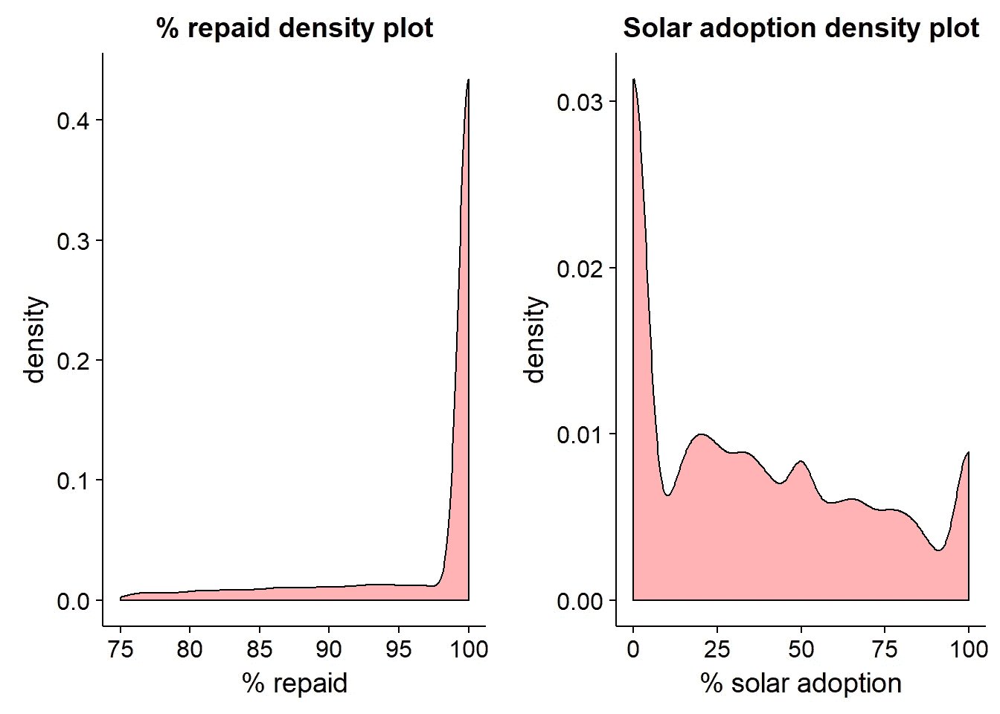

我们可以从密度图中清楚地看到，我们的数据在两种情况下都是非正态的。但是让我们使用上面概述的诊断来确保:

```
par(mfrow = c(1, 2)) qqnorm(df$X..Repaid, main="QQ plot for % repaid") qqline(df$X..Repaid) qqnorm(df$solar_A, main="QQ plot for solar adoption") qqline(df$solar_A)#Shapiro test has an upper limit of 5000, so we will randomly take a subset of data to test instead shapiro.test(sample(df$X..Repaid, size=1000))Shapiro-Wilk normality test data: sample(df$X..Repaid, size = 1000) W = 0.54519, p-value < 2.2e-16shapiro.test(sample(df$solar_A, size=1000))Shapiro-Wilk normality test data: sample(df$solar_A, size = 1000) W = 0.87404, p-value < 2.2e-16
```

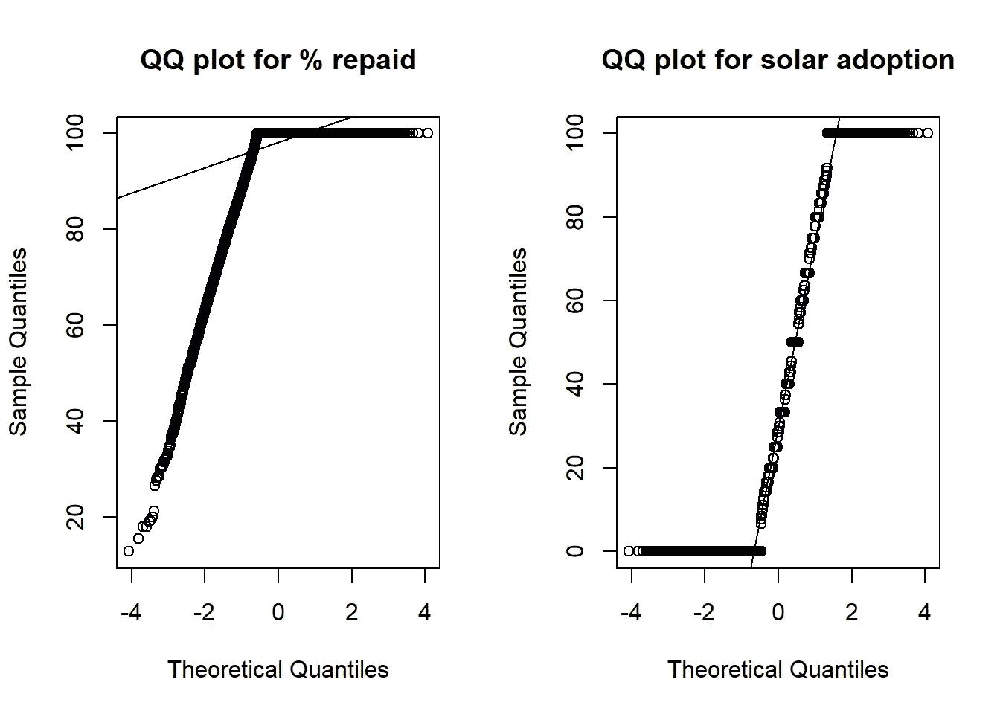

哇！这些是一些看起来很糟糕的 QQ 图，和一些非常低的 P 值！数据远非正常。

然而，我们仍然希望对这些数据进行假设检验。

# 如何检验非正态数据

现在让我们比较一下测试增加 1.5%太阳能利用率的干预措施的方法。我们将使用 T 检验(对非正态数据不正确)、韦尔奇检验(对非正态数据也不正确)和**威尔科森检验**(对非正态数据的适当检验)。

```
#load data
norm1 <- df$solar_A
norm2 <- norm1 *1.015
```

T 检验:

```
#t test
t.test(norm1,norm2, alternative = "two.sided", var.equal = TRUE)
```

*P 值= 0.1048*

韦尔奇试验:

```
#welch test
t.test(norm1,norm2, alternative = "two.sided", var.equal = FALSE)
```

*P 值= 0.1048*

威尔科克森试验:

```
wilcox.test(norm1 , norm2 ,paired=FALSE, correct=TRUE)
```

*P 值= 1.55e-06*

我们可以看到我们得到了非常不同的结果！T 检验和 Welch 检验报告 p 值为 0.105 和 0.105，这表明在典型的 p 值阈值 0.05 下无显著性。而 Wilcoxon 试验表明 p 值为 1.55e-06。

你可以看到，根据我们使用的测试，我们会得出完全不同的结果。T 检验和 Welch 检验会使我们相信干预是没有用的，而 Wilcoxon 检验清楚地表明干预似乎有效果。因此，对正确的数据使用正确的测试非常重要。想象一下，如果我们一直在测试一种对农民有害的干预措施，但使用了错误的测试方法，因此得出干预措施是安全的结论！

我们现在可以将 Wilcoxon 测试添加到我们的库中:

*   **Wilcoxon-test** :对假设很少的非正态数据的良好测试。我们正在测试两个数据集具有不同分布的假设。这里的主要假设是:1)样本随机代表总体，2)样本相互独立，3)值有顺序(如 3 大于 1，但不能说真大于假)。

# 报告数据

我们现在已经了解了如何计算数据的稳健 P 值。然而，我们报告数据的方式也取决于分布的形状。对于正常数据，我们可以简单地报告平均值和置信区间，例如*平均值为每英亩 4.5(CI:1.5–7.5)千克*(您也可以报告带有标准误差的平均值，只要您报告的内容清晰明了)。非正态数据有点复杂，我们通常应该报告中位数、第一和第三四分位数，例如*中位数 4.5 (Q1 2.5 & Q3 6)* 。

我们将记住，正态分布是对称的，正是非正态分布的**不对称性**阻止了我们报告 CIs、SEMs 或 StDevs(因为这些都是基于对称性的)。

与上述假设检验思想相关的一个概念是**统计功效**。幂用于计算样本量，也用于解释试验后 RCT 的结果。低功率意味着我们的结果不太可靠，我们可能会对干预做出错误的结论。

我们使用正确的功率计算非常重要，就像我们使用正确的假设检验一样重要。功率计算取决于数据分布，R 中最常用的功率计算器适用于正态分布的数据。这个计算器需要一个“效果大小”，这是一个简单的方法来衡量治疗的效果。效应大小基本上是样本间平均值的差异除以样本的标准差。这意味着单位是标准偏差。因此，效应大小为 1 意味着数据移动了等于 1 个标准差的量。我在下面加入了一个函数，使用科恩的 D 方程计算效应大小:

```
cohen_d <- function(d1,d2) {  

  m1 <- mean(d1, na.rm=TRUE)
  m2 <- mean(d2, na.rm=TRUE)
  s1 <- sd(d1, na.rm=TRUE)
  s2 <- sd(d2, na.rm=TRUE)
  spo <- sqrt((s1**2 + s2**2)/2)
  d <- (m1 - m2)/spo
  rpb <- d / sqrt((d**2)+4)
  ret <- list("rpb" = rpb, "effectsi" = d)
  return(ret)  }
```

现在我们有了一种计算效果大小的方法，让我们用它来计算一项有正常数据和 100 名参与者的研究的功效。我们将使用 pwr 库中的函数“pwr.t.test”。该函数需要以下参数:

*   **h** —这是由上面的科恩 D 方程计算出的效应大小。我们用对象后面的“$effectsi”来调用它(详见代码)。
*   **n**——每个样本的样本量
*   **sig.level** —这是我们希望在分析中使用的 p 值临界值。这通常是 0.05 或 0.1。
*   **power** —我们希望将此设置为 NULL，以获得将电源返回给我们的功能。

我们一起将这个库称为“pwr”。

其中“length()”参数返回名为“norm”的列表中元素的数量。

```
norm <- rnorm(200,40,10)
norm2 <- norm*1.1
inp <- cohen_d(norm, norm2)
```

这里我们看到我们有一个 0.97 的幂。理想情况下，我们希望功效高于 0.75–0.8，以获得准确检测效果的良好概率。

请注意，我们可以通过填写幂参数并将 **n** 设置为空来计算 0.8 的幂所需的样本量，如下所示(这是一个略有不同的等式，因为我们假设对照组和治疗组的大小相等):

`*pwr.t.test(n= NULL, d= inp$effectsi, power=0.8, alternative="two.sided")*`

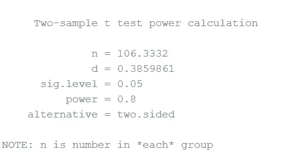

我们可以循环查看不同样本大小的功效，然后用一条线标出功效为 0.8 的位置。

```
power_out <- c() # initialise this empty so we can append to it
sample_sizes <- c(2,4,6,10,20,30,40,50,70,90,110,130)
for(i in sample_sizes){
  x <- pwr.t.test(n= i, d= inp$effectsi, power=NULL, alternative="two.sided")$power
  power_out <- c(power_out, x)

}

p <- ggplot() + geom_line(aes(x=sample_sizes, y= power_out)) + geom_hline(yintercept = 0.8, color="red", size=2) + ggtitle("Example power curve")
p
```

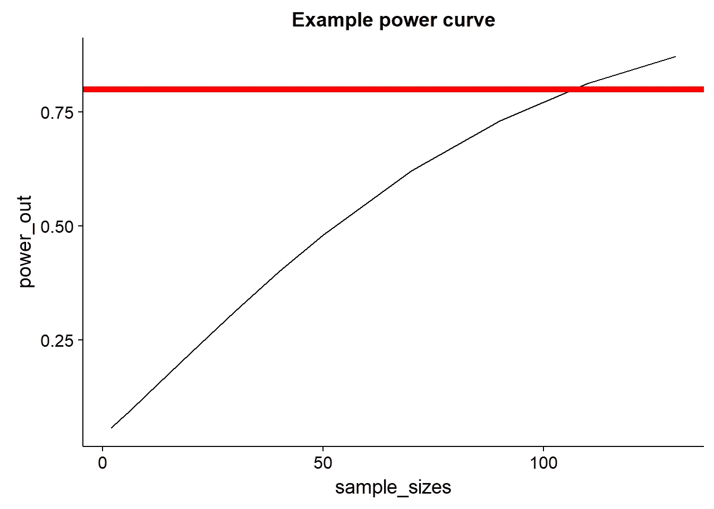

像上面这样的图可以帮助你了解什么样的样本大小和功效是合理的。我强烈建议绘制功效曲线的下限(即你可能看到的最小功效)和上限(即你可能看到的最大功效)。

运行一个完整的例子:让我们想象我们想要运行一个 RCT(或 A/B 测试),检查一个新的利率对肥料使用的影响。我们有两组，一组是对照组，利率和之前一样。以及利率降低 3 个点(例如 15%的利息而不是 18%)的治疗组。我们对客户的了解意味着，我们认为通过这种处理方式，化肥的使用量将增加 15%至 25%。我们绘制如下的功率曲线*(请检查代码并确保您理解了代码)*:

```
control <- rnorm(100, 0.5,0.2)
treat_lower_estimate <- control *1.15
treat_upper_estimate <- control *1.25

power_lw <- c() # initialise this empty so we can append to it
power_hi <- c() # initialise this empty so we can append to it
sample_sizes <- c(10,20,30,40,50,70,90,100,125,150,175,200,250,300,350,400,450,500,550,600,700)
for(i in sample_sizes){

  lower_cohen <- cohen_d(control, treat_lower_estimate)
  a <- pwr.t.test(d = lower_cohen$effectsi , n=i,  sig.level = 0.05, power = NULL)$power
  power_lw <- c(power_lw, a)

  upper_cohen <- cohen_d(control, treat_upper_estimate)
  b <- pwr.t.test(d = upper_cohen$effectsi , n=i,  sig.level = 0.05, power = NULL)$power
  power_hi <- c(power_hi, b)

}

marker <- pwr.t.test(d = lower_cohen$effectsi , n=NULL,  sig.level = 0.05, power = 0.8)$n
marker2 <- pwr.t.test(d = upper_cohen$effectsi , n=NULL,  sig.level = 0.05, power = 0.8)$n
ggplot() + geom_ribbon(aes(x=sample_sizes, ymin= power_lw, ymax=power_hi), alpha=0.2, colour="blue", fill="blue")  + xlab("Sample size") + ylab("Power") + geom_vline(xintercept = marker, linetype="dotted" ) + geom_hline(yintercept=0.8, linetype="dotted", size=2) + geom_vline(xintercept = marker2 , linetype="dotted") + labs(title="Power curve example", caption="Power curve indicating sample sizes needed for a 0.8 power (dotted lines)") + theme(plot.caption = element_text(hjust = 0.5))
```


上面的图让我们看到它需要一个大的样本量(n 大约是。200，所以我们在这个试验中需要 400 个参与者——200 个控制组和 200 个治疗组)来检测 15%的采用变化，其功效为 0.8。像这样绘制数据允许更灵活的决策，强烈建议这样做。

# 非正态分布数据和样本大小/功效

对于正常的功率计算来说，以上都没问题。但是非正常力量呢？

我们对此也有解决方案！

我在下面做了一个函数(“MCpower”)，它将计算非正态分布的功率。它需要样本 1 和 2(处理和对照)的数据(或预期数据)和样本大小(“大小”参数)。

请确保你理解这个代码，并舒适地使用它

```
MCpower = function(sample1, sample2, size) {

  reps = 1000
    results  <- sapply(1:reps, function(r) {
        resample1 <- sample(sample1, size=size, replace=TRUE) 
        resample2 <- sample(sample2, size=size, replace=TRUE) 
        test <- wilcox.test(resample1, resample2, alternative="two.sided",paired=FALSE, correct=TRUE)
        test$p.value
    })
    sum(results<0.05)/reps
}

#we use it like this
Non_norm_power <- MCpower(control, treat_upper_estimate, 100)
```

我们可以比较这些方法来理解为什么我们需要对正确的数据使用正确的测试。让我们进行一些模拟实验。下面的数据是非正态，样本之间是有差异的。因此，我们期望看到*统计上的显著差异*。请注意，虽然正常的功效测试或假设测试将测试均值，但这里的功效计算将测试分布的总体相似性。

让我们运行一个模拟，计算用不同方法测试两个总体之间的差异所需的功效:

```
#set up vars
nSims <- 500 #number of simulations

#initialise empty vectors for appending to
x1 <- c()
x2 <- c()
p1 <- c()
p2 <- c()

#run simulations
for(i in 1:nSims){ #for each simulated experiment
  set.seed(i)
  sim_a <- c(rnorm(150, mean=130,sd=20) )**2
  sim_b <- c(rnorm(150, mean=120,sd=35) )**2
  sim_b[which(is.nan(sim_b)==TRUE)] <- 1
  sim_a[which(is.nan(sim_a)==TRUE)] <- 1
  inp <- cohen_d(sim_a, sim_b) # effect size
  x1[i] <- pwr.t.test(d= inp$effectsi , n =length(sim_a), sig.level = 0.05, power = NULL)$power
  x2[i] <- MCpower(sim_a, sim_b,  size=150) 
  p1[i] <- t.test(sim_a,sim_b)$p.value
  p2[i] <- wilcox.test(sim_a,sim_b, paired=FALSE, correct=TRUE)$p.value
}

#hist(sim_b, bins=20)
#shapiro.test(sim_b)
par(mfrow = c(1, 2))
hist(x1, main="Histogram of normal powers ", xlab=("Observed power"), xlim =c(0,1))
hist(x2, main="Histogram of MC powers", xlab=("Observed power"), xlim =c(0,1))
```

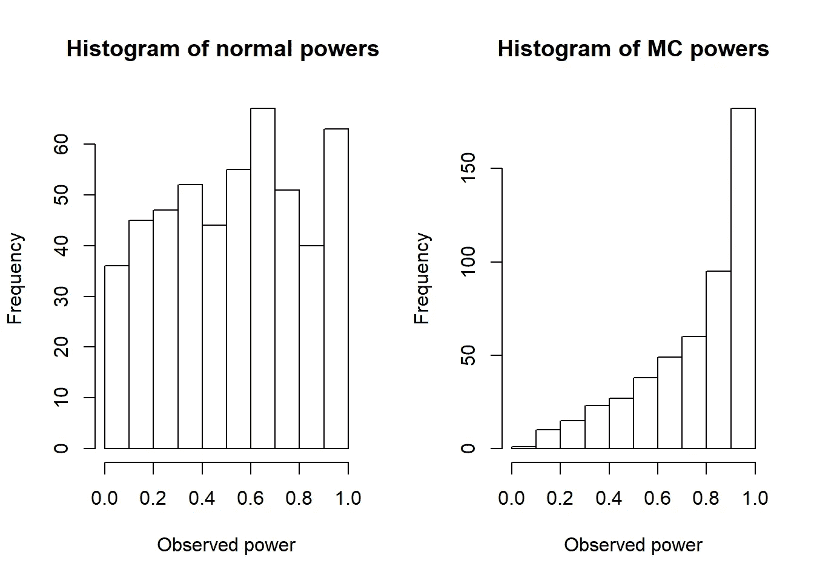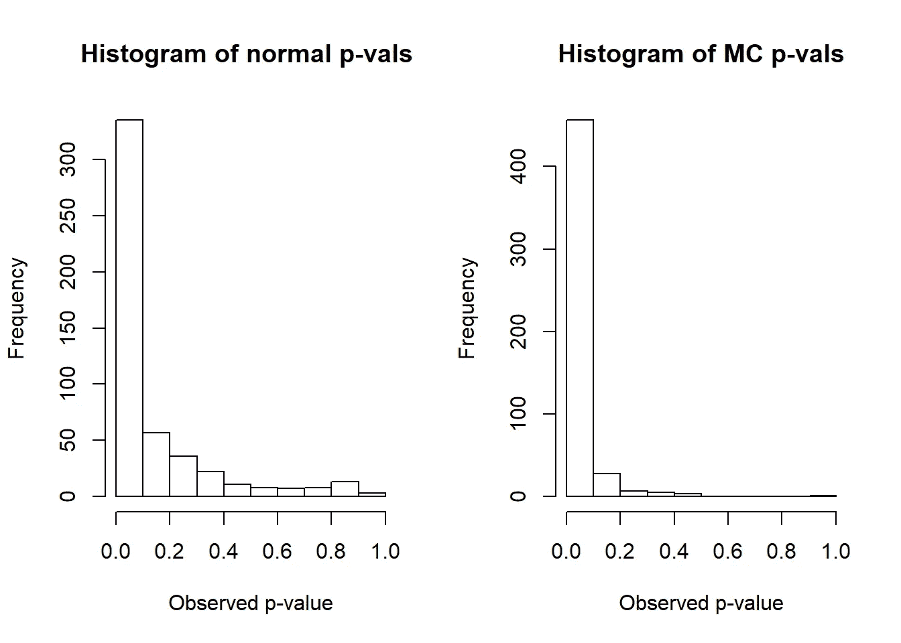

数百次 t 检验模拟的平均 p 值为 0.133，MC 检验的平均 p 值为 0.0305(参见上述分布直方图)。我们现在知道 T-检验假设正态分布，这在这里是不正确的，而 MC 方法只需要满足很少的假设。我们可以看到，MC 方法通常具有更高的功效，并且经常正确地识别出这些样本之间存在**和**显著差异，不像 T 检验表现不佳。

注意，对于正常数据，正常功率计算的结果和我的 MC 方法非常相似。比较效应大小为 1 的两种分布，标准方法和 MC 方法的 P 值分别为 0.012 和 0.014，功效分别为 0.86 和 0.85。

# 摘要

我们现在已经了解了如何绘制和呈现数据，以使其简单且真实地反映基础数据，我们还了解了如何计算 RCT 中正常和非正常数据的 p 值和乘方，以及当我们的假设有误时会发生什么。我附上了一个简短的流程图来说明需要作出的决定:

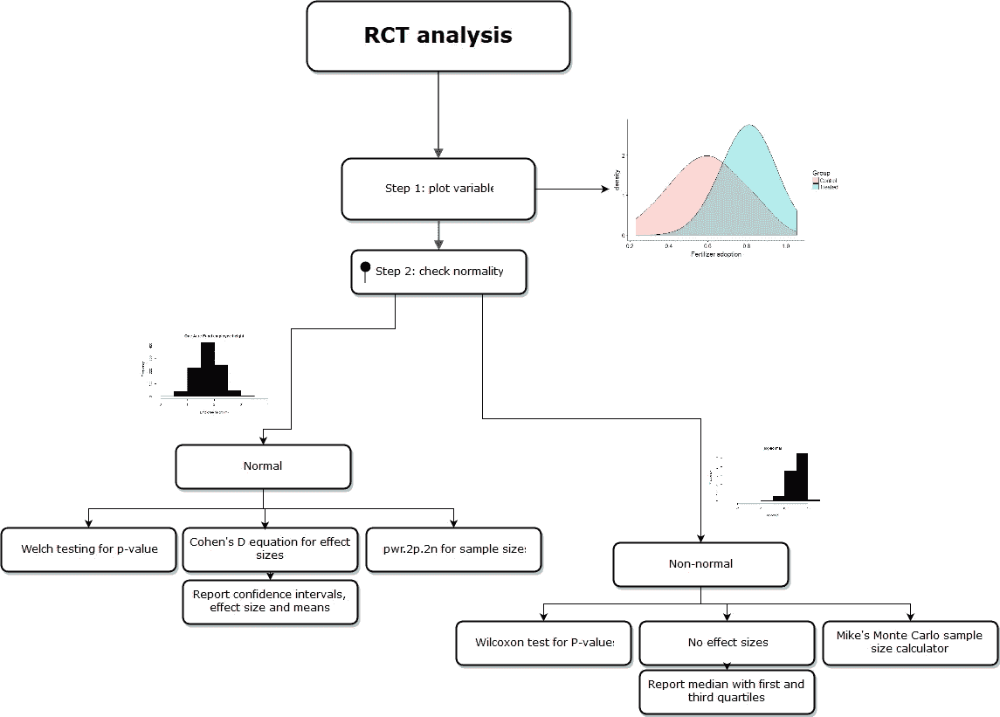

# *分析 RCT 的最佳实践:*

*   即使您在 RCT 前计算样本量，计算 RCT 后的功效(与样本量相关)也很重要，以确保我们的研究有足够的功效。请记住，低功率意味着我们不太可能检测到干预的效果，通常会使我们的结果不太可靠。我希望每一次 RCT 分析都从关键变量的功效计算开始
*   我们还必须绘制关键变量的分布图。在 RCT 中，我们通常会观察 2 个或更多组(例如对照组和治疗组)。因此，我建议在分析开始时为每个关键变量绘制密度图或箱线图。R-Markdown(这是本课的内容)在这里非常有用，将成为 AMP 的重点。
*   检验我们的假设。在决定使用什么方法之前，我们应该对我们的数据进行 Shapiro 测试，以确保它是正常的*(例如 T-测试或 Wilcoxon 测试)。*
*   对于正态分布数据，始终报告 p 值的平均值和置信区间，对于非正态数据，报告中位数和第一个及第三个四分位数。
*   确保图表**简单，但真实的数据**。

# 统计测试概述

*   **T 检验**:假设正态分布。该测试是在 20 世纪 50 年代针对小样本量进行的，现在有了更可靠的测试，应该使用
*   **配对 T-检验**:T-检验(如上)，但用于测量治疗前后的**同一受试者**(例如，测量发传单活动前后的农民种植依从性)
*   **双样本 T 检验:**用于**两个不同组**的 T 检验，例如比较接受治疗的农民和对照农民的玉米产量。
*   **Welch 检验:**对 T 检验的改进，对不等方差更稳健(例如，对密度图宽度不同的样本更稳健)。我们可以在 t.test() R 函数中调用带有参数“var.equal=FALSE”的 Welch 测试。请注意，韦尔奇检验仅对正态分布数据有效(如 T 检验)。
*   **Wilcoxon-test** :对假设很少的非正态数据的良好测试。我们正在测试两个数据集具有不同分布的假设。这里的主要假设是:1)样本随机代表总体，2)样本相互独立，3)值有顺序(如 3 大于 1，但不能说真大于假)。

# 资源

*   [设置/安装说明 R](https://courses.edx.org/courses/UTAustinX/UT.7.01x/3T2014/56c5437b88fa43cf828bff5371c6a924/)
*   [互动 R 基础教程——强烈推荐](https://tutorials.shinyapps.io/04-Programming-Basics/)
*   [Base R cheatsheet](http://github.com/rstudio/cheatsheets/raw/master/base-r.pdf) —强烈推荐，打印出来放在办公桌上！
*   [非互动教程(如果那是你的事)](http://www.cyclismo.org/tutorial/R/)
*   [Youtube 教程](https://www.youtube.com/user/TheLearnR)
*   [备忘单](https://www.rstudio.com/resources/cheatsheets/) —仅推荐给更高级的 R 用户
*   [StackOverFlow](https://stackoverflow.com/questions/tagged/r) —针对具体的技术问题

# 词汇表

*   **观察**:在统计学中，这是一个变量在特定时间的值。我们也可以把观察看作数据帧中的数据行
*   **变量**:可以观察到的特性。这也可以被称为一个*特性*，可以被认为是数据帧中的一列(例如:性别、糖价或收成)。
*   **正态**:正态分布是近似对称的，均值一定等于中位数。数据点离平均值越远，发生的可能性就越小。正常数据也称为“钟形数据”。
*   **方差和标准差**:方差是正态分布的宽度。标准差是方差的平方根。我们可以认为这是数据的分布，高方差意味着大量的可变性，低方差意味着大多数观测值将具有非常相似的值。
*   **四分位数**:四分位数是另一种数据度量。如果我将一个变量的所有值按顺序排列，那么第一个四分位数就是总长度的四分之一。同样，第三个四分位数将是四分之三长度的值。例如，数据 *1，3，6，8，10，14，15，18，20，22，25，26* 的第一个四分位数为 *6* ，第三个四分位数为 *20* 。
*   人口:从大量潜在数据中抽取样本。
*   样本:我们有数据的总体的子集。例如，我们可能正在研究一个由 1000 名肯尼亚农民组成的*样本*，但是想要推广到整个肯尼亚农民*人口*。
*   **P 值**:观察结果完全随机产生的概率(即*群体*之间没有真正差异的概率)
*   **功效**:在给定样本量、分布和误差率的情况下，我们能够检测出两个总体之间差异的概率。请注意，功率也会影响我们的结果的稳健程度。
*   **效果大小**:2 组之间的标准化差异。它有单位 *stdev* 。因此，1 的效应大小等于 1 stdev 的差值。群体之间。
*   **假设检验**:统计检验。每个假设检验有两个部分，一个是*零假设*，表示两个群体是相同的(即没有差异)，另一个是*替代假设*，表示两个群体之间有差异。通常，零假设被称为 H0，替代假设被称为 H1。
*   标准形式/科学记数法:我们可以用标准形式写出有很多零的数字。例如 0.001 变成 1e-3，1000 变成 1e+3(意思是 1 *10 的 3 次方)。
*   **直方图**:矩形图(也称为*条柱*)，条柱的高度与观察值的数量成比例，宽度与包含的值的范围成比例。

# 下一篇文章:

*   最小可检测影响
*   计划 A/B 测试
*   集群内效应
*   还有更多！

*最初发布于*[*Michael-bar . github . io*](https://michael-bar.github.io/Introduction-to-statistics/AMP-1-distributions.html#)*。*

如果你在这些帖子中看到任何错误，请留下评论！同样，如果任何事情需要进一步的解释，然后评论！