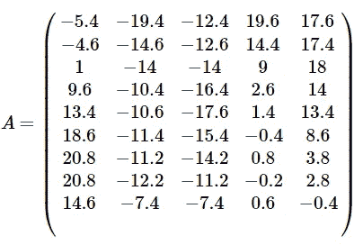
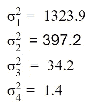
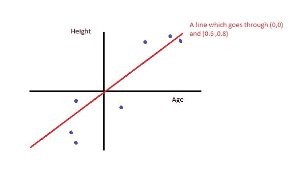

# 主成分背后的直觉

> 原文：<https://towardsdatascience.com/intuition-behind-principal-components-849d3ef9d616?source=collection_archive---------9----------------------->

> PCA 一直困扰着我。这是那些我已经记了很多遍，但在我的潜意识中却无法正确理解的概念之一。这是在我完全理解线性代数的细微差别之前。

如果你理解矩阵的特征值、特征向量和协方差，那么你最终会在这篇博客中找到 PCA 的平静。如果这些概念有点生疏，不要担心，你可以在继续之前快速修改它们 [*这里*](http://math.mit.edu/linearalgebra/ila0601.pdf) 和 [*这里*](http://web.mit.edu/be.400/www/SVD/Singular_Value_Decomposition.htm) 。

假设我们为 5 个不同的个体测量了 9 个不同的变量/属性，并将数据放入一个 9 乘 5 的矩阵中。

Matrix A : 9x5dimensional

同样假设，我们也对这个数据应用了我们可爱的标准化，因此每一行的平均值为零。所以在上面的矩阵中，均值(行 1)=均值(行 2)..平均值(第 9 行)= 0

让我们称这个矩阵为 A，我在行中有变量/属性，在列中有观察值。

现在在我跳到主成分及其解释之前，首先让我们计算 a 的协方差矩阵。

A 的协方差矩阵将是 S = AAt/(n-1 ),其中 At =矩阵 A 的转置，n 是观测值的数量= 5

现在，为了确保我们对矩阵 S 的维数是正确的，AAt 的维数应该是(9x5)乘以(5x9) = (9x9)

因此，基本上，由于我们已经将变量(m=9)放在行中，所以协方差矩阵的维数将是 9x9。

这是我已经计算过的矩阵 S——

Matrix A : 9x5

Matrix B = At (A transpose) : 5x9

Covariance Matrix S : AAt/(n-1) : 9x9

现在，是时候让事情真正热起来，并计算上述矩阵的一些性质

S 的特征值个数:

首先，看起来 9×9 维矩阵 S 的特征值总数等于 9，然而这不是真的。矩阵 AAt 和 AtA 的特征值个数必须相同(证明 [*此处*](https://math.stackexchange.com/questions/1087064/non-zero-eigenvalues-of-aat-and-ata) )

因此，AtA 矩阵将具有 5x5 的维度(检查！)并因此将具有最多 5 个非零特征值，矩阵 AAt 也是如此。

然而，矩阵 A 的所有列都不是独立的(记得我们将所有行居中，所以 A 的所有列的总和将为零)，因此，矩阵 AAt 的非零特征值将仅为 4。

即 S 的特征值的数量:4

我们把 A 的 4 个奇异值(奇异值分解)称为:

因此，S 的特征值= A 的信号值的平方=

Eigenvalues of S

上述特征值是直接从矩阵 S 的值通过编程计算出来的。

注意，S 的特征值之和也等于 S ~1756.7 的对角元素之和

Sum of Eigenvalues of S = 1756.7

Sum of diagonals elements of S = 1752.91

现在，让我们也计算矩阵 a 的每一行(属性)的方差。(因为我们对每一行的均值是零，方差只是每个值的平方和除以 4)

Last Column is variance of each row of matrix A

一旦个体方差在这里，我们可以计算:

矩阵 A 的属性总方差=所有属性方差之和= **1753.39**

> 请注意，协方差矩阵 S 的特征值之和几乎与原始数据矩阵 a 的总方差之和相同。这是一个重要的性质。

因此，我们的 4 个特征值涵盖了数据中的所有方差，注意第一个特征值是最大的，然后它继续下降。

矩阵 S 的每个特征值与其特征向量相关联。在我们的例子中，我们有 4 个特征向量

其中每个特征向量相互垂直，并根据它们各自的特征值计算

最大特征值具有特征向量(u1 ),我们称之为第一主分量，因为该主分量能够解释其方向上的最大方差(1753.39 中的 1323.9)

第二大特征值具有特征向量(u2 ),该特征向量也称为第二主分量，并解释了(在其垂直于第一主分量方向上的总共 1753.39 个方差中的 397.2 个方差)

类似地，第三和第四特征向量解释了总方差相对较小的部分，但这是我们停止的地方。如果我们对前两个特征值求和，我们将得到 98%的总方差，仅由两个特征向量解释，这基本上意味着 u1 和 u2 包含关于矩阵 A 中数据的最大信息，因此我们只需要两个向量，而不是 A 的所有列。这也是我们所说的 PCA 中的降维。

*上面的例子是有意将 5 维减少到 2 维，然而，很难想象这样的例子*

## 现在让我们举一个更简单的例子，当我们对这个方法有些熟悉的时候，让它永远在我们的脑海中具体化

我们有两个属性年龄和身高为 6 人，如下所示矩阵格式[2x6]，年龄和身高行以零为中心。

Matrix A: 2x6 with Mean(row1) = Mean(row2) = 0

Plotted points in 2-D

二维数据也可以如上所示绘制，X 为年龄，y 为身高

有了矩阵 A 中的数据，我们来计算它的协方差矩阵 S = AAt/(n-1)

回想一下，我们的协方差矩阵是 2x2

现在，我们计算 S 的特征值，可以找到 57 和 3(回想一下，S 的特征值之和是 diagnol = 60 上的元素之和，这意味着到目前为止我们是好的。

现在，我们找到矩阵 A 属性的总方差

所以总方差= 20 + 40 = 60

回想一下矩阵 A 中方差=协方差矩阵 S 的特征值之和= 60

所以，第一个特征值 57 解释了我们数据中 60 个变量中的 57 个。如果我们找到它的特征向量，它就是向量

u1 = [0.6 0.8]

这在理论上可以解释最大方差。

当我们在二维空间中绘制这个向量时，我们会得到红线，它基本上只是二维空间中的点在一维空间中的表示。这里，特征向量 u1 是第一主分量，包含关于矩阵 a 的最大信息。

我希望现在有意义的是如何将一个矩阵简化为一组正交的特征向量，这些特征向量通过它们的特征值来解释总方差的最大分数。并且如果我们有总共 q 个特征向量(或主成分)，那么我们只选择最上面的 r 个特征向量(r

干杯！