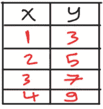
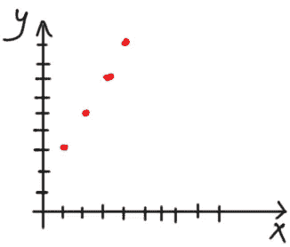
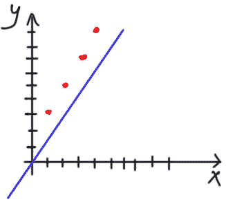
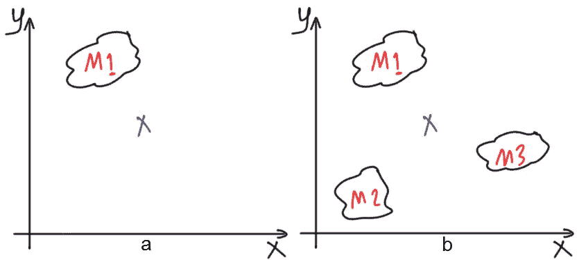
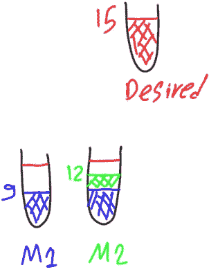
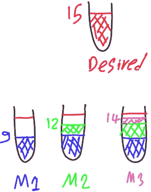

# 以梯度推进为研究案例的直观集成学习指南

> 原文：<https://towardsdatascience.com/intuitive-ensemble-learning-guide-with-gradient-boosting-as-a-study-case-9a3bc1ba1e09?source=collection_archive---------8----------------------->

使用单一的机器学习模型可能不总是适合数据。优化其参数也可能于事无补。一种解决方案是将多个模型结合在一起以适应数据。本教程以梯度推进为研究案例，讨论集成学习的重要性。

# **简介**

机器学习(ML)管道中的一个关键步骤是选择适合数据的最佳算法。基于来自数据的一些统计和可视化，ML 工程师将选择最佳算法。让我们将其应用于一个回归示例，其数据如图 1 所示。

**Figure 1\. Regression input-output simple data.**

通过根据图 2 可视化数据，似乎线性回归模型将是合适的。

**Figure 2\. Data visualization.**

一个只有一个输入和一个输出的回归模型将根据图 3 中的等式进行公式化。

**Figure 3\. Linear regression model**

其中 a 和 b 是方程的参数。

因为我们不知道适合数据的最佳参数，所以我们可以从初始值开始。我们可以将 a 设置为 1.0，b 设置为 0.0，并如图 4 所示可视化模型。

**Figure 4\. Initial regression model.**

该模型似乎不符合基于参数初始值的数据。

预计从第一次试验开始，一切可能都不成功。问题是如何在这种情况下提高结果？换句话说，如何最大化分类精度或者最小化回归误差？做那件事有不同的方法。

一个简单的方法是尝试改变先前选择的参数。经过多次试验后，模型将知道最佳参数是 a=2 和 b=1。在这种情况下，模型将符合数据，如图 5 所示。非常好。

**Figure 5\. Linear regression model**

但是在某些情况下，改变模型参数不会使模型符合数据。会有一些错误的预测。假设数据有一个新点(x=2，y=2)。根据图 6，不可能找到使模型完全适合每个数据点的参数。

**Figure 6\. Impossible to fit the data by changing model parameters.**

有人可能会说，拟合 4 个点，缺少一个点是可以接受的。但是，如果有更多的点不符合直线，如图 7 所示，该怎么办呢？因此，模型会做出比正确预测更多的错误预测。没有一条线可以容纳全部数据。该模型对线上各点的预测能力较强，但对其他点的预测能力较弱。

**Figure 7\. More false predictions.**

# **合奏学习**

因为单个回归模型无法拟合全部数据，所以另一种解决方案是使用多个回归模型。每个回归模型都能够很好地拟合一部分数据。所有模型的组合将减少整个数据的总误差，并产生一个通常很强的模型。在一个问题中使用多个模型称为集成学习。使用多个模型的重要性如图 8 所示。图 8(a)显示，预测样本结果时误差很大。根据图 8(b ),当存在多个模型(例如，三个模型)时，它们的结果的平均值将能够做出比以前更准确的预测。

**Figure 8\. Single vs. multiple models**

当应用于图 7 中的前一个问题时，拟合数据的 4 个回归模型的集合如图 9 所示。

**Figure 9\. Ensemble of 4 regression models**

这就留下了另一个问题。如果有多个模型来拟合数据，如何得到单个预测？有两种方法可以组合多个回归模型来返回一个结果。他们是装袋和助推(这是本教程的重点)。

在 bagging 中，每个模型将返回其结果，并且通过汇总所有这些结果将返回最终结果。一种方法是对所有结果进行平均。装袋是并行的，因为所有模型同时工作。

相比之下，增压被认为是连续的，因为一个模型的结果是下一个模型的输入。boosting 的思想是使用弱学习器来拟合数据。因为它是弱的，它将不能正确地拟合数据。这样一个学习者的弱点会被另一个弱学习者所弥补。如果一些弱点仍然存在，那么将使用另一个弱学习者来修复它们。这个链条不断延伸，直到最终从多个弱学习者中产生一个强学习者。

接下来是解释梯度增强是如何工作的。

# **梯度增强(GB)**

下面是基于一个简单示例的梯度增强工作原理:

假设要建立一个回归模型，数据只有一个输出，其中第一个样本有一个输出 15。如图 10 所示。目标是建立一个回归模型，正确预测这样一个样本的输出。

**Figure 10**

第一个弱模型预测第一个样本的输出是 9，而不是图 11 所示的 15。

**Figure 11\. Prediction of 9/15 with residual equal to 6.**

为了测量预测中的损失量，需要计算其残差。残差是期望输出和预测输出之间的差值。它是根据以下公式计算的:

**期望—预测 1 =剩余 1**

其中**预测 1** 和**残差 1** 分别是第一弱模型的预测输出和残差。

通过用期望输出和预测输出的值代替，残差将是 6:

**15–9 = 6**

对于预测输出和期望输出之间的**残差 1** =6，我们可以创建第二个弱模型，其目标是预测与第一个模型的残差相等的输出。因此，第二种模式将弥补第一种模式的不足。根据下式，两个模型的输出之和等于所需输出:

**期望=预测 1 +预测 2(剩余 1)**

如果第二弱模型能够正确预测**残差 1** ，那么期望输出将等于所有弱模型的预测，如下所示:

**期望=预测 1 +预测 2(剩余 1) = 9 + 6 = 15**

但是如果第二弱模型未能正确预测**残差 1** 的值，并且例如仅返回 4，那么第二弱学习器也将具有非零残差，计算如下:

**剩余 2 =预测 1 —预测 2 = 6–3 = 3**

这如图 12 所示。

**Figure 12\. Prediction of 3/6 with residual equal to 3.**

为了修复第二个弱模型的弱点，将创建第三个弱模型。它的目标是预测第二个弱模型的残差。因此它的目标是 3。因此，我们样本的期望输出将等于所有弱模型的预测，如下所示:

**期望=预测 1 +预测 2(剩余 1) +预测 3(剩余 2)**

如果第三弱模型预测是 2，即它不能预测第二弱模型的残差，那么对于这样的第三模型将有一个残差等于如下:

**剩余 3 =预测 2 —预测 3 = 3–2 = 1**

这如图 13 所示。

**Figure 13\. Prediction of 2/3 with residual equal to 1.**

结果，将创建第四弱模型来预测等于 1 的第三弱模型的残差。期望输出将等于所有弱模型的预测，如下所示:

**期望=预测 1 +预测 2(剩余 1) +预测 3(剩余 2) +预测 4(剩余 3)**

如果第四个弱模型正确地预测了它的目标(即残差 3)，那么使用总共四个弱模型已经达到了期望的输出 15，如图 14 所示。

**Figure 14\. Prediction of 1/1 with residual equal to 0.**

这是梯度推进算法的核心思想。使用前一个模型的残差作为下一个模型的目标。

# **国标概述**

总的来说，梯度推进从一个弱模型开始进行预测。这种模型的目标是问题的期望输出。训练好模型后，计算其残差。如果残差不等于零，则创建另一个弱模型来修复前一个模型的弱点。但是这种新模型的目标不是期望的输出，而是先前模型的残差。也就是说，如果给定样本的期望输出是 T，则第一模型的目标是 T。在对其进行训练之后，对于这样的样本，可能存在 R 的残差。要创建的新模型将把它的目标设置为 R，而不是 t。这是因为新模型填补了以前模型的空白。

梯度推进类似于由多个虚弱的人将一个重金属抬上几级楼梯。没有一个虚弱的人能把这块金属抬上所有的楼梯。每个人只能把它抬起一步。第一个弱的人会把金属抬一步，之后就累了。另一个虚弱的人将把金属再抬一步，以此类推，直到把金属抬上所有的楼梯。

原文可在 LinkedIn 本页面查看:[https://www . LinkedIn . com/pulse/intuitive-ensemble-learning-guide-gradient-boosting-study-Ahmed-gad](https://www.linkedin.com/pulse/intuitive-ensemble-learning-guide-gradient-boosting-study-ahmed-gad)

## 联系作者:

领英:【https://linkedin.com/in/ahmedfgad 

电子邮件:ahmed.f.gad@gmail.com