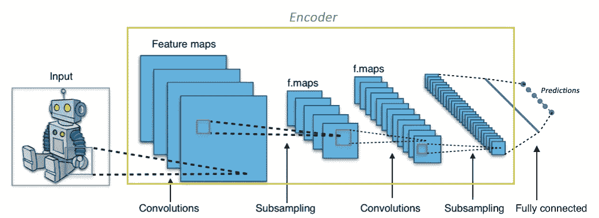
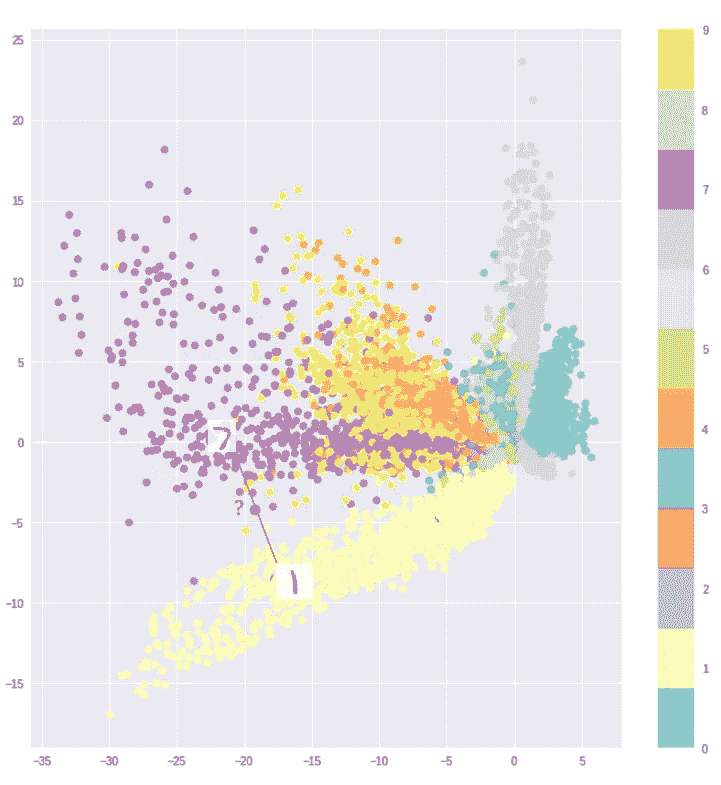
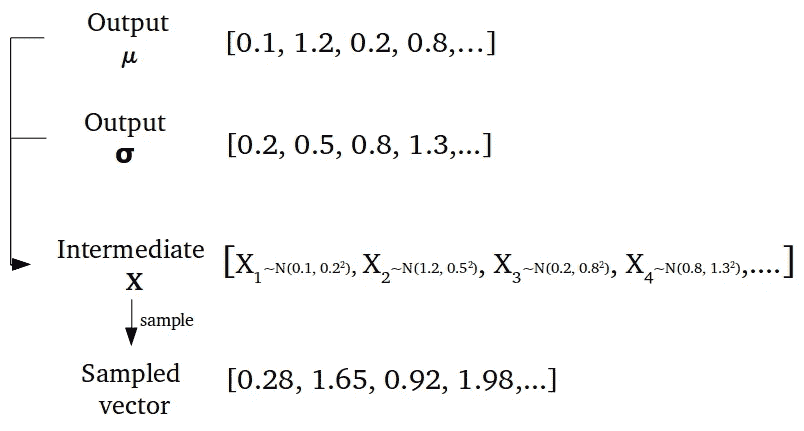
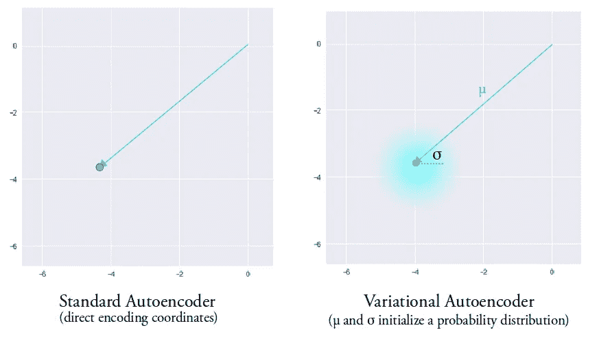
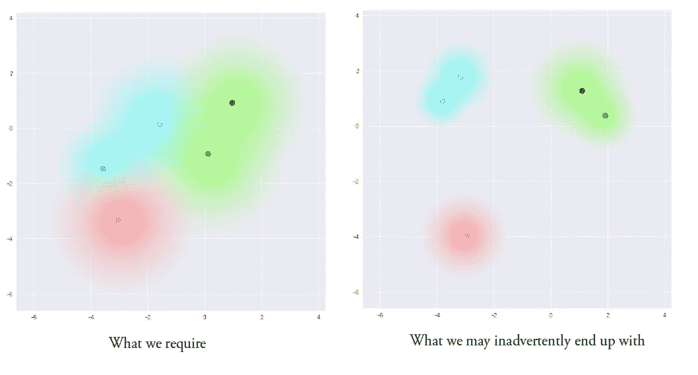
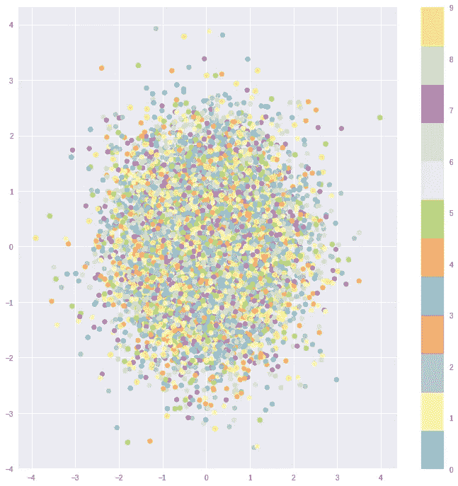
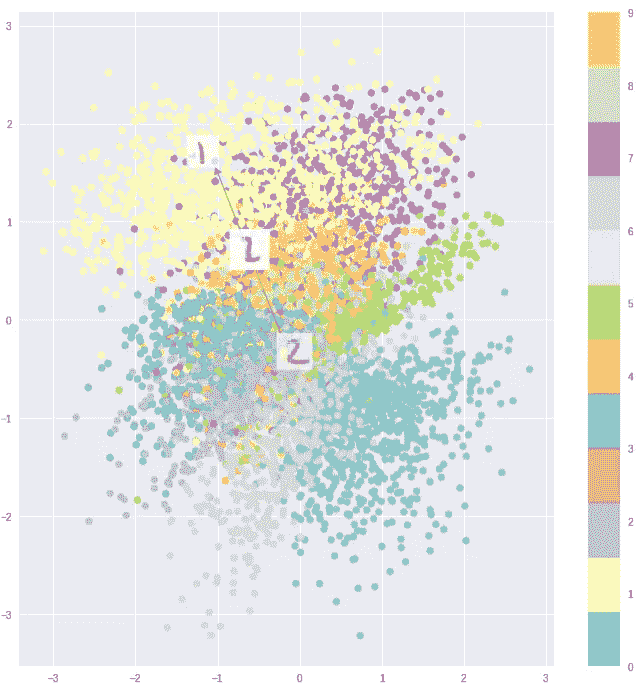
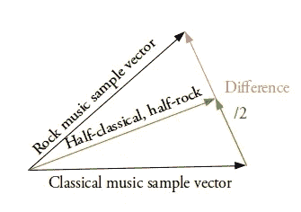
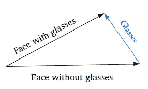
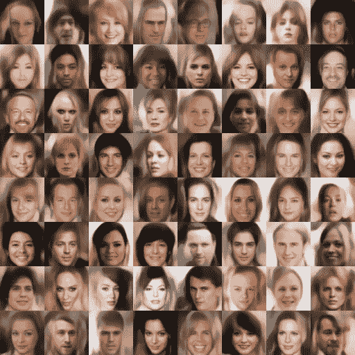

# 直观理解变型自动编码器

> 原文：<https://towardsdatascience.com/intuitively-understanding-variational-autoencoders-1bfe67eb5daf?source=collection_archive---------0----------------------->

A Standard Variational Autoencoder

## 以及为什么它们在创造你自己的文本、艺术甚至音乐时如此有用

与神经网络作为回归器或分类器的更标准用途相反，变分自动编码器(VAEs)是强大的**生成**模型，现在具有从生成假人脸到制作纯合成音乐的各种应用。

这篇文章将探讨什么是 VAE，为什么它如此有效背后的直觉，以及它作为各种媒体的强大生成工具的用途。

# 但首先，为什么是维斯？

Exploring a specific variation of input data[[1]](https://colab.research.google.com/notebook#fileId=/v2/external/notebooks/latent_constraints/latentconstraints.ipynb)

当使用创成式模型时，您可以简单地生成一个随机的、新的输出，它看起来类似于训练数据，并且您当然也可以使用 VAEs 来实现这一点。但是更多的时候，你想要改变，或者探索你已经拥有的的*数据的变化，而且不仅仅是以随机的方式，而是以期望的、*特定的*方向。这就是 VAEs 比目前可用的任何其他方法更好的地方。*

# 解码标准自动编码器

自动编码器网络实际上是一对两个相连的网络，一个编码器和一个解码器。编码器网络接收输入，并将其转换为更小、更密集的表示形式，解码器网络可以使用该表示形式将其转换回原始输入。

如果你不熟悉编码器网络，但熟悉卷积神经网络(CNN)，那么你可能已经知道编码器是做什么的了。

The encoder inside of a CNN[[a]](https://commons.wikimedia.org/wiki/File:Typical_cnn.png)

任何 CNN 的卷积层接收大图像(例如大小为 299x299x3 的秩 3 张量)，并将其转换为更紧凑、更密集的表示(例如大小为 1000 的秩 1 张量)。然后，全连接分类器网络使用这种密集表示对图像进行分类。

编码器与此类似，它只是一个网络，接收输入并产生一个更小的表示(编码)(T7)，其中包含足够的信息供网络的下一部分将其处理成所需的输出格式。典型地，编码器与网络的其他部分一起被训练，通过反向传播被优化，以产生对于手边的任务特别有用的编码。在 CNN 中，产生的 1000 维编码对分类特别有用。

自动编码器采纳了这一想法，并通过让编码器生成对*重建自己的输入特别有用的编码，稍微颠倒了一下。*

A standard Autoencoder

整个网络通常作为一个整体来训练。损失函数通常是输出和输入之间的均方误差或交叉熵，称为*重构损失*，其惩罚网络产生不同于输入的输出。

由于编码(只是中间隐藏层的输出)的单元远少于输入，编码器必须选择丢弃信息。编码器学习在有限的编码中尽可能多地保留相关信息，并智能地丢弃不相关的部分。解码器学习采用编码并正确地将其重构为完整的图像。它们共同构成了一个自动编码器。

## 标准自动编码器的问题是

标准的自动编码器学会生成紧凑的表示并很好地重建它们的输入，但是除了像去噪自动编码器这样的一些应用之外，它们相当有限。

对于生成来说，自动编码器的基本问题是它们将输入转换到的潜在空间以及它们的编码向量所在的位置可能不连续，或者不允许简单的插值。

Optimizing purely for reconstruction loss

例如，在 MNIST 数据集上训练自动编码器，并可视化来自 2D 潜在空间的编码，揭示了不同簇的形成。这是有意义的，因为每种图像类型的不同编码使解码器更容易解码它们。如果你只是*复制*相同的图像，这没问题。

但是当你在建立一个*生成型*模型的时候，你**不想**准备*复制*你放进去的同一个形象。您希望从潜在空间中随机取样，或者从连续的潜在空间中生成输入图像的变化。

如果空间具有不连续性(例如，簇之间的间隙),并且您从那里采样/生成变化，解码器将简单地生成不切实际的输出，因为解码器不知道如何处理潜在空间的该区域。在训练期间，它*从未看到*来自潜在空间区域的编码向量。

# 可变自动编码器

变分自动编码器(vae)有一个从根本上区别于普通自动编码器的独特属性，正是这个属性使它们对生成式建模如此有用:它们的潜在空间通过设计*、*是连续的，允许简单的随机采样和插值。

它通过做一些乍一看似乎相当令人惊讶的事情来实现这一点:让它的编码器不输出大小为 *n、*的编码向量，而是输出大小为 n 的两个向量:一个均值向量**、μ** 和另一个标准差向量**、σ** 。

Variational Autoencoder

它们形成长度为 n 的随机变量向量的参数，其中第 *i* 个元素为 **μ** 和 **σ** 是第 *i* 个随机变量的平均值和标准偏差， **X** i，我们从中进行采样，以获得采样编码，并将其向前传递给解码器:

Stochastically generating encoding vectors

这种随机生成意味着，即使对于相同的输入，虽然平均值和标准偏差保持不变，但实际的编码在每次通过时都会有所不同，这仅仅是因为采样。

直观地说，均值向量控制着输入的编码应该集中在哪里，而标准差控制着“区域”，即编码可以偏离均值多少。由于编码是从“圆”(分布)内的任何地方随机生成的，解码器了解到不仅潜在空间中的单个点引用该类的样本，所有附近的点也引用相同的样本。这允许解码器不仅解码潜在空间中的单个特定编码(使可解码潜在空间不连续)，而且还解码稍微变化的编码，因为解码器在训练期间暴露于相同输入的编码的变化范围。在代码中:

code for sampling **mean** and **stddev**

现在，通过改变一个样本的编码，该模型暴露于一定程度的局部变化，从而在局部尺度上，即对于相似的样本，产生平滑的潜在空间。理想情况下，我们希望不太相似的样本之间有重叠，以便在类之间插入*。然而，由于对于向量**μ**和 **σ** 可以取什么值*没有限制* ，编码器可以学习为不同的类生成非常不同的 **μ** ，将它们分簇，并最小化 **σ** ，确保编码本身对于同一样本不会有太大变化(也就是说，解码器的不确定性更小)。这允许解码器有效地重构*训练*数据。*****

****

**我们理想中想要的是编码，*所有的*尽可能地彼此接近，同时仍然是不同的，允许平滑的插值，并且能够构造*新的*样本。**

**为了迫使这一点，我们将 kull back-lei bler 散度(KL 散度[【2】](https://www.countbayesie.com/blog/2017/5/9/kullback-leibler-divergence-explained))引入损失函数。两个概率分布之间的 KL 偏离简单地测量了它们彼此偏离的程度。这里最小化 KL 散度意味着优化概率分布参数 **(μ** 和 **σ)** 以非常类似于目标分布。**

****

**对于 VAEs，KL 损失相当于 **X** 中的*分量*X*I*~*N*(μ*I*，σ *i* )与标准常态[【3】](https://stats.stackexchange.com/questions/7440/kl-divergence-between-two-univariate-gaussians)之间所有 KL 偏差的*之和*。当μ *i* = 0，σ *i* = 1 时最小。**

**直观上，这种损失促使编码器将所有编码(对于所有类型的输入，例如所有 MNIST 数)均匀地分布在潜在空间的中心周围。如果它试图通过将它们聚集到远离原点的特定区域来“作弊”，它将受到惩罚。**

**现在，使用纯 KL 损失导致潜在空间，导致编码密集地随机放置在潜在空间的中心附近，很少考虑附近编码之间的相似性。解码器发现不可能从这个空间中解码出任何有意义的东西，原因很简单，因为这里真的没有任何意义。**

****

**Optimizing using pure KL divergence loss**

**然而，一起优化这两者导致潜在空间的生成，该潜在空间通过聚类在*局部尺度*上保持附近编码的相似性，然而在*全局上，*在潜在空间原点附近非常密集地打包(将轴与原始轴进行比较)。**

****

**Optimizing using both reconstruction loss and KL divergence loss**

**直观上，这是重建损失的*群集形成*性质和 KL 损失的*密集打包*性质达到的平衡，形成解码器可以解码的不同群集。这很棒，因为这意味着当随机生成时，如果你从编码向量的相同先验分布中采样一个向量， *N* ( **0** ， **I** )，解码器将成功解码它。如果你在插值，簇之间没有突然的间隙，而是解码器可以理解的特征的平滑混合。**

**The final loss function**

# **向量运算**

**那么我们实际上是如何产生我们所说的平滑插值的呢？从这里开始，它是潜在空间中简单的向量运算。**

****

**Interpolating between samples**

**例如，如果您希望在两个样本之间的中途生成一个新样本，只需找到它们的均值( **μ** )向量之间的差，并将该差的一半加到原始样本上，然后简单解码即可。**

****

**Adding new features to samples**

**生成*特定特征*怎么样，比如在一张脸上生成眼镜？找到两个样本，一个带眼镜，一个不带，从编码器获得它们的编码向量，并保存差异。将这个新的“眼镜”向量添加到任何其他人脸图像中，并对其进行解码。**

# **从这里去哪里？**

**在变分自动编码器的基础上还可以做很多进一步的改进。事实上，你可以用卷积反卷积编码器-解码器对来取代标准的全连接密集编码器-解码器，比如这个项目[【4】](https://github.com/yzwxx/vae-celebA)，来制作出色的合成人脸照片。**

****

**Generating celebrity-lookalike photos**

**您甚至可以使用 LSTM 编码器-解码器对(使用 seq2seq 架构的修改版本)来训练自动编码器处理*顺序的、离散的*数据(使用 GANs 等方法是不可能的)，以产生合成文本，甚至在 MIDI 样本之间进行插值，如 Google Brain 的 Magenta 的 music vae[【5】](https://nips2017creativity.github.io/doc/Hierarchical_Variational_Autoencoders_for_Music.pdf):**

**vae 可以处理各种不同类型的数据，顺序的或非顺序的，连续的或离散的，甚至有标签的或完全无标签的，这使它们成为非常强大的生成工具。我希望你现在理解了 VAEs 是如何工作的，并且你也能够在你自己的生产努力中使用它们。**

**如果你觉得这篇文章有用，并且相信其他人也会觉得有用，请留下你的掌声！如果你想保持联系，你可以在 Twitter [*这里*](https://twitter.com/irhumshafkat) *找到我。***

****注意事项****

**[1] [潜在约束:无条件生成模型的条件生成](https://colab.research.google.com/notebook#fileId=/v2/external/notebooks/latent_constraints/latentconstraints.ipynb)**

**[2] [库尔贝克-莱布勒分歧解释](https://www.countbayesie.com/blog/2017/5/9/kullback-leibler-divergence-explained)**

**[3] [两个单变量高斯函数之间的 KL 散度](https://stats.stackexchange.com/questions/7440/kl-divergence-between-two-univariate-gaussians)**

**[【4】深度特征一致变分自动编码器](https://github.com/yzwxx/vae-celebA)**

**[5] [分级变分音乐自动编码器](https://nips2017creativity.github.io/doc/Hierarchical_Variational_Autoencoders_for_Music.pdf)**

**延伸阅读:**

*   **[变型自动编码器](https://www.jeremyjordan.me/variational-autoencoders/)**
*   **[教程—什么是变分自动编码器？](https://jaan.io/what-is-variational-autoencoder-vae-tutorial/)**
*   **[变型自动编码器教程](https://arxiv.org/pdf/1606.05908.pdf)**

**实施:**

*   **[在 Keras 中构建自动编码器](https://blog.keras.io/building-autoencoders-in-keras.html)**
*   **[Keras 中的卷积反卷积自动编码器](https://github.com/keras-team/keras/blob/master/examples/variational_autoencoder_deconv.py)**