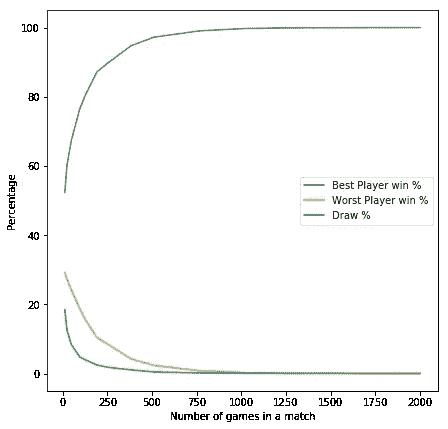
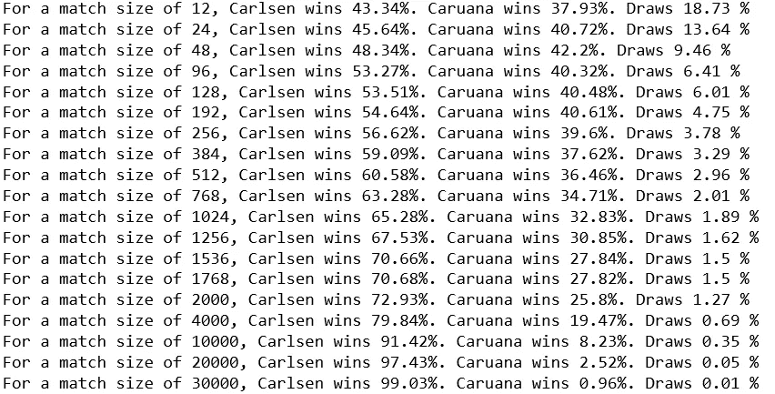

# 世界象棋锦标赛决赛方差的研究

> 原文：<https://towardsdatascience.com/investigating-the-variance-of-the-world-chess-championship-final-b8bb7626cc26?source=collection_archive---------12----------------------->

## 卡尔森决赛方法的统计分析

Credit: GR stocks on [unsplash](https://unsplash.com/photos/Iq9SaJezkOE)

当 FIDE 世界象棋锦标赛正在进行时，我发现了以下[问题](https://fivethirtyeight.com/features/the-riddler-just-had-to-go-and-reinvent-beer-pong/):

> 假设其中一个玩家比他的对手强，他赢了 20%的比赛，输了 15%的比赛，65%的比赛是平局。这场比赛的胜利值 1 分，每位玩家得半分，输 0 分。在 12 场比赛中，第一个得分 6.5 分的选手获胜。
> 
> 更好的选手赢得 12 场比赛的机会有多大？为了让更好的玩家有 75%的机会赢得比赛，一场比赛要进行多少场？90%的可能性？99%的可能性？

现在，比赛结束不到一个月了，所有的分析都来自于卡尔森 3-0 横扫对手的激烈的 12 场平局比赛，我发现提出的问题非常相关，因为毕竟球员们在所有 12 场常规比赛中都打成了平局。卡尔森的策略是抽长得多的常规比赛(第 1 场比赛 7 小时，第 12 场比赛 3 小时)，以便在短得多的决胜局中压倒他的对手，而众所周知他在决胜局中是无与伦比的，这是否是比赢得常规比赛更安全的选择？

在本文中，我打算实现一个简单的 Python 脚本，试图模拟在什么情况下(每场比赛的游戏数)最好的玩家几乎总是会赢。

我提议用我喜欢的东西来解决这个问题:**取样。**

我将假设两个不知疲倦的代理人 A 和 B 将相互进行 **10，000 次** **n 场** **比赛**，n 是每场比赛的比赛数。按照标准的国际象棋规则，赢一场得 1 分，平一场得 0.5 分，输一场得 0 分。

如果一个玩家达到(n/2)+0.5 点，他就赢得了一场 n 局比赛。例如，在 12 场比赛中，如果一名球员达到 6.5 分，他就赢了。独立地重复 10，000 次，你将得到代理 A 获胜的匹配百分比和代理 B 获胜的匹配百分比。

函数 **sample(n)，**返回 n 场比赛的结果，其中 1 表示代理 A 赢了，-1 表示代理 B 赢了，0 表示那场比赛平局。我们假设代理人 A 是更好的代理人，它赢了 20%的游戏，输了 15%的游戏给 B，抽取剩下的 65%。

以下脚本尝试了不同的比赛规模(n ),并打印了较好的玩家赢的比赛的百分比、最差的玩家赢的比赛的百分比以及和棋的百分比。

输出:

Percentage of times the better agent wins, loses and draws.

正如我们所看到的，为了让更好的代理有 99%的机会参加比赛，需要一场比赛包含大约 768 场比赛。要有 75%的胜算，只需要少于 96 场比赛。

在目前的 12 场比赛中，即使胜算很大，特工 A 也只赢了大约 51.66%的比赛。为什么？嗯，因为类似于卡尔森和卡鲁阿纳之间的决赛，拥有这种匹配技能的球员/经纪人往往会抽很多，不管是不是故意的。

为了评估卡尔森的策略，我们需要知道比赛的规模，以确保卡尔森和卡鲁阿纳之间更好的球员获胜。

在国际象棋中，一个玩家的相对技能可以通过他们的“Elo 等级”来评估。卡尔森在比赛前的 Elo 是 2835，卡鲁阿纳的 Elo 是 2832。根据他们的 Elo 得分，并根据这个[网站](https://wismuth.com/elo/calculator.html#rating1=2835&rating2=2832&best_of=12)，卡尔森有 19.2812559%的机会赢得一场比赛。卡鲁阿纳有 18.4434925%的几率赢一局，有 62.2752516%的几率平一局。

通过更新**示例(n)** 函数来反映这些值，并再次运行脚本，我们得到以下输出:

这将需要由大约 10，000 场比赛组成的比赛，以便给卡尔森 90%的获胜机会。因此，我相信他试图扳平比赛以进入短得多的决胜局(众所周知他是最致命的)的策略是一个好策略，尤其是因为它奏效了！

承认

[标斜](https://medium.com/u/42c0ce1ed0d?source=post_page-----b8bb7626cc26--------------------------------)为发表前阅读文章。