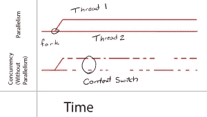
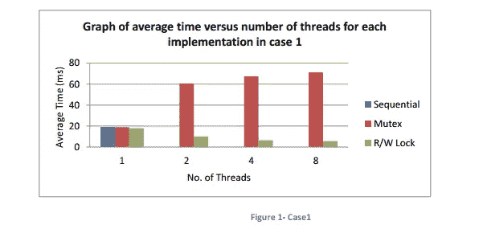
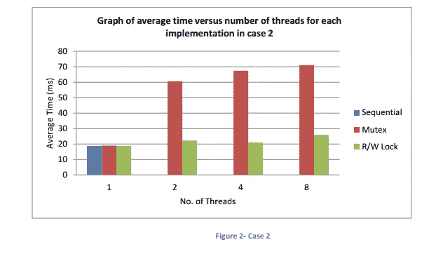

# 并发真的能提高性能吗？

> 原文：<https://towardsdatascience.com/is-concurrency-really-increases-the-performance-8cd06dd762f6?source=collection_archive---------4----------------------->

如果您想提高程序的性能，一个可能的解决方案是添加并发编程技术。基本上，在并发执行中，同一个程序的多个线程同时执行。这类似于添加更多的工人来完成一项工作。

“并行”是另一个经常与并发性一起使用的词。并行是并发的一个子集。并发性是指试图同时做多件事情，而并行性是指同时做多件事情。

即使在单核处理器上，也可以通过在线程间切换来实现并发。在某个时刻，一个线程被执行。然而，通过在线程间切换并作为一个整体前进，许多事情正在发生。

并行发生在多核处理器上。由于有多个内核，因此一次可以执行多个线程。在单核处理器上，实际并行是不可能的。然而，它试图通过在线程之间快速切换来归档并行性。

并行解决一个问题似乎会大大减少计算时间。然而，任何事情都是有代价的。尽管我们认为一次做很多事情会加快速度，但由于线程之间的通信以及确保它们不会崩溃或产生错误的输出，这是有成本的。并发编程必须非常小心，它会导致不可避免的编程开销。

1.  初始化时间
2.  时间最终确定
3.  外部库导致的开销
4.  线程间通信的开销

通常，外部库(例如 pThreads，OpenMP)将在编写并发程序时使用。加载这些库会有开销。此外，将使用并发编程构建块，如信号量、互斥体、锁，它们将花费初始化和最终确定的时间。

其中最大的开销是由线程间的相互通信引起的。在并行设计中，产生错误结果的可能性很高，并且需要处理互斥，以避免死锁或饥饿场景。

为了满足上述所有条件，需要大量的同步和信令，这将增加计算时间。这些开销是不可避免的，因此要求设计程序时尽可能减少开销。

下面的例子展示了与串行执行相比，使用不同机制的并发编程的强大功能。这里使用一个链表来执行插入、删除和成员操作。测量执行时间来比较性能。

在包含不同数量的插入、删除和成员操作的 LinkedList 上执行 1000 次操作。所有的任务都是串行和并行执行的。并行执行再次使用互斥锁和锁来实现。

下面是使用 pThreads 库用 C 语言实现该程序的代码段。

**串行程序**

**使用互斥体的并行程序**

**使用锁的并行程序**

**以下是观察到的结果**

代码被执行并采集了 100 个样本，以确保结果在 95%的置信区间内。

*案例 1:*

*   插入操作:5
*   删除操作:5
*   会员运营:990

*案例二:*

*   插入操作:50
*   删除操作:50
*   会员运营:900 家

*案例三:*

*   插入操作:250
*   删除操作:250
*   会员运营:500 人

如图 1 和 2 所示，当使用一个线程时，使用互斥和读/写锁比顺序编程有更长的处理时间。出现这种情况的主要原因是，当互斥体和读/写锁操作执行时，需要额外的时间来获取和释放锁或互斥体。但是在顺序编程中，不存在获取或释放锁或互斥体的情况。然而，在图 3 中，对于一个线程，顺序编程方法和并行编程方法存在滑动偏差。可能的原因是操作中分数的变化。

根据图 1 和图 2，对于任何数量的线程，使用读/写锁都比使用互斥锁表现出明显更高的性能。这是因为读/写锁允许执行读操作的线程同时访问临界区。但是在互斥的情况下，它只允许一个线程访问临界区一次，而不考虑操作类型。这种机制降低了互斥锁的速度，而不是读/写锁。

与情况 1、2、3 相比，执行读/写操作所需的时间增加了。出现这种情况的可能原因是，在案例 3 中，成员操作正在减少。因此，并发读取操作减少，而插入和删除操作增加，这导致总处理时间增加。

在图 1 中，在有多个线程情况下，与互斥和顺序方法相比，执行读/写操作所需的时间大大减少了。这是因为在这种情况下，有更多的读操作会导致读/写锁中的并发读。这展示了实际的并行性，并显示了读/写执行的低平均执行时间。

**结论**

根据结果，并行执行明显地显示出显著的改进。但是这里我们需要考虑一些事情。

不应该使用并发方法来加速小型计算问题。原因是初始化和完成库、互斥、信号量等所需的时间对输出有很大影响。

另一方面，对于大型计算问题，即使有额外的开销，整体性能也会提高。

另一个重要的设计决策是选择正确的构建模块(信号量、监视器、互斥体)来实现程序。即使在上面的例子中，我们也可以看到锁的性能比互斥锁好。为此，我们应该对基础知识有适当的了解，以便正确应用。

使用并发编程可以获得相当大的加速。天气预报系统、视频渲染程序、模拟程序都利用了并发编程的巨大优势。但是，需要了解适用性以及正确的设计和实现才能享受性能