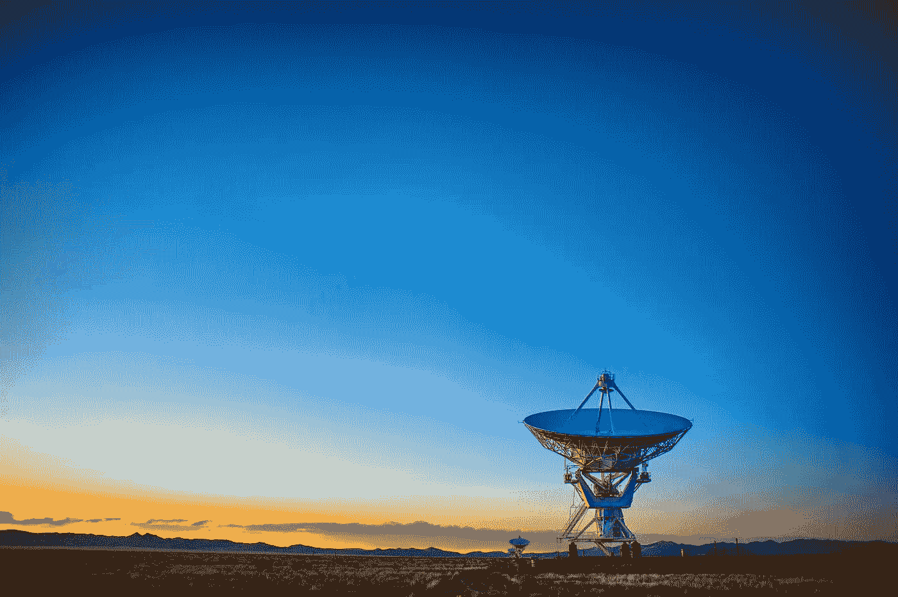

# 数据科学是真正的科学吗？

> 原文：<https://towardsdatascience.com/is-data-science-a-real-science-2920bb2529aa?source=collection_archive---------0----------------------->

## 当我听到关于数据科学不科学的批评时，我想澄清什么是科学，并展示数据科学家如何回答这些关于他们领域的常见批评。

Photo by [Donald Giannatti](https://unsplash.com/photos/Wj1D-qiOseE?utm_source=unsplash&utm_medium=referral&utm_content=creditCopyText)

## 什么是科学？

科学是寻求对世界的合理解释的过程。正如大卫·多伊奇在他的书《T2:无限的开始》中指出的，一个好的解释是清晰、精确且难以改变的。

## 什么是数据科学？

数据科学是一个新兴的科学领域，致力于从数据中提取意义并增进理解。它代表了从统计、数据分析、BI 等其他分析领域的发展。

今天，由于互联网提供的数据爆炸，更先进的技术提高了计算能力，计算机科学和机器学习算法的发展，数据科学应运而生。

Jeff Hammerbacher 和 DJ Patil 首先使用数据科学家这个术语来描述一个新的职位。他们寻找拥有一套新的关键技能的人，如数学、统计学、计算机科学、机器学习和商业知识。

## 为什么数据科学可能永远不是“真正的”科学？

批评:*“大数据分析主要是:垃圾进，垃圾出……那么，你如何认证你的数据和结果的质量呢？”*。的确，我们的海量数据可能充满了错误和差错。但是，这种批评也适用于中小型数据集。重要的是我们如何收集数据，以及如何处理数据。在这个过程中，我们会犯一些错误，但是对于大多数错误，数据科学可以处理数据质量的问题；像其他分析领域一样。

批评:“*数据科学可以在大量数据中发现任何东西。通过子集化数据和构建新的功能，他们可以证明任何事情。正如罗纳德·h·科斯(Ronald H. Coase)所说:“如果你对数据折磨的时间足够长，它就会招供*。另一个大问题是可以克服的。当然，数据科学家必须小心不要太快下结论。再一次，就像其他任何试图寻求真相的人一样。在数据科学中，我们有几十种严谨的方法来处理数据。例如，交叉验证和正则化有助于避免过度拟合一个人的预测。此外，我们可以发布我们的代码，其他科学家可以从头到尾准确地跟踪我们对数据做了什么。

批评:“*数据科学家只能建立观察性研究。他们可能会发现一些相关性，但不能说任何潜在的原因。*“
随机样本和对照组的对照实验更好地评估因果关系。但在很多情况下，他们是昂贵的，不道德的，甚至是不可能领导的。为了正确地研究不同的现象，科学需要两者:控制实验和观察研究。

批评:“*对数据科学来说还行…但是，业务数据科学永远不会是真正的科学。科学在商业中是不可能的，因为公司追求的是金钱，而不是科学真理。* "
即使在这里进行区分是有意义的，在企业工作的数据科学家也可以被视为科学的，就像许多其他经常在研发部门工作的研究人员一样。事实上，对现实和真相的承诺可以为企业带来持久的竞争优势，科学发现可以带来巨大的好处。

即使这些批评需要被任何试图使用数据获得知识的数据科学家考虑在内，他们也不会谴责他们是失败的科学家。此外，这些批评往往没有抓住要点，因为它们来自那些不太了解我们处理大量数据的方法的人。

## 能否一下子判断出整个数据科学领域？

上述批评的主要错误在于，在没有真正理解的情况下，立刻对整个数据科学领域做出判断。这在任何科学领域都行不通:

有的医生根本不懂统计学；这是否意味着医学界不科学？而我们说医学注定不科学吗？

2015 年，许多[失败的实验复制](http://www.nature.com/news/over-half-of-psychology-studies-fail-reproducibility-test-1.18248)严重伤害了心理学。我们是否得出结论，所有的心理学家都不是科学的，而且永远不会是科学的？

我们不能马上对整个科学领域做出判断，因为他们在更科学的领域中包括了许多不科学的人。

一些数据科学家是受经济利益驱使的计算机极客。其他一些人努力确认任何先前的直觉。数据科学不得不处理这个问题，并在一些地方背负了坏名声。

但是，数据科学领域在生物学、金融、市场营销和经济学方面也取得了许多成功。此外，更多的发现将来自我们利用机器学习算法或计算统计学来理解大量数据的新方法。

## 数据科学家是真正的科学家吗？

> “科学是一种思维方式，而不仅仅是一种知识体系。”——卡尔·萨根。

为了找到关于世界的更好的解释，科学家们为纠正他们以前知识中的错误创造了空间。他们寻找清晰、合理且可检验的解释。

数据科学家需要坚持这些科学原则，还需要接受科学价值观，如开放思想、批评和尊重他人的理性意见。

所以下次你想知道某个领域是否是科学的，深入到个人层面，看看那个人有多尊重科学的认识论、价值观和方法。例如，你可以问，她想达到什么目的？她是如何质疑自己的知识的？她信仰的主要来源是什么？