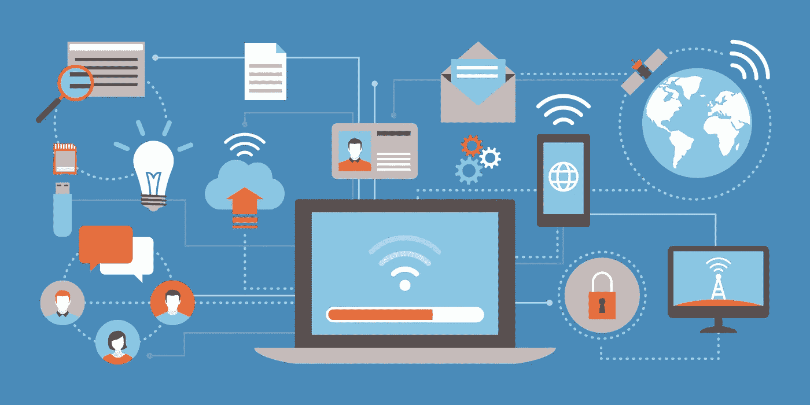

# 现在是数据民主化的时候了吗？

> 原文：<https://towardsdatascience.com/is-it-high-time-for-data-democratization-2e4e16a5356e?source=collection_archive---------12----------------------->

获得竞争优势的方法之一是让数据变得越来越容易访问。这与数据分析师和科学家是唯一有能力理解公司数据的人相反。归根结底，这些专家并不便宜。

正如所料，数据民主化有利也有弊。这些将在下面讨论。

## 反对数据民主化的论点

很长一段时间以来，许多人对数据管理持保守观点，认为数据的严格分析应该留给数字分析师和数据科学家。严格的治理也将适用于数据的收集、解释和传播。通过这种方式，负责处理数据的数据科学小组将承担责任。

人们有各种各样的理由相信获取信息应该受到限制。例如，他们可能认为这将确保更严格地控制潜在的风险数据，如档案、机密记录和给公司带来明显声誉或竞争优势的信息。此外，由于数据专家使用先进的建模技术和多个数据集来分析问题，因此人们认为限制可以确保在提出建议时进行更严格的审查。

数据民主化允许访问多个数据源和数据消费群体，从而呈现多个版本的“真相”，这是一个可能导致信心丧失和建议减少的因素。公司内不同团队的个人访问数据也会导致昂贵的冗余功能。隐私问题也出现了，因为较少的治理可能会导致侵犯隐私以及监管控制。

## 数据民主化的论据

然而，在最近的过去，公司已经意识到对数据采取协作和整体方法的重要性。这意味着，组织中的每个人都应该对数据有足够的了解，以便做出深思熟虑的决策。此外，数据民主化的支持者认为，责任在于数据的用户。

数据管理和访问方面的进步(如数据民主化)提高了用户管理、转换和解释数据的能力。那些有权访问所述数据的人也有机会添加他们的输入，为不同的分析和商业智能平台提供消费和分析。此外，向不同工作团队中的个人分发信息促进了创业精神，对中小企业尤其有利，因为它们比大企业更灵活，受管制更少。

民主化还可以帮助中小企业中精通数据的利益相关者减少对集中式分析团队的依赖。通过访问数据，中小型企业还可以发现他们可能错过的潜在盈利业务机会。此外，通过利用数据有效地消除猜测，他们可以降低获取客户的成本，并做出基于事实的投资决策。

# 有助于推动数据民主化的创新

为了让非专业人士更好地理解数据，技术上已经有了许多进步。这些创新也有助于提高大数据的可管理性。这里，我们讨论的是云存储、数据联合软件和数据可视化软件。

云存储是帮助适应数据民主化的工具之一。有了一个可在线访问的中心位置，所有授权用户都可以使用存储在那里的数据做出明智的决策。尽管存在与云服务相关的安全风险，但可以通过加密协议将其降至最低。

数据联邦软件也极大地促进了数据民主化。该软件有助于将不同来源的数据组合起来，并将其存储在虚拟数据库中。然后，这些数据可以用于商业智能分析和其他分析。不是在虚拟数据库中创建数据，而是有关于数据及其位置的元数据。

不了解技术细节的个人可以使用数据可视化软件来检索和操作数据。它将文本和数字数据转换成表格、图形和可视化图表。例如，企业可以使用该软件来展示访问者的活动。

# 总结

组织内的决策直接受到手头数据的影响。多年来，让业务分析师、营销人员和高管以及其他员工通过数据专家已经成为一种常态。事实上，有些人认为什么都不应该改变，而其他人认为是时候提高数据的可访问性了。在所有推动数据民主化的软件解决方案中，后者极有可能胜出。