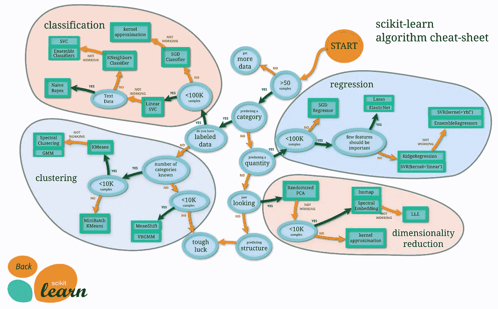

# 食品配送时间预测介绍

> 原文：<https://towardsdatascience.com/is-the-food-here-yet-f13a7bb0cd20?source=collection_archive---------1----------------------->

## 提示:不仅仅是谷歌地图


Prepare yourself for food. — Photo by [Dan Gold](https://unsplash.com/@danielcgold?utm_source=unsplash&utm_medium=referral&utm_content=creditCopyText) on [Unsplash](https://unsplash.com/s/photos/food?utm_source=unsplash&utm_medium=referral&utm_content=creditCopyText)

配送时间预测长期以来一直是城市物流的一部分，但最近精确化对于 Deliveroo、Foodpanda 和 Uber Eats 等按需配送食品的服务变得非常重要。

这些服务和类似的服务必须在收到订单后 30 分钟内送达，以安抚用户。在这些情况下，+/- 5 分钟可能会产生很大的差异，因此，初始预测的高度准确性以及任何延迟的有效沟通对于客户满意度非常重要。


It’s a real problem. Credit: [@bustle](https://twitter.com/bustle).

在本文中，我将讨论我为一家食品配送初创公司构建(真实世界)配送时间预测模型的经验，以及它是如何给出比我们训练有素的运营团队更好的预测的。

本文将涉及机器学习的技术主题，同时重点关注创建功能良好的预测模型所需的业务知识。为了你的阅读乐趣，也将包括进一步阅读的外部资源的链接。

**我们的路线图:**

*   📝问题陈述
*   🔢数据
*   ⚒️工具包
*   📈模型结构
*   🤔改进估计

# 问题陈述

首先，让我们制定一个我们可以使用的问题陈述。这将有助于我们专注于目标。

> 我们希望建立一个模型，它将把有关食品交付的数据作为输入，然后输出所需的提货时间，以传达给司机。

其他一些需要注意的事项:

*   交货量很大，可以假定需要汽车。
*   供应商(或多个供应商)的范围从餐馆到餐饮供应商，可以有非常不同的特点。
*   可以假设司机在指定的接车时间准时到达供应商处。在现实中，这并不总是正确的，但是如果有足够数量的驱动程序，这可以保持在最小的数量。
*   食物不应该送得太晚，因为顾客会等待和生气，也不应该送得太早，因为在顾客准备吃之前，食物必须放在外面。


Late deliveries = melted ice cream; every child and sugar-loving colleague’s worst nightmare. Photo credit [The Food Passionates/Corbis](https://www.cnet.com/news/slower-melting-ice-cream-made-possible-by-science/).

# 数据

作为我们模型的输入，我们有三类典型的此类问题的数据:

*   **点餐:**人们在点什么？他们向哪个供应商订购？什么时候送货？
*   **顾客:**谁在点菜？它们位于哪里？
*   **交付结果:**对于之前的交付，我们的表现如何？每一步花了多长时间？

交货可用数据的一个例子是:

```
Delivery Team    : Deliveries 'R' Us
Order_ID         : 12345
Agent_Name       : Bob Driver
Supplier         : Delicious Donuts
Customer         : Big Corporation Inc.
Pickup_Address   : Shop 1, Busy Street, 23456, Hong Kong
Delivery_Address : Level 9, Skyscraper, 34567, Hong Kong
Delivery_Time    : 29/05/2016 08:00:00
Order_Size       : $500
```

由于我们有大量的文本，我们需要首先处理数据，使其成为机器可用的格式。

可以使用正则表达式处理这些地址，以获得更多结构化信息。重点是:楼层、楼栋、邮编、地区、国家。

经过上述处理后，可以将建筑物、邮政编码、区域和邮政编码与其他变量组合起来进行一次热编码。一个热编码将为每个可能的文本创建许多二进制变量。这些数字变量可以输入到我们的模型中。你可以在这里阅读更多关于一次热编码[的介绍。](https://machinelearningmastery.com/why-one-hot-encode-data-in-machine-learning/)

## 培养

为了训练模型，我们将使用以前交货的数据，这包括预测交货时间和实际交货时间(我们练习的目标变量)。出于本文的目的，我们将使用大约 1000 个数据点。

# 工具包

在深入研究之前，我们应该考虑什么模型最适合解决我们所面临的这类问题。Scikit-Learn 文档中的下图给出了一个决定应该使用哪种算法的好方法。



Who said Machine Learning is a tough discipline? Credit: [Scikit-Learn Documentation](https://scikit-learn.org/stable/tutorial/machine_learning_map/index.html).

让我们看看我们对我们的问题有什么了解:

*   如前所述，我们有 1000 多个数据点用于训练。
*   模型的输出应该是一个数值。
*   由于一次性编码，我们剩下了相当多的二进制变量，这意味着许多特性可能是重要的。

考虑到这一点，我们可以按照上面的图表来实现岭回归和具有线性核的 SVR。为了简单起见，我们将只使用岭回归，并添加一个随机森林回归器，以查看它对数据的不同表现。

如果您对更多的背景感兴趣，您可以阅读 Scikit-Learn 文档中相应页面上的算法:[岭回归](https://scikit-learn.org/stable/modules/generated/sklearn.linear_model.Ridge.html)、 [SVR(支持向量回归)](https://scikit-learn.org/stable/modules/generated/sklearn.svm.SVR.html)和[随机森林回归](https://scikit-learn.org/stable/modules/generated/sklearn.ensemble.RandomForestRegressor.html)。

## 性能指标

我们还应该注意我们将用来判断模型有效性的指标。

我们可以用平均绝对误差( [MAE](https://en.wikipedia.org/wiki/Mean_absolute_error) )来快速了解我们的性能。这告诉我们我们的交付时间估计和实际交付时间之间的平均差异。

更进一步，我们可以定义另外两个特定于领域的指标:

*   基本准时(< 5 mins late)
*   OK, we’re a *少*晚(<晚 10 分钟)

这两个指标告诉我们让用户不高兴的频率。如果我们迟到 15 分钟或 25 分钟，对用户来说并不重要，我们只是**真的迟到了**。MAE 没有意识到这一点，会认为一个比另一个差，但就业务而言，这实际上是一回事，我们的模型理解这一点很重要。

*注意:我们实际上将使用这些指标的倒数(即延迟 5 分钟以上的交付)，因为它们更容易使用。*

因此，快速回顾一下:我们知道我们需要做什么，我们知道我们必须用什么数据来做这件事，我们也知道我们将要做的方式，所以让我们开始做吧！

# 模型结构


Thankfully data science doesn’t require so many hands. Photo credit: [Rand Faith](https://unsplash.com/photos/ymf4_9Y9S_A).

让我们想一想送餐都涉及哪些内容。我们可以把它分成三个主要部分:

1.  从供应商那里拿食物。
2.  从供应商到客户。
3.  把食物交给顾客。

我们可以预测每个组件所需的时间，然后将这些时间加在一起，得到最终的交付时间。

```
Delivery Time = Pick-up Time + Point-to-Point Time + Drop-off Time
```

或者，我们可以训练一个模型来预测整个交付时间。我们应该打破这个的原因是创造*专业*模型，它将比一个通用模型有更好的能力。如果我们用人来代替模型，这就说得通了。在你的业务开发团队中，你会有一个非常了解供应商以及他们可能需要多长时间交货的人。在你的客户服务团队中，你会有一个非常了解每个客户的人，他可以根据他们的位置和建筑来预测送货可能需要多长时间。我们在构建我们的流程时考虑到了这一点。

现在我们有了三个阶段，让我们深入其中并构建我们的模型。

## 供应商提货

当司机到达一个目的地时，他被要求找到一个停车场，拿起食物并回到车上。让我们探讨一下在这个过程中可能出现的潜在并发症。

*   **没有公园:**对于位于市中心的餐馆来说，与位于居民区的餐馆相比，这要困难得多。为了获取这些信息，我们可以使用邮政编码或纬度/经度信息。我发现邮政编码特别有价值，因为它们的特殊结构捕获了高级通用信息。
*   **难以进入:**餐馆往往很容易进入，因为它们依赖于此来为顾客服务，但餐饮服务提供商可能位于工业区，而且没有明显的入口，这使得进入变得更加困难。与上面类似，我们可以在添加供应商类别时使用位置信息。
*   **食物未准备好:**由于订单量可能很大，食物未准备好的情况并不少见。为了解决这一问题，可以在取餐当天联系餐饮服务商，检查食物是否会按时准备好。对这些信息的回应将是理解我们时机的有用标志。特定供应商是否有历史记录也是有用的输入。最后，订单大小是一个很好的指标；准备少量食物时不会出什么问题，但如果是 100 人份的食物，就更有可能出问题。
*   **订单中缺少一些东西:**司机应该在到达时检查订单，在某些情况下，他们可能会发现订单中缺少一些东西。这意味着他们必须等待额外的食物准备好。同样，这可能取决于供应商以及他们提货时的繁忙程度。

对于这部分问题，我们将使用以下数据点:

```
Supplier         : Delicious Donuts
Customer         : Big Corporation Inc.
Pickup_Address   : Shop 1, Busy Street, 23456, Hong Kong
Delivery_Time    : 29/05/2016 08:00:00
Order_Size       : $500
```

执行上述处理后，可将数据输入我们的 Scikit-Learn 模型，结果如下:

```
Baseline Results:
Mean Absolute Error: 544 seconds
Greater than 5 mins late: 55%
Greater than 10 mins late: 19%

Random Forest Results:
Mean Absolute Error: 575 seconds
Greater than 5 mins late: 42%
Greater than 10 mins late: 22%

Linear Regressor Results:
Mean Absolute Error: 550 seconds
Greater than 5 mins late: 44%
Greater than 10 mins late: 17%

Ensemble Results:
Mean Absolute Error: 549 seconds
Greater than 5 mins late: 45%
Greater than 10 mins late: 17%
```

可以看出，如果我们使用平均绝对误差(MAE)的基本度量，所有模型的表现都比基线模型差。然而，如果我们看一下与食品配送业务更相关的指标，我们会发现每种模式都有其优势。

随机森林模型将延迟超过 5 分钟的订单减少了近 25%。线性回归器在减少延迟 10 分钟的订单方面做得最好，大约 10%。有趣的是，集合模型在两个指标上都做得相当好，但值得注意的是，它在三个模型中具有最小的 MAE。

当选择正确的模型时，业务目标是第一位的，它决定了我们对重要指标的选择，从而决定了正确的模型。有了这个动机，我们将坚持整体模型。

## 点对点

出于多种原因，估计目的地之间的旅行时间是一项棘手的任务；有成千上万的路线可供选择，不断变化的交通状况，道路封闭和事故；所有这些都为您创建的任何模型提供了如此多的不可预测性。

幸运的是，有一群人对这个问题进行了长时间的思考，并收集了数百万个数据点来帮助更好地了解环境。谷歌进来了。


Our friend (and potential future overlord). Credit: [Wikimedia](https://commons.wikimedia.org/wiki/File:Google_maps_logo.png).

为了预测点到点的旅行时间，我们将使用已知的上车点和下车点调用 Google Maps API。返回的结果包括考虑交通和最坏情况场景的参数，我们可以将这些参数用作模型的输入。对 API 的调用非常简单，看起来像这样:

```
gmaps = googlemaps.Client(key='MY_API_KEY')params = {'mode': 'driving',
          'alternatives': False,
          'avoid': 'tolls',
          'language': 'en',
          'units': 'metric',
          'region': country}directions_result = gmaps.directions(pick_up_location,
                                     drop_off_location,
                                     arrival_time=arrival_time,
                                     **params)
```

有了这个，我们就可以对一个已经深思熟虑过的问题得到一个高度准确的结果。重要的是不要重做工作，

> 如果你的问题已经有了足够好的解决方案，就不要多此一举了。

在实施这一模式之前，我们的组织使用公共的谷歌地图界面来预测送货时间。因此，我们的新模型在这部分旅程中的性能与基线完全相同。因此，我们不会在这里计算任何比较。

一个重要的旁注是地址的格式并不总是正确的！当查询谷歌地图时，总有可能他们会说“*嗯……我不知道*”，对此我们必须有一个答案。这是人类和机器必须如何合作的一个很好的例子。每当地址格式不正确时，操作员都有可能介入并澄清地址，甚至给客户打电话澄清信息。

这样，我们就可以继续我们模型的第三部分了。

## 顾客下车

一旦司机到达地点，他们必须找到一个公园，把食物送到正确的人那里，并得到最后的签字。这一过程中的潜在问题包括:

*   **停车场有高度限制:**这很简单，但许多送货都是在货车上进行的，在这种情况下，可能会有高度限制，阻止司机使用主入口。
*   **建筑没有停车场:**这是显而易见的。没有停车场意味着司机在送货时必须花时间开车四处寻找停车的地方。
*   大楼安全问题:大多数现代办公大楼都需要安全卡才能进入。在最好的情况下，司机可以简单地刷卡通过，但在最坏的情况下，司机可能被要求去一个单独的位置，注册一张卡，然后使用后门。
*   **高楼层或棘手位置的客户**:这听起来可能很荒谬，但有些办公楼很难通过不同楼层的不同电梯，对于较小的公司来说，它们可能隐藏在迷宫般的走廊中。

有了所有这些，邮政编码是一个很好的指标，因为它告诉我们，如果我们可以期待一个商业区或住宅区。我们还可以进一步深入地址。例如，如果我们有 40 级，很明显，交付是在一个大的塔块，可能会有一个复杂的安全程序。

对于这部分问题，我们将使用以下数据点。

```
Customer         : Big Corporation Inc.
Delivery_Address : Level 9, Skyscraper, 34567, Hong Kong
Delivery_Time    : 29/05/2016 08:00:00
Order_Size       : $500
```

在执行典型的处理和运行我们的模型之后，我们看到以下内容:

```
Baseline Results:
Mean Absolute Error: 351 seconds
Greater than 5 mins late: 35%
Greater than 10 mins late: 0%

Random Forest Results:
Mean Absolute Error: 296 seconds
Greater than 5 mins late: 15%
Greater than 10 mins late: 7%

Linear Regressor Results:
Mean Absolute Error: 300 seconds
Greater than 5 mins late: 14%
Greater than 10 mins late: 5%

Ensemble Results:
Mean Absolute Error: 293 seconds
Greater than 5 mins late: 13%
Greater than 10 mins late: 6%
```

在这里，我们可以看到 MAE 减少了 17%，比以前好得多。类似地，我们看到超过 5 分钟的订单减少了 63%。另一方面，该模型确实将延迟订单数从 0%增加到 6%。同样，我们面临着各种模式之间的权衡，这两种模式各有千秋，我们必须让我们的业务 KPI 成为决定性因素。

# 把所有的放在一起

我们现在可以用下面的公式将我们的模型结合在一起:

```
Delivery Time = Pick-up Time + Point-to-Point Time + Drop-off Time 
                + Hyperparamater
```

注意这次增加了一个超参数。我们将加入这一点，以考虑到我们在数据中看到的任何其他奇怪的影响，例如接站时间总是提前 5 分钟，以满足司机的期望。我们将设置该参数，以便在计算组合结果后最小化最终误差指标。

综上所述，我们得到了最终结果:

```
Baseline Results:
Mean Absolute Error: 1429 seconds
Greater than 5 mins late: 60%
Greater than 10 mins late: 19%

Ensemble Results:
Mean Absolute Error: 1263 seconds
Greater than 5 mins late: 41%
Greater than 10 mins late: 12%
```

因此，我们的最终模型在所有指标上都比基线模型有了显著的改进——我们做到了！


That feeling when your food finally arrives! Photo credit: [Sander Dalhuisen](https://unsplash.com/photos/nA6Xhnq2Od8).

最重要的是，我们发现延迟 10 分钟以上的订单减少了近 40%！我们能够实现这一目标，是因为我们开发了三个独立的模型，这些模型针对各自特定的业务问题进行了优化。将它们结合起来，并在最后阶段进行微调，确保我们生产出的模型达到了专业人员的水平。

# 做出更好的估计(不改进你的模型)

拥有一个更加精确的模型当然很好，但是由于收益递减法则，这也需要付出更多的努力。相反，如果我们多考虑商业案例，少考虑机器学习，就会有其他解决方案。

## 迟到和早退

你可能一开始就记得，这个模型是针对餐饮配送的，也就是说我们提前知道配送时间。避免延迟交付的一个简单方法是获取模型输出的任何值并增加它，以确保我们足够早。

这不是一个很好的解决方案，因为太早也有一个问题，食物可能会变坏或没有准备好。但是，它确实提出了一个观点，即我们应该考虑'*'和'*'提前量的分布。也许早 10 分钟比晚 5 分钟更好。到目前为止，我们还没有针对这种情况进行优化，因此我们可以重新考虑这一点并进行相应的优化。**

## **交付窗口**

**另一件要考虑的事情是模型如何呈现给用户。如果用户被告知你会在下午 2 点到达，而你没有，他们会很沮丧。如果你告诉某人你会在下午 1:45-2 点到达那里，那么你可以在下午 1:50 到达，如果你晚了一点，你还有余地。**

**将机器学习问题作为实际现实世界问题的解决方案来考虑总是很重要的——这种背景通常可以导致“改进”，否则从模型本身是不可能的。**

## **供应商反馈**

**这种模式的一个关键优势是能够有效区分供应商不同的准备时间。这告诉我们，供应商必须有非常不同的表现。**

**深入调查后发现，司机在一些供应商处花费的时间是他们的 3 倍。有了这些信息，回到商业领域，就有可能与供应商进行讨论并确定问题，从而减少在这些供应商处花费的时间，并通过减少变化来提高模型的整体性能。**

# **包扎**

**我们从预测食物配送时间的问题陈述开始。我们决定使用什么样的数据以及应该做什么样的处理。我们思考什么是解决我们特殊问题的最佳模式。然后，我们将我们的问题分解为三个部分，以构建目标模型，最后将它们组合在一起，创建一个全功能的预测模型。然而，我们并没有止步于此，我们利用我们的业务知识来提高我们模型的有效性。**

**这导致延迟 10 分钟以上的订单减少了 40%，这可以直接转化为退款节省的资金。它还有助于减轻运营团队的负担，这意味着他们可以专注于更有意义的任务，如提高供应商效率。**

**如上所述，这是可用于应用机器学习来解决业务问题的一般程序。这种方法确保在以后为额外的几个百分点的改进进行优化之前，先把基础做好。这是我成功使用过的一个方法，我希望你也能成功。**

***如果你喜欢读这篇文章，请不要忘记留下一两下掌声，或者三下……*👏👏👏🔄**

***如果你想了解为什么使用高科技(比如这篇文章)并不总是最好的解决方案，请看这里:***

**[](https://medium.com/@jyesawtellrickson/business-automation-the-easy-way-5f9bbc896bcc) [## 业务自动化，简单的方法

### 在我们这个以技术为中心的世界里，将外包作为自动化可以节省您的时间和金钱

medium.com](https://medium.com/@jyesawtellrickson/business-automation-the-easy-way-5f9bbc896bcc)**