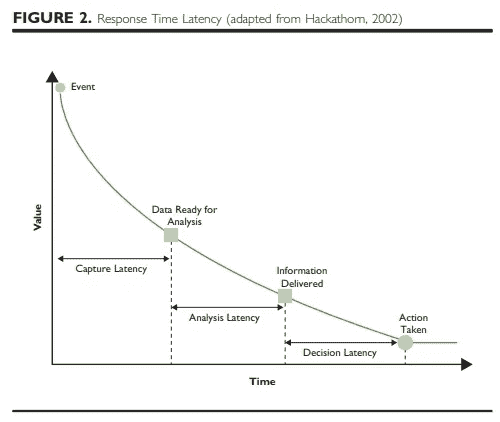

# 你的大数据是不是在逆向思维？

> 原文：<https://towardsdatascience.com/is-your-big-data-thinking-backwards-e4176413a801?source=collection_archive---------7----------------------->

## 采用客户驱动的数据流作为核心业务策略的指南。

忘记通过增加客户价值的计划来扩展你的公司。考虑通过一些计划来扩展你的公司，这些计划将*给你数据* *告诉你*如何以无人想象的方式*为你的客户服务*。这是*必须得到*认可才能成功将大数据作为企业战略文化的范例。

本文是系列文章的第二部分，从:[大数据分析:你能为你的组织做的最好的颠覆性的事情](https://medium.com/@devin.bost/big-data-analytics-the-most-disruptive-thing-you-can-do-to-your-organization-42fd4a52d86d) n

# 大数据不仅仅是一个技术问题

Krotov (2017)用一个类比解释了这一现象:

> “1875 年 3 月，当时默默无闻的发明家亚历山大·格雷厄姆·贝尔向西部联合电报公司总裁威廉·奥顿提供了贝尔电话发明的专利，价格为 10 万美元，大约相当于今天的 200 万美元(Carlson，1994)。威廉·奥顿拒绝了这个提议。接下来发生的就是历史了。在贝尔提出收购时，西联汇款是美国最具主导地位的电信公司。几年后，较小的公司开始使用贝尔的电话发明来分割西联汇款的市场份额。为了迎头赶上，奥顿试图开发西联公司自己的电话。然而，这太少了，也太迟了。西部联盟再也无法回到它曾经达到的显赫地位。。。**西联汇款的故事经常在商业文本中被用作一个轶事证据，证明盲目的商业领袖如何与技术的未来潜力相关** (Christensen，Anthony，& Roth，2004)。。。Carlson (1994 年，第 161 页)解释了[领导者中]的这种偏见:

> “历史学家和公众通常都认为一项新技术的‘最终用途’是包含在技术本身之中的。假设一旦一个设备被发明出来，它将如何被使用以及被谁使用就很清楚了。。。相反。。。**技术的“最终用途”是由技术企业中的各种参与者创造或构建的**。。."[【1】](#_ftn1)

这个世界已经不是大多数当代管理理论形成时的那个世界了。正如 Braganza、Brooks、Nepelski、Ali 和 Moro (2017 年)所提到的，技术的发展速度远远超过管理思维的发展速度，他们指出:

> “对正在制作的数据的来源和数量的各种估计包括思科的估计”**到 2020 年，每两分钟就会有相当于所有电影的千兆字节(GB)通过全球互联网**”(思科视觉网络指数，2016 年，第 4 页)。。。大数据催生了新的技术、方法、数据采集应用、可视化技术和数据聚合能力。借助成熟的商业智能、数据挖掘和分析实践，大数据方法催生了新一代算法，并重新激发了人们对数学、统计和定量分析的兴趣。。。学者们认识到大数据不仅仅是一个技术问题，为了充分发挥作用，**大数据需要成为组织结构的一部分** (Davenport，Barth，& Bean，2012)。**应将大数据纳入营销和新产品开发等战略活动**(徐，Frankwick，& Ramirez，2016)。其他人认识到**大数据影响组织文化，因为决策变得更加基于证据** (Erevelles 等人，2016 年，伊拉尼，2010 年)。”[【2】](#_ftn2)

最赚钱的公司正在想办法让他们的客户创造驱动核心业务流程的数据流。Pigni、Poccoli 和 Watson (2016 年)报告称:

> “数字数据流的出现正在为现有公司创造战略机遇，并促成新企业的形成。这种巨大变化的催化剂是**大量生成的实时**结构化和非结构化**数据流，组织可以利用这些数据流进行决策和运营变化**。这些新企业的象征是优步，世界上最大的“出租车”公司，市值高达 500 亿美元。(1)优步没有汽车，但利用其司机汽车的实时数字数据流**，并将其与实时乘车需求相匹配。现有组织也在成功利用“大数据”的实时流动来创造新的价值。想想旧金山的 SFPark 吧，它是旧金山市政运输局(SFMTA)的一个公私合作项目。通过在城市的每个收费停车位安装磁力计来检测车辆，SFMTA 创建了实时停车数据流。通过这样做，它提供了可用停车位的实时可见性，减少了驾车者寻找停车位的平均时间(43%)、街道停车的平均费用(4%)和车库费用(12%)。此外，该市还能够通过引入需求反应定价来获得一些创造的价值。。。其结果是，停车位使用率目标更经常地达到 31 %,温室气体排放减少了 30 %,这是因为驾驶员为了停车而绕行的英里数减少了" [[3]](#_ftn3)**

**想想谷歌、亚马逊、脸书、推特、Instagram、Pinterest、优步和领英等公司创造的数据流。作为其核心业务战略的一部分，这些公司依靠客户创造的数据流繁荣发展。**

****

**From Pigni, F., Piccoli, G., & Watson, R. (2016)**

# **利用客户驱动的数据流作为核心业务战略**

**亚马逊创建了一个全球市场 [[4]](#_ftn4) ，允许他们的客户上传他们自己的产品，并利用亚马逊的平台和市场向全球受众销售。从某种程度上说，他们的公司战略创造了一种自助式商业模式，在这种模式下，客户能够挑选他们想要使用的产品和功能，利用公司提供的工具和数据管理流程来满足他们自己的需求，并提供数据，使亚马逊能够更好地为其他客户提供更好的服务，并拓展到新的市场。马泽伊&诺贝尔(2017)这样说:**

> **“亚马逊提供了一个公司如何应用数据和分析进行战略发展的标志性例子。。。作为一家专注于图书的电子商务公司，亚马逊能够获得信息，并对查看其图书库存的消费者的鼠标点击进行分析。该公司获取了浏览历史，包括搜索词、购买的书籍、未购买的书籍、放在愿望清单上的书籍以及项目被浏览的时间长度。这导致了更多的选择，改善了目标市场营销，并最终通过电子零售商扩展到更多的细分市场。亚马逊现在在电子商务网站上销售几乎任何产品，包括电子产品、运动器材、服装，甚至建筑材料。**改进的分析能力有助于增强大数据的力量**，使亚马逊作为云计算服务提供商进入一个新兴行业。亚马逊网络服务(AWS)现在是一项价值 50 亿美元的业务，引领云计算和分析基础设施市场，为各种规模的公司提供灵活而全面的服务(Novet，2015)。”**

**通过分析在其网站上搜索书籍和产品的用户的搜索查询和流量行为，亚马逊是否可能意识到他们有机会开拓新市场的下一个大领域是云计算和网络服务？想想吧。为什么像亚马逊这样的公司会进入一个在很多方面对他们来说完全陌生的市场？这样的举动不是一步到位的冲动决定；相反，它需要在一段时间内仔细规划。亚马逊的第一次大数据收购发生在 1998 年，当时收购了 Junglee corp .[【6】](#_ftn6)，这是一家 XML 数据挖掘公司，它提取在线产品价格，允许网络购物者比较数百万种产品的价格[【7】](#_ftn7)。当我们回顾亚马逊的决定时，很明显，它们朝着正确的方向前进；由于他们的选择，他们已经成为这个新的自助式 web 服务技术市场的主要领导者。谷歌是自助式商业模式的另一个主要例子。谷歌的产品在由客户创造的数据*流*生态系统中茁壮成长，包括维护网站和网络应用的组织，以及在这些组织中搜索内容的个人[【8】](#_ftn8)。根据 Davenport，t .，Barth，p .，& Bean，r .(2012)[【9】](#_ftn9)的说法，早在 2012 年，仅谷歌一家每天就处理大约 24pb(或 24,000)的数据*。马泽伊&诺布尔(2017)还举了 Progressive Insurance 的例子，该公司利用实时分析以新颖的方式推动其核心业务流程，而没有实质性地改变其市场焦点:***

> ***“Progressive Insurance 正在使用来自车载电信设备的实时分析来监控驾驶活动，通过识别危险行为来创造竞争优势。这使得该公司能够根据每个司机的实际驾驶习惯更准确地对他们进行评级，同时也鼓励其消费者的驾驶行为发生积极的变化(全国保险专员协会，2015 年)。”[【5】](#_ftn5)***

***因此，即使一家公司不适合一头扎进一个完全陌生的市场，也可以循序渐进地实现数据驱动。随着渐进式保险开始利用实时数据来更准确地评估司机的实际驾驶习惯，其他保险市场开始出现，如驾驶付费(PAYD)、驾驶付费(PHYD)和现收现付(PAYG)。这些仍然是允许流数据驱动市场决策的例子，允许公司在许多情况下创建新的市场，以更好的方式满足客户需求。***

# ***大数据不是一个独立的流程或技术***

***现在，组织认为大数据只是一种独立影响组织并增加价值的技术或流程是错误的。许多大数据计划正是因为这个原因而失败[【12】](#_ftn12)，但是将大数据贯穿于其组织和业务流程的组织正是那些从其投资中获得最大价值和收益的组织[【13】](#_ftn13)。然而，将大数据集成到现有业务流程中可能需要逆转许多流程，并彻底转变决策方面的管理视角。*如果您的组织已经引入了大数据，但您的决策流程并未发生实质性变化，那么您就错失了机会，并给组织的绩效带来了瓶颈*。马泽伊&宣布:***

> ***“有许多有远见的高管致力于构建数据资源，使他们的公司能够开发结合传统和现代战略思想的彻底创新的商业模式。本质上，这些**领导者将数据视为其组织战略的核心，并选择专注于数据流*而非数据存量*** (Davenport et al .，2012)。**这些公司根据他们能够积累的数据开发出专注于其产品和服务的生态系统**。。。随着这些学习型组织基于通过数据分析发现的趋势而动态发展，许多传统的扩张和多样化约束被贬低了。**这些公司创造了杠杆——由于它们能够获得从过去和当前收入来源获得的数据、知识和资源——这使得传统的竞争壁垒(例如，买方/供应商的议价能力、进入壁垒)在许多情况下变得毫无意义** (Porter & Heppelmann，2014)。围绕这些公司的扩张和多样化的主要问题是 **(1)他们现有的数据收集和分析是否提供了新的机会；(2)探索允许更丰富、更有洞察力的数据收集和分析；或者(3)扩展工作改善了组织的数据生态系统，其中最终客户被视为一个活生生的数据源**。这些组织认为数据汇编本身就是创造价值的来源。他们不需要立即将数据货币化，因为如果他们捕获了足够多的数据，就可以在未来以无数的方式——也许是目前尚未实现的方式——利用这些数据，作为他们动态能力和数字生态系统发展的一部分，拓宽和导航新行业。。。在这里提到的公司中，**有许多收购或产品线扩张乍一看似乎是被误导的，除非你把数据流想象成公司寻求的产出**。公司。。。以战略身份查看数据的公司能够在没有直接盈利需求的情况下试验他们的产品(例如，脸书进入虚拟现实，苹果进入汽车，Alphabet 进入太空旅行和自动驾驶汽车)，因此他们可以不断创新，学习他们不知道的东西。**从战略上讲，这是一个与数据作为工具截然不同的概念，因为数据流和新知识成为战略政策和决策制定的驱动力**。。。(这些类型的公司)不断将其平台发展成广阔的生态系统，渗透到消费者的生活中，建立数据库存，并增加数据流的数量，这些数据流将通过后来的产品和技术货币化，而这些产品和技术又可能继续增加数据流。[【5】](#_ftn5)***

***当我们考虑这种可能看起来像是传统管理理论的彻底转变的新视角时，重要的是要记住，这个世界与大多数当代管理理论发展时截然不同，那些没有赶上潮流的企业将被甩在后面。***

# ***您最近的业务决策是如何由数据驱动的？***

***回想一下你最近做的几个商业决策。这些决策中有多少是*主要是*根据你从另一个项目中发现的数据做出的？如果做出真正的数据驱动决策的过程还没有成为你企业文化的一部分，你就落后了。公司不再适合在利用数据之前*做出决策。马泽伊(2017)是这样表述的:****

> ***“**【数据驱动】组织的勘探和开采决策不仅仅是基于盈利能力；相反，这些公司关心的是增强数据流**，**，目的是开发创新的服务模块，这些模块可以轻松地与现有平台结合，以执行不断提高的服务水平** (Morabito，2015)。。。在大多数当代战略管理理论形成的时候，我们没有短信、聊天、电子邮件、基本免费的长途电话接入、视频会议、数码照片和电影、几乎无限的数据存储，以及现在被视为理所当然的无数其他数字工具。相反，交易是通过传真、面对面的会议、打字机和“蜗牛”邮件来完成的。数据处理是一项漫长、昂贵而艰巨的任务。。。[数据驱动的]公司如何选择探索新市场不是通过传统的战略规划来完成的，而是通过机会识别来发展的，这些机会识别主要基于从持续分析更多更丰富的数据流中收集的信息。。。**据预测，仅在美国，大数据、数字化和自动化将在 10-20 年内消除 47%的现有工作岗位** (Frey & Osborne，2013)[【15】](#_ftn15)***

***想象一下，如果 47%的员工被大数据、数字化和自动化所取代，你的公司会是什么样子。想想谁会留下，谁会被取代。思考哪些类型的角色可能会被取代。认识到这个行业正在发生的事情很重要，因为如果你还没有接受它，这个行业和你的竞争对手会替你接受它，而你可能会成为被取代的 47%中的一员。***

# ***您的数据是否已经决定了您的业务战略？***

******

***From Mazzei, M. J., & Noble, D. (2017)***

***全球对数据的看法正在发生变化，数据作为一种战略优先事项变得越来越重要。让我们从博弈的角度来思考一下策略。在各种游戏中，你可能会使用策略，通过做出某些选择来观察你的对手将如何反应，以便你可以估计他们的计划。你可能用策略来探索某些机会或决定，以收集更多关于回报或风险的信息。你可能已经使用策略来利用你的资源来获得竞争或位置优势。现在，在这些情况中，有多少是你的选择或信心受到你所拥有的可用信息数量的限制？想象一下，如果你有十倍于你正在考虑的决定的信息。你能看出它是如何在有利的选择和致命的选择之间做出区别的吗？Brandenburger 和 Nalebuff (2002)指出，“**成功的商业战略是积极塑造你玩的游戏，而不仅仅是玩你发现的游戏**。” [[19]](#_ftnref19) 当竞争对手奋力追赶时，将数据流作为战略重点的公司正在积极地塑造他们的市场并创造新的市场。然而，并非所有现有的业务流程都符合这种将数据放在第一位的现代范式，因此许多公司需要认真地重新审视他们的假设、优先级和思维。Massi & Nobel (2017)也表示:***

> ***"**访问海量数据和提升分析能力需要重新审视之前的假设**。。。一家公司的业务层面战略决定了它如何使用数据来开拓当前市场，还是从一家公司的定位中产生的数据流在多样化和公司战略的发展中发挥了更重要的作用？尽管战略管理领域的传统观点认为，选择的战略决定了价值的衡量标准和数据的选择或适用性，但我们认为许多公司已经改变了这种方法。我们的观察表明，在某些情况下，收集和分析的数据对企业战略有着巨大的影响，而不是企业战略决定了应该收集和分析哪些数据(见图 1)。**拥抱大数据带来的创新和探索机遇的公司正在实现新的价值创造和提高公司绩效** (Lavalle，Lesser，Shockley，Hopkins，& Kruschwitz，2011)，**，并且正在以前所未有的规模实现**。我们见证了一场实践运动，这场运动通过剔除传统价值链和竞争力，开始解开过去 40 年来发展的许多已知战略管理理论(Evans，2013)。**数据的用途正在发生变化，因为收集的数据有助于确定要探索的市场以及消费者趋势如何变化，并且数据可以实时推动这些决定**。我们看到企业进入非传统市场，利用他们的数据和分析资源——结合大量的人力和金融资本——颠覆传统的进入壁垒。**大数据推动者和创新者的最终目标是构建更丰富的知识和动态能力**并应用大数据分析的优势，通过发展多样化的生态系统和数据流来创造独特和可持续的竞争优势。”[【5】](#_ftn5)***

# ***将数据放在第一位—大数据应该如何影响战略***

***你的公司最近一次启动面向客户的计划是在什么时候，当时认为该计划不会直接提供额外的收入，而是会提供数据，让执行管理层获得所需的洞察力，以确定他们是否应该进入一个他们以前没有考虑过的新市场？你的公司上一次冒着失去底线的风险启动一个项目是什么时候？这个项目纯粹是为了获得数据，向你展示你的客户是否会对获得某些潜在的高影响力的新产品功能而不是其他功能更感兴趣？你的公司上一次创建一个有争议的“高风险”项目(乍一看甚至可能被误导)来决定公司是否应该冒险进入一个全新的市场是什么时候，这个市场要么刚刚兴起，要么他们目前没有经验？如果这些都不适合你，那么你的公司就落后了。过于专注于实现眼前收入目标的公司将会错过获得最大长期收入收益的机会和市场机会，而这些机会只能通过从实验性数据收集工作中获得的洞察力来获得。Shah、Soriano 和 Coutroubis (2017 年)报告称:***

> ***"**大数据项目通常会失败，因为组织[努力]在技术及其能力上，而不是商业机会上** [9]。采取创新方法并给予探索机会的公司，正在创造新的价值并达到[加速的]绩效[25]。根据[15]，**的说法，一个常见的错误是将大数据视为一个限定时间的项目，而不是一个持续的探索练习**[【17】](#_ftn17)***

***将大数据作为核心战略优先事项意味着它不能孤立地完成。利用数据不能只由公司内一个孤立的专家小组来处理，即使是一个有影响力的专家小组。它必须成为一种系统的组织实践，渗透到管理思维和决策制定的各个方面。正如 Fleming，Fountaine，Henke 和 Saleh (2018)所述，如果大数据分析没有成为整个组织管理思想的一部分，即使是拥有集中式大数据分析业务的公司也很难从分析工作中创造价值:***

> ***“与任何重大商业计划一样， [analytics 应该有自己的战略方向](https://www.mckinsey.com/business-functions/digital-mckinsey/our-insights/making-data-analytics-work-for-you-instead-of-the-other-way-around)。。。我们观察到，拥有成功分析计划的组织将分析能力嵌入到其核心业务中。**那些努力通过分析创造价值的组织倾向于孤立地开发分析能力**，要么集中在远离业务的地方，要么分散在协调性差的孤岛中。这两种组织模式都是无效的。”[【18】](#_ftn18)***

***尚未在全公司范围内采用分析的公司可能需要进行重大变革，以完全由数据驱动，但第一个重要步骤是扭转我们的思维，将数据置于战略规划之前。***

***[【1】](#_ftnref1)克罗托夫，V. (2017)。物联网与新商机。*业务视野*， *60* (6)，831–841。加粗补充道。检索自[https://Fardapaper . IR/mohavaha/uploads/2018/03/Fardapaper-The-Internet of-Things-and-new-business-opportunities . pdf](https://fardapaper.ir/mohavaha/uploads/2018/03/Fardapaper-The-Internet-of-Things-and-new-business-opportunities.pdf)***

***[【2】](#_ftnref2)brag anza，a .，Brooks，l .，Nepelski，d .，Ali，m .，& Moro，R. (2017)。大数据计划中的资源管理:流程和动态能力。商业研究杂志，70，328–337 页。加粗补充道。检索自[https://www . science direct . com/science/article/pii/s 0148296316304933 # f 0005](https://www.sciencedirect.com/science/article/pii/S0148296316304933#f0005)***

***[【3】](#_ftnref3)皮格尼，f .，皮考利，g .&沃森，R. (2016)。数字数据流:从大数据的实时流中创造价值。*加州管理评论*， *58* (3)，5–25。加粗补充道。从 https://dds.cct.lsu.edu/ddslab/pdf/digitalDataStream.pdf[取回](https://dds.cct.lsu.edu/ddslab/pdf/digitalDataStream.pdf)***

***[【4】](#_ftnref4)陈，l，Mislove，a，&威尔逊，C. (2016，4 月)。亚马逊市场算法定价的实证分析。在*第 25 届万维网国际会议记录*(第 1339-1349 页)。国际万维网会议指导委员会。从 https://mislove.org/publications/Amazon-WWW.pdf[取回](https://mislove.org/publications/Amazon-WWW.pdf)***

***[【5】](#_ftnref5)马泽伊，m . j .&诺布尔，D. (2017)。大数据梦想:企业战略框架。*商业视野*， *60* (3)，405–414。加粗补充道。检索自[http://irana rze . IR/WP-content/uploads/2018/01/e 5723-irana rze . pdf](http://iranarze.ir/wp-content/uploads/2018/01/E5723-IranArze.pdf)***

***[【6】](#_ftnref6)亚马逊公司(1998)。Amazon.com 收购两家领先的互联网公司[新闻稿]。检索自:[http://phx.corporate-ir.net/phoenix.zhtml?c=97664&p = irol-news article&ID = 233831&highlight](http://phx.corporate-ir.net/phoenix.zhtml?c=97664&p=irol-newsArticle&ID=233831&highlight)=***

***拉杰加塔，C. (1998 年)。Junglee 男孩在网上淘金。检索自[https://web . archive . org/web/20131217162934/http://expression dia . Indian express . com/ie/daily/1998 08 14/22650774 . html](https://web.archive.org/web/20131217162934/http:/expressindia.indianexpress.com/ie/daily/19980814/22650774.html)检索于 2018 年 8 月 11 日。***

***[【8】](#_ftnref8)佩奇、l、布林、s、莫特瓦尼、r、&威诺格拉、T. (1999)。PageRank 引用排名:给网络带来秩序。斯坦福信息实验室。从 http://ilpubs.stanford.edu:8090/422/1/1999-66.pdf[取回](http://ilpubs.stanford.edu:8090/422/1/1999-66.pdf)***

***[【9】](#_ftnref9)达文波特，T. H .，巴斯，p .，&比恩，R. (2012)。*“大数据”有何不同*。麻省理工学院斯隆管理评论。检索自[https://pdfs . semantic scholar . org/eb3d/ECE 257 cc a2 e 8 ce 6 EAF 73 FD 98 C1 fdcbdc 5522 . pdf](https://pdfs.semanticscholar.org/eb3d/ece257cca2e8ce6eaf73fd98c1fdcbdc5522.pdf)***

***[【11】](#_ftnref11)husn JAK，s .、Perakovi，d .、Forenbacher，I .、& Mumdziev，M. (2015)。基于使用的汽车保险中的远程信息系统。 *Procedia 工程*， *100* ，816–825。从 https://core.ac.uk/download/pdf/82469016.pdf[取回](https://core.ac.uk/download/pdf/82469016.pdf)***

****Grover，v .，蒋，R. H .，梁，T. P .，&张，D. (2018)。从大数据分析中创造战略商业价值:一个研究框架。*管理信息系统杂志*， *35* (2)，388–423。检索自[https://www . tandfonline . com/doi/ABS/10.1080/07421222.2018 . 1451951](https://www.tandfonline.com/doi/abs/10.1080/07421222.2018.1451951)****

****[【13】](#_ftnref13)达文波特，T. H .，&戴奇，J. (2013)。大公司的大数据。*国际分析研究所*， *3* 。检索自[http://datascienceassn . org/sites/default/files/Big % 20 data % 20 in % 20 Big % 20 companies % 20-% 20 Tom % 20 aven port . pdf](http://datascienceassn.org/sites/default/files/Big%20Data%20in%20Big%20Companies%20-%20Tom%20Davenport.pdf)****

****[【15】](#_ftnref15)马泽伊，m . j .&诺布尔，D. (2017 年 1 月)。不仅仅是一种资源？大数据现象的理论基础。载于《管理学院学报》(2017 年第 1 卷第 17546 页)。荆棘崖庄园，纽约 10510:管理学院。加粗补充道。检索自[https://www . researchgate . net/profile/David _ noble 8/project/The-Digital-Economy-Big-Data-and-Strategy-Implications/attachment/595707 c 282999 C3 ee 923 cd7e/AS:51136483246080 @ 1498875842970/download/2017+AoM+Meeting+paper . docx？context = projectUpdateDetail](https://www.researchgate.net/profile/David_Noble8/project/The-Digital-Economy-Big-Data-and-Strategy-Implications/attachment/595707c282999c3ee923cd7e/AS:511136483246080@1498875842970/download/2017+AoM+Meeting+Paper.docx?context=projectUpdateDetail)****

****[【17】](#_ftnref17)Shah，s .，Soriano，c . b .&Coutroubis，A. D. (2017，12 月)。大数据是面向所有人的吗？中小企业采用大数据的挑战。在*工业工程与工程管理(IEEM)，2017 IEEE 国际会议上*(第 803–807 页)。IEEE。加粗补充道。从 https://core.ac.uk/download/pdf/96675234.pdf[取回](https://core.ac.uk/download/pdf/96675234.pdf)****

****[【18】](#_ftnref18)佛莱明，奥，方丹，t，亨克，n .&萨利赫，T. (2018)。十个危险信号表明你的分析程序将会失败。麦肯锡分析公司。加粗补充道。检索自[https://www . McKinsey . com/business-functions/McKinsey-analytics/our-insights/ten-red-flags-signaling-your-analytics-program-will-fail](https://www.mckinsey.com/business-functions/mckinsey-analytics/our-insights/ten-red-flags-signaling-your-analytics-program-will-fail)****

****布兰登伯格，a . m .&纳勒布夫，B. J. (2002)。用博弈论来塑造战略。*战略:对商业和管理的关键观点*， *4* ，260。检索自[http://faculty . som . Yale . edu/barrynalebuff/right game _ HBR 1995 . pdf](http://faculty.som.yale.edu/barrynalebuff/RightGame_HBR1995.pdf)****