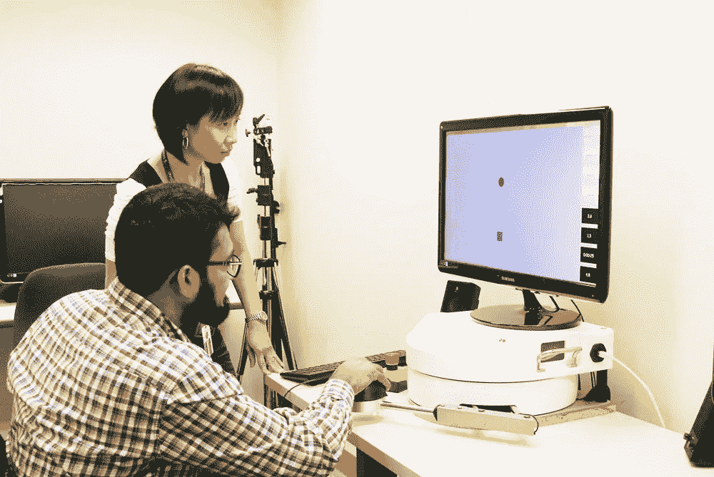
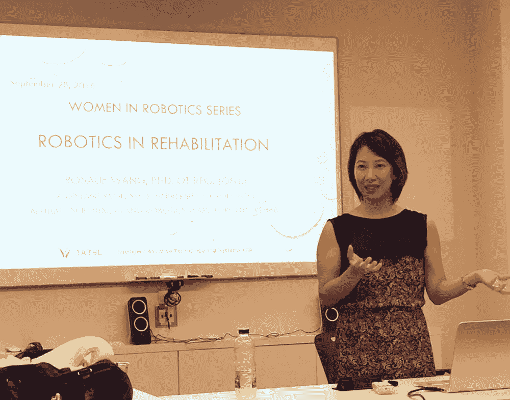
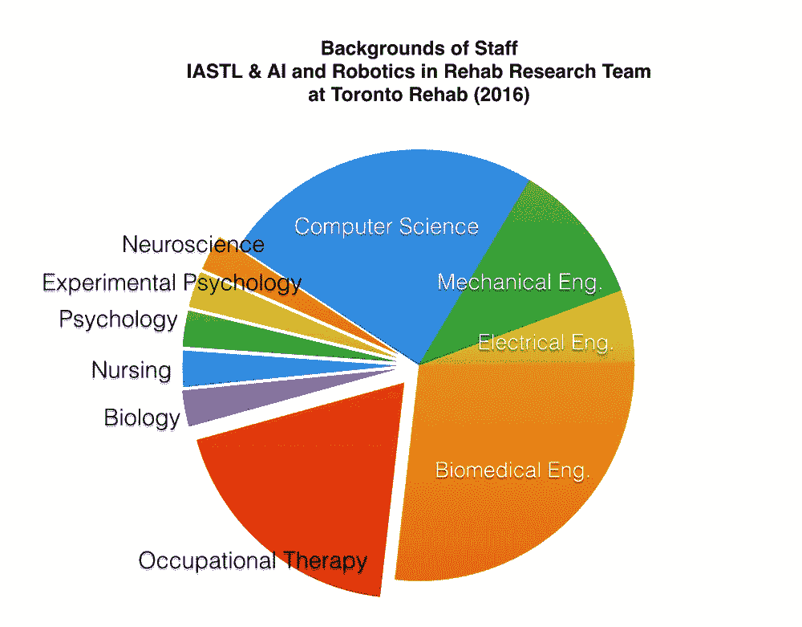

# 不仅仅是从事机器人工作的工程师

> 原文：<https://towardsdatascience.com/its-not-only-engineers-who-work-in-robotics-8c65259247b5?source=collection_archive---------0----------------------->

Occupational Therapist Rosalie Wang investigates how intelligent haptic robotic systems can benefit people recovering from upper limb disability due to stroke. Photo courtesy IATSL (Intelligent Assistive Technology and Systems Lab) at Toronto Rehab, University of Toronto.

机器人技术一直是一个跨学科的领域，它整合了计算机科学、机械、电子、控制和其他工程领域的知识。但是，随着机器人走出工厂和研究实验室，进入我们的家庭和工作场所，另一种机器人专家正在出现——工程或计算机科学学位不一定是他们简历的一部分。

**从职业治疗到康复机器人**

Rosalie Wang 是智能辅助技术和系统实验室的助理教授，这是一个多学科研究小组，由工程师、计算机科学家、康复和医学研究人员组成，他们利用人工智能和机器人技术开发智能辅助和治疗设备。IATSL 研究涵盖所有领域，包括电动轮椅的避障和导航系统、跌倒检测解决方案、中风康复的智能触觉系统、帮助就地老龄化的个人机器人、痴呆症患者的辅助机器人等等。

但王的职业生涯始于职业治疗师，为长期护理的客户提供支持。她的热情是帮助老年人，在一家养老院工作时，她发现自己在摆弄客户的轮椅。“我会带着满是油脂的指甲回到家，把轮椅拆开又组装起来，以便更好地满足我客户的需求。”一件事接着一件事，很快她发现自己正在攻读电动轮椅防撞技术的博士学位。

**将技术转化为实践**

寻找“人的问题”的技术解决方案是一种特殊的技能，需要对最终用户及其环境有深刻的了解，并有能力与工程师和计算机科学家密切合作，以了解技术的可能性和局限性。

王说，电动轮椅的一个常见问题是，对于有身体和/或认知障碍的人来说，它们很难控制；因为它们是电动的，它们也可能比手动轮椅更危险，尤其是对那些健康状况已经很脆弱的人来说——这也是一些养老院完全禁止使用电动轮椅的原因之一。此外还有伦理方面的问题:“一旦你给了某人一个电动轮椅，你就很难把它从他那里拿走。我们希望实现移动性，我们希望保护人们的安全，我们希望以尊重客户的方式来做到这一点，”王说。

王还指出，仅仅拥有在特定条件下可以工作的技术并不意味着它会在实践中被采用；技术本身之外的许多环境因素会成为障碍。例如，大多数跌倒检测监控服务倾向于使用基于订阅的商业模式，类似于家庭监控。但王发现，许多客户更喜欢让他们的个人护理监控服务触发对家庭成员的警告呼叫，而不是呼叫中心——即使这种解决方案不太可能被行业合作伙伴采用。“在设计系统时，你必须着眼于全局。客户觉得干扰呼叫中心是一种耻辱。”

将技术开发成可以实际部署到现实世界场景中的系统和产品是一项挑战，了解客户的个人偏好、他们的身体和认知能力以及背景因素(如养老院架构、常规和法规、家庭和护理人员需求、道德等)非常重要。这就是为什么 IATSL 研究的一个关键部分也是为在疗养院和家中应用智能辅助技术开发框架、指南和方法。

Rosalie Wang speaks about her career path from Occupational Therapist to rehab robotics researcher at the Women in Robotics lecture series, hosted by [Get Your Bot On](https://twitter.com/GetYourBotOn) and [Women Engineers TO](https://twitter.com/WE_Toronto) in Toronto, Canada. Photo via Nicole Proulx.

对于王来说，在机器人和人工智能领域担任职业治疗师的好处是双向的:她可以以用户为中心的视角来设计技术，但“机器人和人工智能也可以帮助加强职业治疗师的工作，推动整个领域的发展，”她说。王的研究还包括临床评估上肢中风康复机器人和帮助老年痴呆症患者的辅助机器人。她上个月刚刚发表的最新论文调查了患有阿尔茨海默氏症的老年人和他们的护理人员对使用机器人帮助他们完成家庭任务的感受，这是少数几项对该问题进行深入研究的研究之一。

从职业治疗师的角度来看，使用机器人和人工智能的一个关键好处是，它可以为循证治疗提供数据。“过去，我们只能通过非常粗略的快照来衡量治疗效果……客户要么可以完成一项任务，要么无法完成。这种反馈可能会使客户非常沮丧，并使治疗师更难察觉和记录进展中的微小变化……现在我们可以收集连续的数据，这让我们可以设计更完善的治疗，并让客户对进展有更好的感觉。治疗机器人可以给你连续的临床数据，即使你无法感知。”

当被问及是否想过有一天会从事机器人领域的工作时，王给出了一个响亮的答案:“不会。”她也不愿意将自己描述为机器人专家。尽管如此，鉴于智能辅助技术和系统实验室正在开展的[广泛的项目，很明显，需要一个拥有各种专业知识的跨学科团队来将机器人和人工智能转化为实际的医疗保健解决方案。](http://iatsl.org/projects.htm)

IATSL 团队成员的背景包括职业治疗、神经科学、工业设计、生物学、临床心理学、实验心理学、康复科学和护理。