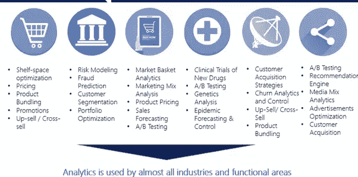
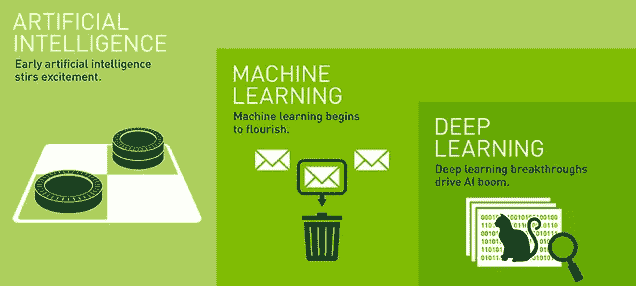
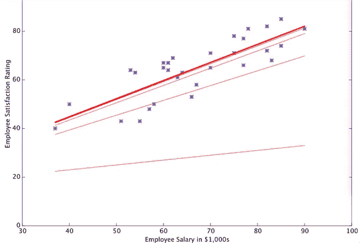
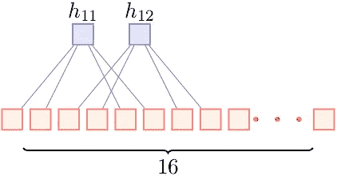
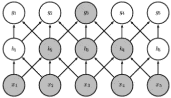
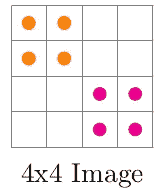
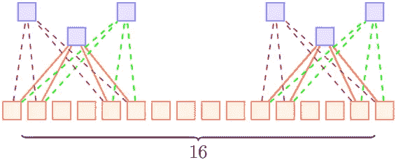
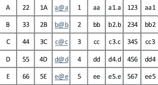

# 从机器学习到深度学习的旅程

> 原文：<https://towardsdatascience.com/journey-from-machine-learning-to-deep-learning-8a807e8f3c1c?source=collection_archive---------7----------------------->

我们都知道，机器学习和深度学习肯定会继续存在。从健康诊断到金融技术，许多初创公司都在这些基础上构建应用程序，而老牌企业则试图升级他们的技术堆栈，将这些技术用于业务分析。越来越多的企业需要智能分析来保持竞争优势。这绝对是为了未来收益而投资的两项技术。

> 在短短两年内，英伟达在深度学习方面合作的公司数量增长了近 35 倍，达到 3400 多家。

医疗保健、生命科学、能源、金融服务、汽车、制造和娱乐等行业将受益于从海量数据中推断出的洞察力。这些分析已经被杰出的玩家用来在游戏中保持领先。

Intelligence is desired by every enterprise to achieve optimality in every aspect of an organization.

我们每个人在日常生活中都听过这两个词。但是，这两者之间的确切区别是什么，以及我们的业务用例何时需要使用其中之一。深度学习显然已经显示了从计算机视觉到 NLP 分析的大量应用，并且已经超过了它的前身机器学习模型。但是，到目前为止，商业分析仍然主要由机器学习和决策树、随机森林等传统算法控制。仍然是可靠的方法。

在本文中，让我们探索这两个领域的基本区别，并对这两个领域进行评价。考虑到这两个领域的重要性，最好是温习一下基础知识，并对这两个领域有一个基本的不同理解。

深度学习是机器学习的子集，机器学习是 AI 的子集，AI 是任何做一些智能事情的计算机程序的总称。换句话说，所有的机器学习都是 AI，但不是所有的 AI 都是机器学习。例如，专家系统可能不使用任何机器学习，而只是利用由专家编码到其中的领域知识。

Open For Discussion In Response Section : Can we really call a machine mimicking intelligent behavior really intelligent ? Refer, Chinese Room Problem for example.

# 什么是机器学习？

机器学习捕捉系统的动态，并且不需要人为干预来进行某些改变。这使它变得强大，减少了对人类专家的依赖。也许，汤姆·米切尔最流行的定义会提供更多的见解。

> 如果一个计算机程序在 T 中的任务上的性能(如 P 所测量的)随着经验 E 而提高，则称该计算机程序从关于某类任务 T 和性能测量 P 的经验 E 中学习。

让我们借助一个例子来探讨这个定义。考虑一个场景，其中您有兴趣找出雇主满意度和雇主工资之间关系。所以，我们已经定义了我们的任务。让我们用线性模型来拟合我们的数据，损失函数是距离最佳拟合线的欧几里得距离之和。对于最佳拟合，我们的目标是将其最小化。

With number of more iterations i.e. increased **experience** **E** our model’s **performance P** does increases with reduction in loss and much better fitted curve for better predictions.

> 显然，这是一个让计算机无需显式编程就能学习的研究领域。

# 什么是深度学习？

深度人工神经网络是一组算法，在许多重要问题上，如图像识别、声音识别、推荐系统等，它们在准确性方面创造了新的记录。术语'*深*'指的是神经网络中不止一个隐藏层。这些隐藏层用于学习一个问题的不同特征图。考虑下面的定义。

> 深度学习通过学习将问题表示为嵌套的概念层次结构来实现强大的功能和灵活性，每个概念都是相对于更简单的概念来定义的，而更抽象的表示是根据不太抽象的概念来计算的。

让我们通过与自动编码器(机器学习中的标准前馈神经网络)进行比较来培养对深度学习模型的欣赏。

# **征途:从机器学习中欣赏深度学习**

深度学习模型在性能和达到最先进的结果方面超出了预期。但是，它们与机器学习中使用的人工神经网络或自动编码器有什么不同？使他们的工作更出色以取得更好结果的根本区别是什么？

考虑以[汽车、公共汽车、纪念碑、花卉]作为输出类别的多类别分类问题的情况。在机器学习中，最基本的方法是利用我们训练好的模型，如模式识别，在大量的特征集中找出分类对象的准确出现。

这种方法效率很低。但是，为什么呢？分类器需要做太多不必要的分析。像天空和水的蓝色在物体检测的图像中是不重要的。此外，对象的颜色在图像中并不重要。这将不必要地增加功能的数量。让我们应用特征工程，用边缘检测过滤器，用有限的重要特征达到更好的结果。具有计算出边缘的能力的模型将能够更好地构造出完整的对象，并且仅学习最相关的特征。

它肯定会比以前的方法给出更好的结果。但是，现在我们也可以使用专门设计的过滤器来检测像 SIFT 或 HOG 这样的对象。这将有助于给出以上问题的最新结果。

所有的特征工程过程都是在一些领域知识和静态特征提取技术的帮助下完成的。在绘制这些特征图时，他们没有学习。这是数据科学家需要做的预处理工作。深度学习需要从上述场景中回答的主要问题是…

> 除了学习分类器的权重，我们还可以学习**多个有意义的核**吗？

**Yes, We can !!**

简单地通过将这些核作为参数，并且通过反向传播算法除了学习分类器的权重之外还学习它们。你可能已经知道，用于这个过程的网络被称为卷积神经网络。因为，我们什么也不做，只是在图像上应用这些过滤器时执行卷积运算。

> 但是，它与以前机器学习中存在的前馈神经网络有什么不同呢？

常规的前馈神经网络是密集的，使得一个密集的网络从所有 16 个输入神经元中取贡献值来对 ***h11 的计算作出贡献。*此外，最重要是大多数连接都是冗余的**。****

> ***多余！！但是，我认为这些密集的连接会捕捉到最多的信息。*让我们看看 CNN 是如何解决这些问题的。**

****

**Assume a 16 pixel input**

**显然，只有少数局部神经元参与了 *h11* 的计算。例如，只有像素 1、2、5、6 对 *h11* 有贡献。随着参数数量的减少，连接更加稀疏，使得复杂性降低，从而减少了计算。**

> **这些稀疏的连接是否合理？我们不是在丢失信息吗？**

****

**这些稀疏的连接表明，相邻像素之间的相互作用比其他像素更重要。此外，考虑 *x1* 和 *x5* 它们在第 1 层中不交互。但是它们间接有助于 *g3* 的计算，因此间接相互作用。考虑到假设两个不同的邻域可能表示对象的相同特征。这将被上面的连接和更高的权重所考虑。**

**CNN 的另一个重要特性是**重量共享**。自动编码器将为图像的不同部分赋予不同的内核。**

****

**Do we want the kernel weights to be different for different portions of the image?**

**想象一下，我们正在尝试学习一个检测边缘的内核/过滤器。难道我们不应该在图像的所有部分应用相同的内核吗？因为，图像的像素可能只是平移。此外，我们可以用多个不同的内核学习图像的不同特征来增强我们的特征学习过程。**

****

**嗯，我希望通过上面的例子可以清楚地看到，与机器学习相比，深度学习模型具有更强的泛化能力和能力。所有的智能工作都由你创造的神经网络架构来完成。让我们在下一篇文章中看看并欣赏架构。**

# **比较圈地:那么，为什么要用 ML？**

**最后，让我们在不同的用例参数上比较这两个领域，这些领域算法在这些用例参数上会表现得更好。深度学习没有成为行业标准，留下了优秀的旧 ML，这肯定有原因。**

**第一个感兴趣的参数是可使用的数据量和数据放大时模型的性能。随着数据的增加，参数会得到很好的调整，模型中的偏差会减少。但是，相反，假设我们想分析每天的数据，例如股票市场的日交易者。在数据量较小的情况下，机器学习模型的性能会更好。**

****

**Data dependencies of domains**

**此外，在应用任何模型时，数据类型都非常重要。深度学习模型在关系数据上表现不佳是众所周知的。因为，没有像我们在 CNN 上看到的那样的社区房产。**

****

**Relational Data with **no** neighborhood relations 😉**

> **数据无疑是模型的燃料，是决定使用哪种模型类型的主要因素。**

**对于硬件要求，深度学习模型严重依赖于具有大量 GPU 能力的高端机器，因为它涉及大量矩阵乘法，这些乘法可以用强大的 GPU 能力并行执行。其中，机器学习模型训练起来相对非常快，即使没有 GPU 计算也能很好地工作。**

**如上所述，它们在特征工程过程方面也不同。机器学习需要手工编码的规则和领域知识来提取特征信息。它的性能将取决于在深度学习算法从数据中学习特征时，特征提取得有多好。CNN 将尝试学习低层次的特征，如早期图层中的边缘和线条，然后是人脸的部分，然后是人脸的高层次表示。**

****

**与机器学习算法相比，深度学习模型的训练时间要长得多，因为这些模型中涉及的参数数量要大得多。但是测试时间更短，因为它执行操作的速度更快，运行时间更少。k 近邻等机器学习算法在测试过程中速度较慢。**

**重复性和可解释性是许多行业仍在考虑将深度学习模型用作标准程序的主要原因。由模型获得的结果是不可重复的，因为它涉及大量的参数，这些高参数的不确定性仍然存在。精确的结果可能无法重现，需要取平均值。**

**此外，我们不知道特定的神经元在深度学习模型中以精确量化的方式做什么。我们可以找出哪个神经元在什么时候活跃，但我们不知道这些神经元应该模拟什么，以及这些神经元层集体在做什么。而像决策树这样的机器学习算法给出了清晰的规则，svm 用其超平面给出了清晰的界限，这更容易解释。**

**我希望这次对话能够明确深度学习和机器学习之间的区别，并了解何时从机器学习过渡到深度学习。感谢阅读！！**