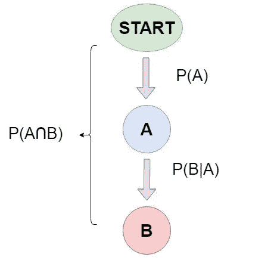
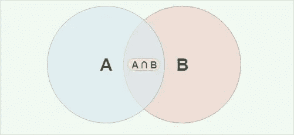
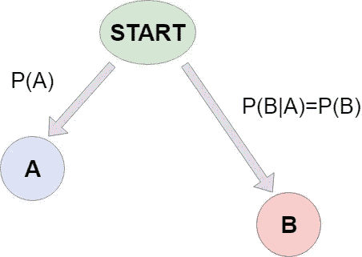
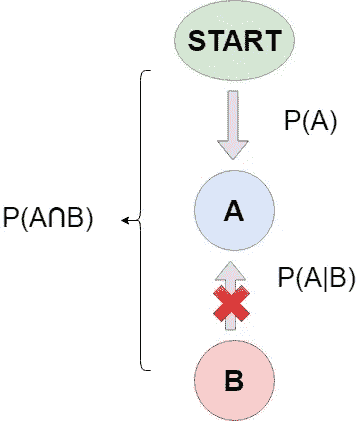

# 直观理解贝叶斯定理之旅

> 原文：<https://towardsdatascience.com/journey-to-understand-bayes-theorem-visually-80b9fbf9f4f5?source=collection_archive---------10----------------------->

Photo by [Riho Kroll](https://unsplash.com/@rihok?utm_source=medium&utm_medium=referral) on [Unsplash](https://unsplash.com?utm_source=medium&utm_medium=referral)

对于机器学习工程师或数据科学专业人员来说，理解概率的概念是必须的。许多数据科学挑战性问题的解决方案本质上往往是概率性的。因此，更好地理解概率将有助于你更有效地理解和实现这些算法。

每当我阅读任何概率书籍或研究论文时，大多数时候我都发现这些书籍中的文献过于理论化。根据[社会科学研究网](https://papers.ssrn.com/sol3/papers.cfm?abstract_id=587201)的数据，65%的人是视觉学习者。用图解法理解定理和证明是可视化信息和数据的有效方法，不仅如此，这种以可视化方式呈现数据的方法在很长一段时间内都被证明是有效的。所以通过这个博客，我想以一种视觉的方式展示概率的概念。

# 目录

1.  什么是条件概率？
2.  全概率定律
3.  贝叶斯定理
4.  贝叶斯定理的应用

首先让我们详细了解条件概率。

# 什么是条件概率？

根据[维基百科](https://en.wikipedia.org/wiki/Conditional_probability) **的说法，条件概率**是在假设(通过假设、推测、断言或证据)另一事件已经发生的情况下，对一个事件(一些特定情况发生)的概率的度量。如果感兴趣的事件是 *A* 且事件 *B* 已知或假设已经发生，“给定 *B* 的情况下 *A* 的条件概率”，或“条件 *B* 下 *A* 的概率”，通常写成*P*(*A*|*B*，有时也写成*P*

**

*Source: [giphy.com](https://giphy.com)*

*这和我第一次读这本书时的反应是一样的。你们中的一些人一定已经通过[维恩图方法](https://oscarbonilla.com/2009/05/visualizing-bayes-theorem/)理解了它。所以现在让我们尝试用一种新的方法来直观地解释它。*

**

*Conditional Probability Diagram*

*假设我们在从**开始**的时间线内开始观察。在我们开始观察时间线之后，事件 A 有可能发生。在 A 之后还有另一个事件 B 发生的可能性，其概率用 **P(B|A)** 表示。*

*由于两个事件相继发生，整个时间线发生的概率(即 [A 和 B 都发生](https://brilliant.org/wiki/rule-of-product/)并且 B 发生在 A 之后)为*

> *P(A)⋅港口*

*由于我们考虑 A 和 B 都发生的概率，它也可以解释为 **P(A ∩ B)***

**

*Intersection Rule (A **∩** B)*

*因此，*

> *P(A **∩** B) = P(A)⋅ P(B|A)*

*这里 P(B|A)被称为**条件概率**，因此可以简化为*

> *P(B|A) = P(A **∩** B)/P(A)，假设 P(A) ≠ 0*

> *请注意，只有当事件相继发生并且相互依赖时，上述情况才有效。也有可能 A 不影响 B，如果是这样，那么这些事件是相互独立的，称为独立事件*

**

*Independent Events*

*因此，在独立事件的情况下，A 发生的几率不会影响 B 发生的几率。*

> *P(B|A) = P(B)*

# *全概率定律*

*全概率法则将计算分成不同的部分。它用于确定一个事件的概率，该事件与前一个事件之前发生的两个或多个事件相关。*

*太抽象？让我们试试视觉方法*

**

*Total Probability Diagram*

*设 B 是一个事件，它可以发生在任何“ **n** ”事件(A1，A2，A3，…)之后..安)。如上定义 **P(Ai ∩ B) = P(Ai)⋅P(B|Ai) ∀ i ∈[1，n]***

*自从事件 A1，A2，A3，…an 是互斥的，不能同时出现，我们可以通过 A1 或 A2 或 A3 或……或 An 到达 B。因此,[求和规则](https://brilliant.org/wiki/rule-of-sum/)规定*

> ***P(B)= P(A1∩B)+P(A2∩B)+P(A3∩B)+…..+ P(An ∩ B)***
> 
> *P(A1)⋅ P(B|A1) + P(A2)⋅ P(B|A2) + …..+ P(An)⋅ P(B|An)*

*上述表达式称为**全概率法则**或**全概率法则**。这也可以用[文氏图](https://www.probabilitycourse.com/chapter1/1_4_2_total_probability.php)来解释。*

# *贝叶斯定理*

*贝叶斯定理是一种基于某些概率的先验知识来预测起源或来源的方法*

*我们已经知道 **P(B|A) = P(A ∩ B)/P(A)** ，假设两个相互依存的事件 P(A) ≠ 0。有没有想过什么 **P(A|B) =？**，语义上没有任何意义，因为 B 发生在 A 之后，并且时间线不能反转(即我们不能从 **B** 向上移动到**开始***

**

*根据条件概率，数学上我们知道*

> ***P(A|B) = P(B ∩ A)/P(B)，假设 P(B) ≠ 0***
> 
> ***P(A|B) = P(A ∩ B)/P(B)，as P(A ∩ B) = P(B ∩ A)***

*我们知道这一点*

> ***P(A ∩ B) = P(B|A)⋅ P(A)***

*替换我们得到的值*

> ***p(a | b)=p(b|a)⋅p(a)/p(b)***

*这是贝叶斯定理的最简单形式。*

*现在，假设 **B** 相互依赖于在它之前发生的多个事件。将**全概率规则**应用于上述表达式，我们得到*

**

> *p(ai | b)=p(b|ai)⋅p(ai)/(p(a1)⋅p(b | a1)+…..+ P(An)⋅ P(B|An))*

*这是我们通常在各种现实世界应用中使用的贝叶斯定理的形式。*

# *贝叶斯定理的应用*

*由于它的预测性质，我们使用贝叶斯定理来推导朴素贝叶斯，这是一个流行的机器学习分类器*

*如您所知，贝叶斯定理基于可能与事件相关的因素的先验知识来定义事件的概率。*

*现在，基本上对于一个数据点 xi，我们必须预测当前输出 Y 属于哪一类。假设总共有“j”个类用于输出。
然后，
P(y = c1 | x = xi)——>告诉我们，对于给定的输入 Xi，y 是 C1 的概率是多少。
P(y = c2 | x = xi)——>告诉我们，对于给定的输入 Xi，y 是 C2 的概率是多少。
以此类推直到 cj。*

*在所有这些概率计算中，y 属于具有最大概率的特定类别。*

*我们将使用贝叶斯定理来做这些概率计算。*

*这为我们提供了数据点(xi)的当前值的输出属于第 j 类的概率。
因为对于所有的类 1，2，…，j，分母将具有相同的值，所以我们在进行比较时可以忽略这一点。因此，我们得到了计算概率的公式。*

***为什么叫幼稚？还是天真的假设***

*我们之所以称之为幼稚，是因为我们做了一个简单的假设，即一个类中特定特性的存在与任何其他特性的存在无关，这意味着每个特性都是相互独立的。*

*概率 P(y=cj)的估计可以直接从训练点的数量来完成。
假设有 100 个训练点和 3 个输出类别，10 个属于类别 c1，40 个属于类别 C2，剩余的 50 个属于类别 C3。
类别概率的估计值将为:
P(y = C1)= 10/100 = 0.1
P(y = C2)= 40/100 = 0.4
P(y = C3)= 50/100 = 0.5*

*为了对 P(x=xi|y=cj)进行概率估计，朴素贝叶斯分类算法假设**所有特征都是独立的**。因此，对于第 j 个类的输出，我们可以通过分别乘以所有这些特征获得的概率(假设特征是独立的)来计算这一点。*

*P(x = Xi | y = CJ)= P(x = Xi(1)| y = CJ)P(x = Xi(2)| y = CJ)…。P(x=xi(n)|y=cj)*

*这里，xi(1)表示第 I 个数据点的第 1 特征的值，x=xi(n)表示第 I 个数据点的第 n 特征的值。*

*在接受了天真的假设后，我们可以很容易地计算出个体的概率，然后简单地将结果相乘，计算出最终的概率 P’。*

*使用上面的公式，对于给定的第 I 个数据点，我们可以计算输出 y 属于第 j 类的概率。*

*这是贝叶斯定理在现实世界中的一个主要应用*

**

*Source: [giphy.com](https://giphy.com)*