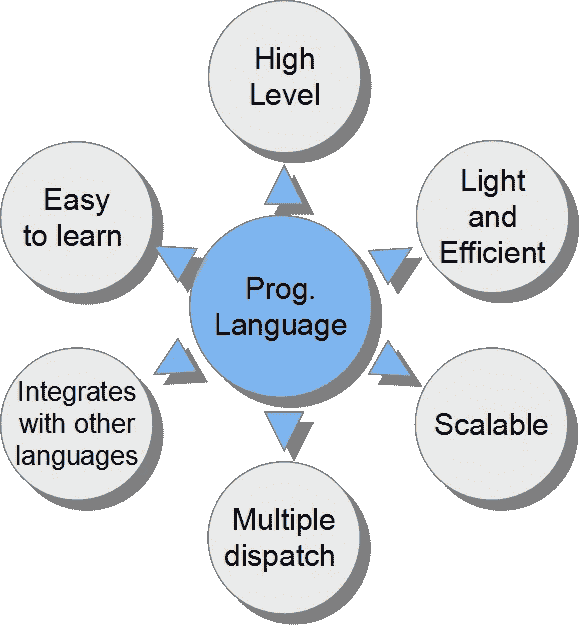

# Julia 及其在数据科学中的用途

> 原文：<https://towardsdatascience.com/julia-and-its-usefulness-in-data-science-6e9181504ff4?source=collection_archive---------0----------------------->

作者:扎卡里亚斯·沃尔加里斯

Julia 是一种相对较新的编程语言，由麻省理工学院的一组研究人员为数据科学开发。不像其他擅长利基用例的编程语言，Julia 是一种面向各种应用程序和更多受众的多用途语言。最近，随着越来越多的包进入 Julia 生态系统，它在数据科学中的有用性变得更加明显。

Julia 是一种很好的通用编程语言，因为它有六个要点。首先，它轻便高效。为了运行相对复杂的 Julia 脚本，您不需要拥有最先进的机器。事实上，在一些用例中，Julia 使用了非常轻量级的计算机，比如微型计算机，来实时执行计算密集型操作。这在新数据科学和数据工程中特别有用，因为它允许更好地利用现有资源。

Julia 的另一个优势是可伸缩性。很难高估这种优势的价值，尤其是。在当今的大规模数据世界中。Julia 不需要大数据框架来扩大规模。向运行 Julia 的系统添加更多的资源，并在 Julia 内核上运行必要的命令，可以让您的脚本以相当直接的方式进行扩展。不用说，这对数据科学至关重要。

Julia 也是一种多调度语言。这允许它有更直观的函数名，可以处理多个任务，这取决于您给它们的输入。因此，您可以拥有一个可以处理所有变量的函数，而不是拥有一堆相同函数的不同变体，每个变体都专用于一组特定的参数，Julia 可以选择最适合您提供给该函数的参数的方法。这使得函数池更容易理解和记忆，可以在数据科学项目中使用。

与其他一些语言不同，Julia 与开发人员和数据科学家中流行的现有编程语言集成得很好。比如你可以通过 Julia 调用一个 C，Python，R 脚本。这使得将 Julia 集成到您的工作流中变得更加容易，促进了整个数据科学管道。

此外，Julia 是一种高级语言，使得理解和管理 Julia 脚本更加容易(即使您不是这种语言的专家)。这与这种语言的另一个优势联系得很好，那就是它的易学性。如果您的团队中有数据科学家需要为某个特定项目学习它，这一点尤其重要，一般来说，完成这一任务不需要花费太多时间或资源。

正如我们之前提到的，Julia 是一种高性能语言。在相应的图形中可以看到，其性能与计算机科学中使用多年的低级语言 C 和 Fortran 不相上下。这一点怎么强调都不为过。Julia 与难以编写代码的语言不相上下(这通常是那些学习编程多年的软件开发人员所做的事情)。然而，用这种语言创建原型是相当容易的。因此，Julia 解决了两种语言的问题，当涉及到数据科学应用程序时，您可以使用一种语言(通常是 Python 或 R)创建 PoC，而使用另一种语言(通常是 C++或 Java)在生产中实现它。

朱莉娅吸引了科学界和工业界的许多人。这导致了包和库的开发，它们与用低级语言编写的包和库一样高效。因此，毫不奇怪，Julia 社区正在迅速发展，它已经成为跨不同行业的灵活工具。它会成为下一个数据科学语言吗？很有可能。你会从中受益吗？嗯，那主要取决于你。

如果你正在寻找一种直接的方法来学习如何在数据科学中使用 Julia，我教了一门 8 周 50 小时的课程。[点击此处查看更多详情](http://ivydatascience.com/ds-julia/)。