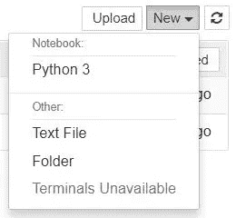
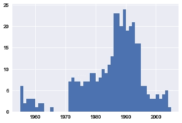
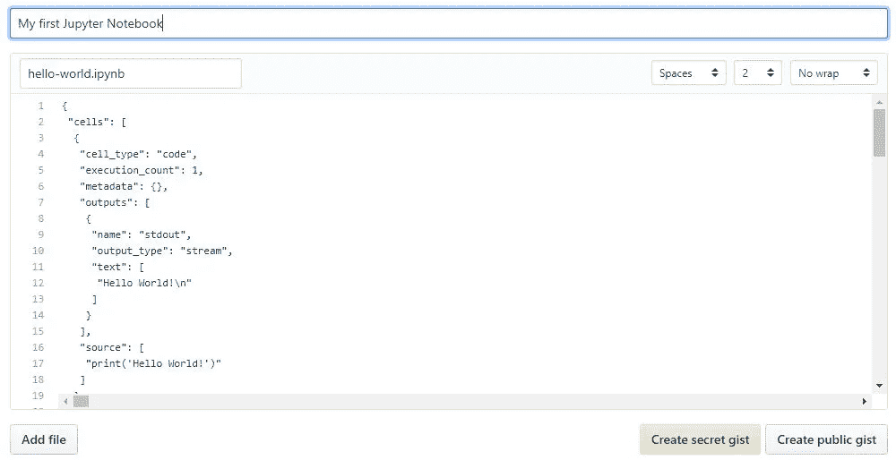

# 初学者 Jupyter 笔记本:教程

> 原文：<https://towardsdatascience.com/jupyter-notebook-for-beginners-a-tutorial-f55b57c23ada?source=collection_archive---------4----------------------->


[Photo](https://pixabay.com/illustrations/learning-hint-school-subject-3245793/) by [Harish Sharma](https://pixabay.com/users/harishs-3407954/) on [Pixabay](https://pixabay.com/)

Jupyter Notebook 是一个非常强大的交互式开发和展示数据科学项目的工具。笔记本将代码及其输出集成到一个文档中，该文档结合了可视化、叙述性文本、数学方程和其他富媒体。直观的工作流促进了迭代和快速开发，使笔记本电脑成为当代数据科学、分析以及越来越普遍的科学的核心中越来越受欢迎的选择。最棒的是，作为开源项目 Jupyter 的一部分，它们是完全免费的。

Jupyter 项目是早期 IPython 笔记本的继任者，该笔记本于 2010 年作为原型首次发布。尽管在 Jupyter 笔记本中可以使用许多不同的编程语言，但本文将重点讨论 Python，因为它是最常见的用例。

为了从本教程中获得最大收益，你应该熟悉编程，特别是 Python 和[熊猫](https://pandas.pydata.org/)。也就是说，如果你有使用另一种语言的经验，本文中的 Python 不应该太神秘，pandas 应该是可解释的。Jupyter 笔记本也可以作为一个灵活的平台来掌握 pandas 甚至 Python，这一点在本文中会变得很明显。

我们将:

*   涵盖安装 Jupyter 和创建您的第一台笔记本的基础知识
*   深入钻研，学习所有重要的术语
*   探索在线共享和发布笔记本有多容易。的确，这篇文章*是*一本 Jupyter 笔记本！这里的所有内容都是在 Jupyter 笔记本环境中编写的，您正在以只读形式查看它。

# Jupyter 笔记本中的示例数据分析

我们将通过一个示例分析来回答一个现实生活中的问题，这样您就可以看到笔记本的流程如何让任务直观地通过我们自己来完成，以及当我们与他人分享时让他人理解。

假设你是一名数据分析师，你的任务是找出美国最大公司的利润历史变化。你会发现一组财富 500 强公司的数据，从 1955 年第一次发布到现在已经超过 50 年了，这些数据来自财富的公共档案库。我们已经创建了一个 CSV 格式的数据，您可以在这里使用。

正如我们将要展示的，Jupyter 笔记本非常适合这项调查。首先，让我们继续安装 Jupyter。

# 装置

初学者开始使用 Jupyter 笔记本最简单的方法是安装 [Anaconda](https://anaconda.org/) 。Anaconda 是数据科学中使用最广泛的 Python 发行版，预装了所有最流行的库和工具。除了 Jupyter，Anaconda 中一些最大的 Python 库包括 [NumPy](http://www.numpy.org/) 、 [pandas](https://pandas.pydata.org/) 和 [Matplotlib](https://matplotlib.org/) ，尽管[完整的 1000+列表](https://docs.anaconda.com/anaconda/packages/pkg-docs)已经很详尽了。这使您可以在自己的全面储备的数据科学研讨会中立即投入运行，而不会有管理无数安装的麻烦，也不会担心依赖关系和特定于操作系统(即特定于 Windows)的安装问题。

要得到 Anaconda，很简单:

1.  [下载](https://www.anaconda.com/download/)Python 3 的 Anaconda 最新版本(忽略 Python 2.7)。
2.  按照下载页面和/或可执行文件中的说明安装 Anaconda。

如果您是已经安装了 Python 的高级用户，并且喜欢手动管理您的包，那么您可以只使用 pip:

# 创建您的第一个笔记本

在本节中，我们将了解如何运行和保存笔记本，熟悉它们的结构，并理解界面。我们将熟悉一些核心术语，引导您实际理解如何自己使用 Jupyter 笔记本电脑，并为下一部分做好准备，这一部分将逐步介绍一个示例数据分析，并将我们在此学到的一切融入生活。

# 跑步 Jupyter

在 Windows 上，您可以通过 Anaconda 添加到开始菜单的快捷方式来运行 Jupyter，这将在您的默认 web 浏览器中打开一个新的选项卡，看起来应该类似于下面的截图。


这还不是一个笔记本，但不要惊慌！没什么大不了的。这是笔记本仪表盘，专门用于管理您的 Jupyter 笔记本。将它视为探索、编辑和创建笔记本的发射台。

请注意，仪表板将只允许您访问 Jupyter 启动目录中包含的文件和子文件夹；但是，启动目录[可以更改](https://stackoverflow.com/q/35254852/604687)。也可以在任何系统上通过命令提示符(或 Unix 系统上的终端)输入命令`jupyter notebook`来启动仪表板；在这种情况下，当前工作目录将是启动目录。

敏锐的读者可能已经注意到仪表板的 URL 类似于`http://localhost:8888/tree`。Localhost 不是一个网站，但它表明内容是从您的本地机器(您自己的计算机)提供的。Jupyter 的笔记本和仪表板是 web 应用程序，Jupyter 启动了一个本地 Python 服务器来为您的 web 浏览器提供这些应用程序，使其基本上独立于平台，并打开了更容易在 web 上共享的大门。

仪表板的界面基本上是不言自明的——尽管我们稍后会简单地回到它。那么我们还在等什么呢？浏览到您想要创建第一个笔记本的文件夹，单击右上角的“新建”下拉按钮，然后选择“Python 3”(或您选择的版本)。



嘿，很快，我们到了！您的第一个 Jupyter 笔记本将在新选项卡中打开，每个笔记本都使用自己的选项卡，因为您可以同时打开多个笔记本。如果你切换回仪表板，你会看到新的文件`Untitled.ipynb`，你应该会看到一些绿色的文字，告诉你你的笔记本正在运行。

## 什么是 ipynb 文件？

理解这个文件到底是什么会很有用。每个`.ipynb`文件都是一个文本文件，以一种叫做 [JSON](https://en.wikipedia.org/wiki/JSON) 的格式描述你笔记本的内容。每个单元格及其内容，包括已经转换为文本字符串的图像附件，与一些[元数据](https://ipython.org/ipython-doc/3/notebook/nbformat.html#metadata)一起列在其中。如果你知道你在做什么，你可以自己编辑它！—从笔记本的菜单栏中选择“编辑>编辑笔记本元数据”。

也可以从仪表盘上的控件中选择“编辑”来查看笔记本文件的内容，但这里的关键词是“*可以*”；除非你真的知道自己在做什么，否则除了好奇没有别的原因。

# 笔记本界面

现在你面前有一个打开的笔记本，它的界面看起来不会完全陌生；毕竟，Jupyter 本质上只是一个高级的文字处理器。为什么不四处看看呢？检查一下菜单，感受一下，特别是花一些时间向下滚动命令面板中的命令列表，命令面板是带有键盘图标的小按钮(或`Ctrl + Shift + P`)。


你应该注意到两个相当突出的术语，它们可能对你来说是新的:*细胞*和*内核*是理解 Jupyter 的关键，也是它不仅仅是一个文字处理器的关键。好在这些概念并不难理解。

*   内核是一个“计算引擎”，它执行笔记本文档中包含的代码。
*   单元是显示在笔记本中的文本或由笔记本内核执行的代码的容器。

# 细胞

稍后我们将回到内核，但首先让我们来了解一下细胞。细胞构成了笔记本的主体。在上一节中新笔记本的屏幕截图中，带有绿色轮廓的框是一个空单元格。我们将介绍两种主要的细胞类型:

*   一个**代码单元**包含要在内核中执行的代码，并在下面显示其输出。
*   **Markdown 单元格**包含使用 Markdown 格式化的文本，并在运行时就地显示其输出。

新笔记本中的第一个单元格总是代码单元格。让我们用一个经典的 hello world 例子来测试一下。在单元格中输入`print('Hello World!')`，点击上方工具栏中的运行按钮或按下`Ctrl + Enter`。


结果应该是这样的:

```
Hello World!
```

当您运行该单元时，其输出将显示在下方，其左侧的标签将从`In [ ]`变为`In [1]`。代码单元的输出也构成了文档的一部分，这就是为什么您可以在本文中看到它。您总是可以区分代码单元格和降价单元格，因为代码单元格的标签在左边，而降价单元格没有。标签的“In”部分是“Input”的简称，而标签号表示单元在内核上执行的时间——在这种情况下，单元首先被执行。再次运行该单元，标签将变为`In [2]`，因为现在该单元是第二个在内核上运行的单元。当我们更仔细地研究内核时，会更清楚为什么这是如此有用。

从菜单栏中，点击*插入*并选择*在*下方插入单元格，在第一个单元格下方创建一个新的代码单元格，并尝试以下代码，看看会发生什么。你注意到什么不同了吗？

这个单元格不产生任何输出，但是它确实需要三秒钟来执行。请注意 Jupyter 是如何通过将标签更改为`In [*]`来表示该单元当前正在运行的。

一般来说，单元格的输出来自于在单元格执行期间专门打印的任何文本数据，以及单元格中最后一行的值，无论是单独的变量、函数调用还是其他。例如:

```
'Hello, Tim!'
```

您会发现自己在自己的项目中几乎经常使用这种方法，以后我们会看到更多。

# 快捷键

运行单元格时，您可能观察到的最后一件事是，它们的边框变成了蓝色，而在编辑时它是绿色的。总是有一个“活动”单元格用边框高亮显示，边框的颜色表示其当前模式，其中绿色表示“编辑模式”，蓝色表示“命令模式”

到目前为止，我们已经看到了如何使用`Ctrl + Enter`运行单元，但是还有更多。键盘快捷键是 Jupyter 环境中非常流行的一个方面，因为它们促进了基于单元格的快速工作流。其中许多操作是您可以在活动单元格处于命令模式时执行的。

下面，你会发现一些 Jupyter 的键盘快捷键列表。你不需要马上去做，但是这个列表会让你知道什么是可能的。

*   分别用`Esc`和`Enter`在编辑和命令模式之间切换。

一旦进入命令模式:

*   用`Up`和`Down`键上下滚动单元格。
*   按下`A`或`B`在当前单元格的上方或下方插入一个新单元格。
*   `M`将当前单元格转换为降价单元格。
*   `Y`将当前单元格设置为代码单元格。
*   `D + D` ( `D`两次)将删除当前单元格。
*   `Z`将撤消单元格删除。
*   按住`Shift`并按下`Up`或`Down`一次选择多个单元格。

选择多个单元格:

*   `Shift + M`将合并您的选择。
*   `Ctrl + Shift + -`，在编辑模式下，将光标处的活动单元格拆分。
*   您也可以点击单元格左边的空白处的和`Shift + Click`来选择它们。

继续在你自己的笔记本上尝试这些。一旦你有了一个剧本，创建一个新的降价单元，我们将学习如何在我们的笔记本上设置文本格式。

# 降价

Markdown 是一种轻量级的、易于学习的标记语言，用于格式化纯文本。它的语法与 HTML 标签一一对应，所以这里的一些先验知识会有所帮助，但绝对不是先决条件。请记住，这篇文章是在 Jupyter 笔记本上写的，所以到目前为止，您看到的所有叙述性文本和图像都是在 Markdown 中实现的。让我们用一个简单的例子来介绍一下基础知识。

```
# This is a level 1 heading
## This is a level 2 heading
This is some plain text that forms a paragraph.
Add emphasis via **bold** and __bold__, or *italic* and _italic_.Paragraphs must be separated by an empty line.* Sometimes we want to include lists.
 * Which can be indented.1\. Lists can also be numbered.
2\. For ordered lists.[It is possible to include hyperlinks]([https://www.example.com](https://www.example.com))Inline code uses single backticks: `foo()`, and code blocks use triple backticks:```
bar()
```

Or can be intented by 4 spaces:

    foo()

And finally, adding images is easy: )
```

附加图像时，您有三种选择:

*   使用网络上图像的 URL。
*   使用一个本地 URL 链接到您将与笔记本一起保存的图像，比如在同一个 git repo 中。
*   通过“编辑>插入图像”添加附件；这将把图像转换成一个字符串并存储在你的笔记本`.ipynb`文件中。
*   请注意，这将使您的`.ipynb`文件更大！

Markdown 还有很多细节，特别是关于超链接，也可以简单地包含普通的 HTML。一旦你发现自己正在挑战上述基础知识的极限，你可以参考创作者约翰·格鲁伯在其网站上提供的官方指南。

# 核

每台笔记本背后都运行着一个内核。当您运行一个代码单元时，该代码在内核中执行，任何输出都返回到该单元进行显示。内核的状态会随着时间的推移在单元格之间持续存在——它属于整个文档，而不是单个单元格。

例如，如果您在一个单元格中导入库或声明变量，它们将在另一个单元格中可用。通过这种方式，您可以认为笔记本文档有点类似于脚本文件，只是它是多媒体的。让我们试试这个来感受一下。首先，我们将导入一个 Python 包并定义一个函数。

一旦我们执行了上面的单元格，我们可以在任何其他单元格中引用`np`和`square`。

```
1 squared is 1
```

不管笔记本中单元格的顺序如何，这都将有效。你可以自己试试，我们再把变量打印出来。

```
Is 1 squared is 1?
```

这里没有惊喜！但是现在让我们改变`y`。

如果我们再次运行包含我们的`print`语句的单元格，您认为会发生什么？我们会得到输出`Is 4 squared is 10?`！

大多数情况下，笔记本中的流程是自上而下的，但经常会回头进行修改。在这种情况下，每个单元格左边的执行顺序，比如`In [6]`，将让您知道是否有任何单元格有过时的输出。如果你想重新设置，内核菜单中有几个非常有用的选项:

*   重启:重启内核，从而清除所有已定义的变量等。
*   重新启动并清除输出:同上，但也会清除代码单元格下方显示的输出。
*   重启并运行全部:同上，但也将从第一个到最后一个顺序运行所有单元格。

如果您的内核卡在一个计算上，并且您希望停止它，您可以选择 Interupt 选项。

## 选择内核

你可能注意到了，Jupyter 给了你改变内核的选项，事实上有很多不同的选项可供选择。当您通过选择 Python 版本从仪表板创建新笔记本时，您实际上是在选择使用哪个内核。

不仅有不同版本 Python 的内核，还有超过 100 种语言的[内核，包括 Java，C，甚至 Fortran。数据科学家可能对](https://github.com/jupyter/jupyter/wiki/Jupyter-kernels) [R](https://irkernel.github.io/) 和 [Julia](https://github.com/JuliaLang/IJulia.jl) 的内核，以及 [imatlab](https://github.com/imatlab/imatlab) 和 [Calysto MATLAB 的内核](https://github.com/calysto/matlab_kernel)特别感兴趣。 [SoS 内核](https://github.com/vatlab/SOS)在一台笔记本电脑中提供多语言支持。每个内核都有自己的安装说明，但可能需要您在计算机上运行一些命令。

# 实例分析

现在我们已经看了什么是 Jupyter 笔记本，是时候看看它们在实践中是如何使用的，这会让你更清楚地了解为什么它们如此受欢迎。终于到了开始使用前面提到的财富 500 强数据集的时候了。请记住，我们的目标是找出美国最大的公司的利润是如何历史变化的。

值得注意的是，每个人都将发展自己的喜好和风格，但一般原则仍然适用，如果你愿意，你可以在自己的笔记本上跟随这一部分，这给了你发挥的空间。

# 命名您的笔记本

在开始编写项目之前，您可能希望给它起一个有意义的名称。可能有些令人困惑的是，你不能从笔记本应用程序本身命名或重命名你的笔记本，而是必须使用仪表板或你的文件浏览器来重命名`.ipynb`文件。我们将返回到仪表板来重命名您之前创建的文件，它将具有默认的笔记本文件名`Untitled.ipynb`。

您不能在笔记本运行时对其进行重命名，因此您必须先将其关闭。最简单的方法是从笔记本菜单中选择“文件>关闭并暂停”。但是，您也可以关闭内核，方法是在笔记本应用程序中进入“内核>关闭”，或者在仪表板中选择笔记本，然后单击“关闭”(见下图)。


然后，您可以选择您的笔记本电脑，并单击仪表板控件中的“重命名”。


请注意，关闭浏览器中的“笔记本”选项卡将**而不是**“关闭”您的笔记本，就像在传统应用程序中关闭文档一样。笔记本的内核将继续在后台运行，并且需要在它真正“关闭”之前关闭——尽管如果你不小心关闭了标签或浏览器，这是非常方便的！如果内核关闭，您可以关闭标签页，而不用担心它是否还在运行。

一旦你命名了你的笔记本，打开它，我们就可以开始了。

# 设置

通常从专门用于导入和设置的代码单元开始，这样，如果您选择添加或更改任何内容，您可以简单地编辑并重新运行该单元，而不会导致任何副作用。

我们导入[熊猫](https://pandas.pydata.org/)来处理我们的数据， [Matplotlib](https://matplotlib.org/) 来绘制图表，以及 [Seaborn](https://seaborn.pydata.org/) 来使我们的图表更漂亮。导入 [NumPy](http://www.numpy.org/) 也很常见，但是在这种情况下，虽然我们通过 pandas 使用它，但是我们不需要显式地导入。第一行不是 Python 命令，而是使用一种叫做 line magic 的东西来指示 Jupyter 捕获 Matplotlib 图并在单元格输出中呈现它们；这是超出本文范围的一系列高级特性之一。

让我们继续加载我们的数据。

明智的做法是在单个单元格中也这样做，以防我们需要在任何时候重新加载它。

# 保存和检查点

现在我们已经开始了，定期储蓄是最好的做法。按下`Ctrl + S`会通过调用“保存和检查点”命令来保存你的笔记本，但是这个检查点是什么东西呢？

每次创建新笔记本时，都会创建一个检查点文件以及您的笔记本文件；它将位于保存位置的一个隐藏子目录中，名为`.ipynb_checkpoints`，也是一个`.ipynb`文件。默认情况下，Jupyter 会每隔 120 秒自动将您的笔记本保存到该检查点文件，而不会改变您的主笔记本文件。当您“保存并检查”时，笔记本和检查点文件都会更新。因此，检查点使您能够在出现意外问题时恢复未保存的工作。您可以通过“文件>恢复到检查点”从菜单恢复到检查点

# 调查我们的数据集

现在我们真的开始了！我们的笔记本被安全保存，我们已经将数据集`df`加载到最常用的 pandas 数据结构中，该结构被称为`DataFrame`，基本上看起来像一个表。我们的看起来像什么？

看起来不错。我们有我们需要的列，每一行对应于一年中的一家公司。

让我们重新命名这些列，以便以后引用它们。

接下来，我们需要探索我们的数据集。完成了吗？熊猫如预期的读了吗？是否缺少任何值？

```
25500
```

好的，看起来不错——从 1955 年到 2005 年，每年都有 500 行。

让我们检查一下我们的数据集是否像我们期望的那样被导入了。一个简单的检查是查看数据类型(或 dtypes)是否被正确解释。

```
year      int64
rank      int64
company   object
revenue   float64
profit    object
dtype: object
```

啊哦。看起来利润栏有问题——我们希望它像收入栏一样是一个`float64`。这表明它很可能包含一些非整数值，所以我们来看看。

正如我们所怀疑的！有些值是字符串，用于指示丢失的数据。有没有其他的价值观已经悄然进入？

```
{'N.A.'}
```

这很容易解释，但是我们应该怎么做呢？嗯，那要看少了多少个值。

```
369
```

这只是我们数据集的一小部分，尽管并非完全无关紧要，因为它仍然在 1.5%左右。如果包含`N.A.`的行在这些年中大致均匀分布，最简单的解决方法就是删除它们。所以让我们快速看一下分布情况。



一眼看去，我们可以看到一年中最无效的值少于 25，并且由于每年有 500 个数据点，删除这些值将占最差年份数据的不到 4%。事实上，除了 90 年代左右的飙升，大多数年份都不到峰值的一半。出于我们的目的，假设这是可以接受的，并继续删除这些行。

我们应该检查一下是否有效。

```
25131
```

```
year      int64
rank      int64
company   object
revenue   float64
profit    float64
dtype: object
```

太好了！我们已经完成了数据集设置。

如果您要将笔记本显示为报告，您可以去掉我们创建的调查单元格(此处包含这些单元格是为了演示使用笔记本的流程),并合并相关单元格(请参阅下面的高级功能部分了解更多信息)以创建单个数据集设置单元格。这意味着，如果我们在其他地方弄乱了数据集，我们可以重新运行 setup 单元来恢复它。

# 使用 matplotlib 绘图

接下来，我们可以通过绘制每年的平均利润来解决手头的问题。我们也可以绘制收入图，所以首先我们可以定义一些变量和一个减少代码的方法。

现在我们来策划！


哇，这看起来像一个指数，但它有一些巨大的下降。它们必须与 20 世纪 90 年代初的衰退和 T2 的网络泡沫相对应。在数据中看到这一点很有趣。但是，每次衰退之后，利润是如何恢复到更高水平的呢？

也许收入能告诉我们更多。


这增加了故事的另一面。收入没有受到如此严重的打击，这是财务部门的一些伟大的会计工作。

通过栈溢出的一点点帮助[，我们可以用+/-它们的标准偏差叠加这些图。](https://stackoverflow.com/a/47582329/604687)


这是惊人的，标准差是巨大的。一些财富 500 强公司赚了数十亿美元，而另一些公司却损失了数十亿美元，而且随着这些年利润的增加，风险也在增加。也许有些公司比其他公司表现更好；前 10%的利润比后 10%的利润波动更大还是更小？

接下来我们可以研究很多问题，很容易看出在笔记本上工作的流程是如何与一个人自己的思维过程相匹配的，所以现在是时候结束这个例子了。这个流程帮助我们轻松地在一个地方调查我们的数据集，而无需在应用程序之间切换上下文，并且我们的工作可以立即共享和重现。如果我们希望为特定的受众创建更简洁的报告，我们可以通过合并单元格和删除中间代码来快速重构我们的工作。

# 共享您的笔记本

当人们谈论共享他们的笔记本时，他们通常会考虑两种模式。大多数情况下，个人分享他们工作的最终结果，很像这篇文章本身，这意味着分享他们笔记本的非交互、预渲染版本；然而，也有可能在笔记本上与 aid 版本控制系统协作，例如 [Git](https://git-scm.com/) 。

也就是说，有一些[T4 的](https://mybinder.org/)[新兴公司](https://kyso.io/)出现在网络上，提供在云中运行交互式 Jupyter 笔记本的能力。

# 在分享之前

共享笔记本将完全按照导出或保存时的状态显示，包括任何代码单元格的输出。因此，为了确保您的笔记本可以共享，您应该在共享前采取以下几个步骤:

1.  单击“单元格>所有输出>清除”
2.  点击“内核>重启并全部运行”
3.  等待您的代码单元完成执行，并检查它们是否按预期执行

这将确保您的笔记本不包含中间输出，没有过时状态，并在共享时按顺序执行。

# 导出您的笔记本

Jupyter 内置了对导出为 HTML 和 PDF 以及其他几种格式的支持，你可以在“文件>下载为”下的菜单中找到如果您希望与一个小型私人团体共享您的笔记本电脑，此功能可能正是您所需要的。事实上，由于学术机构的许多研究人员都获得了一些公共或内部网络空间，并且因为您可以将笔记本导出为 HTML 文件，Jupyter 笔记本可以成为他们与同行分享成果的一种特别方便的方式。

但是如果共享导出的文件对你来说还不够，还有一些非常流行的方法可以更直接地在网上共享`.ipynb`文件。

# 开源代码库

随着 GitHub 上的[公共笔记本数量在 2018 年初超过 180 万，它无疑是最受欢迎的与世界分享 Jupyter 项目的独立平台。GitHub 已经集成了对直接在存储库和网站上的 gists 中呈现`.ipynb`文件的支持。如果你还不知道的话，](https://github.com/parente/nbestimate) [GitHub](https://github.com/) 是一个代码托管平台，用于版本控制和使用 [Git](https://git-scm.com/) 创建的存储库的协作。你需要一个帐户来使用他们的服务，但标准帐户是免费的。

一旦你有了 GitHub 账户，在 GitHub 上分享笔记本最简单的方法实际上根本不需要 Git。自 2008 年以来，GitHub 提供了 Gist 服务来托管和共享代码片段，每个代码片段都有自己的存储库。要使用 Gists 共享笔记本:

1.  登录并浏览至[gist.github.com](https://gist.github.com/)。
2.  在一个文本编辑器中打开你的`.ipynb`文件，选择全部并复制里面的 JSON。
3.  将笔记本 JSON 粘贴到要点中。
4.  给你的要点一个文件名，记住要加上`.ipynb`，否则就没用了。
5.  点按“创建秘密要点”或“创建公开要点”

这应该类似于以下内容:



如果你创建了一个公共 Gist，你现在可以和任何人分享它的 URL，其他人也可以[复制你的作品。](https://help.github.com/articles/forking-and-cloning-gists/)

创建自己的 Git 库并在 GitHub 上共享超出了本教程的范围，但是 [GitHub 提供了大量的指南](https://guides.github.com/)让你自己开始。

对于那些使用 git 的人来说，一个额外的提示是[为 Jupyter 创建的那些隐藏的`.ipynb_checkpoints`目录添加一个例外](https://stackoverflow.com/q/35916658/604687)到你的`.gitignore`中，这样就不会不必要地提交检查点文件到你的 repo 中。

# Nbviewer

到 2015 年，NBViewer 已经发展到每周渲染[数十万台](https://blog.jupyter.org/rendering-notebooks-on-github-f7ac8736d686)笔记本，是网络上最受欢迎的笔记本渲染器。如果你已经有一个地方可以在线存放你的 Jupyter 笔记本，无论是 GitHub 还是其他地方，NBViewer 都会呈现你的笔记本并提供一个可共享的 URL。作为 Jupyter 项目的一部分，它是免费提供的，可在[nbviewer.jupyter.org](https://nbviewer.jupyter.org/)获得。

NBViewer 最初是在 GitHub 的 Jupyter 笔记本集成之前开发的，它允许任何人输入 URL、Gist ID 或 GitHub 用户名/repo/file，它会将笔记本呈现为网页。Gist 的 ID 是其 URL 末尾的唯一数字；比如`https://gist.github.com/username/50896401c23e0bf417e89cd57e89e1de`中最后一个反斜杠后的字符串。如果您输入 GitHub 用户名或用户名/回购，您将看到一个最小的文件浏览器，让您浏览用户的回购及其内容。

显示笔记本时，NBViewer 显示的 URL 是一个常数，基于它所渲染的笔记本的 URL，因此您可以与任何人共享它，只要原始文件保持在线，它就可以工作-nb viewer 不会缓存文件很长时间。

# 最后的想法

从基础开始，我们已经掌握了 Jupyter 笔记本的自然工作流程，深入研究了 IPython 更高级的功能，并最终学会了如何与朋友、同事和世界分享我们的工作。我们从一台笔记本电脑上完成了这一切！

应该清楚笔记本如何通过减少上下文切换和模仿项目过程中思维的自然发展来促进高效的工作体验。Jupyter 笔记本的强大之处应该也是显而易见的，我们介绍了大量线索，让您开始探索自己项目中更高级的功能。

如果你想为你自己的笔记本获得更多灵感，Jupyter 已经收集了[一系列有趣的 Jupyter 笔记本](https://github.com/jupyter/jupyter/wiki/A-gallery-of-interesting-Jupyter-Notebooks)，你可能会觉得有帮助，并且[NBC viewer 主页](https://nbviewer.jupyter.org/)链接到一些真正高档的优质笔记本。也来看看我们的 [Jupyter 笔记本提示](https://www.dataquest.io/blog/jupyter-notebook-tips-tricks-shortcuts/)列表。

> 想了解更多关于 Jupyter 笔记本的信息？我们有[一个引导项目](https://www.dataquest.io/m/207/guided-project%3A-using-jupyter-notebook)你可能会感兴趣。