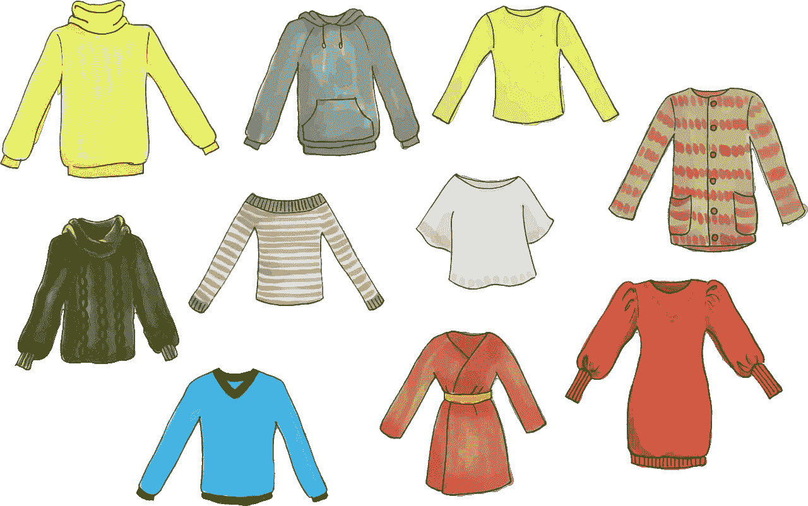
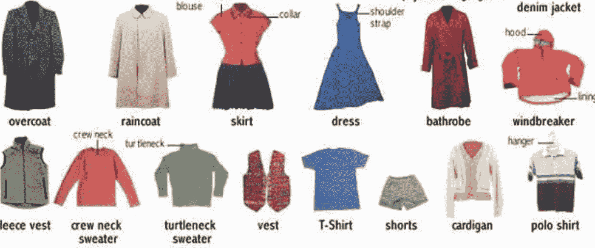
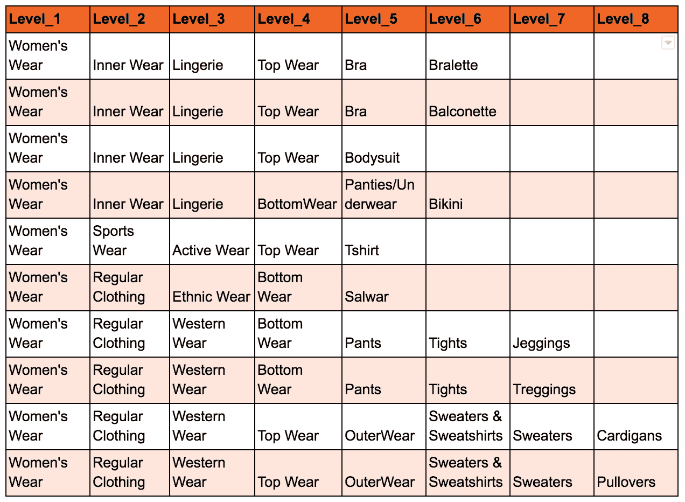
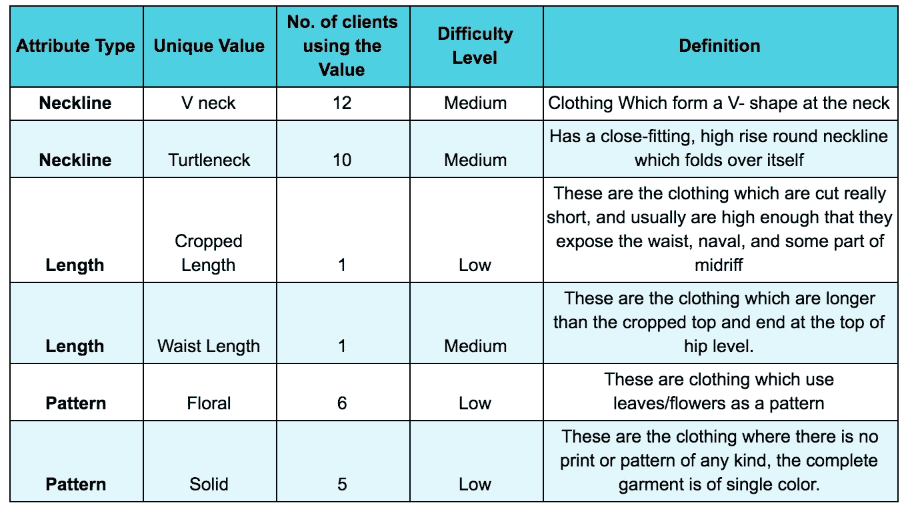
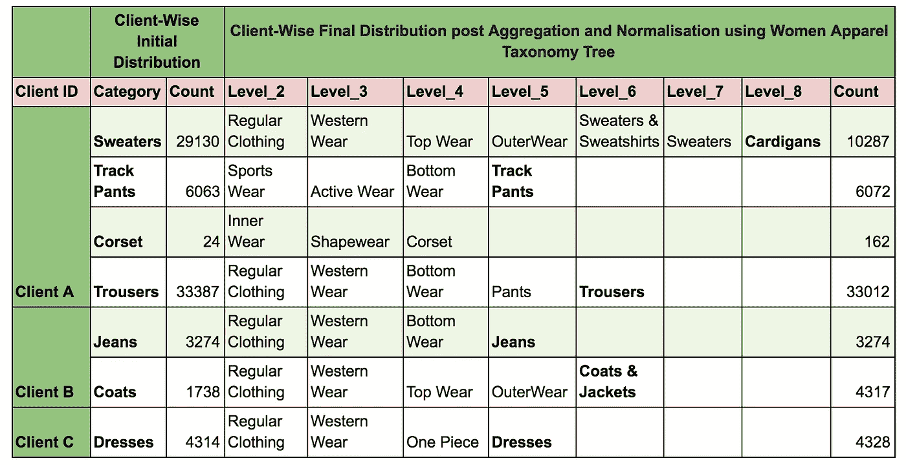
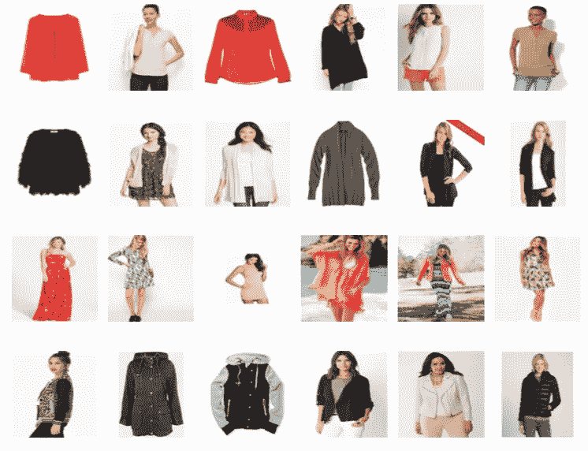

# 只是“一堆东西”和人工智能的魔力

> 原文：<https://towardsdatascience.com/just-pile-of-stuff-and-magic-of-ai-8bd651428b9d?source=collection_archive---------11----------------------->

*Pile of Stuff*

有多少次你逛商店，告诉他们，你需要一条裙子。但不是所有的裙子，你需要一条长及膝盖的裙子，看起来非常宽松，但没有很多褶皱，而且超级宽松。

等等，这不是真正的裙子，这是一种裤子，看起来像裙子，但不像裙子…

…或者类似的事情。

*你真的不知道。*

但是等等，如果你知道呢？知道它叫“裙裤”。

只需上网，寻找[裙裤](https://www.google.co.in/search?q=buy+culottes&rlz=1C5CHFA_enIN749IN749&oq=buy+culottes&aqs=chrome..69i57j0l5.3185j0j9&sourceid=chrome&ie=UTF-8)，瞧，你就可以挑选了。

或者你仍然继续寻找，但你至少知道你在寻找什么。:)

这就是[小队](https://www.squadplatform.com/)正在做的事情。不仅仅是映射正确的东西，或者定义它，或者给它标签，而是让用户能够从一堆东西中找到正确的东西。

想象你开了一个购物平台，你需要一些下装。第一页向你展示了什么是下装，并询问你是在找裤子、运动裤还是裙子。

如果你决定买一条裙子，它会向你展示裙子的几种选择。你知道铅笔裙和紧身衣有多么不同，你挑选它，选择合适的长度，选择合适的颜色，然后把它放到你的购物车里，瞧！世界感觉稍微好了一点，一切尽在你的指尖。

现在，想象一下上面的场景，仅仅好 10 倍，不仅是裙子，还有裤子，上衣，内衣，民族服装，以及所有其他种类的服装。

所有你曾经想到的，但现在更容易找到。

我知道你现在可能在想，这可能吗？你如何去每一家商店，告诉他们对你的“一堆东西”使用相同的定义？

甚至不同的网上购物平台都有自己喜欢的类别，在不同的建筑中寻找特定的商品就像在煤窖中寻找黑猫一样。

但是等等，你听说过一个叫艾的镇上的魔术师吗？只要一眨眼的功夫，它就能帮你找到你正在寻找的那条裙子，因为我们为魔鬼提供了类别和属性的详尽映射。

这就是我们在过去几个月里所做的。在我们的领域专家 Deepika Sai Chitkara 的帮助下，我们创建了一个详尽的类别和属性列表。

我们首先定义了女装，并创建了一个八级深度分类树。

**为什么有女装分类树？**

在 Squad，我们对来自不同客户的产品清单进行[内容审核和质量检查](https://www.squadplatform.com/blog/content-moderation-humans-ai/)。每个客户都有自己的分类来安排产品目录。根据我们的经验，我们观察到没有全球标准可循，至少在时尚领域是如此(在不同客户的分类法中)。相同产品的信息在不同客户之间不一致，例如*客户 A* 认为是裤子*客户 B* 认为是七分裤。

这让我们开始探索一个可以代表时尚行业标准的分类树。但令我们惊讶的是，我们没有发现任何这样的服装行业现有的标准化流程。这就是为什么我们开始研究一个分类树，它可以作为映射不同客户分类的标准。

**分类树中的前 5 个目标**

当我们开始构建女装的品类树和属性列表时，我们有以下目标。

1.  以聚合和标准化客户端上多个数据点。
2.  解决时尚的内容审核用例，并建议适当的类别。
3.  使用丰富和标准的概念，共同解决分类和归属的自动化问题。
4.  在联合模型的帮助下获得自动生成的描述。
5.  为基于搜索相关性和排名的用例创建更好的机器学习模型。

**我们的分类体系树快照&属性模板**

经过我们小型求解团队近一个月的努力，我们为女装建立了一个标准的分类树。以表格形式找到我们的标准分类树的快照。下表仅描述了我们的分类分类树中 218 个节点(女装概念)的 178 个唯一路径中的几个路径。

我们还创建了一个属性模板，其中包含不同客户的所有独特属性的值和指导原则。

在下面找到归因模板的快照，以及视觉相似性的“难度等级”。下表仅描述了我们属性模板中 5 种不同属性类型和 175 个唯一值中的少数属性和值。

**使用分类树和属性模板进行数据标准化和聚合**

我们的分类分类树和属性模板不仅有助于映射视觉上相似的概念并实现标准化，还能帮助我们消除数据集中的不一致。

一个详尽的 8 级深度树帮助我们聚集和标准化了不同客户的近 50–60%的数据点，并使女装分类和属性数据点的数量分别达到 130 万卢比和 40 万卢比，顶级概念下有 15000 多点。使用标准树，我们增加了每个类别的样本数量。因此，这有助于我们学习属性和分类的通用模型，以实现审核和质量检查的自动化。

为您提供一些关于它如何帮助我们消除数据稀疏性的统计数据:下面是一些产品在不同客户中不一致命名的分布表快照，以及使用我们的分类法的最终类别和数量。

我们使用干净和丰富的数据来执行各种实验，以正确分类和检索服装图像，而不使用边界框或丰富的注释来进行归因。我们一直在不断努力进一步改善我们的[基础设施](https://medium.com/@om.vedvasu/evolution-of-kernel-the-backbone-of-squadai-7c605ec64b28)，以便我们可以展示 Squad 的人工智能算法的炼金术，用于解决最复杂的消费者对消费者(C2C)内容调节问题，如时尚等用例。

Results using our categorisation pipeline without using bounding boxes or rich annotation on few leaf nodes of our Women’s Apparel Taxonomy Tree. Rows 1–4 are Blouses, Cardigans, Dresses, and Jackets.

**游戏规则改变者**

我们相信，我们现在是印度极少数成功打破女装分类的公司之一。结合我们已经到位的归因指导方针，我们可以成为新一代时尚商业的答案。

由于服装行业没有现成的标准化流程，这样的分类树可以作为 [ISO 61.020](https://www.iso.org/ics/61.020/x/) 未来项目书籍的垫脚石，包括内衣、睡衣、针织品、军装、针织品等。以及它们的标签和尺寸编码方案。我们的分类法也符合 Euratex 的标准，因此对欧洲组织很有用。

再次感谢我们的领域专家 Deepika Sai Chitkara、我们崭露头角的 MLE 实习生 Priyank Jain 和我们的运营团队为这个博客做出的重要贡献。

**对于不知道什么是“一堆东西”的人来说**

米兰达·普里斯特利:【*米兰达和几个助手正在为一套服装挑选两条相似的腰带。安迪窃笑，因为她认为他们看起来一模一样*有什么好笑的吗？

[安迪·萨克斯](http://www.imdb.com/name/nm0004266/?ref_=tt_trv_qu):不，不，不。没什么……你知道，只是这两条皮带在我看来完全一样。你知道，我还在学习这些东西，嗯…

米兰达·普里斯特利:‘这……东西’？哦。好吧。我明白了。你以为这跟你没关系。你走进你的衣橱，选择了……我不知道……那件凹凸不平的蓝色毛衣，比如说，因为你试图告诉世界，你太把自己当回事了，以至于不在乎你背上穿的是什么。但你不知道的是，那件毛衣不只是蓝色，也不是青绿色。不是青金石。其实是天蓝色的。你可能还不知道，2002 年，奥斯卡·德拉伦塔设计了一系列天蓝色礼服。然后我想是伊夫圣罗兰…不是他展示了天蓝色的军用夹克吗？我想我们需要一件夹克。然后天蓝色很快出现在八个不同设计师的作品中。然后它，呃，通过百货商店渗透下来，然后慢慢流到某个悲惨的休闲角落，毫无疑问，你是在那里从某个清仓垃圾箱里找到它的。然而，这种蓝色代表着数百万美元和无数的工作机会，你觉得自己做了一个让你远离时尚行业的选择，这有点滑稽，事实上，你穿着的毛衣是这个房间里的人从一堆东西中为你挑选的。