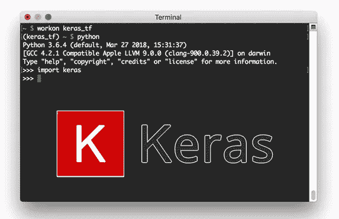
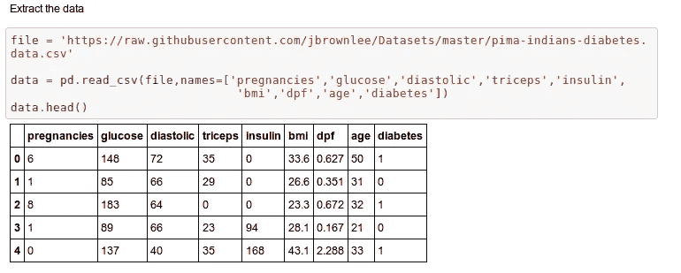
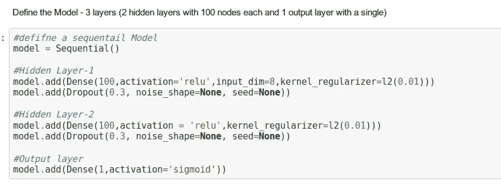
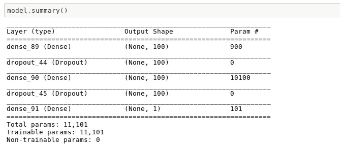
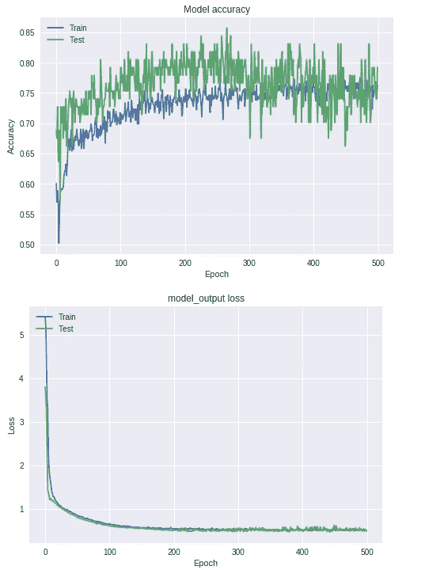
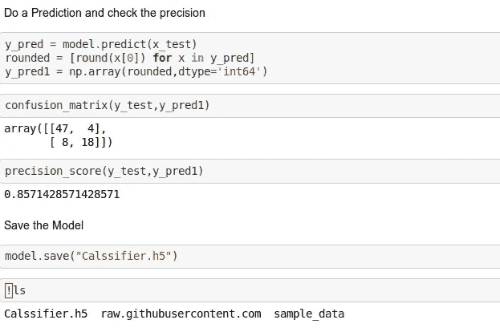

# 一个深度学习分类器！

> 原文：<https://towardsdatascience.com/k-as-in-keras-simple-classification-model-a9d2d23d5b5a?source=collection_archive---------8----------------------->

希望你知道这篇文章是关于什么的，是的，你是对的！它是关于使用 Keras API 构建一个简单的分类模型。众所周知，Keras 是目前最简单、用户友好和最受欢迎的深度学习库之一，它运行在 TensorFlow/Theano 之上。Keras 上完整的文档是 [**这里**](https://keras.io/) 。Kears 受欢迎是因为以下指导原则。

**模块化**:一个模型可以单独理解为一个序列或者一个图。

极简主义:它提供了足够的可读性。

**Python:** 一切都是原生 Python。

酷，让我们开始使用这个简单的框架构建一个简单的分类器。完整的代码在 [**GitHub**](https://github.com/Msanjayds/Keras/blob/master/Classification_Model_using_Keras.ipynb) 中。

**步骤 1:安装所需的库**

我已经用 [**GoogleColab**](https://colab.research.google.com/notebooks/welcome.ipynb) (感谢谷歌)建立了这个模型。因为所有需要的库都是预安装的，所以我们不需要担心安装它们。只是导入了如下所需的库和函数。

**第二步:加载并拆分数据**(训练并测试/验证)。

对于这个例子，我使用了 Pima Indianas 发病糖尿病数据集。它描述患者病历数据，并告知患者是否患有糖尿病(1:是，0:否)。所有的输入变量都是数值型的，所以我们可以很容易地直接在模型中使用它，而不需要太多的预处理。正如我们在下面看到的，我们有 8 个输入特征和一个输出/目标变量(糖尿病-1 或 0)。

我已经将输入特征和输出分成 x & y 变量。我使用 scikitlearn 的 train_test_split 函数将数据分成训练集和测试集(90:10)。拥有一个验证集对于通过检查我们的模型是否欠拟合、过拟合或泛化来调整模型更有用。

**第三步:** **定义模型**

我们使用的是一个**序列**模型，这是一个简单的线性层叠。我们可以通过向构造器一次传递一个层实例列表来创建这个模型，直到我们对网络拓扑满意为止。

在这个例子中，我使用了一个全连接的 3 层结构(2 个隐藏层，每个层有 100 个节点，1 个输出层有一个节点，不包括输入层)。使用**密集**类定义完全连接的层。层数和节点数是随机选择的。理想情况下，我们需要一个足够大的网络来学习/捕捉数据的趋势/结构。

在第一个隐藏层中，我们需要使用 **input_dim** 参数来指定输入维度的数量(在我们的例子中是 8 个特征)。对于每一层，我们需要指定激活函数(非线性)。我对隐藏层使用了“ **relu** ，因为它提供了比“tanh”更好的性能，对输出层使用了“ **sigmoid** ，因为这是一个二进制分类。

由于我们的训练集只有 691 个观察值，我们的模型很可能会过拟合，因此我对隐藏层应用了 **L2 调节**。权重正则化是一种减少深度学习神经网络模型对训练数据的过拟合并提高测试数据性能的方法。Keras 提供了 3 个**kernel _ regulator**实例(L1，L2，L1L2)，它们为损失函数增加了一个权重大小的惩罚，从而在一定程度上降低了它的预测能力，这反过来有助于防止过拟合。

我还使用了**辍学**正规化技术。在这种技术中，在训练过程中，一些随机选择的神经元被忽略，即“退出”。这里我使用了 0.3，即在每次迭代中，我们在给定的层中随机丢弃 30%的神经元。如果需要，我们可以为每个层设置不同的辍学率。由于丢失，它们对下游神经元激活的贡献被暂时取消，并且在向后传递期间没有权重更新被应用于那些神经元。

*如果神经元在训练过程中被随机丢弃，那么其他神经元必须介入并处理对丢失的神经元进行预测所需的表示。这导致所有神经元更好地学习，因此网络对神经元的特定权重变得不太敏感，因此泛化能力更好，不太可能过度拟合。*

**第四步:** **编译模型**

这里，我们需要让模型知道使用什么损失函数来计算损失，使用哪个优化器来减少损失/找到最佳权重/偏差值，以及使用什么指标来评估模型性能。

我们使用**‘二元交叉熵**(负对数损失)’作为我们的损失函数，因为我们只有两个目标类。如果我们的类多于两个，我们可以选择范畴交叉熵。

接下来是模型训练最重要的超参数，**优化器，**在我们的例子中，我们使用了“**亚当**”(自适应矩估计)。其他优化器在整个训练过程中保持单一的学习速率，其中 Adam 随着训练的进行采用学习速率(自适应学习速率)。Adam 结合了 SGD(随机梯度下降)的其他两个扩展的优点，即均方根传播(RMSProp)和自适应梯度算法(AdaGrad)。它利用了 RMSProp 的最大优点，并将它们与动量优化的思想相结合。结果是一个允许快速有效优化的策略。下图显示了不同优化器在迭代过程中训练成本的下降。Adam 提供了最佳性能，收敛速度很快。

下一个参数是“**指标**，用于判断我们模型的性能。其类似于损失函数，除了在训练模型时不使用评估度量的结果。我们使用准确性(**ACC**’)作为我们的度量，它返回一个单一的张量值，代表所有数据点的平均值。

从下面的模型总结中，我们可以看到我们模型的可训练参数细节。(请忽略单词 dense 旁边的数字，如 dense_89、dense_90 等。)

第一层总共有 900 个参数((100 * 8)权重+ (100 * 1)偏差)

第二层有 10100 个参数((100 * 100)权重+ (100 * 1)偏差= 10100)。总的来说，这个模型有 11，101 个可训练参数。

**第五步:训练模型**

编译后，我们可以使用' **fit** '方法训练模型。我们使用训练集(x_train，y_train)来训练模型。我已经用 20 的 batch_size 运行了 500 个**时期**的模型。 **Batch_size** 也是一个随机数(理想值为 10 到 124 ),取决于我们拥有的数据量，它决定了一次迭代中使用的训练样本的数量。因此，在一个给定的时期，我们将有许多迭代。Verbose 可以设置为 0 或 1，它打开/关闭每个时期的日志输出。我们可以使用 **validation_data** 参数提供用于评估损失的 validation_data 和每个时期结束时的任何模型指标，模型将**不会根据该验证数据进行**训练。

with verbose = 1

正如我们在上面看到的，来自最后一个历元的训练精度大约是 75.55，验证精度是 76.62。所有时期的平均训练精度约为 73.03%，平均验证精度为 76.45%。我想这还算可以😉。下图显示了各时期训练和测试数据的准确性和损失。

使用' **predict** '方法对测试数据进行预测，并得出混淆度量。这表明在 77 个测试样本中，我们错分了 12 个样本。我们的准确率达到了 85.7%。

这就是这篇文章的全部内容，非常感谢你阅读到这里。非常欢迎你的评论/建议/纠正。如果你喜欢这个帖子，请👏。下次博客再见。