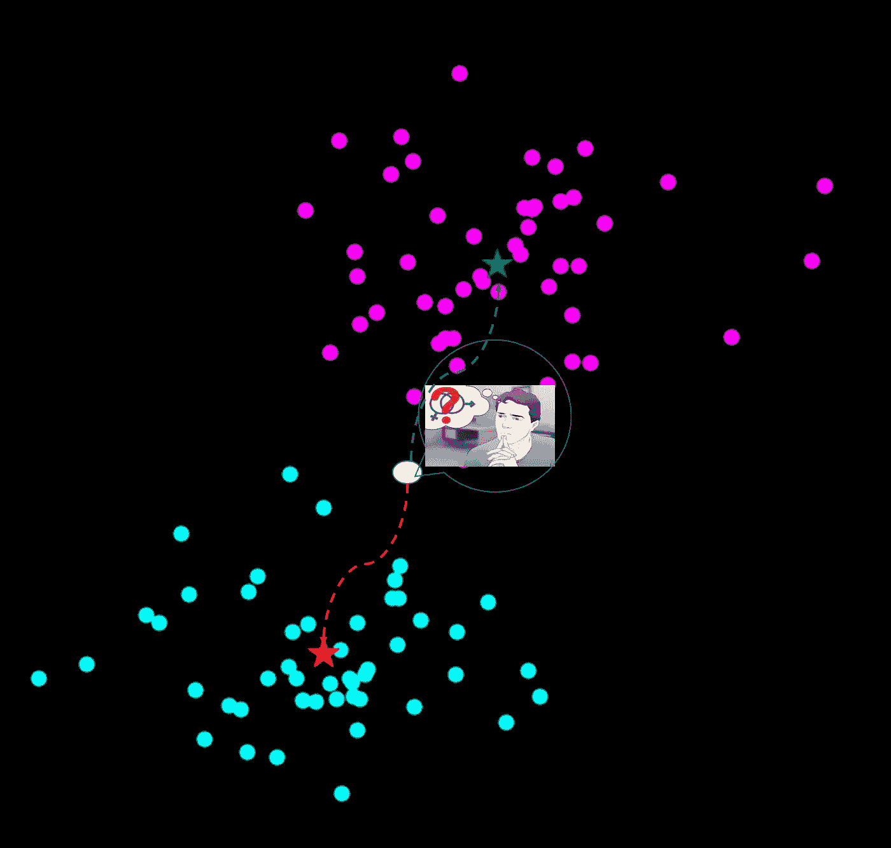
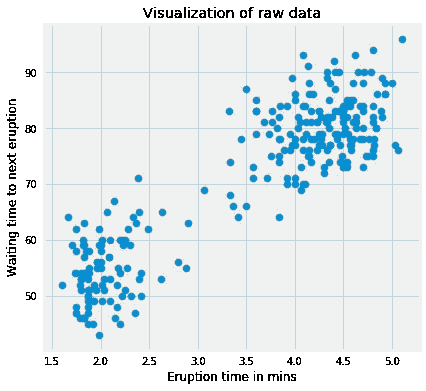
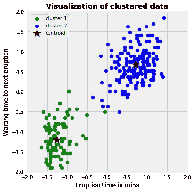
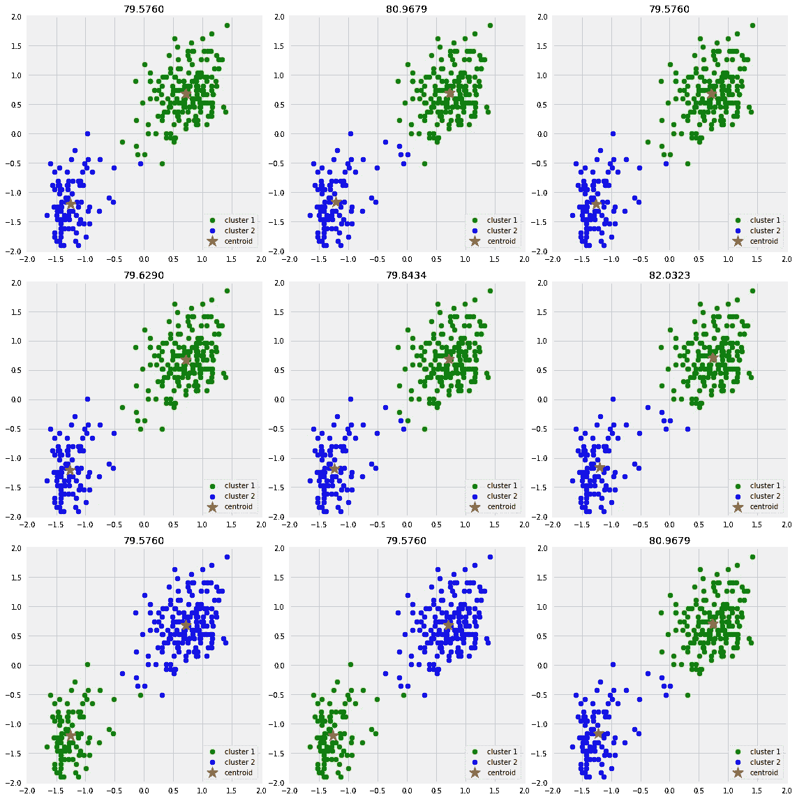
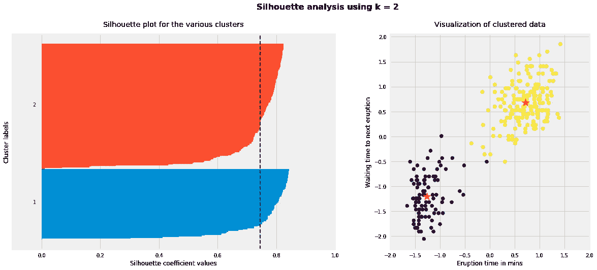
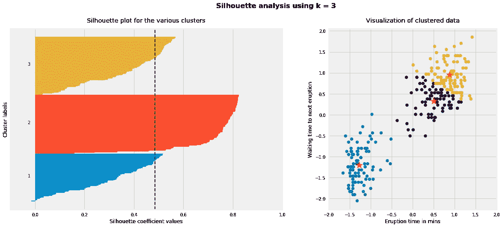
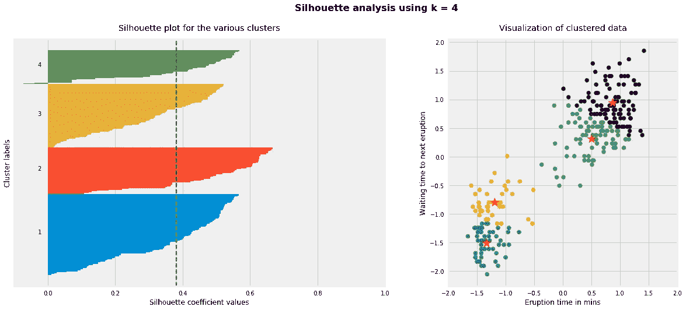
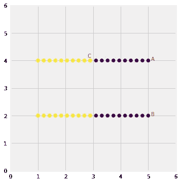
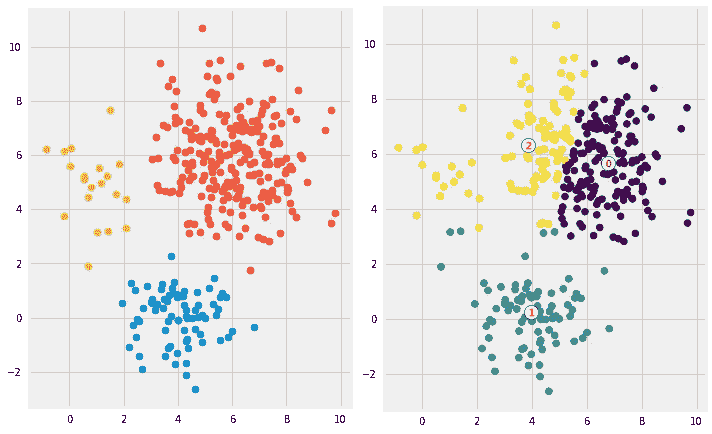
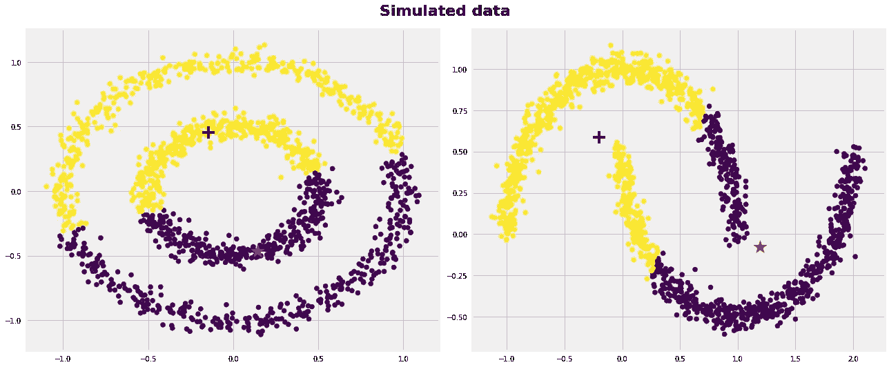

# k-均值聚类:算法、应用、评价方法和缺点

> 原文：<https://towardsdatascience.com/k-means-clustering-algorithm-applications-evaluation-methods-and-drawbacks-aa03e644b48a?source=collection_archive---------0----------------------->

# 使聚集

**聚类**是最常见的探索性数据分析技术之一，用于获得关于数据结构的直觉。它可以被定义为识别数据中的子组的任务，使得同一子组(聚类)中的数据点非常相似，而不同聚类中的数据点非常不同。换句话说，我们试图在数据中找到同质的子组，使得每个聚类中的数据点根据相似性度量(例如基于欧几里德的距离或基于相关性的距离)尽可能相似。使用哪种相似性度量的决定是特定于应用的。

聚类分析可以在特征的基础上进行，我们试图根据特征找到样本的子组，或者在样本的基础上进行，我们试图根据样本找到特征的子组。我们将在这里讨论基于特征的聚类。聚类用于市场细分；我们试图找到在行为或属性、图像分割/压缩方面彼此相似的客户；其中我们尝试将相似的区域分组在一起，基于主题的文档聚类等。

与监督学习不同，聚类被认为是一种非监督学习方法，因为我们没有将聚类算法的输出与真实标签进行比较以评估其性能的基本事实。我们只想通过将数据点分组到不同的子组来研究数据的结构。

在本帖中，我们将只讨论 **Kmeans** ，由于其简单性，它被认为是最常用的聚类算法之一。

# Kmeans 算法

**Kmeans** 算法是一种迭代算法，试图将数据集划分为 *K* 个预定义的不同非重叠子组(聚类)，其中每个数据点仅属于**一个组**。它试图使簇内数据点尽可能相似，同时保持簇尽可能不同(远)。它将数据点分配给一个聚类，使得数据点和聚类质心(属于该聚类的所有数据点的算术平均值)之间的平方距离之和最小。聚类中的差异越小，同一聚类中的数据点就越相似。

kmeans 算法的工作方式如下:

1.  指定集群数量 *K* 。
2.  通过首先混洗数据集，然后为质心随机选择 *K* 个数据点来初始化质心，而无需替换。
3.  继续迭代，直到质心没有变化。也就是说，数据点到聚类的分配没有改变。

*   计算数据点和所有质心之间距离的平方和。
*   将每个数据点分配给最近的聚类(质心)。
*   通过取属于每个聚类的所有数据点的平均值来计算聚类的质心。

kmeans 解决问题的方法叫做**期望最大化**。E 步骤是将数据点分配给最近的聚类。M 步骤是计算每个聚类的质心。下面是我们如何用数学方法解决它的分解(随意跳过)。

目标函数是:

其中，如果数据点 xi 属于聚类 *k* ，则 wik = 1；否则，wik=0。另外，μk 是 xi 星系团的质心。

这是两部分的最小化问题。我们首先最小化 J . w . r . t . wik，并处理μk 固定。然后我们最小化 J . w . r . t .μk 并处理 wik 固定。从技术上讲，我们首先区分 J w.r.t. wik 并更新集群分配( *E-step* )。然后，我们对 J . w . r . t .μk 进行微分，并在上一步进行聚类分配后重新计算质心( *M 步*)。因此，电子步骤是:

换句话说，将数据点 xi 分配给根据其与聚类质心的距离平方和判断的最近的聚类。

而 M-step 是:

这转化为重新计算每个聚类的质心以反映新的分配。

这里需要注意几件事:

*   由于包括 kmeans 在内的聚类算法使用基于距离的测量来确定数据点之间的相似性，因此建议将数据标准化为平均值为零且标准差为一，因为任何数据集中的要素几乎总是具有不同的测量单位，例如年龄与收入。
*   给定 kmeans 的迭代性质和算法开始时质心的随机初始化，不同的初始化可能导致不同的聚类，因为 kmeans 算法可能*陷入局部最优，并且可能不会收敛到全局最优*。因此，建议使用不同的质心初始化来运行该算法，并选择产生较小距离平方和的运行结果。
*   示例分配不变与组内变化不变是一回事:

# 履行

这里我们将使用 kmeans 的简单实现来说明一些概念。然后，我们将使用更有效的`sklearn`实现来为我们处理许多事情。

# 应用程序

kmeans 算法是一种非常流行的算法，广泛应用于市场分割、文档聚类、图像分割和图像压缩等领域。我们进行聚类分析的目标通常是:

1.  对我们正在处理的数据结构有一个有意义的直觉。
2.  如果我们认为不同子群的行为有很大的差异，那么聚类然后预测不同子群将在哪里建立不同的模型。一个例子是将患者分成不同的小组，并为每个小组建立一个模型来预测心脏病发作的风险概率。

在本文中，我们将在两种情况下应用聚类:

*   间歇泉喷发分割(2D 数据集)。
*   图像压缩。

# 间歇泉喷发分段的方法

我们将首先在 2D 数据集上实现 kmeans 算法，看看它是如何工作的。该数据集有 272 个观测值和 2 个要素。这些数据涵盖了美国怀俄明州黄石国家公园老忠实间歇泉的喷发间隔时间和喷发持续时间。我们将尝试在数据点中找到 *K* 子群，并相应地对它们进行分组。以下是对这些功能的描述:

*   喷发(浮动):以分钟为单位的喷发时间。
*   等待(int):等待下一次喷发的时间。

让我们先绘制数据:

我们将使用该数据，因为它是一个二维数据集，很容易绘制和直观地发现聚类。很明显，我们有两个集群。让我们首先对数据进行标准化，并对 K=2 的标准化数据运行 kmeans 算法。

上图显示了数据的散点图，这些数据由它们所属的聚类进行着色。在这个例子中，我们选择 K=2。符号 **'*'** 是每个簇的质心。我们可以认为这两个星团在不同的场景下有不同的行为。

接下来，我们将展示不同的质心初始化可能会产生不同的结果。我将使用 9 个不同的`random_state`来改变质心的初始化并绘制结果。每个图的标题将是每个初始化的平方距离之和。

作为一个旁注，这个数据集被认为是非常容易的，收敛不到 10 次迭代。因此，为了查看随机初始化对收敛的影响，我将使用 3 次迭代来说明这个概念。然而，在现实世界的应用程序中，数据集一点也不干净漂亮！

如上图所示，基于不同的初始化，我们最终只有两种不同的聚类方式。我们会选择距离平方和最小的一个。

# 图像压缩方法

在这一部分，我们将实现 kmeans 来压缩图像。我们将要处理的图像是 396 x 396 x 3。因此，对于每个像素位置，我们将有 3 个 8 位整数来指定红色、绿色和蓝色强度值。我们的目标是将颜色数量减少到 30 种，并且只使用这 30 种颜色来表示(压缩)照片。为了挑选要使用的颜色，我们将对图像使用 kmeans 算法，并将每个像素视为一个数据点。这意味着将图像从高 x 宽 x 通道重塑为(高*宽)x 通道，也就是说，我们在三维空间中将有 396 x 396 = 156，816 个数据点，这是 RGB 的强度。这样做将允许我们使用每个像素的 30 个质心来表示图像，并将图像的大小显著减小到 1/6。原始图像大小为 396 x 396 x 24 = 3，763，584 位；但是，新的压缩图像将是 30 x 24 + 396 x 396 x 4 = 627，984 位。巨大的差异来自于这样一个事实，我们将使用质心作为像素颜色的查找，这将把每个像素位置的大小减少到 4 位而不是 8 位。

从现在开始，我们将使用 kmeans 的`sklearn`实现。这里需要注意几件事:

*   `n_init`是运行不同质心初始化的 kmeans 的次数。最佳结果将会公布。
*   `tol`是用于宣告收敛的类内变异度量。
*   `init`的缺省值是 **k-means++** ，这应该比随机初始化质心产生更好的结果。

我们可以看到原始图像和压缩图像之间的对比。压缩图像看起来接近原始图像，这意味着我们能够保留原始图像的大部分特征。使用较少的聚类数，我们会以牺牲图像质量为代价获得较高的压缩率。顺便说一下，这种图像压缩方法被称为*有损数据压缩*，因为我们无法从压缩图像中重建原始图像。

# 评估方法

与监督学习相反，在监督学习中，我们有基础事实来评估模型的性能，聚类分析没有可靠的评估度量，我们可以使用它来评估不同聚类算法的结果。此外，由于 kmeans 需要 *k* 作为输入，并且不从数据中学习它，所以就我们在任何问题中应该拥有的集群数量而言，没有正确的答案。有时领域知识和直觉可能会有所帮助，但通常情况并非如此。在聚类预测方法中，我们可以基于不同的 *K* 聚类来评估模型的性能，因为聚类用于下游建模。

在本帖中，我们将讨论两个指标，它们可能会给我们一些关于 *k* 的直觉:

*   肘法
*   轮廓分析

# 肘法

**Elbow** 方法给了我们一个概念，即基于数据点和它们所分配的聚类质心之间的平方距离(SSE)之和，聚类的数量应该是多少。我们在 SSE 开始变平并形成弯头的地方选择 k。我们将使用 geyser 数据集，针对不同的 *k* 值评估 SSE，并查看曲线可能在何处形成肘部并变平。

上图显示 k=2 是个不错的选择。有时仍然很难确定要使用的聚类的数量，因为曲线是单调递减的，可能不会显示任何弯头，或者在曲线开始变平的地方有一个明显的点。

# 轮廓分析

**侧影分析**可用于确定聚类之间的分离程度。对于每个样品:

*   计算同一聚类中所有数据点的平均距离(ai)。
*   计算最近聚类中所有数据点的平均距离(bi)。
*   计算系数:

该系数可以取区间[-1，1]内的值。

*   如果为 0 –>样本非常接近相邻的簇。
*   如果是 1 –>样本远离相邻的聚类。
*   如果是-1 –>样本被分配到错误的簇。

因此，我们希望系数尽可能大，并接近 1，以获得良好的聚类。我们将在这里再次使用间歇泉数据集，因为它运行剪影分析更便宜，实际上很明显，最有可能只有两组数据点。

如上图所示，`n_clusters=2`的平均轮廓分数最好，约为 0.75，所有聚类都高于平均值，这表明它实际上是一个不错的选择。此外，轮廓图的厚度给出了每个簇有多大的指示。该图显示，聚类 1 的样本几乎是聚类 2 的两倍。然而，随着我们将`n_clusters`增加到 3 和 4，平均轮廓分数分别急剧下降到 0.48 和 0.39 左右。此外，轮廓图的厚度开始出现大幅波动。底线是:好的`n_clusters`将有一个远高于 0.5 的剪影平均分，以及所有的集群都高于平均分。

# 缺点

如果聚类具有类似球形的形状，Kmeans 算法在捕获数据结构方面是很好的。它总是试图围绕质心构造一个漂亮的球形。这意味着，当聚类具有复杂的几何形状时，kmeans 在数据聚类方面表现不佳。我们将举例说明 kmeans 表现不佳的三种情况。

首先，kmeans 算法不会让彼此远离的数据点共享同一个聚类，即使它们显然属于同一个聚类。下面是两条不同水平线上的数据点示例，说明了 kmeans 如何尝试将每条水平线上的一半数据点组合在一起。

Kmeans 认为点“B”比点“C”更接近点“A ”,因为它们具有非球形形状。因此，点‘A’和‘B’将在同一聚类中，但是点‘C’将在不同的聚类中。注意**单链**层次聚类方法得到了正确的结果，因为它没有分离相似的点)。

其次，我们将从具有不同均值和标准差的多元正态分布中生成数据。因此，我们将有 3 组数据，每组数据都是从不同的多元正态分布(不同的均值/标准差)中生成的。一个组的数据点将比另外两个组的总和多得多。接下来，我们将对 K=3 的数据运行 kmeans，看看它是否能够正确地对数据进行聚类。为了便于比较，我将首先根据数据来自的分布情况对数据进行着色。然后，我将绘制相同的数据，但现在根据它们被分配到的分类进行着色。

看起来 kmeans 不能正确地计算出聚类。因为它试图最小化类内的变化，所以它给予较大的类比较小的类更多的权重。换句话说，较小聚类中的数据点可以远离质心，以便更多地集中在较大的聚类上。

最后，我们将生成具有复杂几何形状的数据，例如相互重叠的月亮和圆圈，并在两个数据集上测试 kmeans。

正如所料，kmeans 无法找出两个数据集的正确聚类。然而，如果我们使用内核方法，我们可以帮助 kmeans 完美地聚类这些类型的数据集。这个想法是我们转换到更高维的表示，使数据线性分离(同样的想法，我们用在支持向量机)。不同种类的算法在诸如`SpectralClustering`的场景中工作得非常好，见下文:

# 结论

Kmeans 聚类是最流行的聚类算法之一，通常是从业者在解决聚类任务时首先应用的，以了解数据集的结构。kmeans 的目标是将数据点分组到不同的非重叠子组中。当集群有一种球形时，它做得非常好。然而，由于团簇的几何形状偏离球形，它受到了影响。此外，它也无法从数据中获知集群的数量，并且需要预先定义。作为一名优秀的实践者，了解算法/方法背后的假设是很好的，这样你就可以很好地了解每种方法的优缺点。这将帮助您决定何时以及在何种情况下使用每种方法。在这篇文章中，我们讨论了与 kmeans 相关的优点、缺点和一些评估方法。

以下是主要的收获:

*   应用 kmeans 算法时，对数据进行缩放/标准化。
*   选择聚类数的肘方法通常不起作用，因为对于所有的 *k* s，误差函数是单调递减的。
*   Kmeans 给予更大的集群更多的权重。
*   Kmeans 采用球形的簇形状(半径等于质心和最远数据点之间的距离)，当簇的形状不同时，例如椭圆形簇，Kmeans 就不能很好地工作。
*   如果聚类之间存在重叠，则 kman 没有固有的不确定性度量，因为示例属于重叠区域，无法确定为哪个聚类分配每个数据点。
*   即使数据不能被聚类，比如来自*均匀分布*的数据，kman 仍然可以对数据进行聚类。

创建此帖子的笔记本可以在这里找到[。](https://github.com/ImadDabbura/blog-posts/blob/master/notebooks/Kmeans-Clustering.ipynb)

*原载于 2018 年 9 月 17 日*[*imaddababura . github . io*](https://imaddabbura.github.io/posts/clustering/Kmeans-Clustering.html)*。*