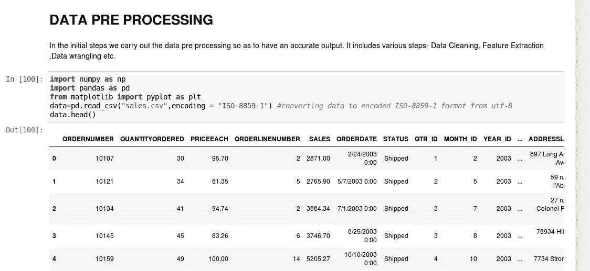
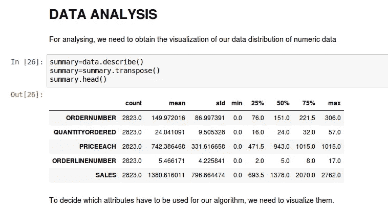
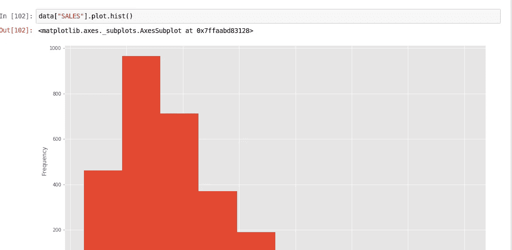
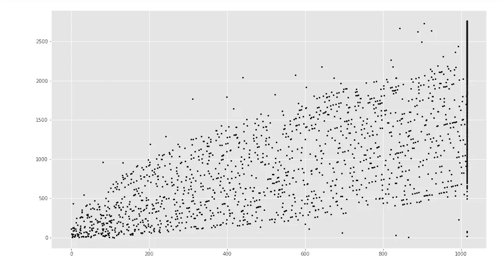
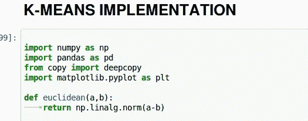
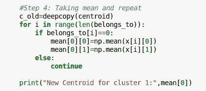
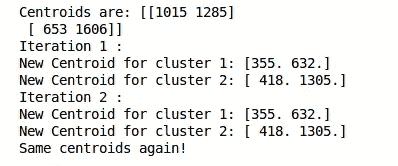
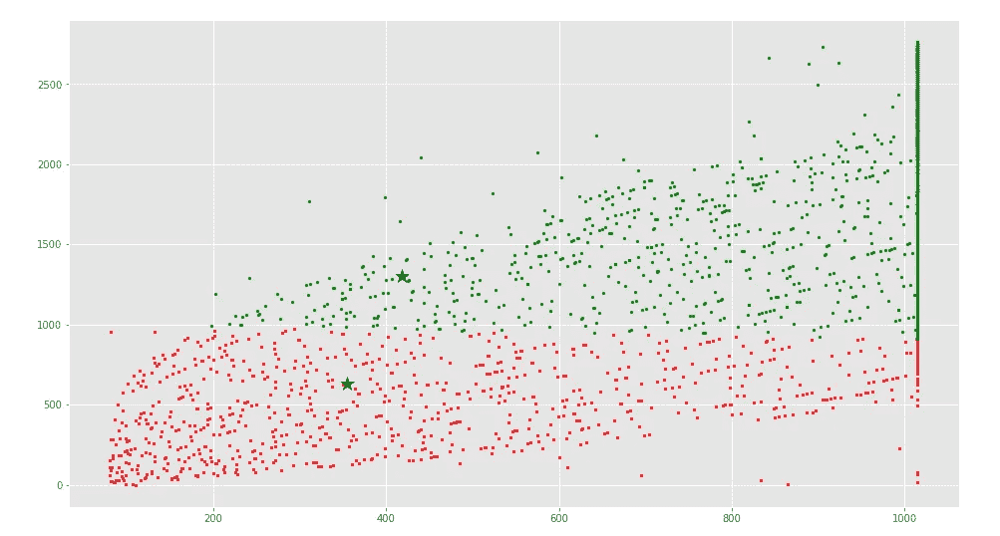

# 潜入 K-Means…

> 原文：<https://towardsdatascience.com/k-means-clustering-implementation-2018-ac5cd1e51d0a?source=collection_archive---------7----------------------->

我们已经在上一篇 [***这里***](https://medium.com/@diti.modi/linear-regression-model-899558ba0fc4) 完成了我们的第一个基本监督学习模型，即线性回归模型。因此，在这篇文章中，我们从最基本的无监督学习算法开始- **K 均值聚类**。事不宜迟，我们开始吧！

## **背景:**

顾名思义，K-means 聚类是一种聚类算法，没有预先确定的标签，就像我们对线性回归模型一样，因此被称为无监督学习算法。

## **逻辑与工作:**

> *K-means 简单地将给定数据集划分成具有不同特征的各种聚类(组)。*

**到底如何？**

k 是指在整个数据集中定义的聚类总数。有一个为给定聚类类型选择的质心，用于计算给定数据点的距离。距离本质上表示数据点的特征与聚类类型的相似性。

> 我们可以以校车为例来说明这一点。如果我们有来自特定区域(集群)的许多学生(数据点)通过校车前往学校，学校声明一个中心汽车站(质心),来自附近地区的所有学生可以在此集合登上校车(集群过程)。

**约束:**

只能使用**数值数据**。一般来说，k-means 最适合二维数值数据。在 2d 或 3d 数据中可视化是可能的。但实际上，一次总有多个特征需要考虑。

因此，可以使用多维数据，但是在将数据用于 k-均值之前，必须对数据进行降维。

*选择 K:*

没有确切的方法来确定 K(用于划分的总聚类数)的理想值。我们必须对给定的数据集尝试不同的 K 值，并比较由此获得的结果。

## 为什么要用 K-means？

> 使用 k-means，在分析数据之后对数据进行聚类，而不是基于预定义的标签将其原始地定义在一个组下。每个质心都是本质上代表其所属聚类类型的特征的集合。因此，质心可以用来解释所形成的集群的类型。

## 现实生活应用:

1.  客户零售细分分为不同数据分析应用的聚类，例如了解忠诚客户、分析客户的消费行为或特定类型客户的需求。
2.  网络犯罪欺诈的欺诈检测。
3.  MP3 文件、手机是使用这种技术的一般领域。英语中大约有 40 种不同的声音。

# TL；速度三角形定位法(dead reckoning)

在这里，我们执行整个机器学习过程，而不仅仅是算法实现。

> 注意:我们在这里从头开始实现 K-means。“scikit-learn”库，Python 中的机器学习库内置了 K-means 方法，可以直接使用。

## 为机器学习方法执行的步骤是:

1.  数据预处理
2.  数据分析
3.  模型实现

## k-means 算法的基本步骤:

步骤 1:从数据集中的值中选择 k 个质心的随机值(这里 k=2)

步骤 2:计算每个质心的每个点的欧几里德距离

步骤 3:比较距离并分配聚类

第四步:取平均值，重复直到误差为零

4.结果可视化

## **实施:**

> 1.数据预处理

在使用现有数据之前，我们必须对其进行预处理，以获得准确的结果。预处理包括数据清洗、数据争论、特征提取、数据归约等。这些根据数据和要求而变化。

这里我们导入 numpy、pandas、matplotlib 库，分别用于数组处理、数据帧使用和数据可视化。数据被读取并存储在名为“data”的数据帧中。这里的编码被指定为“ISO-8859–1 ”,因为我们的 csv 文件是“utf-8”格式的，以便于阅读。data.head()显示整个数据集的前 5 行。

我们通过(total_rows，total_columns)格式的 data.shape 找到数据帧的大小。数据清理是为了清除空值或缺失值。为此，我们需要使用 data.isnull()知道数据中空值的数量。sum()。它在每个属性列中提供总的空值。我们可以使用“data.drop.na()”删除所有空值条目。

因为我们在这里只想使用数字数据来表示 K-means，而且属性中没有空值，所以我们可以让数据保持原样。

特征提取在数据分析部分进一步完成。

> 2.数据分析

我们用 data.describe()存储在“summary”变量中获得数据的摘要。我们转置它来交换行和列。summary.head()显示摘要。

可以进行数据可视化，以可视化该列中的分布，无论它是否倾斜，绘制直方图、箱线图、散点图。这里绘制了“销售额”、“订购数量”和“价格”的直方图。我们可以使用“SALES”和“QUANTITYORDERED”来根据产品的销售额和订购数量形成集群。

现在我们绘制一个散点图。“x”仅用于保存我们需要的“数据”中的 2 列，以及所有行条目。接下来，我们绘制散点图，将图形大小设置为 16x9，样式设置为 ggplot，这样就形成了一个网格。plt.scatter()用黑色圆点绘制 x 数据帧的第 0 列和第 1 列，大小为 7。

我们的初始数据看起来像这样，没有分组:

我们的数据中有异常值。离群值只是远离其他数据点的值，它们不适合我们的数据，可能会妨碍我们的准确性。

正如我们看到的，在我们的数据中有许多异常值，我们通过计算 z-score 来删除这些异常值。zscore()是 python 的 scipy 库中的内置函数。

Z score 使我们的数据正常化。在这里，我们得到的 z 得分的绝对值在-3 到 3 的范围内，所有点都存储回 x 中，所有其他行都被删除。

正如我们注意到的，x 的形状从最初的行数变化到更少的行数，因为删除的行数更少。

> 3.k-均值实现

因此，现在我们终于在获得最终数据后开始实际的算法实现。我们只是在这里导入复制库和其他基本库。deepcopy 用于将一个数组复制到另一个数组中。我们用它来存储质心的历史，可以用来提前计算误差。

我们定义一个函数“欧几里得”来计算两点“a”和“b”之间的距离。np.linalg.norm()是 numpy 库中的内置函数，它在这里计算 a 和 b 的欧氏距离。

接下来我们定义 main()函数。这里我们应用所有的 k 均值算法步骤。

K-Means 的第一步:选择随机质心

因此，第一步是从数据集本身选择随机质心。Numpy 具有内置函数 np.random.choice()，其参数为 x.shape[0],给出了总行数和 2 列数，即聚类数，replace 设置为 false，即 x 不被这些值替换。

我们可以打印出质心的随机值，然后我们定义所有的变量以备将来使用。我们将“total”变量定义为 x 的形状值。“ditance_1”和“distance_2”分别定义为从数据中的每个点到质心 1 和质心 2 的距离，我们用大小为 total[0]的零对其进行初始化。因此，这些是 x 中总行数的 1D 数组

“belongs_to”用于存储数据点所属的簇的值。它通过索引对应于 x 中的每个数据点。它还被初始化为零和 total[0]的大小，以便存储每个数据点的逐行的簇号(这里是-0，1 编号的簇)。“c_old”存储质心的旧值。这里它被初始化为零，并且是“形心”的形状。

“误差”用于存储当前质心和旧质心的欧几里德距离，即如果两个质心值相同，误差变为零。“mean”用于存储新的质心。因此，它是“质心”的大小，并被初始化为零。“np.zeros()”是 Numpy 中的内置函数，它通过将大小作为参数传递来将给定数组初始化为零。最后“iterator”计算执行的迭代总数。目前为零。

**K-Means 的第二步:计算欧氏距离**

接下来，我们执行步骤 2，计算每个质心的每个数据点的欧几里德距离。循环条件是误差不等于零，如果误差变为零，那么计算的质心与前一个相同，所以循环将在那里停止。我们打印出迭代次数，并开始 for 循环来计算欧几里得距离。

**K-Means 的步骤 3:比较距离**

因此，步骤 3 将这些距离相互比较，并相应地分配聚类。因此,“if”条件为第一组分配 0，为第二组分配 1。“属于”值根据每个数据点与第一个和第二个质心的距离而变化。

**K 均值第 4 步:取均值，重复**

最后一步现在通过分别对聚类 1 数据点和聚类 2 数据点取平均值来计算新的质心。我们使用“deepcopy”复制 c_old 中旧质心的值。for 循环一直进行到 belongs_to 的范围，为第一个聚类分配每列的平均值。“np.mean()”是用于计算平均值的内置 Numpy 函数。现在我们知道为什么我们在 Python 中如此广泛地使用 Numpy 了！:P

为了清楚起见，我在这里使用了单独的“均值”变量。我们可以替换“质心”变量并在这里重新使用它。

我们对聚类 2 的平均值进行相同的循环，其中 belongs_to()值为 1，而聚类 1 的平均值为 0。

然后，我们将平均值分配给质心，并计算旧质心和新质心的误差。迭代器加 1，条件错误检查在这里完成。如果误差为 0，则传送相同质心值的消息，然后循环停止。

> 4.结果可视化

最后，我们执行机器学习过程的最后一步，可视化我们的聚类点。我们使用和以前一样的情节。唯一改变的是每个簇的颜色。我们用红色‘r’和绿色‘g’来代表每个聚类。我们将“点”指定为 x 的数组，该数组位于其所属行的范围内，其中“所属行”的值为 0 或 1。我们只是将红色点(颜色[0])分散到聚类 1(属于 _ 属于[]=0)，将绿色点(颜色[1])分散到聚类 2(属于 _ 属于[]=1)。我们指定星号(*)标记，用黑色标出最终质心。

最后，我们调用主函数来执行模型。

完整的代码和数据集可在[这里](https://github.com/ditsme/Machine-Learning/tree/master/100-Days-Of-ML-Code/Day-06-07-k-means)获得。我还添加了运动员数据的另一个实现，这可以使数据清理部分变得清晰，因为我们删除了那里的重复值和空值。

## **输出:**

我得到的输出如下:

> 注意:这里的输出可能会有所不同，因为我们最初是随机选择质心的。这里仅执行 2 次迭代，直到误差变为零。

聚类:

绘制散点图时考虑最终迭代质心和聚类。

对于任何疑问或评论，请在下面评论，让我知道你是否喜欢这个博客！；)