# 葡萄酒数据的 k-均值聚类

> 原文：<https://towardsdatascience.com/k-means-clustering-of-wine-data-95bac074baae?source=collection_archive---------8----------------------->

我们在这篇文章中要分析的数据集是对意大利某个特定地区的葡萄酒进行化学分析的结果，这些葡萄酒来自三个不同的品种。这项分析确定了三种葡萄酒中 13 种成分的含量。属性有:*酒精、苹果酸、灰分、灰分的碱度、镁、总酚、类黄酮、非类黄酮酚、原花青素、颜色强度、色调、稀释酒的 OD280/OD315、*和*脯氨酸*。数据集有 178 个观察值，没有缺失值。可以在这里下载[。](https://archive.ics.uci.edu/ml/datasets/wine)

我们的目标是尝试将相似的观察结果分组在一起，并确定可能的聚类数(可能不是 3)。这将有助于我们进行预测并降低维数。第一步是将数据集分成训练集(2/3)和测试集(1/3)。包 *caTools* 中的函数 *sample.split* 做得很好，它在训练集和测试集中处理了 3 个品种大致相同的分布。

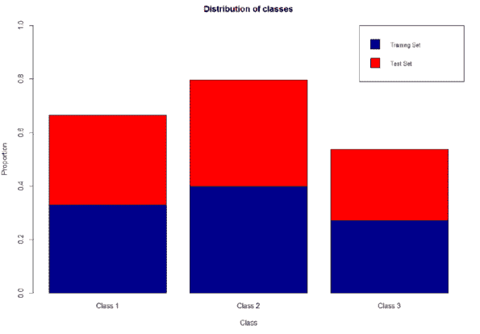

下面是数据集的摘要。注意到这些属性不在同一个尺度上是非常重要的；因此，我们稍后将缩放数据。

让我们确定将要使用的集群数量。根据肘方法，我们可以使用 3 个集群，因为从这一点开始，总 WCSS ( *在集群平方和*内)不会显著降低。

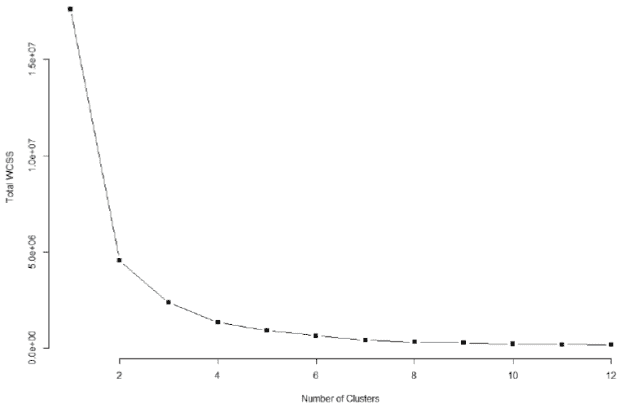

# 原始数据和欧几里德距离

首先，我们要处理原始的、未经处理的、未经润色的数据。这不是最好的方法，但我们对结果感兴趣。我们用 100 种不同的种子创建了一个包含 100 种可能的聚类方式的列表(名为 L1)。这考虑到了再现性。在这 100 个结果中，我们选择具有最小总 WCSS 的结果，并且在这些结果中，我们选择 L1[[3]]，因为原始类名“1”、“2”、“3”匹配聚类类名“1”、“2”、“3”。这不是必须的，但是解释结果更容易。

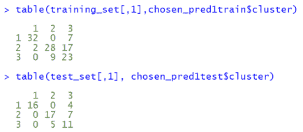

我们看到，该算法在训练集上表现不错(准确率为 70.3%)，但在测试集上表现更好，准确率为 73.3%(这一点更重要，因为我们更喜欢在之前尚未“看到”的数据上测试该算法)。我们希望将这些结果可视化——“抖动”图可能是个好主意。

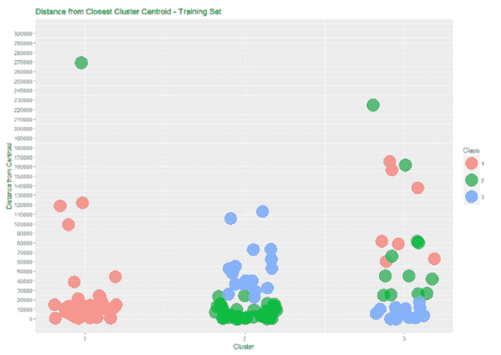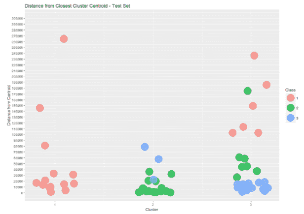

我们注意到 SSE 相当高，因为我们处理的是未缩放的数据。这就是为什么我们可能看不到抖动图上的所有数据。

# 原始数据和曼哈顿距离

这次我们用的是 k-means 算法中的曼哈顿距离，在不同维度没有可比性的情况下可能更有用。下面是原始数据的结果—我们选择了具有最小总 WCSS 的聚类。

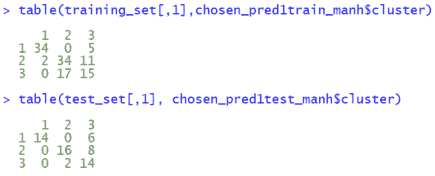

训练集的准确率为 83/118 = 70.3%，测试集的准确率为 44/60 = 73.3%。下面给出了训练集和测试集的抖动图。

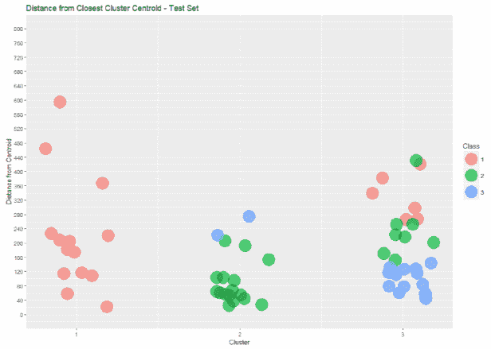

# 缩放数据和欧几里德距离

接下来，让我们看看缩放后的数据会发生什么。请注意，测试集是用用于缩放训练集的相同参数来缩放的。我们得到了以下结果:

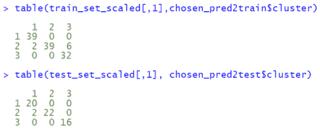

显然，与未缩放的数据相比，精确度有所提高。对于训练集，准确率为 110/118 = 93.2%，对于测试集，准确率为 58/60 = 96.7%。但是我们需要小心——太接近 100%并不总是好的，因为我们可能会有过度拟合的问题。

训练集和测试集的抖动图如下所示:

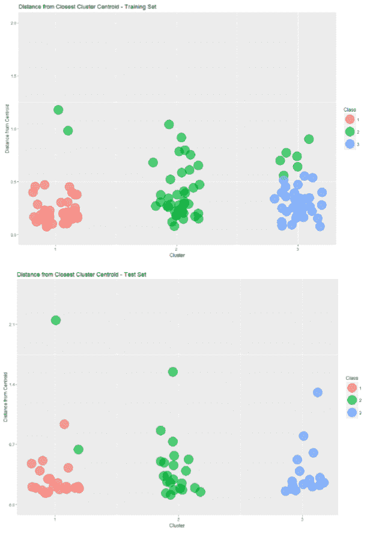

# 缩放数据和曼哈顿距离

对于缩放数据和曼哈顿距离，最佳聚类是:

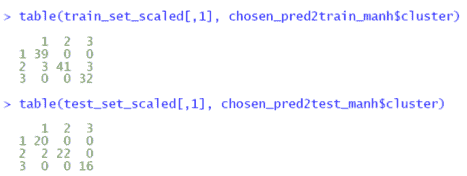

我们注意到，与使用欧几里德距离对缩放数据进行聚类相比，测试集上的聚类没有改进，但在训练集上有所改进。现在，训练集的准确率为 112/118 = 94.5%，测试集的准确率为 58/60 = 96.7%。抖动曲线如下所示。

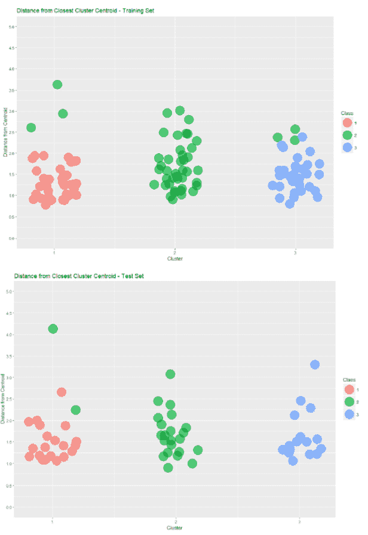

# 主成分分析

主成分分析在这一点上可能会有所帮助。我们的目标是提取预测变量的线性组合，解释数据中最大的方差。函数 *prcomp* 用于进行分析，以下是结果汇总。

如果我们观察累积比例，我们会发现前两个主成分解释了数据中 60.9%的方差，而前三个主成分解释了数据中大约 69.6%的方差。下面的 scree 图显示了方差的衰减。

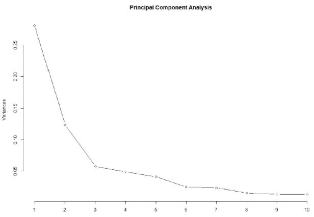

我们决定保留前两个主成分，因为我们将能够看到结果。训练数据包含矩阵 A1＄x 的前两个 PC，但是测试数据应该使用相同的变换进行变换。运行 k-means 算法后，我们发现最佳聚类如下:

训练数据的准确率为 112/118 = 94.9%，测试数据的准确率为 57/60 = 95%。测试数据的准确性仅比 PCA 之前的缩放测试数据的准确性差 1.7%，但是我们显著降低了维度(从 13 个变量减少到仅 2 个变量)。下面给出了训练和测试数据的抖动图。

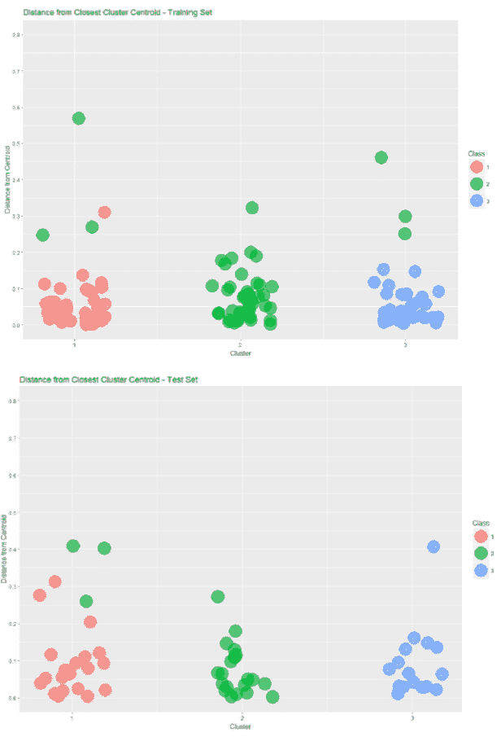

包 *clusterSim* 中的函数 *clusplot* 允许我们显示聚类:

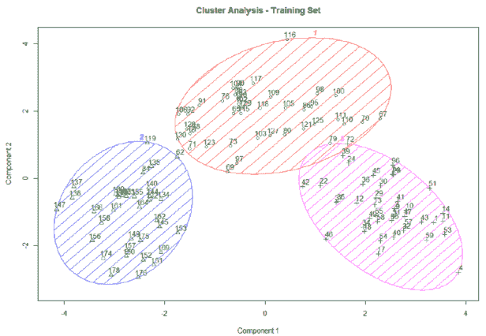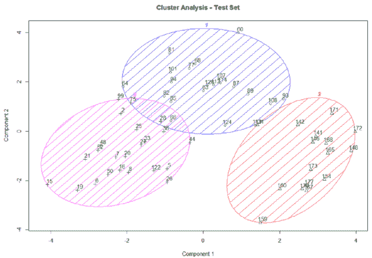

聚类的问题发生在交叉区域——这是我们得到错误分类的数据点的地方。成对图也有助于了解前两台 PC 在群集时的表现。第一台电脑本身做得很好(我们通过观察行/列 PC1 可以看出这一点)，第二台电脑稍差一些。其他的很糟糕，因为颜色混在一起了。前两台电脑(位于交叉点)在集群时表现出色。

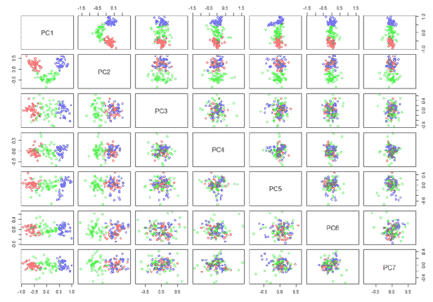

前三个 PC 甚至更高效，来自包*散点图 3d* 的函数*散点图 3d* 表明这确实是真的:

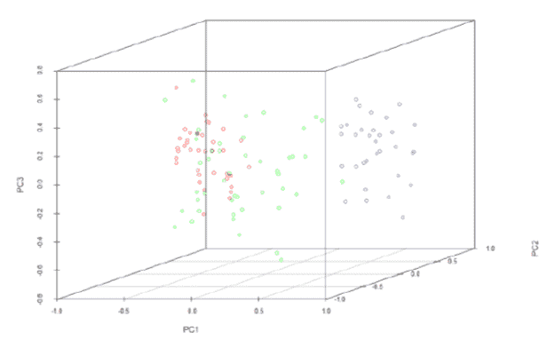

# 独立成分分析

与 PCA 不同，ICA 的目标是产生 13 个统计上独立的成分，没有特定的顺序，然后使用这些成分对数据进行聚类。我们使用来自包*脱字符*的函数*预处理*来转换训练数据，并且相同的转换已经被应用到测试数据。我们在下面看到，当对数据进行聚类时，组件 ICA6 做得很好，而其他 12 个组件单独地不能很好地对数据进行聚类。

下面是第六个独立成分与自身的对比图——事实上，它可以非常准确地分离数据。

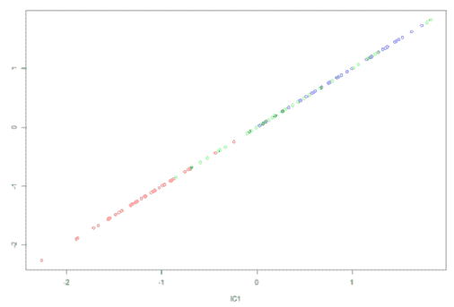

k-means 算法还需要一个组件——如果我们仔细观察获得的成对图，我们可以看到组件 6 和 8 可以保留用于聚类。下面是聚类的结果。

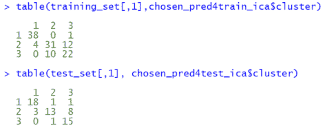

对于训练集，聚类准确率为 91/118 = 77.1%，对于测试集，聚类准确率为 46/60 = 76.7%。精度尚可，但维度从 13 降到只有 2！下面给出了训练集和测试集的抖动图。

# 我们的结果总结

下表提供了关于所获得的聚类结果的结论。

PCA 做的最好！它在测试集上的表现比缩放数据稍差，但维度已经减少。

完整的 R 代码，请访问我的 GitHub 简介[这里](https://github.com/dinajankovic/K-Means-Clustering-Wine-Data)。