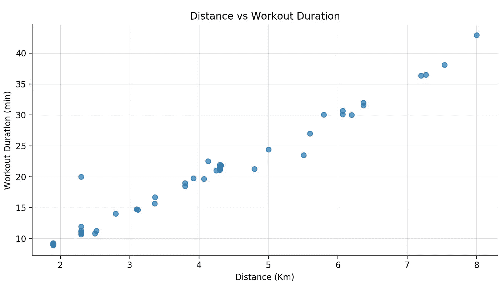
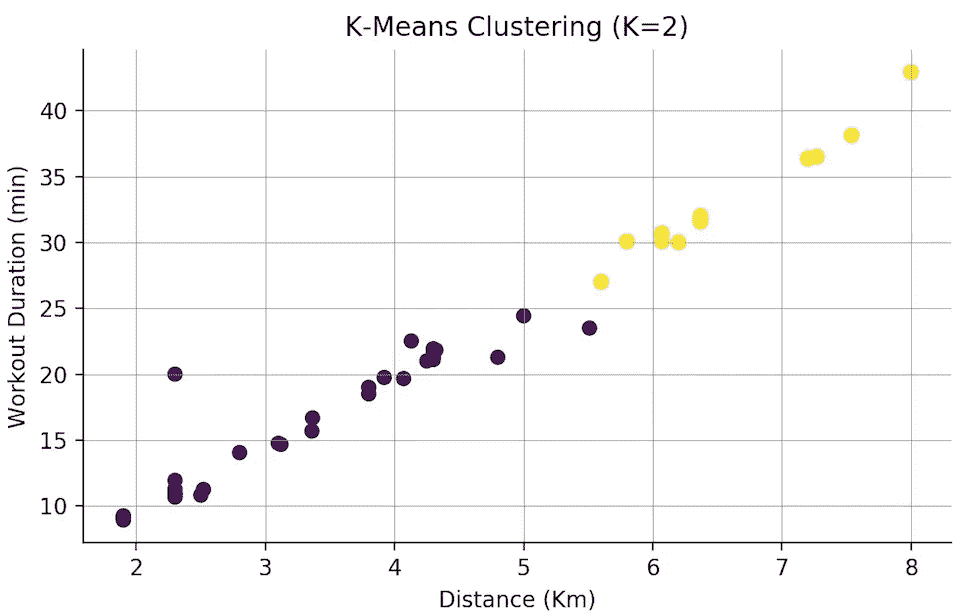
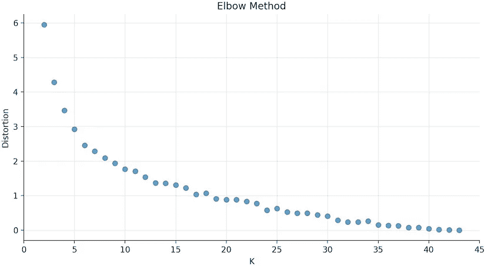

# 现实生活中的 K-Means:聚类锻炼时段

> 原文：<https://towardsdatascience.com/k-means-in-real-life-clustering-workout-sessions-119946f9e8dd?source=collection_archive---------3----------------------->

K -means 聚类是一种非常流行的无监督学习算法。在这篇文章中，我想提供一些关于它的背景知识，并展示我们如何在真实生活中使用它。

[K 均值聚类](https://en.wikipedia.org/wiki/K-means_clustering)是一种算法，给定一个数据集，它将识别哪些数据点属于 *k* 个聚类中的每一个。它获取你的数据，并学习如何对其进行分组。

通过一系列迭代，该算法创建多组数据点(称为聚类)，这些数据点具有相似的方差，并最小化特定的成本函数:类内平方和。

***Within-Cluster Sum of Squares*:** where C_i is a cluster and "mu_i" is the mean of the data points in cluster C_i

通过使用组内平方和作为成本函数，相同组中的数据点将*彼此相似*，而不同组中的数据点将具有较低水平的相似性。

K-Means 聚类是一组名为 [*无监督学习*](https://en.wikipedia.org/wiki/Unsupervised_learning) 的学习算法的一部分。在这种类型的学习模型中，没有对每个数据点的标签/类/类别的明确标识。

数据集中的每个数据点都是一个属性向量，也就是说，没有特定标注的要素可以将其分配给特定的聚类或类。然后，该算法将自行学习如何对具有相似特征的数据点进行分组，并*将它们聚集在一起*。

关于 K-Means 聚类的一个重要细节是，即使它确定哪个数据点应该属于哪个聚类，您也必须指定参数 *K，*来表示您想要用来“分布”您的数据的聚类总数。

你最喜欢的锻炼是慢跑，因为你非常喜欢数据，所以你要确保记录你的表现。所以你最终会编译一个类似这样的数据集

它包括您慢跑的日期、总跑步距离(公里)、持续时间(分钟)和自上次锻炼以来的天数。数据集中的每一行都包含每个健身程序的*属性*或*功能*。

## 最终，你想要回答的问题是:“我如何识别相似的锻炼时段？”

通过识别彼此相似的锻炼时段，您可以更好地了解自己的整体表现，并获得如何改进的新想法。

像 **K-Means 聚类**这样的聚类算法可以帮助您将数据分组到不同的组中，保证每个组中的数据点彼此相似。

数据科学和分析的一个良好实践是，在进行任何分析之前，首先要对数据集有很好的理解。

对数据集进行探索性观察，首先绘制一个**对图**，以便更好地了解不同特征之间的相关性。

对角线上的图对应于每个特征的分布，而其他图是每对特征的散点图。

一个有趣的图是距离对持续时间，它显示了线性相关性。

然而，当我们将距离和持续时间与自上次锻炼以来的天数进行比较时，它们之间没有明显的相关性。

现在你已经对*你的数据集如何看起来像*有了一个很好的想法，是时候使用 **K-Means** 并查看单个会话是如何分组的。你可以从把你的数据集分成两个不同的组开始。

在该图中，与 pair 图一样，我们看到了距离和锻炼持续时间之间的关系，但现在每个数据点都有其聚类的颜色。

快速浏览一下这个散点图，我们可以看到，例如，所有 25 分钟以下的锻炼都在一个簇中。

## 我们如何知道使用哪个 K 值？

根据数据集和您正在解决的问题，您可能知道如何对数据进行聚类。也许你想看到数据分成 3 组，5 组，10 组…

如果不是这样，我们如何确定使用哪个 K 值呢？

> 像算法中的任何参数一样，它需要一些实验，即调整。

为了试验不同的 K 值，您还需要一个*决定因素*或度量，您将使用它来决定哪个 K 值提供最佳结果。

上图是对健身数据集运行 K 均值聚类的结果，K 值介于 2 和 43 之间，对应于数据集的大小。K 的每个值与各自的失真值相对应。

y 轴上的失真对应于我们的成本函数:每个数据点和质心(即聚类中心)之间的平方差之和。

随着 K 的增加，相应的失真值将趋于零，因为最终每个聚类只有一个数据点。由于每个聚类中只有一个数据点，质心就是数据点本身，因此失真将等于零。

对于该数据集，曲线的*弯头大约为 K= 5。对于大于 5 的 K 值，失真值开始稳定衰减。*

回到原始数据集，用新找到的 K 重新运行 K-Means，就可以把数据聚类成 5 个不同的组！

至此，K-Means 聚类的工作已经完成，您的数据分析工作开始了😀🤓

下一步需要人工干预，以便解释结果并获得额外的洞察力。

简单回顾一下，这些是**使用 K-Means 的优势:**

*   易于实施
*   相对快速和高效
*   只有一个参数需要调整，您可以很容易地看到调整参数 K 值的直接影响

*感谢阅读！*