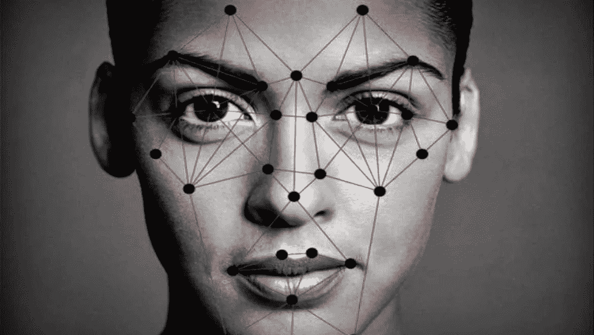

# k-NN —了解你最近的邻居

> 原文：<https://towardsdatascience.com/k-nn-getting-to-know-your-nearest-neighbors-b60399dc0f32?source=collection_archive---------6----------------------->

Evolving Science

*本文是探索 10 种基本机器学习算法的 BAI 系列文章的一部分**

在一系列客户会议之后，这是明年某个时候的傍晚，在纽约市的高架线上。你在一个户外酒吧停下来，喝了第一杯酒，吃了点东西。坐在你的饮料旁边，你开始想你最近的邻居。你忍不住掏出手机来试试它新的面部识别技术。这款应用近乎实时地识别出你周围的人、他们的工作经历、他们的朋友和共同兴趣。除了隐私问题，k-NN 是什么，它是如何工作的，它在数据科学中的使用场景是什么，以及它如何促进面部识别技术的创新？

k-NN 是一种机器学习算法，自 20 世纪 70 年代以来被广泛用于在监督学习环境中分析数据。它的流行源于它的易用性和清晰易懂的结果。k-NN 中的“k”是指用于分类或预测数据集中结果的最近邻的数量。每个新观察值的分类或预测是基于加权平均值关于指定的距离(即最近邻)计算的。k-NN 分析是一个合理的选择，当很少有先验知识的观察分布的数据。

An example of k-NN classification — Adi Bronshtein

当我们被给定一个训练观察的标记数据集，并且目标是捕获每个观察之间的关系时，我们使用 k-NN。这种相似性关系被表示为数据点之间的距离度量。观察值之间的间隔被测量为欧几里德、曼哈顿、切比雪夫、汉明距离或甚至余弦相似性。k-NN 是一种非参数算法，因为它对关系的函数形式没有明确的假设。它也是基于实例学习的一个例子，因为它直接关注训练实例，而不是应用特定的数据模型。

k-NN 算法处理整个数据集，而不是训练数据的子集。最近邻的数量(k)是一个超参数，超过了数据科学家为了获得数据集的最佳拟合而选择的参数。当数量 k 较小时，我们限制了预测的区域，并使分类器对整体分布不太敏感。对于分类问题，这可能是最常见的类值。对于回归问题，这可能是平均输出变量。

你什么时候会用 k-NN？该算法被部署在概念搜索中，在概念搜索中，数据科学家在语义上搜索相似的文档。Discovery 是另一个使用场景，其中该算法可用于查找所有电子邮件、简报、合同等。与给定问题相关。推荐系统通常集成了 k-NN，因为如果你知道一个顾客喜欢某个特定的商品，你就可以向他们推荐类似的商品。最后，k-NN 通常用作更复杂分类器的基准，如人工神经网络(ANN)和支持向量机(SVM)。[【1】](#_ftn1)

A k-NN classifier example using the CIIFAR 10 dataset — — Andrej Karpathy

他的算法有什么局限？当超参数 k 较高时，预测对异常值更有弹性。如果一类观察值在数据中非常频繁，K-NN 也会受到偏斜类分布的影响。k-NN 的易用性是以内存和计算为代价的，因为使用 k-NN 需要处理整个数据集而不是一个样本。由于所有这些原因，k-NN 算法在工业环境中可能不实用。

有几种技术可以提高算法的针对性。重新调整数据可以使距离度量更有意义。改变距离度量的性质可以帮助提高分类/预测的准确性(例如用汉明或曼哈顿代替欧几里德距离)。像 PCA 这样的降维技术可以在应用 k-NN 之前执行，以提供更易管理的结果。最后，使用类似 k-d 树的近似最近邻技术来存储训练观察值可以用来减少测试时间。

回到面部识别和高线上的酒吧，k-NN 在像 Herta Security 这样的应用程序中起着重要作用。[【2】](#_ftn2)考虑到应用程序的性质，为城市中的每个人训练一个单独的分类器既具有挑战性又成本高昂。Herta 的数据科学家开发了深度学习算法，来生成代表人脸的特征向量。该应用程序然后使用 k-NN 来识别个人，将他们的脸与观察列表进行比较。一旦确定了一个引用，就可以将它链接到任何可用的数据库。当你啜饮第二杯葡萄酒时，你可能会思考面部识别的道德问题，因为知道你最近的邻居就在你的手边。[【3】](#_ftn3)

李施伦克博士，[商业分析研究所](http://baieurope.com./)，2018 年 9 月 20 日

* *之前在白系列中发表的关于基本机器学习算法的文章包括* [*贝叶斯定理——熟能生巧*](https://medium.com/p/1ec7d4bcdb1d?source=your_stories_page---------------------------) *和* [*鲨鱼攻击——解释泊松回归的用法*](https://medium.com/p/449739bf96da?source=your_stories_page---------------------------)

Lee Schlenker 是商业分析和社区管理教授，也是 http://baieurope.com 商业分析研究所的负责人。可以在[查看他的 LinkedIn 个人资料](http://www.linkedin.com/in/leeschlenker.)可以在[的 Twitter 上关注白](https://twitter.com/DSign4Analytics)

*****

[【1】](http://file///C:/Users/Lee/Dropbox/Business%20Analytics%20Insitute/Nearest%20Neighbors.docx#_ftnref1)凯文·扎克卡，(2016)，[K 近邻完全指南](https://kevinzakka.github.io/2016/07/13/k-nearest-neighbor/)

[【2】](http://file///C:/Users/Lee/Dropbox/Business%20Analytics%20Insitute/Nearest%20Neighbors.docx#_ftnref2)赫塔安全，[技术](http://www.hertasecurity.com/en/technology)

[【3】](http://file///C:/Users/Lee/Dropbox/Business%20Analytics%20Insitute/Nearest%20Neighbors.docx#_ftnref3)Jon Christian，(2018)，[面部识别如何将我们撕裂](https://medium.com/s/futurehuman/how-facial-recognition-tech-could-tear-us-apart-c4486c1ee9c4)，