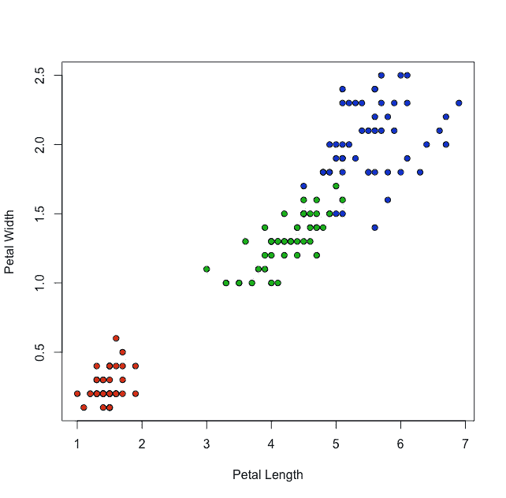
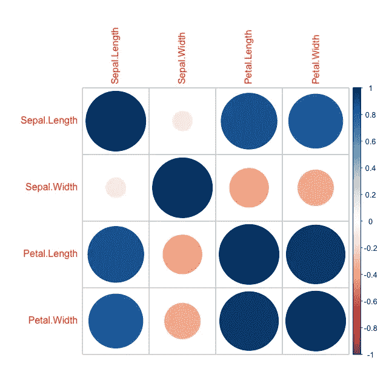
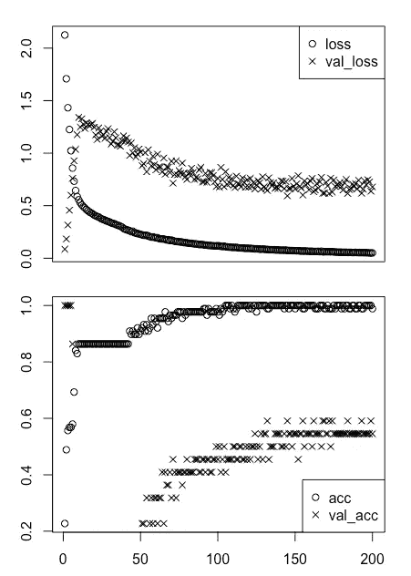
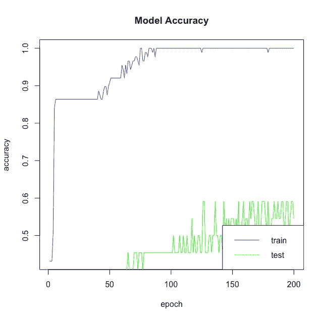
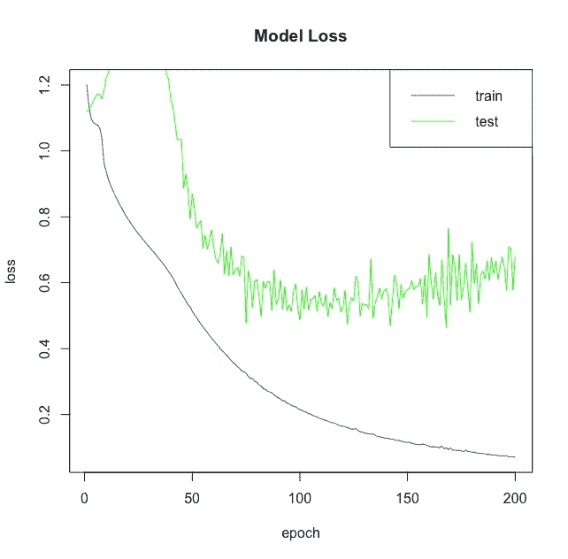
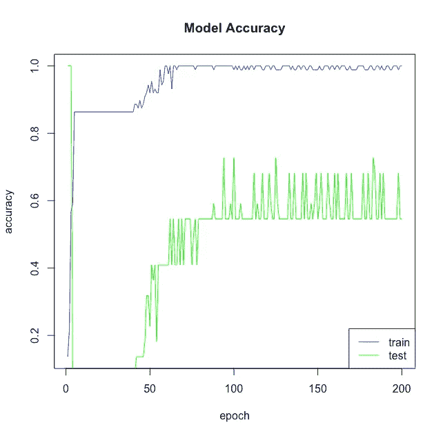
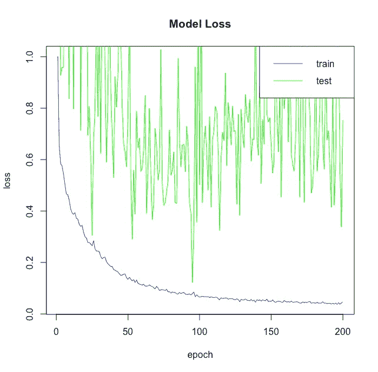
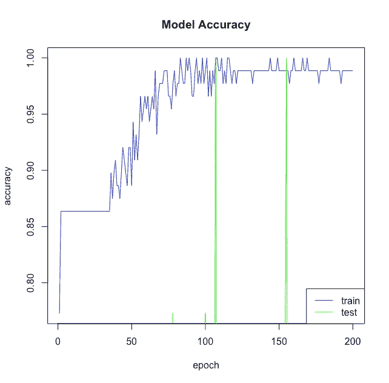

# keras:R 中的深度学习

> 原文：<https://towardsdatascience.com/keras-deep-learning-in-r-b0be9dc726ff?source=collection_archive---------1----------------------->

正如你现在所知道的，机器学习是计算机科学(CS)中的一个子领域。深度学习是机器学习的一个子领域，它是一套受大脑结构和功能启发的算法，通常被称为人工神经网络(ANN)。深度学习是当下机器学习最热门的趋势之一，有很多问题是深度学习大放异彩的，比如机器人、图像识别、人工智能(AI)。

今天的教程将带着`keras`包用 Keras 简单介绍一下 R 中的深度学习:

*   您将从 R 中的[深度学习包的简短概述开始，并且](https://www.datacamp.com/community/tutorials/keras-r-deep-learning#overview)
*   你将读到更多关于 Keras、 `[kerasR](https://www.datacamp.com/community/tutorials/keras-r-deep-learning#differences)` [和](https://www.datacamp.com/community/tutorials/keras-r-deep-learning#differences) `[keras](https://www.datacamp.com/community/tutorials/keras-r-deep-learning#differences)`包之间的[差异，以及当一个包是另一个包的接口时意味着什么；](https://www.datacamp.com/community/tutorials/keras-r-deep-learning#differences)
*   然后，您将真正开始使用 RStudio 的`keras`包:您将学习如何首先[准备您的工作空间](https://www.datacamp.com/community/tutorials/prep)并[加载](https://www.datacamp.com/community/tutorials/keras-r-deep-learning#data)内置数据集、虚拟数据和来自 CSV 的数据；
*   接下来，您将看到如何[探索](https://www.datacamp.com/community/tutorials/keras-r-deep-learning#explore)和[预处理您从 CSV 文件中加载的数据](https://www.datacamp.com/community/tutorials/keras-r-deep-learning#prep):您将标准化数据并将其分成训练集和测试集。
*   在这之后，你就准备好[构建你的深度学习模型](https://www.datacamp.com/community/tutorials/keras-r-deep-learning#model)；在这种情况下，您将为多类分类构建一个多层感知器(MLP)。
*   您将学习如何[编译和拟合](https://www.datacamp.com/community/tutorials/keras-r-deep-learning#compile)模型以适应您的数据，如何[可视化培训历史](https://www.datacamp.com/community/tutorials/viz)，以及
*   你将[根据测试数据预测目标值](https://www.datacamp.com/community/tutorials/keras-r-deep-learning#predict)；
*   最后，您将[评估您的模型](https://www.datacamp.com/community/tutorials/keras-r-deep-learning#evaluate)，解释结果并[微调您的模型](https://www.datacamp.com/community/tutorials/keras-r-deep-learning#finetune)，使其性能更好:您将学习如何添加层和隐藏层，并了解如何调整优化参数以实现更好的结果。
*   此外，您可能希望[保存您的(优化的)模型，或者在其他时间将其加载回](https://www.datacamp.com/community/tutorials/keras-r-deep-learning#save)。您将在本教程的最后一节看到这是如何完成的！

想进一步了解感知机、多层感知机(MLPs)等深度学习中的原始 Keras 或关键概念吗？考虑或参加 DataCamp 的[Python 深度学习](https://www.datacamp.com/courses/deep-learning-in-python)课程或参加 [Keras 教程:Python 深度学习](https://www.datacamp.com/community/tutorials/deep-learning-python)。

**提示**:在这里找到我们的 Keras 备忘单[。](https://www.datacamp.com/community/blog/keras-cheat-sheet)

# R 中的深度学习:包的简短概述

随着深度学习受欢迎程度的上升，CRAN 已经丰富了更多的 R 深度学习包；下面你可以看到这些包的概述，取自[机器学习和统计学习 CRAN 任务视图](https://cran.r-project.org/view=MachineLearning)。“百分位数”栏表示在[文件](https://www.datacamp.com/community/tutorials/www.rdocumentation.org)中找到的百分位数:

[参见[原文](https://www.datacamp.com/community/tutorials/keras-r-deep-learning)中的概述]

**提示**:关于 R 中深度学习包的比较，请阅读[这篇博文](http://www.rblog.uni-freiburg.de/2017/02/07/deep-learning-in-r/)。有关 RDocumentation 中排名和分数的更多信息，请查看这篇博文。

在 RDocumentation.org 上没有找到`deepr`和`MXNetR`，所以这两个包的百分比是未知的。

# 喀拉斯、`keras`和`kerasR`

最近，两个新的软件包进入了 R 社区:由 Taylor Arnold 创作的`[kerasR](https://github.com/statsmaths/kerasR)` [软件包](https://github.com/statsmaths/kerasR)和【RStudio】的 `[keras](https://github.com/rstudio/keras)` [软件包](https://github.com/rstudio/keras)。

这两个包都提供了 Python 深度学习包 Keras 的 R 接口，您可能已经听说过或者可能已经使用过它了！对于那些不知道 Keras 包必须为 Python 用户提供什么的人来说，它是“一种高级神经网络 API，用 Python 编写，能够在 TensorFlow、微软认知工具包(CNTK)或 Theano 上运行”。

你看，开始使用 Keras 是熟悉 Python 深度学习的最简单的方法之一，这也解释了为什么`kerasR`和`keras`包为 R 用户提供了这个奇妙包的接口。

在这种情况下，当一个包(比如 R `keras`)是另一个包(Python Keras)的“接口”时，理解它的确切含义是有好处的。简单地说，这意味着带有接口的`keras` R 包允许您享受 R 编程的好处，同时访问 Python Keras 包的功能。

**注意**这并不是一种不常见的做法:例如，`h2o`包也提供了一个接口，但是在这种情况下——正如它的名字所暗示的那样——提供给 H2O，一个用于大数据的开源数学引擎，你可以用它来计算并行分布式机器学习算法。其他你可能知道的提供接口的包有`RWeka`(Weka 的 R 接口)`tensorflow`(tensor flow 的 R 接口)`openml-r`(OpenML 的 R 接口)……可以继续说下去！

现在您已经知道了所有这些，您可能会先问自己以下问题:您如何比较原始的 Python 包和 R 包？

本质上，你不会发现 R 包和原来的 Python 包有太多的区别，多半是因为函数名几乎都一样；您注意到的唯一区别主要在于编程语言本身(变量赋值、库加载等等)，但最重要的是要注意 R 包中包含了多少原始功能。

**注意**这个备注不仅对`keras`库有效，对上面提到的`tensorflow`、`openml-r`、…等接口包也有效！

其次，你可能也想知道这两个 R 包之间有什么区别。好吧，如果你想考虑两者的区别，你可能要考虑以下几点:

*   `keras`包使用管道操作符(`%>%`)将函数或操作连接在一起，而在`kerasR`中你不会发现这一点:例如，用`kerasR`制作你的模型，你会发现你需要使用`$`操作符。管道操作符的使用通常会提高代码的可读性，如果你以前使用过 [Tidyverse 包](http://tidyverse.org/)，你肯定已经见过这个操作符了。
*   您将会看到`kerasR`包含了一些函数，它们的命名方式与最初的 Keras 包相似，但并不完全相同。比如原来的(Python) `compile()`函数叫做`keras_compile()`；这同样适用于其他功能，例如`fit()`，它变成了`keras_fit()`，或者`predict()`，当您使用`kerasR`包时，它是`keras_predict`。这些都是自定义包装。
*   你可以争辩 RStudio 的`keras`包的安装比`kerasR`包的安装容易；要安装后者，您需要首先确保配置使用哪个 Python 版本，如果您在安装了多个环境或 Python 版本的 pc 上工作，这可能会变得很棘手。但我会让你决定这一点:)


现在您已经收集了一些背景知识，是时候真正开始使用 R 中的 Keras 了。正如您将在本教程的介绍中读到的，您将首先检查您的工作区的设置。然后，您将加载一些数据，经过一个简短的数据探索和预处理步骤，您将能够开始构建您的 MLP！

让我们继续吧！

# 安装`keras`包

和往常一样，开始使用任何包的第一步是设置您的工作空间:将库安装并加载到 RStudio 或您正在工作的任何环境中。

不用担心，对于[原创教程](https://www.datacamp.com/community/tutorials/keras-r-deep-learning)，包会帮你加载进去！

首先，确保您安装了`keras`:您可以通过在您的控制台中运行`devtools::install_github("rstudio/keras")`来轻松完成此操作。接下来，您可以加载包并安装 TensorFlow:

```
# Load in the keras package 
library(keras) # Install TensorFlow 
install_tensorflow()
```

当你做完这些，你就可以走了！很快，对吧？

**提示**:关于安装过程的更多信息，请查看[软件包网站](https://rstudio.github.io/keras/)。

# 加载数据

现在安装过程已经清楚了，您的工作空间也准备好了，您可以开始加载数据了！此时，当涉及到您的数据时，您有三个大的选择:您可以选择使用`keras`包自带的一个内置数据集，您可以从例如 CSV 文件加载您自己的数据集，或者您可以创建一些虚拟数据。

无论您处于哪种情况，您都会看到您能够快速开始使用该软件包。本节将快速浏览三个选项，并解释如何加载(或创建)您需要开始的数据！

如果你以前使用过 Python 中的 Keras 包，你可能已经使用函数`mnist.load_data()`、`cifar10.load_data()`或`imdb.load_data()`访问过 [Keras 内置数据集](https://github.com/fchollet/keras/tree/master/keras/datasets)。

以下是一些使用`keras`包加载 MNIST、CIFAR10 和 IMDB 数据的示例:

```
# Read in MNIST 
data mnist <- dataset_mnist() # Read in CIFAR10 data 
cifar10 <- dataset_cifar10() # Read in IMDB data 
imdb <- dataset_imdb()
```

**注意**用`keras`载入内置数据集中的所有函数遵循相同的模式；对于 MNIST 数据，您将使用`dataset_mnist()`功能加载您的数据。

或者，你也可以快速制作一些虚拟数据来开始。要了解如何轻松使用`matrix()`函数来实现这一点，请访问[原始文章](https://www.datacamp.com/community/tutorials/keras-r-deep-learning)。

**注意**检查你的数据的数据结构绝对是个好主意；了解您正在处理的数据非常重要，因为这对您需要采取的后续步骤非常重要。在本教程的后面部分，您将了解到更多关于这方面的内容！

除了内置数据集之外，您还可以从文件中加载数据。在本教程中，您将重点关注从 CSV 文件中加载数据，但是如果您想了解更多关于在 R 中导入文件的信息，请考虑 DataCamp 的 [R 数据导入教程](https://www.datacamp.com/community/tutorials/r-data-import-tutorial)。

让我们使用`read.table`包中的`read.csv()`函数加载来自 [UCI 机器学习库](http://archive.ics.uci.edu/ml/index.php)的数据集。你可以在这里找到这个练习[的代码。](https://www.datacamp.com/community/tutorials/keras-r-deep-learning)

检查您的数据导入是否成功总是一个好主意。你通常使用像上面 DataCamp Light chunk 中的`head()`、`str()`和`dim()`这样的函数来快速完成这项工作。

这三个函数的结果不会立即指出任何异常；通过查看`str()`函数的输出，可以看到`Species`列的字符串是作为因子读入的。这没有问题，但是对于接下来的步骤来说，知道您将在哪里探索和预处理数据绝对是件好事。

# 数据探索

在本教程中，您将继续使用通过`read.csv()`函数导入的著名的`iris`数据集。

对于那些不具备处理这些数据所需的生物学知识的人，这里有一些背景信息:所有的花都有一个萼片和一个花瓣。萼片包围花瓣，通常是绿色的叶状，而花瓣通常是彩色的叶子。对于鸢尾花来说，这只是有一点点不同，如下图所示:


您可能已经在上一节中看到过，在导入之后,`iris`数据框没有任何列名。现在，对于本教程的剩余部分，这并不太重要:即使`read.csv()`函数将`data.frame`中的数据返回给你，你需要传递给`fit()`函数的数据需要是一个矩阵或数组。

关于刚刚提到的这两种数据结构，需要记住一些事情:—矩阵和数组没有列名；—矩阵是单一数据类型的二维对象；—数组是单一数据类型的多维对象；

**提示**:如果你想回顾一下 R！

**注意**另一方面，数据帧是一种特殊的命名列表，其中所有元素都具有相同的长度。它是一个多维对象，可以包含多种数据类型。当您检查前一节中的`iris`数据帧的结构时，您已经看到了这一点。了解这一点并考虑到您将需要处理一个二维或多维的单数据类型的对象，您应该在开始构建您的神经网络之前准备好做一些预处理！

现在，列名可以方便地用于探索目的，它们肯定会帮助您理解数据，所以让我们借助`names()`函数添加一些列名。接下来，您可以立即在您的数据探索中使用`iris`变量！例如，画出花瓣长度和花瓣宽度如何与`plot()`函数相关联。你可以在这里找到练习。

**注意**您使用`unclass()`函数将物种名称，即“setosa，versicolor”和“virginica”转换为数字 1、2 和 3。

现在仔细看看绘图函数的结果:



该图显示了不同种类鸢尾花的`Petal.Length`和`Petal.Width`之间的正相关关系。然而，这可能是您想用`cor()`函数测试的东西，它将给出数据集中包含的所有属性之间的整体相关性。你可以在这里找到代码。

此外，您可以结合使用`corrplot`包和`cor()`函数来绘制数据属性之间的相关性；在这种情况下，您将计算`iris`数据框所有属性的总体相关性。您将计算结果存储在变量`M`中，并将其传递给`corrplot()`函数。

此外，不要忘记指定一个`method`参数来指示您希望如何绘制数据！

您可以在原文章的[中进一步尝试 DataCamp Light chunk 中的可视化方法。](https://www.datacamp.com/community/tutorials/keras-r-deep-learning)



利用 R 控制台进一步探索您的数据。

如果你想用`ggvis`包，也就是图形的交互语法，为这些数据制作情节，可以看看 DataCamp 的《R 中的[机器学习》新手教程](https://www.datacamp.com/community/tutorials/machine-learning-in-r)或者上 DataCamp 的 [ggvis 课程](https://www.datacamp.com/courses/ggvis-data-visualization-r-tutorial/)。

# 数据预处理

在构建模型之前，您还需要确保您的数据已被清理、规范化(如果适用)并被划分为训练集和测试集。由于数据集来自 UCI 机器学习知识库，您可以预期它已经有些干净了，但是让我们再次检查您的数据质量。

乍一看，你用`head()`检查数据的时候，并没有真的看出什么异常，对吧？让我们利用`summary()`和`str()`来简单回顾一下您在检查数据导入是否成功时所学到的内容。

既然您已经确定数据足够干净，那么您可以开始检查对于您在本教程中使用的任何数据是否有必要进行规范化。

从上面 DataCamp Light 块中的`summary()`函数的结果中，您可以看到虹膜数据集不需要进行规范化:`Sepal.Length`属性的值从`4.3`到`7.9`并且`Sepal.Width`包含从`2`到`4.4`的值，而`Petal.Length`的值范围从`1`到`6.9`并且`Petal.Width`从`0.1`到`2.5`。换句话说，虹膜数据集所有属性的所有值都包含在`0.1`和`7.9`的范围内，你可以认为是可以接受的。

但是，研究规范化对数据的影响仍然是一个好主意；您甚至可以将规范化的数据传递到您的模型中，看看是否有任何影响。这超出了本教程的范围，但是您可以自己尝试一下！代码都在本教程中:)

你可以自己制作函数来归一化虹膜数据；在这种情况下，这是一个最小-最大归一化函数，它将您的数据线性转换为函数 *(x-min)/(max-min)* 。从这个角度来看，将这个公式转换成 R 非常简单:创建一个函数，向其传递`x`或一些数据。然后，您将计算第一次减法 *x-min* 的结果，并将结果存储在`num`中。接下来，您还要计算 *max-min* 并将结果存储在`denom`中。你的`normalize()`函数的结果应该会返回`num`除以`max`的结果。

要对您的`iris`数据(不包括目标值)应用这个用户定义的函数，您不仅需要使用`normalize`，还需要使用`lapply()`函数来归一化数据，就像本练习中的[一样。](https://www.datacamp.com/community/tutorials/keras-r-deep-learning)

**提示**使用 R 控制台中的`hist()`功能，研究归一化前(`iris`)和归一化后(`iris_norm`)的虹膜数据分布。

要使用`keras`包中的`normalize()`函数，您首先需要确保您正在使用一个矩阵。您可能还记得，矩阵的特征是矩阵数据元素具有相同的基本类型；在这种情况下，您有 factor 类型的目标值，而其余的都是数字。

这首先需要改变。

您可以使用`as.numeric()`功能将数据转换成数字。在这里找到代码。

数字数据框是可以的，但是如果你想使用`keras`包，你需要将数据转换成数组或矩阵。您可以通过`as.matrix()`功能轻松实现这一点；不要忘记在这里将`dimnames`设置为`NULL`。

正如您可能已经在上一节中读到的，归一化虹膜数据是没有必要的。尽管如此，研究规范化及其效果仍然是一个好主意，看看如何不仅通过 UDF，而且通过内置的`normalize()`函数来实现。

将数据转换成矩阵后，您确实可以使用`keras`包来研究数据标准化的效果。点击查看练习[。](https://www.datacamp.com/community/tutorials/keras-r-deep-learning)

**注意**这里使用`dimnames()`将`iris`的 dimnames 设置为`NULL`。这可以确保数据中没有列名。

现在，您已经检查了数据的质量，并且知道没有必要对数据进行规范化，您可以继续使用原始数据，并将其分为定型集和测试集，以便最终准备好开始构建模型。通过这样做，您可以确保事后对预测模型的性能进行诚实的评估。

在将数据分成训练集和测试集之前，最好先设定一个种子。用`set.seed()`可以很容易地做到这一点:使用这个函数并传递一个随机整数给它。种子是一个数 R 的随机数发生器。设置种子的主要优点是，无论何时在随机数生成器中提供相同的种子，您都可以获得相同的随机数序列。

这对于代码的可复制性来说非常好！

您使用`sample()`函数获取一个样本，其大小设置为虹膜数据集的行数，即 150。使用替换进行采样:从两个元素的向量中进行选择，并将 1 或 2 分配给虹膜数据集的 150 行。元素的分配受制于`0.67`和`0.33`的概率权重。

要查看代码、练习和答案，请点击这里。

`sample()`函数的`replace`参数被设置为`TRUE`，这意味着你将一个`1`或者一个`2`赋值给某一行，然后将`2`的向量重置为原来的状态。

换句话说，对于数据集中的下一行，每次都可以分配一个`1`或`2`。选择`1`或`2`的概率不应该与剩余物品的权重成比例，所以你指定概率权重。

*补充说明:*例如，如果您使用了带有特定`dataset_imdb()`函数的内置数据集，那么您的数据可以通过使用`$`运算符轻松拆分:

```
x_train <- imdb$train$x 
y_train <- imdb$train$y 
x_test <- imdb$test$x 
y_test <- imdb$test$y
```

您已经成功分割了数据，但是还需要完成一个步骤才能开始构建模型。你能猜出是哪个吗？

当您希望使用神经网络对多类分类问题进行建模时，通常最好确保将目标属性从包含每个类值的向量转换为包含每个类值的布尔值的矩阵，无论给定实例是否具有该类值。

这是一个热门编码(OHE)的松散解释。听起来很复杂，不是吗？

幸运的是，`keras`包有一个`to_categorical()`函数可以帮你完成所有这些；将`iris.trainingtarget`和`iris.testtarget`传入该函数，并将结果存储在`iris.trainLabels`和`iris.testLabels.`中

在[原教程](https://www.datacamp.com/community/tutorials/keras-r-deep-learning)里看看这是怎么做到的。

现在，您已经正式到达了本教程中探索和预处理步骤的末尾。你现在可以继续用`keras`构建你的神经网络了！

# 构建模型

要开始构建模型，您应该首先在`keras_model_sequential()`功能的帮助下初始化一个顺序模型。然后，你就可以开始建模了。

然而，在你开始之前，最好重温一下你最初关于这个数据集的问题:你能预测某种鸢尾花的种类吗？使用数字数据更容易，您已经对数据进行了预处理，并对目标变量的值进行了热编码:一朵花的类型是 versicolor、setosa 或 virginica，这反映在二进制值`1`和`0`中。

在这种问题上表现良好的一种网络是多层感知器。这种类型的神经网络通常是完全连接的。这意味着您正在寻求构建一个完全连接的层的相当简单的堆栈来解决这个问题。至于你会用到的激活函数，出于熟悉 Keras 和神经网络的目的，这里最好用一个最常见的，就是 relu 激活函数。这个整流器激活功能用于隐藏层，一般来说这是一个好的做法。

此外，您还可以看到 softmax 激活函数用于输出层。这样做是因为您希望确保输出值在 0 和 1 的范围内，并且可以用作预测概率。

在这里尝试互动练习。

**注意**输出层如何创建 3 个输出值，每个值对应一个虹膜类别(versicolor、virginica 或 setosa)。另一方面，包含 8 个隐藏音符的第一层的`input_shape`为 4。这是因为你的训练数据`iris.training`有 4 列。

您可以使用以下功能进一步检查您的模型:

*   您可以使用`summary()`功能来打印您的模型的概要表示；
*   `get_config()`将返回一个包含该型号配置的列表；
*   `get_layer()`将返回图层配置。
*   `layers`属性可用于检索模型图层的展平列表；
*   要列出输入张量，可以使用`inputs`属性；和
*   最后，为了检索输出张量，您可以利用`outputs`属性。

你可以在这里找到练习。

现在您已经建立了模型的架构，是时候编译并使模型适合数据了。为了编译您的模型，您用`adam`优化器和`categorical_crossentropy`损失函数配置模型。此外，您还可以通过将`'accuracy'`传递给 metrics 参数来监控训练过程中的准确性。你可以在[这个页面](https://www.datacamp.com/community/tutorials/keras-r-deep-learning)找到代码。

如果要编译模型，优化器和损失是两个必需的参数。

使用的一些最流行的优化算法是随机梯度下降(SGD)、ADAM 和 RMSprop。根据您选择的算法，您需要调整某些参数，比如学习率或动量。损失函数的选择取决于您手头的任务:例如，对于回归问题，您通常使用均方误差(MSE)。

正如您在本例中所看到的，您使用了`categorical_crossentropy`损失函数来解决多类分类问题，即确定虹膜是属于杂色鸢尾、海滨鸢尾还是刚毛鸢尾。但是，请注意，如果您遇到了二元类分类问题，您应该使用`binary_crossentropy`损失函数。

接下来，您还可以让模型适合您的数据；在这种情况下，您在`iris.training`和`iris.trainLabels`中的所有样本上训练模型 200 个时期或迭代，每批 5 个样本。在这里查看代码。

**提示**如果你愿意，你也可以在`fit()`函数中指定详细参数。通过将该参数设置为`1`，表明您希望看到进度条日志记录。

您使用上面的代码所做的是针对指定数量的历元或对训练数据集的暴露来训练模型。一个时期是对整个训练集的一次遍历，随后是对验证集的测试。您在上面的代码中指定的批处理大小定义了将通过网络传播的样本数。此外，通过这样做，您可以优化效率，因为您确保不会同时将太多的输入模式加载到内存中。

# 可视化模型训练历史

此外，如果您将上面的 DataCamp Light 块中的代码行分配给一个变量，您也可以可视化拟合，这是一件好事。然后你可以将变量传递给`plot()`函数，就像你在[中看到的这个特殊的代码块](https://www.datacamp.com/community/tutorials/keras-r-deep-learning)！

一定要更详细地研究这个情节。



乍一看，这一切看起来有点乱并不奇怪。你可能不完全知道你在看什么，对吗？

需要知道的一件事是，`loss`和`acc`表示训练数据的模型损失和准确性，而`val_loss`和`val_acc`是测试或验证数据的相同度量、损失和准确性。

但是，即使你知道这一点，也不容易解释这两个图表。让我们试着把它分成几个部分，这样你可能更容易理解！您将拆分这两个图，并制作两个单独的图:一个用于模型损失，另一个用于模型精度。幸运的是，您可以轻松地使用`$`操作符来访问数据并一步一步地绘制出来。

查看[这个 DataCamp 灯箱](https://www.datacamp.com/community/tutorials/keras-r-deep-learning)来看看你如何做到这一点:


在第一个图中，您绘制了模型在训练和测试数据上的损失。现在也是[做同样的事情](https://www.datacamp.com/community/tutorials/keras-r-deep-learning)的时候了，但是接下来为了模型的准确性:



以下是一些需要记住的事情:

*   如果您的训练数据准确性不断提高，而您的验证数据准确性却越来越差，那么您可能会过度拟合:您的模型开始只是记忆数据，而不是从中学习。
*   如果两个数据集的准确性趋势在过去几个时期仍在上升，您可以清楚地看到模型尚未过度学习训练数据集。

# 预测新数据的标签

既然您的模型已经被创建、编译并适合数据，那么是时候实际使用您的模型来预测您的测试集`iris.test`的标签了。如您所料，您可以使用`predict()`函数来完成这项工作。之后，您可以打印出混淆矩阵，在`table()`函数的帮助下检查`iris.test`数据的预测和真实标签。在这里看看是怎么做的[。](https://www.datacamp.com/community/tutorials/keras-r-deep-learning)

你认为结果如何？乍一看，你创建的这个模型做出了正确的预测吗？

# 评估您的模型

尽管通过查看`iris.test`的预测标签，您已经对您的模型的表现有了一点了解，但花时间评估您的模型仍然很重要。使用`evaluate()`函数来完成:传入测试数据`iris.test`，测试标签`iris.testLabels`并定义批量大小。将结果存储在变量`score`中，如[中的代码示例](https://www.datacamp.com/community/tutorials/keras-r-deep-learning)。

通过打印`score`，您将获得损失值和度量值(在本例中为`'accuracy'`)。

# 微调您的模型

微调您的模型可能是您要做的很多事情，尤其是在开始的时候，因为并不是所有的分类和回归问题都像您在本教程的第一部分中看到的那样简单。当你读上面的时候，已经有两个关键的决定你可能想要调整:你要使用多少层和你要为每个层选择多少个“隐藏单元”。

一开始，这真的会是一段很长的旅程。

除了调整历元数或批量大小之外，还有其他方法可以调整模型，希望它能有更好的表现:增加层，增加隐藏单元的数量，将你自己的优化参数传递给`compile()`函数。本节将讨论这三个选项。

如果你在你的模型中添加另一层会发生什么？如果它看起来像这样呢？

**请注意**您还可以看到这种新模型的损失和准确性指标！在[原教程](https://www.datacamp.com/community/tutorials/keras-r-deep-learning)中尝试两个练习。



除了添加层和玩隐藏单元，你也可以试着调整你给`compile()`函数的优化算法的参数。到目前为止，您总是将一个带有字符串的向量`adam`传递给`optimizer`参数。

但那并不总是需要这样！

此外，尝试尝试其他优化算法，如随机梯度下降(SGD)。例如，尝试使用`optimizer_sgd()`功能调整学习率`lr`。你注意到效果了吗？

除了使用另一个优化器，你也可以尝试使用较小的学习率来训练你的网络。这是最常见的微调技术之一；一种常见的做法是将初始学习率设置为比您之前用来训练模型的学习率小 10 倍。

让我们再一次可视化训练历史，看看这个小调整的效果；在这里看练习[。](https://www.datacamp.com/community/tutorials/keras-r-deep-learning)



# 保存、加载或导出您的模型

在使用`keras`包的过程中，还有最后一件事要做，那就是保存或导出您的模型，以便您可以在另一个时刻重新加载它。

*   首先，您可以很容易地使用`save_model_hdf5()`和`load_model_hdf5()`功能来保存和加载您的模型到您的工作空间:

```
save_model_hdf5(model, "my_model.h5") 
model <- load_model_hdf5("my_model.h5")
```

*   此外，您还可以使用`save_model_weights_hdf5()`和`load_model_weights_hdf5()`功能保存和加载模型重量:

```
save_model_weights_hdf5("my_model_weights.h5") 
model %>% load_model_weights_hdf5("my_model_weights.h5")
```

*   最后，很高兴知道您还可以将模型配置导出到 JSON 或 YAML。在这里，功能`model_to_json()`和`model_to_yaml()`将帮助你。要将配置加载回您的工作区，您只需使用`model_from_json()`和`model_from yaml()`功能:

```
json_string <- model_to_json(model) 
model <- model_from_json(json_string) yaml_string <- model_to_yaml(model) 
model <- model_from_yaml(yaml_string)
```


恭喜你。你已经用`keras`在 R 中完成了这个深度学习教程。这篇教程只是你深入学习 R 的旅程中的一小步；还有更多的内容要介绍！如果你还没有参加 DataCamp 的 Python 深度学习课程，你可以考虑参加。

与此同时，如果您还没有查看过 [Keras 文档](https://keras.io/)和 RStudio `[keras](https://rstudio.github.io/keras/)`文档[的话，请务必查看一下。你会找到更多关于所有函数、参数、更多层等的例子和信息…也可以看看 Franç ois Chollet 的书](https://rstudio.github.io/keras/)[“Python 深度学习”](https://www.manning.com/books/deep-learning-with-python)。所有这些资源在学习如何在 R！

*最初发表于*[*【www.datacamp.com】*](https://www.datacamp.com/community/tutorials/keras-r-deep-learning)*。*