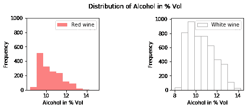
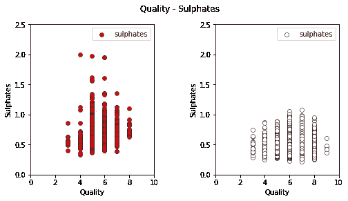
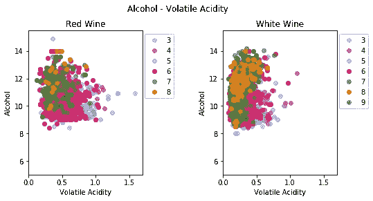
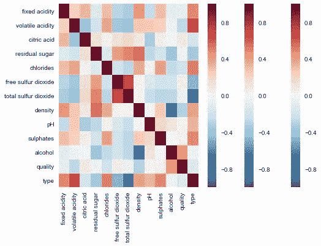

# Keras 教程:Python 中的深度学习

> 原文：<https://towardsdatascience.com/keras-tutorial-deep-learning-in-python-2caf497f8ca1?source=collection_archive---------4----------------------->

*原载于*[*https://www . data camp . com/community/tutorials/deep-learning-python*](https://www.datacamp.com/community/tutorials/deep-learning-python)

现在，你可能已经知道机器学习，这是计算机科学的一个分支，研究可以学习的算法的设计。今天，你们将关注深度学习，这是机器学习的一个子领域，是一套受大脑结构和功能启发的算法。这些算法通常被称为人工神经网络(ANN)。深度学习是数据科学中最热门的领域之一，在机器人、图像识别和人工智能(AI)方面有许多案例研究，取得了令人惊叹的成果。

一些你可能已经知道的成功故事是自动驾驶汽车、自动玩游戏(想想玩棋盘游戏围棋的 [AlphaGo](https://deepmind.com/research/alphago/) )、手写生成、…

用于开发和评估深度学习模型的最强大和易用的 Python 库之一是 Keras 它包装了高效的数值计算库 ano 和 TensorFlow。这样做的好处主要是，你可以用一种简单有趣的方式开始学习神经网络。

今天的 Keras 初学者教程将向您介绍 Python 深度学习的基础:一步一步地，该教程将向您展示如何使用 Python 及其库来探索您的数据，为分类和回归任务建立多层感知器，编译数据并使其符合这些模型，预测目标值并验证您已经建立的模型。

你想参加关于 Keras 和 Python 深度学习的课程吗？可以考虑上 DataCamp 的[深度学习中的 Python](https://www.datacamp.com/courses/deep-learning-in-python) 课程！

此外，不要错过我们的 [Keras 备忘单](https://www.datacamp.com/community/blog/keras-cheat-sheet)，它通过代码示例向您展示了用 Python 构建神经网络需要经历的六个步骤！

在深入研究 Keras 以及如何使用它开始 Python 深度学习之前，您可能应该对神经网络略知一二。正如您在上一节中简要阅读的那样，神经网络找到了它们的灵感和生物学，其中术语“神经网络”也可以用于神经元。人脑就是这种神经网络的一个例子，它由许多神经元组成。

众所周知，大脑能够进行非常复杂的计算，这也是人工神经网络的灵感来源。网络作为一个整体是一个强大的建模工具。

最简单的神经网络是“感知器”，其最简单的形式是由单个神经元组成。非常像具有树突和轴突的生物神经元，单个人工神经元是简单的树形结构，其具有输入节点和连接到每个输入节点的单个输出节点。以下是两者的直观对比:


从图中可以看出，人工神经元有六个组成部分。从左到右，它们是:

1.  **输入节点**。碰巧的是，每个输入节点都与一个数值相关联，这个数值可以是任何实数。记住实数构成了所有的数字:它们可以是正数或负数，整数或小数。
2.  **人脉**。类似地，每个离开输入节点的连接都具有与之相关联的权重，并且这也可以是任何实数。
3.  接下来，输入节点的所有值和连接的权重被集合在一起:它们被用作一个**加权和** : y = f(sum_{i=1}^{D} w_i*x_i)的输入，或者换句话说，y = f(w_1*x_1 + w_2*x_2 + … w_D*x_D)。
4.  该结果将作为**转移或激活功能**的输入。在最简单但平凡的情况下，这个传递函数是一个恒等函数，f(x)=x，或者换句话说，y=x。在这种情况下，\(x\)是输入节点和连接的加权和。然而，就像生物神经元只有在超过某个阈值时才会触发一样，人工神经元也只有在输入的总和超过某个阈值时才会触发，比如说 0。这是你在标识函数中找不到的东西！人们能想到的最直观的方法是设计一个如下的系统:f(x) = 0 如果 x<0；如果 x=0，f(x)= 0.5；如果 x > 0，f(x) = 1。
5.  当然，你已经可以想象输出不会是一条平滑的线:它将是一个不连续的函数。因为这会在数学处理中引起问题，所以经常使用连续变量，即 sigmoid 函数。你可能已经知道的 sigmoid 函数的一个例子是逻辑函数。使用这个函数会产生更平滑的结果！
6.  因此，您有了**输出节点**，它与输入节点的加权和的函数(如 sigmoid 函数)相关联。注意，sigmoid 函数是一个数学函数，它会产生一条“S”形曲线；稍后你会读到更多相关内容。
7.  最后，感知器可能是一个额外的参数，称为**偏差**，实际上您可以将它视为与永久设置为 1 的额外输入节点相关联的权重。偏差值很重要，因为它允许你将激活函数向左或向右移动，这可以决定你学习的成功与否。

请注意，这个模型的逻辑结果是，感知器只处理数字数据。这意味着您应该将任何名义数据转换成数字格式。

既然您已经知道感知器与阈值一起工作，那么将它们用于分类目的的步骤就不远了:感知器可以同意，高于某个阈值的任何输出都表明一个实例属于一个类，而低于阈值的输出可能导致输入成为另一个类的成员。输出等于阈值的直线就是两个类之间的边界。


感知器的网络是多层感知器，这是本教程将在 Keras 的帮助下用 Python 实现的！多层感知器也被称为“前馈神经网络”。正如你现在已经猜到的，这些是比感知器更复杂的网络，因为它们由多层组织的多个神经元组成。层数通常限制在两三层，但理论上是没有限制的！

这些层的行为非常像你在上面读到的生物神经元:一层的输出作为下一层的输入。

在这些层中，您可以区分输入层、隐藏层和输出层。多层感知器通常是全连接的。这意味着某一层中的每个感知器与下一层中的每个感知器之间存在连接。即使连通性不是必需的，这也是典型的情况。

请注意，虽然感知器只能表示类之间的线性分离，但多层感知器克服了这一限制，还可以表示更复杂的决策边界。

对于本教程，您将使用葡萄酒质量数据集，您可以在 UCI 机器学习知识库的葡萄酒质量数据集中找到该数据集。理想情况下，您在较大的数据集上执行深度学习，但出于本教程的目的，您将利用较小的数据集。这主要是因为目标是让您开始使用这个库，并熟悉神经网络的工作方式。

你可能已经知道这个数据集，因为它是开始学习如何解决机器学习问题的最流行的数据集之一。在这种情况下，它将为您使用 Keras 开始深度学习 Python 提供服务。

我们现在就开始吧！

然而，在开始加载数据之前，检查一下您对葡萄酒的了解程度可能是个好主意(当然是与数据集相关的)。你们大多数人都知道，一般来说，有两种非常受欢迎的葡萄酒:红葡萄酒和白葡萄酒。

(我确信还有很多其他的，但为了简单起见，也因为我对葡萄酒的了解有限，我就只说这些了。如果让你们当中真正的鉴赏家失望了，我很抱歉:)。

知道这些已经是一件事了，但是如果你想分析这些数据，你需要知道更多一点。

首先，检查数据描述文件夹，查看包含了哪些变量。这通常是理解数据的第一步。前往[本页](http://archive.ics.uci.edu/ml/machine-learning-databases/wine-quality/winequality.names)查看描述或继续阅读以更好地了解您的数据。

该数据由两个数据集组成，分别与葡萄牙“Vinho Verde”葡萄酒的红色和白色变种相关。如描述中所述，你只会发现物理化学和感官变量包含在这个数据集中。数据描述文件仅列出了数据中包含的 12 个变量，但对于像我一样不是真正的化学专家的人，这里有每个变量的简短描述:

1.  *固定酸度*:酸是葡萄酒的主要特性，对葡萄酒的味道有很大的贡献。通常，总酸度分为两组:挥发性酸和非挥发性或固定酸。葡萄酒中的固定酸有以下几种:酒石酸、苹果酸、柠檬酸和琥珀酸。该变量在数据集中以 g(酒石酸)/dm 表示。
2.  *挥发酸度*:挥发酸度基本上就是酒变成醋的过程。在美国，红餐酒和白餐酒的挥发性酸度法定上限分别为 1.2 克/升和 1.1 克/升。在这些数据集中，挥发性酸度以 g(乙酸)/dm 表示。
3.  柠檬酸是葡萄酒中的一种固定酸。在两个数据集中用 g/dm 表示。
4.  *残糖*一般指发酵停止后剩余的糖，或被停止。在`red`和`white`数据中用 g/dm 表示。
5.  氯化物是葡萄酒中咸味的主要来源。在这里，你会看到它是用 g(氯化钠)/dm 表示的。
6.  *游离二氧化硫*:添加到葡萄酒中并流失到其中的那部分二氧化硫称为结合态，而活性部分则称为游离态。酿酒师总是试图获得最高比例的游离硫来结合。该变量在数据中以 mg/dm 表示。
7.  *总二氧化硫*是结合态和游离态二氧化硫(SO2)的总和。在这里，它是用毫克/分米表示的。葡萄酒中的硫含量有法律限制:在欧盟，红葡萄酒只能有 160 毫克/升，而白葡萄酒和玫瑰葡萄酒可以有大约 210 毫克/升。甜葡萄酒允许有 400 毫克/升。在美国，法律限制是 350 毫克/升，在澳大利亚，这是 250 毫克/升
8.  *密度*通常用于衡量糖向酒精的转化。这里，用 g/cm 表示。
9.  *pH* 或氢的潜力是一个数字标度，用来表示葡萄酒的酸度或碱度。你可能知道，pH 值小于 7 的溶液是酸性的，而 pH 值大于 7 的溶液是碱性的。pH 值为 7 的纯水是中性的。大多数葡萄酒的 pH 值在 2.9 到 3.9 之间，因此是酸性的。
10.  硫酸盐对于葡萄酒就像面筋对于食物一样。你可能已经知道亚硫酸盐会引起头痛。它们是世界各地酿酒的常规部分，被认为是必不可少的。在这种情况下，它们用 g(硫酸钾)/dm 表示。
11.  酒精:葡萄酒是一种酒精饮料，正如你所知道的，酒精含量会因酒而异。这个变量包含在数据集中，并以% vol 表示，这并不奇怪。
12.  *品质*:葡萄酒专家给葡萄酒质量打分，在 0(非常差)到 10(非常优秀)之间。最终的数字是由相同的葡萄酒专家做出的至少三个评价的中间值。

当然，这都是一些非常基本的信息，你可能需要知道开始。如果你是一个真正的葡萄酒鉴赏家，你可能知道所有这些，甚至更多！

现在，tt 是时候得到你的数据了！

这可以通过 Python 数据操作库 Pandas 轻松完成。您遵循导入惯例，在别名`pd`下导入包。

接下来，使用`read_csv()`函数读入存储数据的 CSV 文件。此外，使用`sep`参数指定本例中的分隔符是分号，而不是普通的逗号。

你可以在[这个 DataCamp Light chunk](https://www.datacamp.com/community/tutorials/deep-learning-python) 里试试。

厉害！那不是小菜一碟，不是吗？

到目前为止，你可能已经这样做了一百万次，但是这总是开始的必要步骤。现在，您完全可以开始探索、操作和建模您的数据了！

有了手头的数据，你很容易对这些酒有更多的了解！在本练习中，你可能想做的第一件事就是快速浏览你的两个数据帧。

现在是检查您的导入是否成功的时候了:仔细检查数据是否包含 UCI 机器学习存储库的数据描述文件向您承诺的所有变量。除了变量的数量，还要检查导入的质量:数据类型是否正确？所有的行都通过了吗？当你清理数据的时候，有什么空值需要考虑的吗？

除了`info()`之外，您可能还想检查您的数据。你可以在[这个练习](https://www.datacamp.com/community/tutorials/deep-learning-python)中完成。

简要回顾一下所有这些熊猫功能:你会发现`head()`、`tail()`和`sample()`非常棒，因为它们为你提供了一种快速检查数据的方式，没有任何麻烦。

接下来，`describe()`提供了一些关于您的数据的汇总统计，可以帮助您评估您的数据质量。你可以看到一些变量的`min`和`max`值有很大的不同。这是您稍后要处理的事情，但是此时，意识到这一点非常重要。

最后，在`isnull()`的帮助下，您已经仔细检查了`red`中是否存在空值。当你在阅读了`info()`的结果后仍有疑问时，这个函数总是能派上用场。

**提示**:还要检查葡萄酒数据是否包含空值。您可以通过使用 DataCamp Light chunk 的 IPython shell 来实现这一点，正如您在上面看到的。

既然您已经检查了您的数据以查看导入是否成功和正确，那么是时候更深入一点了。

一种方法是查看数据集变量的分布，并制作散点图来查看可能的相关性。当然，如果您将这些数据用于您自己的项目，您可以将这一切提升到一个更高的水平。

乍一看，你可能会觉得有趣的一个变量是`alcohol`。当你检查一个葡萄酒数据集时，这可能是最先引起你注意的事情之一。您可以使用任何数据可视化库来可视化分布，但是在这种情况下，本教程使用`matplotlib`来快速绘制分布。你可以在这里找到代码。

正如你在下图中看到的，你会发现红葡萄酒和白葡萄酒的酒精含量基本相同:它们的酒精含量都在 9%左右。当然，也有相当数量的观测值具有 10%或 11%的酒精百分比。



注意，如果您使用`numpy`包中的`histogram()`函数来计算`white`和`red`数据的直方图，您可以仔细检查这一点。你可以在这里找到代码。

如果你对`matplotlib`教程感兴趣，请务必查看 DataCamp 的 [Matplotlib](https://www.datacamp.com/community/tutorials/matplotlib-tutorial-python) 初学者教程和[查看 3D 体积数据](https://www.datacamp.com/community/tutorials/matplotlib-3d-volumetric-data)教程，它们向你展示了如何使用 Matplotlib 的事件处理程序 API。

接下来，我感兴趣的一件事是硫酸盐和葡萄酒质量之间的关系。正如你在上面读到的，硫酸盐会让人头疼，我想知道这是否会影响葡萄酒的质量。更有甚者，我经常听说女人特别不愿意喝酒正是因为它会引起头痛。也许这影响了红酒的收视率？

我们来看看:这里可以找到代码[。](https://www.datacamp.com/community/tutorials/deep-learning-python)

正如你在下图中看到的，红葡萄酒似乎比白葡萄酒含有更多的硫酸盐，白葡萄酒含有的硫酸盐少于 1 克/分米。对于白葡萄酒来说，似乎只有几个例外略高于 1 g/\(dm \ ),而对于红葡萄酒来说，这肯定更多。这也许可以解释为什么人们普遍认为红酒会让人头疼，但是红酒的质量如何呢？

你可以清楚地看到，有一种硫酸盐含量相对较低的白葡萄酒得到了 9 分，但对于其他葡萄酒，在这一点上很难正确解读数据。

当然，你需要考虑到观察结果的差异也会影响图表以及你可能如何解读它们。



除了硫酸盐，酸度是葡萄酒的主要和重要的特征之一，是获得优质葡萄酒的必要条件。好的葡萄酒通常能平衡酸度、单宁、酒精和甜味。更多的研究告诉我，0.2 到 0.4 克/升的挥发性酸度不会影响葡萄酒的质量。然而，在更高的浓度下，挥发性的酸度会给葡萄酒带来强烈的酸味。极度易挥发的酸度表明葡萄酒有严重缺陷。

让我们对数据进行测试，并制作一个散点图，绘制酒精与挥发性酸度的关系。数据点应根据其等级或`quality`标签进行着色。你可以在这里找到代码和练习。

请注意，该图像中的颜色是在 NumPy `random`模块的帮助下随机选择的。您总是可以通过向`redcolors`或`whitecolors`变量传递一个列表来改变这一点。确保它们是相同的(除了 1，因为白葡萄酒数据比红葡萄酒数据多一个唯一的`quality`值)，否则你的图例就不匹配了！

点击此处查看完整图表:



在上图中，你可以看到你在上面读到的水平尤其适用于白葡萄酒:大多数标签为 8 的葡萄酒具有 0.5 或更低的挥发性酸度水平，但它是否对质量有影响很难说，因为所有的数据点都非常密集地集中在图表的一侧。

这只是一个快速的数据探索。如果您有兴趣在自己的项目中详细阐述这一步骤，请考虑 DataCamp 的数据探索帖子，如 [Python 探索性数据分析](https://www.datacamp.com/community/tutorials/exploratory-data-analysis-python)和 [Python 数据剖析](https://www.datacamp.com/community/tutorials/python-data-profiling)教程，它们将指导您了解 EDA 的基础知识。

这可能需要消化很多内容，所以稍微回顾一下您在 EDA 过程中所看到的内容永远不会太晚，这对本教程的后续课程可能很重要:

*   数据集的一些变量的值相差很大。您可以在本教程的下一部分中处理这个问题。
*   您有一个理想的场景:数据集中没有空值。
*   数据集中包含的大多数葡萄酒的酒精含量在 9%左右。
*   红葡萄酒似乎比白葡萄酒含有更多的硫酸盐，白葡萄酒的硫酸盐含量低于 1 克/干重。
*   你看到大多数葡萄酒的波动酸度在 0.5 及以下。目前，这与葡萄酒的质量没有直接关系。

到目前为止，您已经分别查看了白葡萄酒和红葡萄酒的数据。当你近距离观察一些变量时，这两者似乎有些不同，而在其他情况下，这两者似乎非常相似。你认为有没有一种方法可以根据变量将条目分为白葡萄酒或红葡萄酒？

只有一种方法可以找到答案:对数据进行预处理，并以这样的方式建模，以便您可以看到会发生什么！

既然您已经探索了您的数据，是时候根据您获得的见解采取行动了！让我们对数据进行预处理，以便您可以开始构建自己的神经网络！

要看代码，去[原教程](https://www.datacamp.com/community/tutorials/deep-learning-python)。

在这种情况下，您将`ignore_index`设置为`True`,因为您不希望在将数据追加到`red`时保留`white`的索引标签:您希望标签从它们在`red`中停止的地方继续，而不是将两个数据集连接在一起的重复索引标签。

现在你有了完整的数据集，做一个快速的数据探索是一个好主意；通过分别查看这两个数据集，您已经知道了一些东西，现在是时候收集一些更可靠的见解了。

由于解释图表可能有些困难，所以绘制相关矩阵也是一个好主意。这将更快地给出关于哪些变量相关的见解。你可以在这里找到代码。

如你所料，有一些变量是相关的，比如`density`和`residual sugar`。此外，`volatile acidity`和`type`的联系比你最初通过分别查看这两个数据集所能猜到的更加紧密，而且`free sulfur dioxide`和`total sulfur dioxide`会有关联也是意料之中的事情。



很有意思！

不平衡数据通常指的是分类问题，其中类别没有被平等地表示。大多数分类数据集在每个类中的实例数量并不完全相等，但是微小的差异通常并不重要。因此，您需要确保所有两类葡萄酒都出现在训练模型中。此外，所有两种葡萄酒类型的实例数量需要大致相等，这样您就不会在预测中偏向某一类。

在这种情况下，似乎有一个不平衡，但你会暂时这样做。之后，您可以评估模型，如果它表现不佳，您可以求助于欠采样或过采样来掩盖观察结果的差异。

现在，从`sklearn.model_selection`导入`train_test_split`，并将数据和目标标签分配给变量`X`和`y`。您将看到，您需要展平目标标签的数组，以便完全准备好使用`X`和`y`变量作为`train_test_split()`函数的输入。开始工作，从[这个数据营的小块](https://www.datacamp.com/community/tutorials/deep-learning-python)开始。

你已经在建立你的第一个神经网络的路上了，但是还有一件事你需要注意！你还知道你在查看`white`和`red`数据集的摘要时发现了什么吗？

事实上，有些价值观相差甚远。在这里做一些标准化可能是有意义的。

标准化是处理这些相距甚远的价值观的一种方式。scikit-learn 包为您提供了一种快速标准化数据的方法:从`sklearn.preprocessing`导入`StandardScaler`模块，您就可以缩放您的训练和测试数据了！

```
# Import `StandardScaler` from `sklearn.preprocessing` 
from sklearn.preprocessing import StandardScaler # Define the scaler 
scaler = StandardScaler().fit(X_train) # Scale the train set 
X_train = scaler.transform(X_train) # Scale the test set 
X_test = scaler.transform(X_test)
```

既然您的数据已经过预处理，那么您可以继续进行真正的工作:构建您自己的神经网络来对葡萄酒进行分类。

在你开始建模之前，回到你最初的问题:你能通过观察葡萄酒的化学性质，如挥发性酸度或硫酸盐，来预测它是红还是白吗？

因为你只有两个类，即白色和红色，你要做一个二进制分类。你可以想象，“二进制”意味着 0 或 1，是或否，由于神经网络只能处理数值数据，所以你已经将红色编码为 1，白色编码为 0。

在这种问题上表现良好的一种网络是多层感知器。正如你在本教程开始时所读到的，这种类型的神经网络通常是完全连接的。这意味着您正在寻求构建一个完全连接的层的相当简单的堆栈来解决这个问题。至于你会用到的激活函数，出于熟悉 Keras 和神经网络的目的，这里最好用一个最常见的，就是 relu 激活函数。

现在你如何开始建立你的多层感知器？快速入门的方法是使用 Keras 顺序模型:它是层的线性堆栈。您可以通过向构造函数传递一个层实例列表来轻松地创建模型，这是通过运行`model = Sequential()`来设置的。

接下来，最好回想一下多层感知器的结构，就像你在本教程开始时读到的那样:你有一个输入层，一些隐藏层和一个输出层。当你制作模型时，考虑到你的第一层需要使输入形状清晰是很重要的。模型需要知道预期的输入形状，这就是为什么在这些层的文档和这些层的实际示例中，您总是会找到`input_shape`、`input_dim`、`input_length`或`batch_size`参数。

在这种情况下，你将不得不使用一个`Dense`层，这是一个完全连接的层。密集层实现如下操作:`output = activation(dot(input, kernel) + bias)`。请注意，如果没有激活函数，您的稠密层将只包含两个线性操作:点积和加法。

在第一层中，`activation`参数取值为`relu`。接下来，您还会看到`input_shape`已经被定义。这是您刚刚看到的操作的`input`:模型将形状`(12,)`或`(*, 12)`作为输入数组。最后，您会看到第一层将`12`作为`Dense()`的`units`参数的第一个值，这是输出空间的维度，实际上是 12 个隐藏单元。这意味着模型将输出形状为`(*, 12)`的数组:这是输出空间的维度。如果您现在还没有完全理解，请不要担心，稍后您会读到更多相关内容！

`units`实际上代表上述公式的`kernel`或层创建的权重矩阵，由给予所有输入节点的所有权重组成。请注意，在下面的示例中，您没有包含任何偏差，因为您没有包含`use_bias`参数并将其设置为`TRUE`，这也是一种可能性。

中间层也使用`relu`激活功能。这一层的输出将是形状`(*,8)`的数组。

您将使用大小为 1 的`Dense`层结束网络。最后一层也将使用一个 sigmoid 激活函数，这样你的输出实际上是一个概率；这意味着这将产生一个介于 0 和 1 之间的分数，表明样品具有目标“1”的可能性有多大，或者葡萄酒是红色的可能性有多大。

你可以在这里找到代码和练习[。](https://www.datacamp.com/community/tutorials/deep-learning-python)

总之，您会看到，在构建模型时，您需要做出两个关键的架构决策:您将使用多少层，以及您将为每层选择多少个“隐藏单元”。

在这种情况下，你为模型的第一层选择了`12`个隐藏单元:正如你在上面读到的，这是输出空间的维度。换句话说，当网络学习表示法时，你设置了你允许网络拥有的自由度。如果您允许更多的隐藏单元，您的网络将能够学习更复杂的表示，但这也将是一个更昂贵的操作，容易过度拟合。

请记住，当模型过于复杂时，过度拟合就会发生:它将描述随机误差或噪声，而不是它需要描述的基本关系。换句话说，训练数据建模得太好了！

请注意，当您没有那么多可用的训练数据时，您应该更喜欢使用具有很少隐藏层的小型网络(通常只有一个，就像上面的示例)。

如果你想获得一些关于你刚刚创建的模型的信息，你可以使用属性化的`output_shape`或者`summary()`函数，等等。下面列出了一些最基本的方法。

试着运行它们，看看你到底得到了什么结果，以及它们告诉了你关于你刚刚创建的模型的什么信息。点击进入练习[。](https://www.datacamp.com/community/tutorials/deep-learning-python)

接下来，是时候编译你的模型并使模型符合数据了:再一次，利用`compile()`和`fit()`来完成这项工作。

```
model.compile(loss='binary_crossentropy', optimizer='adam', metrics=['accuracy']) 
model.fit(X_train, y_train,epochs=20, batch_size=1, verbose=1)
```

在编译中，用`adam`优化器和`binary_crossentropy`损失函数配置模型。此外，您还可以通过将`['accuracy']`传递给`metrics`参数来监控训练过程中的准确性。

`optimizer`和`loss`是编译模型时需要的两个参数。使用的一些最流行的优化算法是随机梯度下降(SGD)、ADAM 和 RMSprop。根据您选择的算法，您需要调整某些参数，比如学习率或动量。损失函数的选择取决于您手头的任务:例如，对于回归问题，您通常使用均方误差(MSE)。正如你在这个例子中看到的，你使用了`binary_crossentropy`来解决二元分类问题，即确定一款葡萄酒是红葡萄酒还是白葡萄酒。最后，通过多类分类，您将利用`categorical_crossentropy`。

之后，您可以在`X_train`和`y_train`中的所有样本上训练模型 20 个历元或迭代，每批 1 个样本。您也可以指定`verbose`参数。通过将它设置为`1`，表明您希望看到进度条日志记录。

换句话说，您必须针对特定数量的历元或对训练数据集的暴露来训练模型。一个时期是对整个训练集的一次遍历，随后是对验证集的测试。您在上面的代码中指定的批处理大小定义了将通过网络传播的样本数。此外，通过这样做，您可以优化效率，因为您确保不会同时将太多的输入模式加载到内存中。

让我们使用您的模型吧！你可以用它来预测测试集的标签。只需使用`predict()`并将测试集传递给它，以预测数据的标签。在这种情况下，结果存储在`y_pred`中:

```
y_pred = model.predict(X_test)
```

在你去评估你的模型之前，你已经可以通过检查`y_pred`和`y_test`的比较来快速了解精确度:

```
y_pred[:5] 
array([[0], [1], [0], [0], [0]], dtype=int32) 
y_test[:5] 
array([0, 1, 0, 0, 0])
```

你可以看到这些值似乎加起来了，但是如果没有一些硬数字，所有这些又是什么呢？

现在，您已经构建了模型，并使用它对模型尚未看到的数据进行预测，是时候评估它的性能了。您可以直观地将预测与实际测试标签进行比较(`y_test`)，或者您可以使用所有类型的指标来确定实际性能。在这种情况下，您将使用`evaluate()`来完成这项工作。传入测试数据和测试标签，如果需要，将`verbose`参数设为 1。当你这样做的时候，你会看到更多的日志出现。

```
score = model.evaluate(X_test, y_test,verbose=1) 
print(score) 
[0.025217213829228164, 0.99487179487179489]
```

分数是一个包含损失和准确性的列表。在这种情况下，你会发现两者似乎都很好，但在这种情况下，最好记住你的数据有些不平衡:你观察到的白葡萄酒比红葡萄酒多。精确度可能只是反映了数据的类别分布，因为它只是预测`white`，因为这些观察值大量存在！

在您开始重新安排数据并以不同的方式将其放在一起之前，尝试不同的评估指标总是一个好主意。为此，您可以依赖 scikit-learn(您将其导入为`sklearn`，就像之前您创建训练集和测试集一样)。

在这种情况下，您将测试一些基本的分类评估技术，例如:

*   混淆矩阵，将预测分解成一个表格，显示正确的预测和错误预测的类型。理想情况下，你只会看到对角线上的数字，这意味着你所有的预测都是正确的！
*   精度是对分类器准确性的度量。精度越高，分类器就越准确。
*   召回是对分类器完整性的一种度量。召回率越高，分类器覆盖的案例就越多。
*   F1 分数或 F 分数是精确度和召回率的加权平均值。
*   Kappa 或 Cohen's kappa 是通过数据中类别的不平衡进行标准化的分类准确度。

```
# Import the modules from `sklearn.metrics` 
from sklearn.metrics import confusion_matrix, precision_score, recall_score, f1_score, cohen_kappa_score # Confusion matrix 
confusion_matrix(y_test, y_pred) 
array([[1585, 3], [ 8, 549]]) # Precision 
precision_score(y_test, y_pred) 
0.994565217391 # Recall 
recall_score(y_test, y_pred) 
0.98563734290843807 # F1 score 
f1_score(y_test,y_pred) 
0.99008115419296661 # Cohen's kappa 
cohen_kappa_score(y_test, y_pred) 
0.98662321692498967
```

这些成绩都很不错！尽管事实上你有相当多的白葡萄酒类型的行，你还是做了一个相当精确的模型。

干得好！

您已经成功地构建了您的第一个模型，但是您可以使用这个模型走得更远。为什么不试试下面这些东西，看看它们的效果如何？正如您在上面读到的，您需要做出的两个关键架构决策涉及到层和隐藏节点。这些都是很好的起点:

*   您使用了 1 个隐藏层。尽量用 2、3 个隐藏层；
*   使用隐藏单元较多或较少的图层；
*   将`quality`列作为目标标签，其余的数据(包括编码后的`type`列！)作为你的数据。你现在有一个多类分类问题！

但是为什么不试着改变激活函数呢？代替 relu，尝试使用 tanh 激活函数，看看结果是什么！


您的分类模型在第一次运行时表现完美！

但是除了更上一层楼，尝试比多层感知器更复杂的结构之外，你还可以做更多的事情。为什么不试着做一个神经网络来预测酒的质量呢？

在这种情况下，本教程假设`quality`是一个连续变量:那么这个任务就不是一个二元分类任务，而是一个有序回归任务。这是一种用于预测序数变量的回归类型:`quality`值存在于任意尺度上，其中不同的`quality`值之间的相对排序是显著的。在这个等级中，质量等级 0-10 代表“非常差”到“非常好”就是这样一个例子。

请注意，您也可以将这类问题视为分类问题，并将质量标签视为固定类别标签。

**要了解如何使用神经网络解决回归问题，请访问** [**原始教程**](https://www.datacamp.com/community/tutorials/deep-learning-python) **。**

本教程只是您深入学习 Python 和 Keras 之旅的开始。还有很多要讲，为什么不上 DataCamp 的[深度学习用 Python](https://www.datacamp.com/courses/deep-learning-in-python) 的课程呢？同时，如果您还没有查看过 [Keras 文档](https://keras.io/)，请务必查看。你会找到更多关于所有函数、参数、更多层等的例子和信息。当你学习如何在 Python 中使用神经网络时，这无疑是一个不可或缺的资源！

*原载于*[*www.datacamp.com*](https://www.datacamp.com/community/tutorials/deep-learning-python)*。*