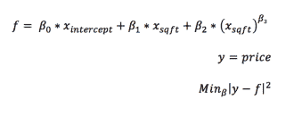
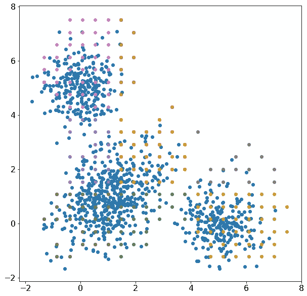

# 核机器学习——kernel ml——广义机器学习算法

> 原文：<https://towardsdatascience.com/kernel-machine-learning-kernelml-generalized-machine-learning-algorithm-4800a4e05a33?source=collection_archive---------7----------------------->

制作这种算法的动机是为分析师和数据科学家提供一种针对复杂损失函数和非线性系数的通用机器学习算法。优化器使用简单的机器学习和概率模拟的组合，使用损失函数、输入和输出矩阵以及(可选的)随机采样器来搜索最佳参数。

**示例用例:**

聚类方法(如 K-means)使用欧几里得距离来比较观察值。然而，经度和纬度数据点之间的欧几里德距离并不直接映射到哈弗森距离，即球体周围的距离。如果坐标在 0 和 1 之间标准化，则距离将不会在聚类分析模型中准确表示。一种可能的解决方案是找到纬度和经度的投影，使得到数据点质心的哈弗斯距离等于欧几里德空间中投影的纬度和经度的哈弗斯距离。

此坐标变换的结果允许您将相对于中心的哈弗线距离表示为欧几里德距离，该距离可以在聚类解决方案中进行缩放和使用。

另一个更简单的问题是找到非线性系数的最佳值，即最小平方线性模型中的幂变换。这样做的原因很简单:整数幂变换很少能捕捉到最合适的变换。通过允许幂变换为任何实数，精确度将提高，并且模型将更好地概括验证数据。

为了阐明功率变换的含义，上面提供了模型的公式。

**算法:**

kernelml 背后的想法很简单。使用机器学习模型中的参数更新历史来决定如何更新下一个参数集。使用机器学习模型作为后端会导致偏差方差问题，具体来说，参数更新在每次迭代中变得更有偏差。这个问题可以通过在每次迭代之后在最佳记录参数集周围包括蒙特卡罗模拟来解决。

**衔接问题:**

该模型在每次迭代后保存最佳参数和用户定义的损失。该模型还记录所有参数更新的历史。问题是如何使用这些数据来定义收敛。一个可能的解决方案是:

该公式使用最后 10 个参数和最佳参数创建 Z 值。如果所有参数的 Z 分数都小于 1，则可以说该算法已经收敛。当存在理论上的最佳参数集时，这种收敛解决方案工作良好。当使用该算法进行聚类时，这是一个问题。请参见下面的示例。

**图 1:用 kernelml 聚类，二维多元正态分布(蓝色)，聚类解决方案(其他颜色)**

我们不会讨论集群解决方案的质量，因为它显然不能代表数据。聚类解决方案最小化了多维直方图和 6 个正态分布(每个轴 3 个)的平均概率之间的差异。在这里，分布可以很容易地“交换”数据点，这可能会增加收敛时间。为什么不直接拟合 3 个多元正态分布？模拟分布参数有一个问题，因为有些参数有约束。协方差矩阵需要是正的，半正定的，并且需要有逆矩阵存在。正态分布中的标准偏差必须大于 0。该模型中使用的解决方案通过对每个单独的参数进行定制模拟来结合参数约束。我仍在寻找如何有效模拟多元正态分布的协方差矩阵的好公式。

**为什么用 kernelml 代替期望最大化？**

非正态分布(如泊松分布)可能不太适合多元正态聚类分析解决方案中的其他维度。此外，随着维数的增加，一个聚类是唯一具有非零值特征的聚类的概率也会增加。这给 em 算法提出了一个问题，因为它试图更新协变矩阵。唯一特征和其他维度之间的协方差将为零，或者另一个聚类接受具有该非零值的观测值的概率为零。

**概率优化器优势:**

参数的概率模拟比完全参数化的模型有更大的好处。首先，正则化包含在先验随机模拟中。例如，如果参数的先验随机模拟在-1 和 1 之间，则可以推断出参数将以同等的重要性更新。此外，当算法收敛时，每次迭代产生一组在全局或局部最小损失附近采样的参数。这样做有两个主要好处:1)可以为每个参数建立置信区间；2)每个参数集的预测输出可以是统一模型中的有用特征。KernelML 并不严格地从概率分布中生成样本。相反，它通过在引导绑定的小批量上更新参数来生成参数的分布。

集群示例的代码、其他示例和文档可以在 github 的[中找到。](https://github.com/Freedomtowin/kernelml)