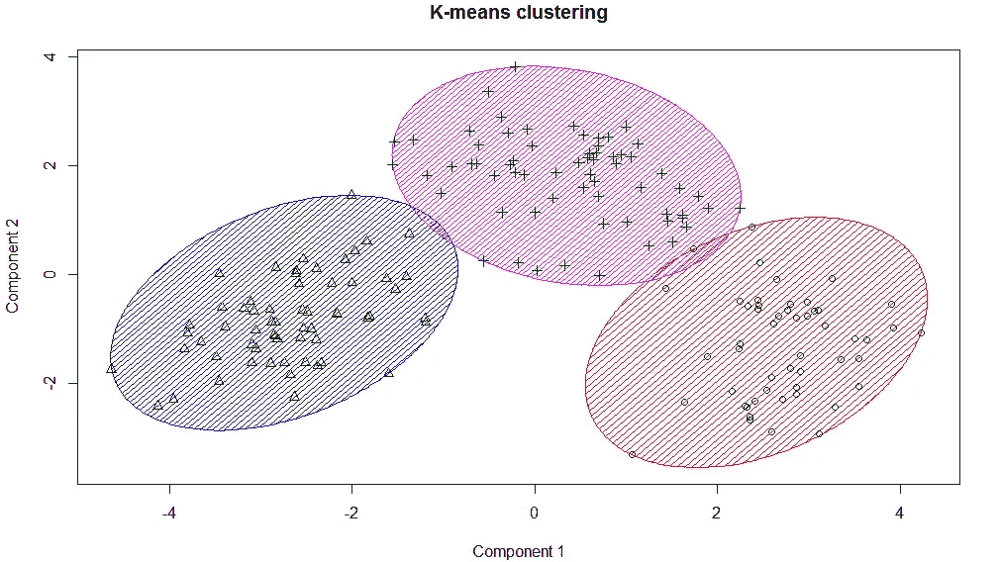

# 用于分类的 k 均值聚类

> 原文：<https://towardsdatascience.com/kmeans-clustering-for-classification-74b992405d0a?source=collection_archive---------2----------------------->

# 背景

聚类作为一种在观察值中寻找子群的方法，广泛应用于市场细分等应用中，在这些应用中，我们试图在数据中找到一些结构。虽然是一种无监督的机器学习技术，但聚类可以用作有监督的机器学习模型中的特征。

> 聚类是一种无监督的机器学习，其目的是找到同质的子组，使得同一组(聚类)中的对象彼此比其他对象更相似。

KMeans 是一种聚类算法，它将观察值分成 k 个聚类。因为我们可以指定聚类的数量，所以它可以很容易地用于分类，在分类中，我们将数据分成等于或大于类数量的聚类。

我将使用 scikit learn 附带的 MNIST 数据集，它是一个带标签的手写数字的集合，并使用 KMeans 在数据集中查找聚类，并测试它作为一个特征有多好。

# 履行

为此，我创建了一个名为 clust 的[类](http://nbviewer.jupyter.org/github/mudassirkhan19/cluster-classification/blob/master/Kmeans_classification.ipynb)，它在初始化时接收一个 sklearn 数据集，并将其分为训练和测试数据集。

函数 KMeans 将 KMeans 聚类应用于训练数据，将类的数量作为要形成的聚类的数量，并为训练和测试数据创建标签。参数输出控制我们希望如何使用这些新标签，“添加”将标签作为特征添加到数据集中，“替换”将使用标签而不是训练和测试数据集来训练我们的分类模型。

# 结果

在第一次尝试中，仅使用 KMeans 找到的聚类来训练分类模型。仅这些聚类就给出了准确度为 78.33%的像样的模型。让我们将其与开箱即用的逻辑回归模型进行比较。

在这种情况下，我只使用特征(灰度强度值)来训练逻辑回归模型。其结果是具有 95.37%准确度的好得多的模型。让我们将分类添加为一个特征(列)并训练相同的逻辑回归模型。

在我们的最后一次迭代中，我们使用聚类作为特征，结果显示比我们以前的模型有所改进。

# 外卖食品

聚类除了是一种无监督的机器学习之外，还可以用于创建聚类作为改进分类模型的特征。结果显示，它们本身不足以进行分类。但是当用作特征时，它们提高了模型的准确性。

你可以[使用我创建的类](http://nbviewer.jupyter.org/github/mudassirkhan19/cluster-classification/blob/master/Kmeans_classification.ipynb)来调整和测试不同的模型，例如测试一个随机的森林分类器，分享一些我在评论中没有找到的东西。