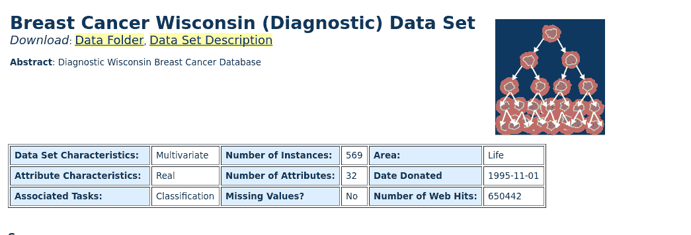
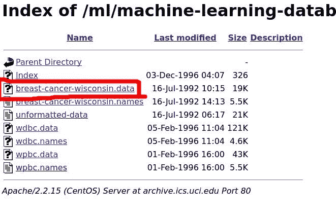

# KNN (K 近邻)#2

> 原文：<https://towardsdatascience.com/knn-k-nearest-neighbors-2-169d667bcee5?source=collection_archive---------10----------------------->

## 获取数据集

如果你还没有阅读，或者不知道 KNN 是如何工作的，我建议你在继续阅读这篇文章之前，先阅读这篇[帖子](http://post antigo)，这样你会发现没有代码的算法解释。

## **从何说起？**

开始吧！首先，我们需要数据，因为没有数据，世界上就没有有效的人工智能！(如果存在，请在评论中发表)

## **我从哪里得到这些数据？**

如果你没有阅读这篇文章来在你工作的公司实施它(你可以做到的！)，你很可能没有任何数据，而且就像我之前说的，没有数据，就没有机器学习。

但是不用担心！我们有一个解决方案，数据是当今最容易获得的东西(取决于数据类型)，我们将在本文中使用的格式是其中最容易的，在互联网的世界中有一个神奇的地方，那里有 N 个大小的 N 个数据集，这个地方就是 [UCI 机器学习库](http://asdsad)，当我写这篇文章时，UCI 在那里维护着 425 个数据集，下载它吧！

> 我如何选择数据集？我对 UCI 界面一点也不了解

不要担心，这非常简单，在初始页面上，您会看到一些数据集，我将向您介绍一点平台，其余的您可以随意浏览。

在上图中，用红色标记的是 UCI 的主要储藏室，为什么它们是主要储藏室？因为它们是最容易工作的数据集，没有丢失的数据，数据分布对于机器学习等非常有用。好了，让我们进入我们将在 KNN 实现中处理的数据集，[乳腺癌威斯康星州(诊断)](http://archive.ics.uci.edu/ml/datasets/Breast+Cancer+Wisconsin+(Diagnostic))包含乳腺癌活检诊断数据。

打开链接，你会看到一些数据集的信息，像上面的图片，如实例数(行)，数据集有多少属性(列)，如果有丢失的数据，数据连接到哪个区域，等等。

在同一页上，你还会发现数据集的描述，引用该数据集的论文，它包含的列，等等。

在下图中，我们有乳腺癌数据集列。

正如你所看到的(或者没有看到)，我们有我们将要工作的列描述。

我们有 id(在我们的分类场景中没有用)、诊断(我们的分类数据)、半径、纹理、周长等，这些其他数据是我们将用于进行肿瘤分类的属性，无论它是恶性还是良性。

## 但是在哪里可以下载这些数据呢？

在数据集名称旁边，你将有两个链接，[数据文件夹](http://archive.ics.uci.edu/ml/machine-learning-databases/breast-cancer-wisconsin/)，[数据集描述](http://archive.ics.uci.edu/ml/machine-learning-databases/breast-cancer-wisconsin/wdbc.names)

从左边开始，数据集描述基本上是关于数据集的信息，通常是纯文本格式，数据文件夹链接是数据集本身所在的位置。

红色选项是要下载的正确文件。

如果你一步一步地阅读这个关于 knn 的系列文章，我建议你不要下载 uci 库中包含的文件，在下一集里，我们将对这个数据进行一些处理，我将为我们的 knn 提供一个准备好的数据集。