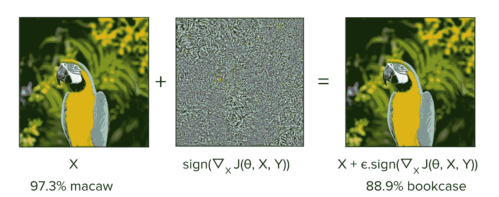
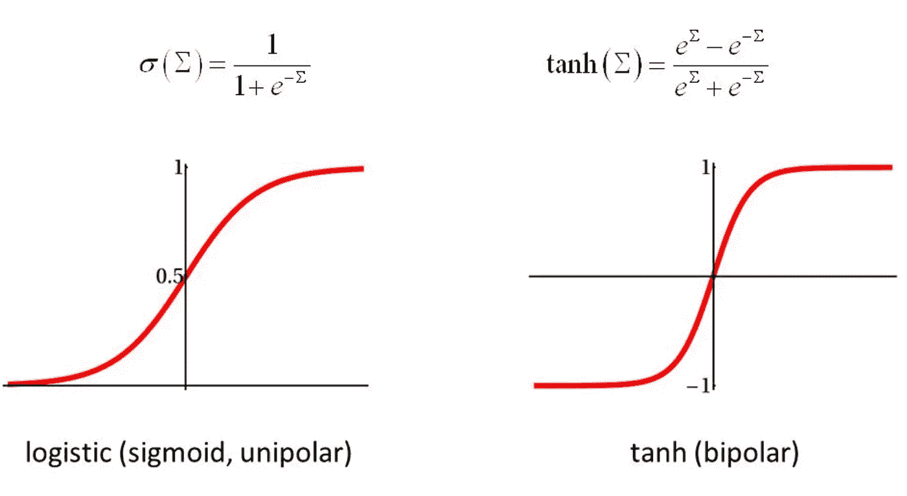

# 了解你的对手:理解对手的例子(第 1/2 部分)

> 原文：<https://towardsdatascience.com/know-your-adversary-understanding-adversarial-examples-part-1-2-63af4c2f5830?source=collection_archive---------0----------------------->

这可能只是一个不可避免的焦点偏差:任何你盯着看足够长时间的问题都会因为你的关注而变得更有兴趣和意义。但是，也就是说，在过去的一周里，我花了很多时间研究对立的例子，我开始将它们视为机器学习世界核心问题的迷人症结:将学到的知识映射到人类概念的困难，一个人的训练集带来的内在限制，以及对在安全化设置中用原则理解换取数字优化的担忧。

我对这一主题的探索是由一个关键问题引发的:对立的例子仅仅是研究人员的一个有趣的玩具问题，还是我们的模型中更深层和更长期的弱点的一个例子？然而，要以任何连贯的方式回答这个问题，首先需要建立一些背景知识。这篇文章是两篇文章中的第一篇，致力于建立对这些攻击如何以及为什么起作用的直觉；第二篇文章将在本周晚些时候发表，重点是思考防御和实际攻击场景。

# 对立的例子是如何制作的？

曾几何时，在 2013 年的太平日子里，早在 Batch Norm 和 ResNets 和 GANs 之前，谷歌的一个小组发表了“[神经网络的有趣特性](https://arxiv.org/pdf/1312.6199.pdf)”，其中作者发现了他们正在试验的模型的一个令人担忧的事实:你经常可以诱导网络改变标签的预测类别，而不改变人类对图像的感知方式。

And in the right-hand column we have: entirely giraffes. According to the network, at least.

让这些例子*具有对抗性*的特殊因素是，只需要施加很少的扰动，就可以让网络改变对正确分类的想法。一般来说，训练有素的模型的一个特点是，它们对少量的噪声相对不变。而且，当涉及到随机噪声时，事实上通常是这样的——实验通常已经证实，向图像添加真正的“白噪声”通常不会影响性能良好的模型的预测。但是，当涉及到非随机噪声，即专门设计来“愚弄”网络的噪声时，这种噪声的数量少得惊人，远远小于人眼可察觉的数量，可以有意义地改变网络的最终输出。

在过去的四年中，新的攻击技术被添加到文献中，每种技术都有自己的细微差别、权衡和怪癖。但所有对立的例子都有一个基本的概念基础:使用(可能是近似的)模型内部状态的知识来寻找输入像素的小修改，这将导致模型有最大的错误机会。

如前所述，使一个例子具有对抗性的关键特征，至少在通俗的说法中，是人类对变化的不易察觉性。显然，当你自动创建示例时，让一个人陷入循环的代价是惊人的，所以研究人员不得不开发“难以察觉的差异”的代理，基于捕捉原始图像和它的扰动邪恶双胞胎之间的差异的度量。

*   **L⁰距离:**图像 x 和图像 z 之间数值不同的像素总数是多少？
*   **L 距离:**图像 X 和图像 Z 的总和绝对值差是多少？
    *(对于每个像素，计算差值的绝对值，并对所有像素求和)*
*   **L 距离:**图像 X 和图像 Z 的平方差是多少？*(对于每个像素，取图像 X 和 Z 之间的距离，将其平方，并对所有像素求和)*
*   **L^infinity 距离:**图像 x 和图像 z 的最大像素差是多少？如果你通读了这篇文章链接的一些论文，你会听到这被称为“最大常态”。
    *(对于每个像素，取 X 和 Z 之间的绝对值差，并返回在所有像素上找到的最大距离)*

你会注意到所有这些距离都用 L 和一个数字来表示。理解这个数字背后的精确数学逻辑是不必要的，但一个有用的启发是，数字越高，距离受异常值的影响就越大。在 L⁰距离中，变化 0.001 的像素与变化 10 的像素的影响一样大，因为该度量仅考虑有任何变化的像素总数。相比之下，在 L-infinity 距离中，唯一重要的是具有最大变化量的像素，而不考虑可能已经被修改的其他像素的数量。L-infinity 或最大范数距离是最常用的，但其他距离偶尔也会出现。有了这些直觉，我们可以继续讨论一些攻击方法。

最早也是最简单的技术叫做[快速梯度符号法](https://arxiv.org/pdf/1412.6572.pdf)。在这个攻击中，第一步是计算你的成本相对于输入像素的梯度。起初，这可能是一个有点奇怪的概念，因为在反向传播中，我们通常根据模型参数来考虑梯度:如果我们修改这个权重或那个权重，这种变化会对总损失产生多大影响？但是网络的输出是其输入像素的函数，也是其参数的函数；我们通常只考虑修改后者，因为数据是固定的，我们正在更新参数以适应它。但是，如果我们想象一个已经训练好的模型，我们可以翻转问题:不是优化参数来减少损失，保持图像不变，我们可以优化图像像素来增加损失，保持参数不变。

一旦我们获得了输出相对于像素的梯度，我们将最终得到一个像素矩阵(或张量),其大小与输入图像相对应，填充有指示如果像素值更新一个单位，损失会改变多少的值。然后，FGSM 取梯度矩阵，并取它的符号。也就是说:它减少了浮点值的矩阵，使得它完全包含-1(对于所有负值)或+1(对于所有正值)。一旦你有了符号矩阵 S，这个方法选择某个值ε，并将两者相乘，这样你就有了一个充满+ε或-ε的矩阵。然后，你把这个矩阵加到输入像素矩阵中，你就有了一个对立的例子。

这个解释有点复杂，但我认为对这种攻击有一个过于清晰的理解有助于为其他人建立直觉，所有这些都有一个广泛的概念方法，即“使用内部模型参数的知识，以一种明确优化的方式干扰您的更新，以降低正确分类的可能性”。已经开发的一些其他攻击包括:

*   应用 FGSM，但是[多次执行计算梯度的步骤](http://chrome-extension://oemmndcbldboiebfnladdacbdfmadadm/https://arxiv.org/pdf/1611.01236.pdf)，这样我们在恶化模型的方向上采取多个“步骤”。通常，完成此操作后，总的可能距离是有上限的，因此即使您采取了多个步骤，您与输入的 L-infinity 距离也不会超过一个固定值。
*   [Deep Fool](https://arxiv.org/pdf/1511.04599.pdf) ，其迭代地“线性化”输入点处的损失函数(取该点处损失函数的正切值)，并且如果该线性近似是正确的，则应用切换类所必需的最小扰动。它多次执行该过程，每次使用先前的输入+先前的扰动作为输入，直到网络选择的类别切换。(对于倾向于线性代数的人来说，线性情况下的“最小必要扰动”相当于将输入向量投影到局部线性化模型的“决策边界”上)
*   [Carlini 的攻击](https://www.arxiv-vanity.com/papers/1608.04644/)，一种在样本被原模型误分类的约束下，直接优化与原样本距离最小的方法。这是一种代价更高的攻击，因为它涉及到解决一个重要的优化问题，即使使用 Carlini 在论文中建议的松弛方法。然而，这是非常有效的，包括对防御，阻止早期品种的对抗性的例子。据我所知，这是目前的重量级攻击冠军。

# 令人惊讶的罪魁祸首:模型线性

有了对什么是机械的、对立的例子的清晰理解，你就可以进入真正有趣的问题:它们为什么存在？如果有的话，它们的存在对现代模型的质量和稳定性说明了什么？

我试图回答这些问题，我是如何了解到一些关于对立例子的真正令人惊讶的事情的:当前研究人员的共识是，对立例子不是过度拟合的产物，而是高维输入和现代模型的内部线性的产物。

这个断言的一些部分很奇怪，不直观有点轻描淡写，但让我们从对立的例子与高维线性相关的评估开始。出现这种情况的基本逻辑是:线性模型进行推断，在训练数据集中的区域之外，它们的行为可能非常病态。这种外推是由以下事实引起的:根据线性模型的线性定义，每个要素都具有相同的部分斜率，而不管其值或其他要素的值如何。也就是说:模型不会因为到达了从未看到训练数据的区域而变平。如果您设法在与决策边界完全一致的方向上将您的输入从训练数据区域推开，您可以到达决策空间的一部分，该部分模型非常确定对应于不同的类别。

In the example above, if we move in a direction perpendicular to the decision boundary, we can, with a relatively small-magnitude vector, push ourselves to a place where the model is very confident in the wrong direction

此外，在高维空间中，每个单独的像素可能仅增加非常小的量，但是这些小的差异导致权重*输入点积的显著差异，因为所有这些小的差异都乘以权重，然后求和在一起。Andrej Karpathy 关于主题的[博客文章进一步阐述了这种直觉，并证实了用单层线性逻辑分类器观察对立例子的可能性。](http://karpathy.github.io/2015/03/30/breaking-convnets/)

Seems legit

现在，让我们把注意力转向这句话的另一个令人惊讶的部分:断言深度模型的问题是它们太线性了。乍一看，这似乎很荒谬:深度网络从定义上来说是非线性的。如果深度网络没有非线性激活函数，它们不会比单层线性函数更复杂，也没有希望学习它们实际学习的函数。此外，深度网络需要非线性才能工作，这是正确的。但是，在可能的非线性激活函数的空间内，现代深度网络实际上已经确定了一个非常接近线性的激活函数:ReLu。

The fault is not in our stars, but in our activation functions, for they are linear

由于 ReLu 具有相当大的置零区域，因此可以称之为非线性，但它也有很大的空间，对于大于 0 的输入，它实际上只是作为线性函数工作。与 sigmoid 或 tanh 激活相比，它们在高激活时会简单地饱和到一个上限值，使用前面部分概述的逻辑，可以将 ReLu 激活推到任意高的值。

关于激活的选择，一个有趣的问题是在可训练性和对抗攻击的鲁棒性之间的权衡。tanh 和 logistic 函数难以训练的一个关键原因是，尾部的饱和区域，激活的斜率(以及梯度值)可能会“卡”在非常接近 0 的位置。这将使网络中来自后面点的任何梯度归零，并使网络的前面位没有任何信号可供学习。当用 tanh 和 sigmoid 训练时，游戏的名字是试图以某种方式保持你的激活在激活的中间区域，在那里梯度大致是线性的，所以你保持你的梯度活着。

相比之下，ReLu 在 0 右侧的任何地方都有非零梯度，这使得它的训练更加稳定和快速。计算起来也更容易，因为您只需要计算一个“检查符号”操作，并根据该操作的结果用 0 或激活的当前值来响应。

然而，从对立例子的角度来看，tanh 和 logistic 的饱和的有益副作用是激活被非线性地限制，使得更难以激发在线性激活中看到的病理性高水平的置信度。

详细引用 Ian Goodfellow 关于主题的[关键论文:](https://arxiv.org/pdf/1412.6572.pdf)

> 使用设计成足够线性的网络——无论是 ReLU 或 maxout 网络、LSTM 还是经过精心配置不会过度饱和的 sigmoid 网络——我们都能够解决我们关心的大多数问题，至少在训练集上是如此。对立例子的存在表明，能够解释训练数据，甚至能够正确标记测试数据，并不意味着我们的模型真正理解我们要求它们执行的任务。相反，他们的线性响应在数据分布中不存在的点上过于自信，而这些自信的预测往往是非常不正确的。…人们也可能得出结论，我们使用的模型族存在固有缺陷。优化的简易性是以模型容易被误导为代价的。

在这种框架中，对立的例子呈现出一种奇怪的悲剧叙事:它们是隐藏在一种技术中的意想不到的弱点，而这种技术至少目前是现代网络的基本必需品。那么，这个数学上的致命弱点有多严重呢？有没有任何现有的防御措施成功地使模型变得健壮？哪种攻击场景或威胁模型最有可能或最有效？我们怎么能想象这种数字漏洞会在现实世界中被利用呢？这些是我将在本系列的下一篇文章中重点讨论的问题。