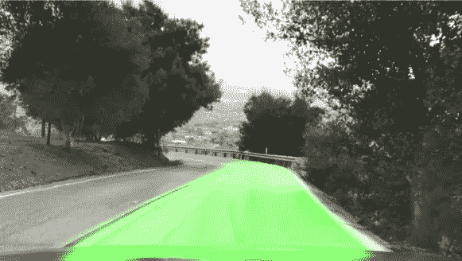
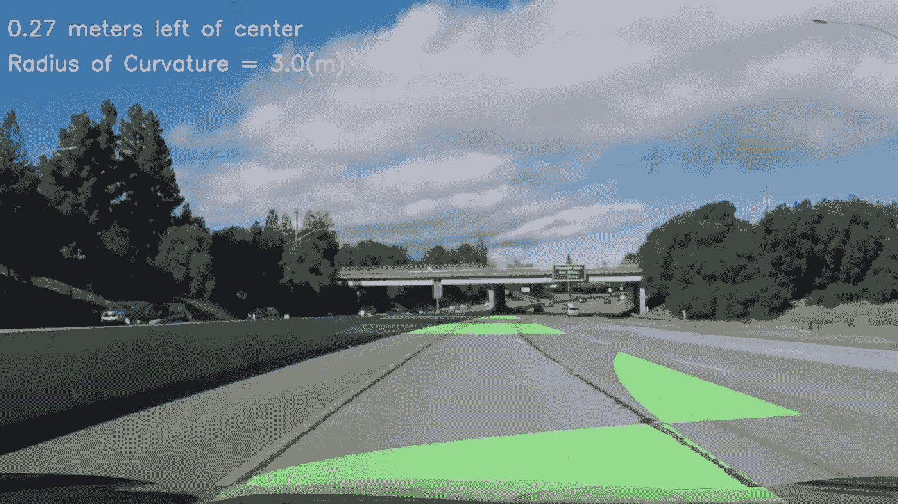
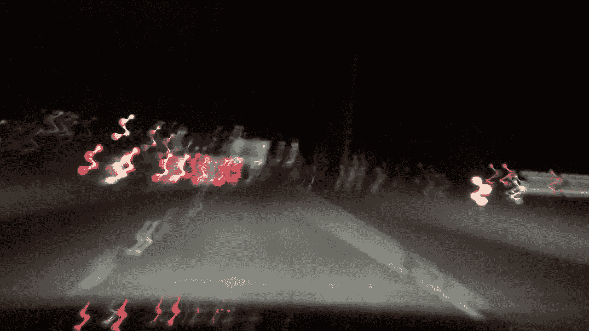
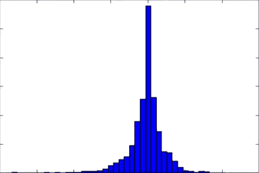
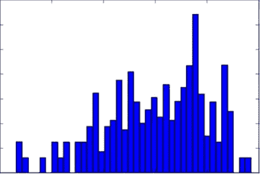

# 利用深度学习进行车道检测(第一部分)

> 原文：<https://towardsdatascience.com/lane-detection-with-deep-learning-part-1-9e096f3320b7?source=collection_archive---------0----------------------->

*这是我的车道检测深度学习解决方案的第一部分，涵盖了我之前方法的局限性以及使用的初步数据。第二部分可以在这里找到***！它讨论了我创建的各种模型和我的最终方法。这里和后面帖子中提到的代码和数据可以在我的*[*Github repo*](https://github.com/mvirgo/MLND-Capstone)*中找到。**

**

*即使在各种各样的条件下，人们也可以相当容易地找到道路上的车道线。除非有雪覆盖地面，降雨量非常大，道路非常脏或年久失修，我们可以告诉我们应该去哪里，假设这些线实际上是有标记的。虽然你们中的一些人可能已经想挑战其他司机是否真的成功地保持在线内(特别是当你想超越他们的时候)，即使没有任何驾驶经验，你也知道那些黄线和白线是什么。*

*另一方面，计算机发现这并不容易。阴影、眩光、道路颜色的微小变化、线路的轻微阻塞……所有这些人们通常仍然可以处理，但计算机可能会与之进行激烈的斗争。这当然是一个有趣的问题，以至于在 Udacity 的无人驾驶汽车纳米学位的第一期，他们将五个项目中的两个集中到了这个问题上。第一个是一个很好的介绍，用来向学生介绍一些基本的计算机视觉技术，如 Canny 边缘检测。*

**

*Canny Edge Detection*

*第二次，在学期的第四个项目中，我们做得更深入一点。这一次，我们使用了一个叫做透视变换的概念，它将图像中的某些点(在这种情况下，是车道线的“拐角”，从图像的底部，车道在汽车下方延伸到地平线附近的某个地方，这些线在远处会聚)延伸到目的地点，对于道路来说，这使你看起来像是一只在头顶上飞行的鸟。*

**

*Perspective Transformation of an Image*

*在透视变换之前，可以使用梯度(当您穿过图像时像素值的变化，如黑暗的道路变为亮线的地方)和颜色阈值来返回二进制图像，只有当这些值高于您给定的阈值时，才会激活该图像。透视变换后，可在线上运行滑动窗口，以计算车道线曲线的多项式拟合线。*

**

*The ‘S’ channel, or Saturation, with binary activation*

**

*A few more thresholds (left) for activation, with the resulting perspective transformation*

**

*Sliding windows and a decent-looking result*

*这看起来一开始还不错，但是有一些很大的限制。首先，透视变换对于摄像机(在变换之前也需要单独保持不失真)、摄像机的安装，甚至汽车所在道路的倾斜都是相当特定的。其次，各种渐变和颜色阈值仅在一小部分条件下起作用——我在开始时提到的计算机在查看车道线时遇到的所有问题在这里变得非常明显。最后，这种技术很慢——我用来将预测的车道检测返回到视频的技术只能以大约每秒 4.5 帧(fps)的速度运行，而来自汽车的视频可能会以大约每秒 30 帧或更高的速度运行。*

**

*When Lane Detection Goes Wrong*

*SDCND 第一学期的其他两个项目专注于深度学习，在这些情况下，用于交通标志分类和行为克隆(让虚拟汽车根据输入的图像以特定角度转向，在训练它时复制你的行为)。五个项目中的最后一个也可能通过深度学习来实现，尽管主要方法使用了不同的机器学习技术。我实际上一直在推迟我的独立机器学习纳米学位的顶点项目，特别是为了尝试在车道检测上使用深度学习方法，现在我已经完成了所有这些项目，包括车道检测和深度学习，这似乎是尝试我的顶点的完美时间。*

# *数据*

*我的第一个决定，也许是最关键的(不幸的是，也许也是最耗时的)，是决定创建我自己的数据集。尽管有很多数据集被用于训练潜在的无人驾驶汽车(几乎每天都在增加)，但它们大多没有根据汽车自己的车道进行标记。此外，我认为创建一个足够精确的数据集来训练深度神经网络将是一个有趣而有益的挑战。*

*收集数据很容易。我住在加州圣何塞，有很多地方我可以开车去。我从我以前的深度学习项目中知道大型数据集有多重要，但也许更重要的是，拥有一个平衡的数据集有多重要。晚上，在雨里，我沿着山坡上非常弯曲的道路，在高速公路和岔路上行驶，到达一个最喜欢的徒步旅行点(幸运的是，当我去收集这些数据时，加利福尼亚的干旱完全逆转了)。虽然听起来可能不多，但我最终用了近 12 分钟的驾驶时间，相当于 21，000 多张单独的图像帧，全部来自我的智能手机。*

*在找到提取图像帧的好方法后，我几乎立刻就注意到了一个问题。虽然我在明亮条件下驾驶较慢的视频主要由高质量的图像组成，但夜间高速公路驾驶和在雨中驾驶有大量模糊的图像(我将夜间高速公路驾驶问题归咎于圣何塞高速公路的颠簸，正如我的手机在黑暗中的问题一样)。我必须逐个浏览每一张图片，否则我的神经网络可能永远也学不会任何东西。我突然减少到 14，000 张图像，仍然故意留下一些稍微模糊的图像，希望能够在未来进行更强大的检测。*

**

*An example of poor data obtained and removed. The trained model, that never saw this image, actually did okay in later predicting the lane for this frame!*

*为了真正标记我的数据集，我计划仍然使用我的旧的基于计算机视觉的技术。这意味着通过我的旧算法运行图像，而不是输出顶部绘制有预测车道的原始图像，而是输出六个多项式系数，或者每条车道线三个(即方程 ax +bx+c 中的 a、b 和 c)。当然，如果我只是打算在标记中纯粹使用我的旧算法，我只是打算训练我的神经网络来解决与旧模型相同的问题，并且我希望它更健壮。我决定用单色手动重新绘制真实车道线(我选择了红色)，这样我可以使用红色通道阈值来更好地检测车道线。在短暂的疯狂时刻，我原本以为我会为 14，000 张图片这样做，但很快意识到这将花费太长时间(除非我像 [comma.ai](https://commacoloring.herokuapp.com/) 一样幸运/人脉广泛，可以众包我的标签)。相反，考虑到时间对数据的影响(如果我低速输入几帧内的图像，模型可能会“窥视”自己的验证集，因为预计变化很小)，我决定只对十分之一的图像进行这一过程，从而创建了一个由 1，400 幅训练图像组成的早期集。*

**

*Drawing over some blurry lines. Given the final model’s ability to still detect lines even in blurry night images, it appears this method did assist in robustness.*

*此时，我创建了一个程序，可以在道路图像上使用我的旧的基于 CV 的模型，检测线多项式，并使用多项式重新绘制线，类似于我在以前的项目中所做的。这保存了每个生成的图像，所以我可以检查哪些是不够的标签。我注意到了一个直接的问题——尽管我给老款车提供了大量弯曲的道路，但它几乎无法正确检测所有这些道路上的线条。我输入的 1400 张照片中，有近 450 张无法使用，其中大部分是曲线。*

*然而，我意识到这是由于原始方法本身的性质，由于其滑动窗口的工作方式。如果车道线偏离了图像的一侧，原始的滑动窗口将继续在图像上垂直向上*,导致算法认为这条线也应该朝着那个方向绘制。这是通过检查窗口框是否接触到图像的侧面来解决的——如果是，并且窗口已经在图像上前进了一点点(防止模型在开始时完全失败，如果窗口一开始就靠近侧面的话),那么滑动窗口就会停止。**

****

**The original sliding windows on a curvy road, versus cutting the window search at the edge (also more windows)**

**成功了！我将失败率减半，从最初的 450 张图像减少到 225 张。他们仍然有很多极端的曲线在这里失败，所以我想检查一下标签的实际分布情况。我这样做是通过使用直方图实际检查六个系数中每一个的分布。我又一次失望了。数据仍然过于偏向直线。我甚至回去添加了额外的图片，这些图片来自我拍摄的弯道视频。当我看这些照片时，问题仍然很明显——即使在非常弯曲的道路上，大多数车道仍然相当直。**

****

**The original distribution of one of the lane line coefficients — too heavily centered around straight lines**

**在我的独立交通标志分类项目中，一个很大的不同之处是，通过对数据中几乎没有表示的任何交通标志类别添加原始图像集的小旋转，创建了“假”数据。再次使用这种方法，对于某个分布范围之外的任何系数标签(我迭代了大约外部 400、100 和 30 个图像，这意味着最外部实际上经历了过程 3X)，图像稍微旋转，同时保持相同的标签。**

****

**The more well-distributed data for a single line coefficient after adding image rotations for the curvier data**

**经过这一过程后，每个系数的数据分布终于稍微均匀了一些。我还为我的图像和标签使用了一些其他的快速预处理项目。训练图像从最初的 720 x 1280 重新调整了大小(我最终尝试了缩小 4 倍、8 倍和 16 倍的不同版本)并进行归一化(这有助于模型的最终收敛)。我还使用 sklearn 的 StandardScaler 标准化了标签(如果你这样做，请确保**保存了 scaler** ，这样你就可以在你的模型结束时反转它了！).这种标签的标准化可能会欺骗你一点，因为训练中的损失会自动降低，但我发现当绘制到图像上时，最终结果也更加令人印象深刻。**

**我终于准备好创建和训练一个模型。**

***准备好第二部分了吗？在这里* *阅读关于我的车道检测模型* [*。*](https://medium.com/@mvirgs44/lane-detection-with-deep-learning-part-2-3ba559b5c5af)**