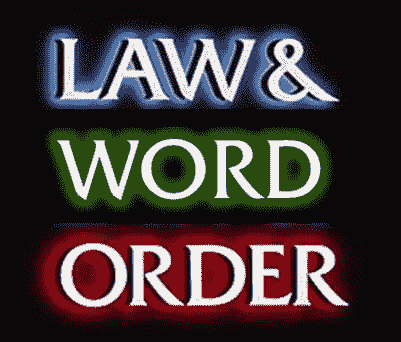

# 法律与词序:法律技术中的自然语言处理

> 原文：<https://towardsdatascience.com/law-and-word-order-nlp-in-legal-tech-bd14257ebd06?source=collection_archive---------6----------------------->

法律的核心是语言，所以长期以来，基于自然语言运行的软件在法律职业的某些领域发挥作用也就不足为奇了。但是在过去的几年里，人们对将现代技术应用于更广泛的问题越来越感兴趣，所以这篇文章着眼于自然语言处理在当今法律领域的应用。

# 法律 NLP 前景

自然语言处理的应用，以及更普遍的人工智能，在法律行业中并不是一件新鲜事。搜索在线法律内容的最早系统出现在 20 世纪 60 年代和 70 年代，法律专家系统是 20 世纪 70 年代和 80 年代讨论的一个热门话题(例如，参见 Richard Susskind 的《法律中的*专家系统*，牛津大学出版社，1987 年)。但在过去几年中，人们对该领域的兴趣大幅上升，正如你可能预料的那样，包括越来越多的初创公司声称在特定的法律应用背景下应用深度学习技术。

在最近的一个项目中，我不得不回顾 NLP 是如何被应用在法律技术中的。这是一个人口密集的空间:[斯坦福大学的一个网站](https://techindex.law.stanford.edu)列出了 1084 家“改变法律运作方式”的公司。在回顾这样的风景时，有一张地图会有所帮助。方便的是，法律实践是一种结构良好的活动，对于典型的律师事务所面临的许多特定任务，可以提供点解决方案。我认为 NLP 在五个法律活动领域发挥着越来越大的作用:

*   法律研究:寻找与法律决定相关的信息
*   电子发现:确定文档与信息请求的相关性
*   合同审查:检查合同是否完整并避免风险
*   文档自动化:生成日常法律文档
*   法律建议:利用问答对话提供量身定制的建议

这些简短的定义隐藏了一些复杂性，我将在下面依次考虑每个领域时解开这些复杂性。

# 法律研究

法律研究是寻找支持法律决策所需信息的过程。在实践中，这通常意味着搜索成文法(由立法机关制定)和判例法(由法院制定)，以找到与手头某一具体事项相关的内容。

这是你在法庭剧和访谈节目中看到的律师办公室墙壁上整齐排列的厚厚装订书籍的主要目的。然而，这些书经常被称为“布满灰尘的大部头书”是有原因的:在法律图书馆的桌子上仔细阅读书页早已被电子搜索和检索机制所取代。

LexisNexis (当时简称 LEXIS)最早出现在 20 世纪 70 年代初，最初提供俄亥俄州和纽约州判例法的全文搜索；它就从那里开始生长。到 20 世纪 70 年代末，律师们能够通过 1200 波特的调制解调器从专用终端使用拨号服务访问数据库。到了 20 世纪 90 年代末，这些数据都出现在了网上。今天，Lexis Nexis 声称拥有超过 30TB 的内容。 [Westlaw](https://legal.thomsonreuters.com/en/products/westlaw) ，法律数据库领域的另一个巨头，也成立于 20 世纪 70 年代中期，并于 1996 年被汤姆森公司(现为汤姆森路透)收购。再加上[沃尔特斯·克鲁瓦](https://wolterskluwer.com/)和[彭博法律](https://www.bna.com/bloomberglaw/)，你就有了这个领域的四大老牌供应商。大多数律师事务所都会订阅部分或全部这些服务。

尽管事实上主要的参与者已经非常成熟，但是，一些新的参与者已经通过提供旨在提高搜索精度和召回率的更智能的技术占领了一些市场份额，超过了使用“传统技术”所能达到的效果，在这里“传统技术”相当于良好的老式布尔搜索和手工构建的索引。显然，搜索结果的质量很大程度上取决于提出正确的查询。两个[案例正文](https://casetext.com)(成立于 2013 年，出资 2080 万美元；此处提供的所有资金数据均来源于 2018 年 11 月底左右的 Crunchbase)和 [CaseMine](https://www.casemine.com) (成立于 2013 年，资金情况不明)提供的界面可以让你通过上传一段话甚至整个简介来找到相关材料，为搜索提供上下文，从而支持“按文档查询”。在每种情况下，这种功能都通过一系列简洁的 UI 特性得到了增强，从而方便了搜索任务。这不仅避免了在适当详细的搜索查询上花费精力的需要，还增加了通过典型查询没有找到的附加相关材料将被定位的可能性。

采用稍微不同的方法，使用 IBM Watson 的 [Ross Intelligence](https://rossintelligence.com) (成立于 2014 年，融资 1310 万美元)和使用 Vincent 产品的 [vLex](https://vlex.com) (成立于 1998 年，融资 400 万欧元)提供自然语言查询界面，因此“你可以像与另一位律师交谈一样提出你的研究问题”。

当然，四大已经迅速建立了自己的“人工智能”解决方案。2018 年 7 月，LexisNexis 推出了 [Lexis Analytics](https://www.lexisnexis.com/en-us/products/lexis-analytics.page) ，这是一款法律研究工具，其中包括机器学习和 NLP 初创公司 [Ravel Law](https://home.ravellaw.com/) 的收购。几乎与此同时，汤森路透推出了 [WestSearch Plus](https://legal.thomsonreuters.com/en/products/westlaw/edge/westsearch-plus) ，这是一个新的搜索引擎，声称使用了最先进的人工智能。

# 电子发现

电子发现，或称 e-discovery，是为响应法律诉讼或调查中的出示请求而识别和收集以电子方式存储的信息的过程。面对可能驻留在典型硬盘上的成千上万的文件，这里的一个关键问题是将这些内容分成相关的(或“响应性的”，在该领域的术语中)和不相关的。在最近与苹果公司的专利纠纷中，三星收集并处理了大约 3.6TB，即 11，108，653 份文件；在 20 个月的时间里处理这些证据的费用据说超过 1300 万美元。

如今，市场份额之争围绕着优化技术展开，这些技术用于尽可能快速高效地对文档是否相关进行分类。这一过程被称为“技术辅助审查”(TAR)，多年来一直是 TREC 法律轨道的活动焦点。与法律研究一样，传统方法包括关键字或布尔搜索，然后是人工审查。更现代的方法使用机器学习进行文档分类，在法律专业中称为“预测编码”。您希望最大限度地提高精确度和召回率，同时将所涉及的工作量(就一个人必须注释或审阅的文档数量而言)保持在一个合理的水平。法律界对各种技术的利弊存在一些争论，特别是围绕什么算作合理的种子集，以及被动学习还是主动学习更好，其中前者涉及随机选择文档进行人工标记，而后者涉及对不确定或假设相关的示例进行有意的机器选择。(此处见[，此处](http://www.nonrelevant.net/2014/07/random-vs-active-selection-oftraining-examples-in-e-discovery/)见[。)](http://www.wlrk.com/webdocs/wlrknew/AttorneyPubs/WLRK.23339.14.pdf)

这个领域最大的玩家可能是[extero](https://www.exterro.com)(成立于 2004 年，融资 1 亿美元；Exterro 的博客是电子发现的有用信息源。他们的最新技术称为智能标签，避免了用户提供人类标记文档的初始种子集的需要，从审查过程的一开始就选择最相关的文档进行审查。 [DISCO](https://www.csdisco.com) (成立于 2012 年，融资 5060 万美元)在其“优先审查”流程中也有类似的基于深度学习的解决方案。

[Everlaw](https://www.everlaw.com/) (成立于 2010 年；另一方面，资助 3460 万美元)似乎仍在使用一种方法，即必须首先标记初始种子集(他们建议 200 个文档)。UI 功能可能是重要的差异化因素: [Relativity](https://www.relativity.com) (成立于 2001 年，融资 1.25 亿美元)，之前被称为 kCura，也提供了一个手机应用程序，这样你就可以“在通勤途中或沙发上编写文档”。律师也是全天候的。

有趣的是，通用的 NLP 提供商也正在进入这个领域。OpenText 推出了一个名为 [Axcelerate](https://www.opentext.com.au/what-we-do/products/discovery/axcelerate) 的电子发现平台；以翻译产品和服务闻名的 SDL 提供了一个[多语言电子发现解决方案](https://www.sdl.com/software-and-services/integrations/solutions-forediscovery. html)，通过翻译可以访问外语案例相关内容。

# 合同审查

律师的一个常见活动是审查合同，提出意见和修改，并建议他们的客户是否签署或谈判更好的条款。这些合同可能相对简单，如保密协议，也可能非常复杂，长达数百页。

自动合同审查系统可用于审查就其包含的内容种类而言相对标准化和可预测的文件。这个过程包括将合同分解成单个的条款，然后对每个条款进行评估，要么提取关键信息，要么与某个标准进行比较(该标准可能只是公司持有的此类合同的其他实例的集合)。因此，举例来说，一个合同审查系统可能会指出没有涵盖贿赂的条款，或者指出涵盖价格上涨的条款没有规定百分比限制。

合同审查可能是在单个合同的层面上，或者说，在对公司收购进行尽职调查的情况下，它可能涉及审查数千份存档的合同。在后一种情况下，该技术还开始纳入被称为法律分析的方面，聚合整个数据集的信息以检测异常和异常值，并生成图表或表格，以便于跨文档进行比较。

在过去的几年里，合同审查引起了人们极大的兴趣。早期的方法再次使用关键术语和标题的存在来指导信息提取，很可能许多产品仍然使用一些基于规则的技术；然而，毫不奇怪，几乎所有最近进入该领域的人都在使用更复杂的机器学习技术。

这里最大的三家 140 强企业是 [Kira Systems](https://kirasystems.com) (成立于 2015 年，融资约 6500 万美元) [Seal Software](https://www.seal-software.com) (成立于 2010 年，融资 4300 万美元)和 [LawGeex](https://www.lawgeex.com) (成立于 2014 年，融资 2150 万美元)。Kira 为涵盖一系列合同类型的约 500 种常见条款提供了预建模型；您可以指出哪些与正在审查的合同相关，还可以为尚未考虑的条款构建定制模型。Seal 提供了类似的功能，但增加了一个逻辑引擎，允许您将业务逻辑应用于从已审核的合同中提取的数据；LawGeex 强调将合同与预先定义的公司政策进行比较的能力。

新进入者和小进入者的一个典型策略似乎是从关注非常具体的文档类型开始，如 NDA、房地产租赁和隐私政策，然后随着公司赢得客户和吸引力而增加处理的文档的范围。勒弗顿(2012 年资助；融资 1500 万欧元，19 从 DFKI 剥离出来，主要专注于房地产文件。它以拥有大量房地产投资组合的公司为目标，用 20 种语言处理合同。其他值得一看的较小公司有 [eBrevia](https://ebrevia.com) (成立于 2012 年，融资 430 万美元) [Eigen Technologies](https://www.eigentech.com) (成立于 2014 年，融资 1300 万美元) [LegalSifter](https://www.legalsifter.com) (成立于 2013 年，融资 620 万美元) [Luminance](https://www.luminance.com) (成立于 2003 年，融资 1300 万美元)，但还有许多其他公司。

毫不奇怪，通用文本分析公司也被这个用例所吸引:参见 [ABBYY 合同文本分析](https://www.abbyy.com/en-au/solutions/text-analytics-for-contracts)、 [Ayfie 合同分析](https://www.ayfie.com/products/extensions/contract-analysis/)和 [OpenText Perceptiv](https://www.opentext.com.au/what-we-do/products/discovery/perceptiv) 。

ContractProbe 和 T2 privacy policy check 都有在线演示，可以让你上传文件进行审核。这些产品比上面讨论的产品要简单得多，但是它们让我们了解了合同评审应用程序的功能。

# 文件自动化和法律咨询

文档自动化系统和法律咨询应用程序之间有一个模糊的界限，所以我将把这两个类别放在一起考虑。

法律顾问是交互式系统，它根据系统提出的一系列问题，根据用户的情况和要求提出建议。在许多情况下，输出是某种法律文档，因此法律建议通常相当于文档自动化。

另一方面，文档自动化系统通常使用某种填空模板机制来创建符合特定标准的法律文档。在某些情况下，生成文档所需的数据是通过反复的问答对话框获得的:如果您愿意，可以称之为聊天机器人。在这种情况下，文档自动化系统具有与法律咨询系统提供的界面相同的界面。

最受公众关注的法律顾问是 DoNotPay，这是一个互动工具，其最初的重点是[帮助普通公众对停车罚单提出上诉](https://www.theguardian.com/technology/2016/jun/28/chatbot-ai-lawyerdonotpay- parking-tickets-london-new-york)。从那时起，应用程序的范围已经大大扩展了；在撰写本文时，DoNotPay 应用程序支持 [14 种不同的用例](https://www.artificiallawyer.com/2018/10/12/the-genius-of-donotpay-givingyou- what-is-already-yours/)，包括对抗不公平的银行、信用卡和透支费用，当司机走错路时从优步和 Lyft 获得退款，以及为延迟的包裹交付申请退款。

斯坦福大学的学生约书亚·白劳德为了回应自己的停车罚单经历，创造了 DoNotPay 但是律师事务所也对提供法律咨询系统感兴趣。自动化在这方面有明显的优势，使那些可能负担不起或不愿意支付法律服务费用的人能够获得法律服务。

因此，例如，澳大利亚律师事务所 Norton Rose Fulbright 在 2017 年底发布了一款针对隐私法问题的聊天机器人。该工具使用 IBM Watson 构建，回答了关于数据泄露的标准问题。该公司后来扩展了应用程序，以处理 GDPR 查询。

[Neota Logic](https://www.neotalogic.com/) ，从 2010 年开始，提供了一个创造专家顾问的平台；事实上，这项技术的应用范围比这要广得多，因为它还可以用于工作流自动化和相关任务，包括文档自动化，这是我接下来要谈到的。

法律文档自动化应用已经存在很长时间了，可以说是最早的商业自然语言生成系统之一。一些研究人员不愿意将这些基于模板的系统称为 NLG，但事实是，所使用的技术与当今领先的商业 NLG 供应商提供的技术相似。

如上所述，这些系统通常通过填写表格或通过问答会话从用户处收集相关数据来工作。然后，通过条件文档组装和模板槽填充的组合，以基于规则的方式使用累积的数据来制作定制的文档。

这一类别中最著名的是汤森路透的[合同快递](https://legal.thomsonreuters.com.au/products/contract-express/)，其目标市场是希望提高效率的律师事务所。还有其他一些著名的参与者，包括 [Rocket Lawyer](https://www.rocketlawyer.com) (成立于 2008 年，融资 4620 万美元)，它更关注消费者，以及 Neota Logic(如上所述)，它们既提供通用的智能文档自动化工具，也提供更加面向最终用户的特定应用程序调用 [PerfectNDA](https://www.neotalogic.com/solution/perfectnda/) 。

更一般地说，许多组织将其文档自动化产品定位于诉诸司法领域，使定制的法律文档易于为公众所用。两个这样的例子是 [A2J 作者](https://www.a2jauthor.org)和[helpesellegal](https://www.helpselflegal.com)。

也有公司提供旨在帮助起草专利的产品:参见[规范](https://specif.io)和[涡轮专利](https://turbopatent.com)。

# 最后判决

如同在许多其他领域一样，法律专业的工作性质更普遍地受到 NLP 和 AI 的威胁。2016 年初，德勤发现[法律部门 39%的工作将在未来十年实现自动化](https://www.legaltechnology.com/latest-news/deloitte-insight-100000-legalroles- to-be-automated)。最近，麦肯锡[估计 22%的律师工作和 35%的法律助理工作可以自动化](https://www.linkedin.com/pulse/how-much-what-lawyers-do-can-automatedlook- new-research-peter-nussey/)。正如在其他领域常见的那样，你经常会看到积极的一面，通常的说法是“技术解放了工人，让他们做更有趣的事情”。但是技术吸收的利与弊是该行业偶尔激烈辩论的焦点，理查德·特罗曼斯将其描述为由想要保持现状的保守派和想要改变的进步派组成。当然，变革的一个主要障碍是法律职业传统上是以计费时间为基础的。在这种情况下，如果一项技术提高了效率，它也会减少你可以在时钟上投入的时间。另一方面，面对世界各地诉诸司法运动日益增长的需求，传统方法的中断是不可避免的。

我得说陪审团已经不在这个案子上了。

*如果你想收到关于商业 NLP 世界正在发生的事情的简短每周简讯，* [*在 NLP*](https://www.language-technology.com/twin) *中注册本周。*