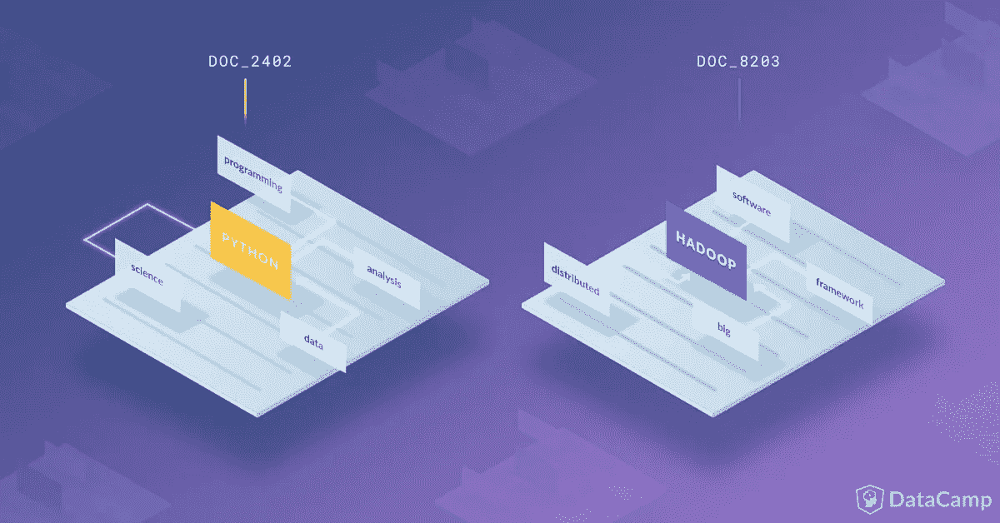
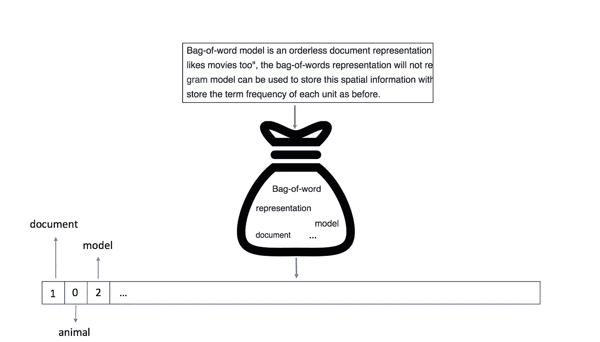
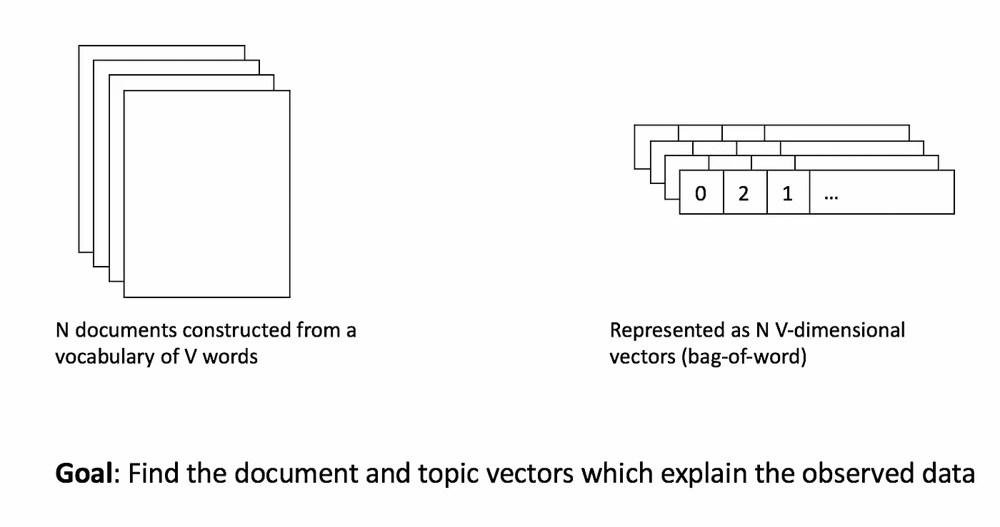
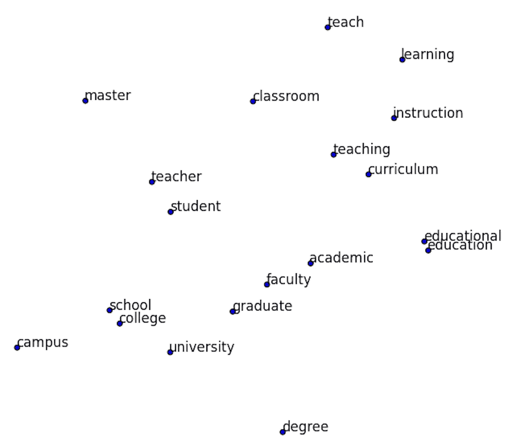
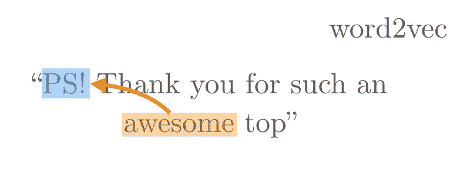
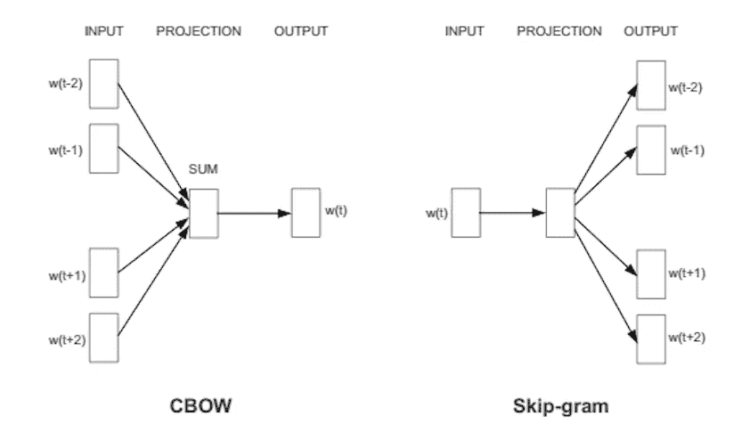

# LDA2vec:主题模型中的词嵌入

> 原文：<https://towardsdatascience.com/lda2vec-word-embeddings-in-topic-models-4ee3fc4b2843?source=collection_archive---------4----------------------->

了解有关 LDA2vec 的更多信息，LDA 2 vec 是一种结合狄利克雷分布的潜在文档级主题向量混合来学习密集单词向量的模型。

Originally published at [https://www.datacamp.com/community/tutorials/lda2vec-topic-model](https://www.datacamp.com/community/tutorials/lda2vec-topic-model).

这篇博文会给大家介绍一下 lda2vec，这是 Chris Moody 在 2016 年发表的一个话题模型[。lda2vec 使用主题和文档向量扩展了 Mikolov 等人在 2013 年描述的 word2vec 模型](http://multithreaded.stitchfix.com/blog/2016/05/27/lda2vec/)[，并结合了单词嵌入和主题模型的思想。](https://arxiv.org/abs/1301.3781)

主题模型的一般目标是产生可解释的文档表示，这些表示可用于发现未标记文档集合中的主题或结构。这种可解释文档表示的一个例子是:文档 X 20%是主题 a，40%是主题 b，40%是主题 c。

今天的帖子将从介绍潜在的狄利克雷分配(LDA)开始。LDA 是一个概率主题模型，它将文档视为一个单词包，所以您将首先探索这种方法的优点和缺点。

另一方面，lda2vec 在单词嵌入的基础上构建文档表示。您将了解更多关于单词嵌入的知识，以及为什么单词嵌入目前是自然语言处理(NLP)模型中的首选构件。

最后，您将了解更多关于 lda2vec 背后的一般思想。

# 潜在狄利克雷分配:简介

主题模型接受一个未标记文档的集合，并试图在这个集合中找到结构或主题。注意，主题模型通常假设单词的使用与主题的出现相关。例如，您可以提供一个包含一组新闻文章的主题模型，该主题模型会根据单词的用法将文档分成若干个组。

主题模型是自动探索和构建大量文档的好方法:它们根据文档中出现的单词对文档进行分组或聚类。由于关于相似主题的文档倾向于使用相似的子词汇表，因此得到的文档簇可以被解释为讨论不同的“主题”。

潜在狄利克雷分配(LDA)是概率主题模型的一个例子。这到底意味着什么，您将在下面的章节中学习:您将首先理解 LDA 如何从一个单词包描述开始来表示不同的文档。然后，您将看到如何使用这些表示在文档集合中查找结构。

## 词汇袋

传统上，文本文档在 NLP 中被表示为一个单词包。

这意味着每个文档都被表示为一个长度等于词汇表大小的固定长度向量。这个向量的每个维度对应于一个单词在文档中的出现次数。能够将可变长度的文档简化为固定长度的向量使它们更适合用于各种机器学习(ML)模型和任务(聚类、分类等)。

The image above illustrates how a document is represented in a bag-of-word model: the word “document” has a count of 1, while the word “model” occurs twice in the text.

虽然单词袋导致稀疏和高维的文档表示，但是如果有大量数据可用，则在主题分类上通常会获得良好的结果。你可以随时阅读最近脸书关于主题分类的论文。

固定长度的文档表示意味着您可以轻松地将不同长度的文档输入到 ML 模型中(SVM 模型、k-NN 模型、随机森林模型等等)。这允许您对文档执行聚类或主题分类。文档的结构信息被移除，并且模型必须发现哪些向量维度在语义上是相似的。例如，在不同维度上映射“猫”和“猫”不太直观，因为模型被迫学习这些不同维度之间的相关性。

## LDA 模型

当训练 LDA 模型时，您从一组文档开始，并且这些文档中的每一个都由一个固定长度的向量(单词包)来表示。LDA 是一种通用的机器学习(ML)技术，这意味着它也可以用于其他无监督的 ML 问题，其中输入是固定长度向量的集合，目标是探索这些数据的结构。

要实现 LDA 模型，首先要定义文档集合中的“主题”数量。这听起来很简单，但是如果您正在处理大量的文档，就没有听起来那么直观了。

在具有 *M* 个主题的 *N* 个文档上训练 LDA 模型对应于找到最佳解释数据的文档和主题向量。

请注意，本教程将不会详细涵盖 LDA 背后的全部理论(参见 Blei 等人的[这篇论文](http://www.jmlr.org/papers/volume3/blei03a/blei03a.pdf))，因为重点是更好地理解一般概念。

假设文档中的词汇由 *V* 个单词组成。

在 LDA 模型中， *N* 个文档中的每一个都将由长度为 *M* 的向量来表示，该向量详细描述了哪些主题出现在该文档中。一个文档可以由 75%的“主题 1”和 25%的“主题 2”组成。通常，LDA 会产生带有大量零的文档向量，这意味着每个文档中出现的主题数量有限。这与文档通常只讨论有限数量的主题的想法是一致的。这极大地提高了这些文档向量的可解释性。

每一个 *M* 主题都由一个长度为 *V* 的向量表示，该向量详细描述了给定一个关于该主题的文档中可能出现的单词。因此，对于主题 1，“学习”、“建模”和“统计”可能是一些最常见的词。这意味着你可以说这是“数据科学”的话题。对于主题 2，“GPU”、“计算”和“存储”可能是最常见的词。你可以把这解释为“计算”主题。

下图直观地展示了 LDA 模型。该模型的目标是找到解释不同文档的原始单词包表示的主题和文档向量。

需要注意的是，您依赖于主题向量是可解释的这一假设，否则模型的输出几乎是垃圾。本质上，你是在假设，给定足够的数据，该模型将找出哪些单词倾向于同现，并将它们聚类到不同的“主题”中。

LDA 是一个简单的概率模型，效果很好。文档向量通常是稀疏的、低维的和高度可解释的，突出了文档中的模式和结构。您必须确定文档集合中出现的主题数量的准确估计值。此外，您必须手动为不同的主题向量分配不同的命名者“主题”。由于单词袋模型被用于表示文档，LDA 可能遭受与单词袋模型相同的缺点。LDA 模型学习文档向量，该向量预测文档内部的单词，而不考虑任何结构或这些单词在局部级别上如何交互。

# 单词嵌入

单词袋表示的一个问题是，该模型负责计算文档向量中的哪些维度是语义相关的。有人可能会认为，利用单词在语义上如何相互关联的信息将会提高模型的性能，而这正是单词嵌入所承诺的。

对于单词嵌入，单词被表示为固定长度的向量或嵌入。存在几种不同的模型来构建嵌入，但是它们都基于分布假设。这意味着“一个词是由它的朋友来描述的”。

单词嵌入的目标是从大型无监督文档集中捕获语言中的语义和句法规则，如维基百科。出现在相同上下文中的单词由彼此非常接近的向量来表示。

Image taken from “[Visualizing Word Embeddings with t-SNE](http://nlp.yvespeirsman.be/blog/visualizing-word-embeddings-with-tsne/)”

上图是使用 t 分布随机邻域嵌入(t-SNE)将单词嵌入空间投影到 2D 空间。t-SNE 是一种降维方法，可以用来可视化高维数据。该方法将单词嵌入作为输入，并将它们投影到二维空间，该空间可以容易地在绘图中可视化。只调查单词空间的一个子部分，集中在接近“教师”的单词上。不是通过向量中的无信息维度来表示单词，而是可以使用单词嵌入通过语义相关的向量来表示单词。

当使用单词嵌入时，ML 模型可以通过将信息嵌入到向量表示中来利用来自大量文档(也称为“语料库”)的信息。这对于单词袋模型是不可能的，当没有大量数据可用时，单词袋模型会损害模型性能。单词嵌入导致文档表示不再是固定长度的。相反，文档由可变长度的单词向量嵌入序列表示。虽然一些深度学习技术，如长短期记忆(LSTM)、具有自适应池的卷积网络等，能够处理可变长度的序列，但通常需要大量数据来正确训练它们。

## word2vec

正如您在简介中看到的，word2vec 是由 Mikolov 等人开发的非常流行的单词嵌入模型。注意，在分布式语义领域中还存在其他几种单词嵌入模型。虽然获得高质量的单词嵌入需要一些技巧，但是本教程将只关注 word2vec 背后的核心思想。

在 word2vec 中使用下面的训练过程来获得单词嵌入。

1.在文本中选择一个(枢纽)单词。当前中枢单词的上下文单词是出现在中枢单词周围的单词。这意味着你在一个固定长度的单词窗口内工作。中枢词和上下文词的组合构成了一组词-上下文对。下面的图片取自 lda2vec 上的[克里斯·穆迪的博客](http://multithreaded.stitchfix.com/blog/2016/05/27/lda2vec/)。在这个文本片段中，“awesome”是中枢单词，它周围的单词被作为上下文单词，产生 7 个单词-上下文对。

Image taken from “[Introducing our Hybrid lda2vec Algorithm](http://multithreaded.stitchfix.com/blog/2016/05/27/lda2vec)”

2.存在 word2vec 模型的两个变体:a .在单词袋体系结构(CBOW)中，基于一组周围的上下文单词来预测中枢单词(即，给定‘谢谢’，‘这样’，‘你’，‘顶’该模型必须预测‘棒极了’)。这被称为单词包架构，因为上下文单词的顺序并不重要。b .在 skip-gram 架构中，中枢词用于预测周围的上下文词(即给定‘牛逼’预测‘谢谢’、‘这样’、‘你’、‘顶’)。下图描述了两种不同的 word2vec 架构。注意，使用了相对简单的(两层)神经模型(与计算机视觉中的深度神经模型相比)。

Image taken from “[Efficient Estimation of Word Representations in Vector Space](https://arxiv.org/abs/1301.3781)” (Mikolov et al., 2013)

通过在大型语料库上训练该模型，您将获得对语义信息进行编码的单词嵌入(投影层中的权重)以及一些有趣的属性:可以执行向量运算，例如*国王-男人* + *女人* = *女王。*

例如，与简单的独热编码表示相比，字向量是有用的表示。它们允许将大型语料库中的统计信息编码到其他模型中，如主题分类或对话系统。单词向量通常是密集的、高维的和不可解释的。考虑下面这个例子:[ -0.65，-1.223，…, -0.252，+3.2]。虽然在 LDA 中，维度大致对应于主题，但是对于词向量来说，情况通常不是这样。每个单词被分配一个上下文无关的单词向量。然而，单词的语义高度依赖于上下文。word2vec 模型学习单词向量，该向量预测不同文档中的上下文单词。结果，特定于文档的信息在单词嵌入中混合在一起。

# lda2vec

受潜在狄利克雷分配(LDA)的启发，word2vec 模型被扩展为同时学习单词、文档和主题向量。

Lda2vec 是通过修改 skip-gram word2vec 变体获得的。在原始的 skip-gram 方法中，模型被训练为基于中枢单词来预测上下文单词。在 lda2vec 中，将主词向量和文档向量相加以获得上下文向量。该上下文向量然后被用于预测上下文单词。

在下一节中，您将看到这些文档向量是如何构造的，以及如何像 LDA 中的文档向量一样使用它们。

## lda2vec 架构

在 word2vec 模型中集成上下文向量的想法并不新鲜。[例如，段落向量](https://cs.stanford.edu/~quocle/paragraph_vector.pdf)也探索了这个想法，以便学习可变长度文本片段的固定长度表示。在他们的工作中，对于每个文本片段(一个段落的大小)，学习一个密集的向量表示，类似于学习的单词向量。

这种方法的缺点是上下文/段落向量类似于典型的单词向量，使得它们不太容易被解释为例如 LDA 的输出。

lda2vec 模型通过处理文档大小的文本片段并将文档向量分解成两个不同的部分，比段落向量方法更进了一步。本着与 LDA 模型相同的精神，文档向量被分解成文档权重向量和主题矩阵。文档权重向量表示不同主题的百分比，而主题矩阵由不同的主题向量组成。因此，通过组合文档中出现的不同主题向量来构建上下文向量。

考虑下面的例子:在最初的 word2vec 模型中，如果中枢单词是“法语”，那么可能的上下文单词可能是“德语”、“荷兰语”、“英语”。在没有任何全局(文档相关)信息的情况下，这些将是最合理的猜测。

通过在 lda2vec 模型中提供额外的上下文向量，可以更好地猜测上下文单词。

如果文档向量是“食物”和“饮料”主题的组合，那么“长棍面包”、“奶酪”和“葡萄酒”可能更合适。如果文档向量类似于“城市”和“地理”主题，那么“巴黎”、“里昂”和“格勒诺布尔”可能更合适。

请注意，这些主题向量是在单词空间中学习的，这便于解释:您只需查看与主题向量最接近的单词向量。此外，对文档权重向量进行约束，以获得稀疏向量(类似于 LDA ),而不是密集向量。这使得不同文档的主题内容的解释变得容易。

简而言之，lda2vec 的最终结果是一组稀疏的文档权重向量，以及易于解释的主题向量。

虽然性能与传统的 LDA 相似，但是使用自动微分方法使得该方法可扩展到非常大的数据集。此外，通过结合上下文向量和词向量，您可以获得“专门的”词向量，这些词向量可以在其他模型中使用(并且可能优于更多的“通用的”词向量)。

## lda2vec 库

Lda2vec 是一种相当新的专门的 NLP 技术。由于它建立在现有方法的基础上，任何 word2vec 实现都可以扩展到 lda2vec。Chris Moody 在 Chainer 中实现了该方法，但也可以使用其他自动微分框架(CNTK，Theano，…)。Tensorflow 实现也公开发布。

lda2vec Python 模块的概述可以在[这里](http://lda2vec.readthedocs.io/en/latest/?badge=latest)找到。由于训练 lda2vec 可能是计算密集型的，建议对较大的语料库使用 GPU 支持。此外，为了加速训练，不同的单词向量通常用预先训练的 word2vec 向量来初始化。

最后，讨论了作为主题模型的 lda2vec，但是也可以更一般地定义向 word2vec 模型添加上下文向量的想法。例如，考虑由来自不同地区的不同作者编写的文档。然后，作者和区域向量也可以被添加到上下文向量，从而产生一种无监督的方法来获得文档、区域和作者向量表示。

# 结论

这篇博文只提供了 LDA、word2vec 和 lda2vec 的快速概述。注意，原作者还发表了一篇关于 lda2vec 技术细节的很棒的[博文](http://multithreaded.stitchfix.com/blog/2016/05/27/lda2vec)。