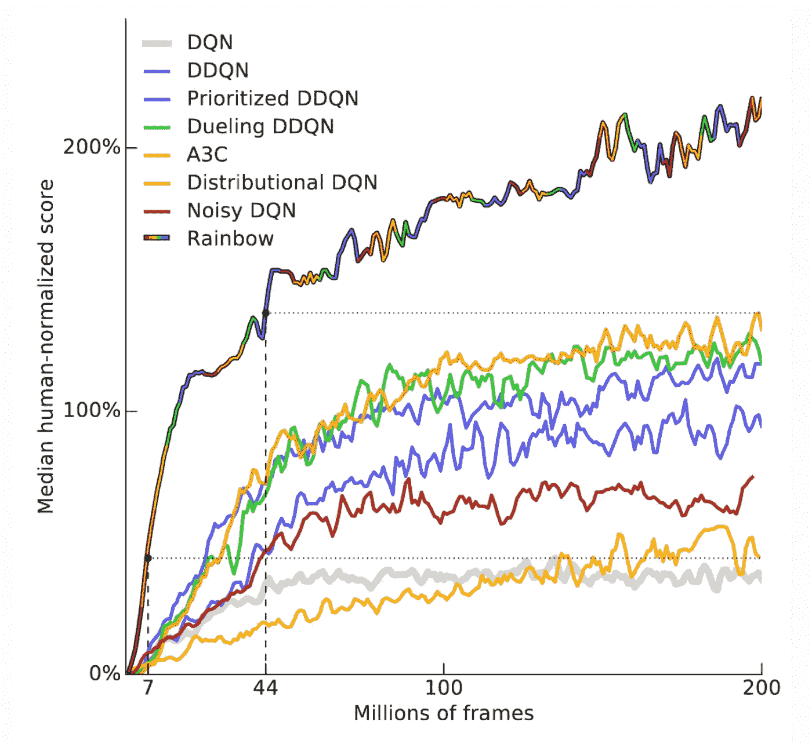
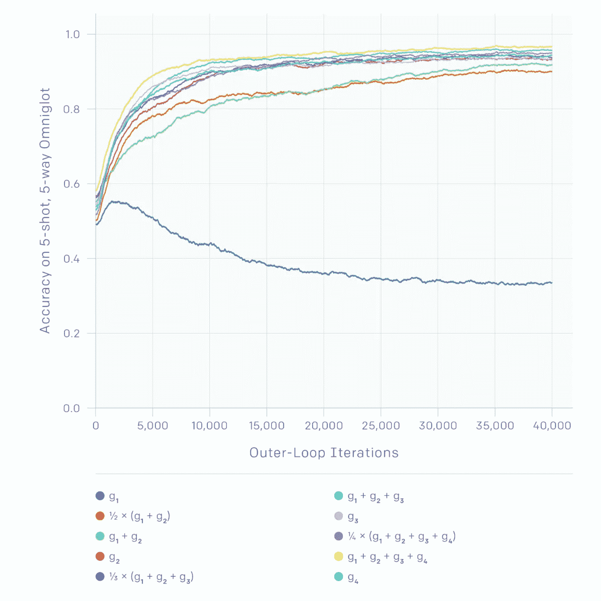
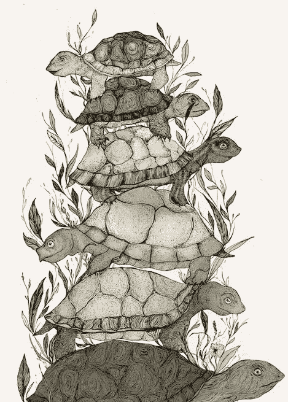

# 学习学习的算法

> 原文：<https://towardsdatascience.com/learning-about-algorithms-that-learn-to-learn-9022f2fa3dd5?source=collection_archive---------2----------------------->

当我第一次听说元学习时，它的前提让我很兴奋:建造不仅能够学习，而且能够学习如何学习的机器。元学习的梦想愿望是算法能够根据性能信号修改其架构和参数空间的基本方面，算法能够在面对新环境时利用积累的经验。简而言之:当未来学家为我们编织普遍胜任的人工智能的梦想时，符合这一描述的组件是这些愿景不可或缺的组成部分。

这篇博文的目标是从这些崇高的高度，从我们想象的一些抽象的自我修改代理可以做的事情，下降到该领域今天的实际位置:它的成功，它的局限性，以及我们离强大的多任务智能还有多远。

# 为什么人类可以做我们做的事情？

具体来说:在许多强化学习任务中，相对于人类需要的时间，算法需要惊人长的时间来学习任务；目前玩 Atari 游戏的技术水平需要大约 83 小时(或 1800 万帧)的游戏时间才能达到人类的中等表现，大多数人在接触游戏几个小时后就可以达到这一水平。

A figure from the recent Rainbow RL paper

这种差异导致机器学习研究人员将问题框定为:人脑为这样的任务带来了什么工具和能力，以及我们如何以统计和信息论的方式构想这些工具？具体来说，元学习研究者似乎有两种主要策略，大致对应于关于这些工具是什么的两种理论。

1.  **习得先验**:在这个镜头中，人类可以快速学习新任务，因为我们可以重复使用我们在过去任务中已经学到的信息，比如物体如何在空间中移动的直观物理学，或者在视频游戏中失去一条生命会导致奖励降低的元知识。
2.  **习得策略:**这是一种想法，即在我们的一生中(也许是在进化的时间尺度上)，我们不仅收集关于世界的客体层面的知识，而且还发展了一种神经结构，这种结构在接受输入并将其转化为输出或策略方面更有效，即使在非常新颖的环境中也是如此。

现在，很明显，这两个想法并不相互排斥，它们之间甚至没有硬性的界限:我们与世界互动的一些硬编码策略可能基于关于世界的深刻先验，比如这样的事实(至少对于与这篇博客帖子相关的所有目的而言)世界有一个因果结构。也就是说，我发现这些想法非常不同，值得将它们分为这两个标签，并将其视为相关轴的两极。

# 不要放弃我的(一次)机会

在深入元学习之前，了解一下一次性学习相关领域的概念基础是很有用的。其中元学习的问题是“我如何才能建立一个快速学习新任务的模型”，而单镜头学习的问题是“我如何才能在只看到一个类的例子后，建立一个可以学习如何对该类进行分类的模型”。

让我们在概念层面上思考一下，是什么让一次性学习变得困难。如果我们试图只在相关类的一个例子上训练一个普通模型，它几乎肯定会过拟合。如果一个模型只看到一幅画，比如说，字母 3，它不会理解一幅图像可以经历什么样的像素变化而仍然保持本质上的 3。例如，如果模型只显示了这个序列中的前 3 个，那么如何先验地知道第二个 3 是同一物种的一个例子呢？理论上，我们对网络学习感兴趣的类别标签与构成字母的线条粗细有关系，这难道不是可能的吗？这对我们来说似乎很傻，但只有一个三的例子，对网络来说这不是一个微不足道的推论。

拥有更多 3s 的例子有助于解决这个问题，因为我们可以了解图像的哪些特征定义了它的基本三维性——两个凸起形状的存在，主要是垂直方向——以及哪些类型的修改是不相关的——线条的粗细，角度的锐度。为了一次性学习成功，我们必须激励网络学习什么样的属性**通常**将一个数字与另一个数字区分开，而不需要每个数字的具体允许变化的例子。

一次学习中的常见技术是学习嵌入空间，其中计算该空间中两个示例的表示之间的欧几里德相似性是计算这两个示例是否属于同一类的良好代理。直觉上，这需要学习在这个分布(在我的例子中:数字上的分布)中，阶级分化最强的内部维度**，并学习如何压缩和转换输入到那些最相关的维度。**

我发现把这个问题记在心里是一个有用的基础，尽管不是试图学习如何总结存在于类分布中的共享信息和模式，而是试图学习存在于任务分布中的规律，每个任务都有其自己的内部结构或目标。

如果要求构建一个神经网络元参数的排序，从最少到最抽象，它会是这样的:

1.  通过使用超参数化梯度下降，网络学习**表示**在任务的全部分布中是有用的。 [MAML](https://arxiv.org/abs/1703.03400) 和[爬虫](https://blog.openai.com/reptile/)就是很好的直接例子，而[共享层次的元学习](https://arxiv.org/abs/1710.09767)是一种有趣的方法，它将表示学习为主策略控制的显式子策略。
2.  网络学习优化其自身梯度下降操作的**参数。这些参数是:学习率、动量和自适应学习率算法的权重。在这里，我们开始走上修改学习算法本身的轨道，但以有限的、参数化的方式。这就是[学习通过梯度下降学习通过梯度下降](https://arxiv.org/abs/1606.04474)所做的。是的，那是报纸的真正标题。**
3.  学习内环**优化器的网络本身就是网络**。也就是说:其中梯度下降用于更新神经优化器网络参数，使得它们跨任务表现良好，但是其中在每个单个任务内从输入数据到输出预测的映射完全由网络进行，而没有任何损失或梯度的显式计算。这就是一个简单的神经注意力元学习者的工作方式。

为了让这篇文章不那么庞大，我将主要关注 1 和 3，来说明这个范围的两个概念。

# 任何其他名字的任务

另一个简短的旁白——我保证是最后一个——我希望它能澄清一个可能会令人困惑的话题。通常，在元学习的讨论中，你会看到提到“任务分配”的想法。你可能会注意到这是一个很难定义的概念，你是对的。当一个问题是一个任务，或者分布在多个任务上时，似乎没有一个明确的标准。例如:我们是否应该将 ImageNet 视为一项任务——物体识别——或多项任务——区分狗是一项任务，区分猫是另一项任务？为什么玩一个雅达利游戏是一个任务，而不是几个任务组成的游戏的个人水平？

我能从所有这些中提取的是:

*   “任务”的概念与已经建立的数据集是非常复杂的，因为把在一个数据集上学习看作一个单一的任务是很自然的
*   对于任何给定的任务分布，这些任务彼此之间的差异可能非常显著(即，每个任务学习不同振幅的正弦波，而每个任务玩不同的 Atari 游戏)
*   因此，不要马上说“啊，这个方法可以推广到<this example="" distribution="" of="" tasks="">，所以这是一个很好的指标，它通常可以在一些任意不同的任务分布上表现良好”。这当然不是该方法有效的方向上的坏的 T2 证据，但是它确实需要批判性的思考来考虑网络为了在所有任务中表现良好实际上需要展示多大的灵活性。</this>

# 那些莫名其妙地以动物命名的

2017 年初，切尔西·芬恩和一个来自伯克利的团队发布了一项名为 [MAML 的技术:模型不可知元学习](https://arxiv.org/abs/1703.03400)。

In case you didn’t think the joke was intentional, turn to the “Species of MAML” section of the paper

在习得策略和习得先验之间，这种方法倾向于后者。该网络的目标是训练一个模型，如果给定一个新任务的梯度步长更新，该模型可以很好地概括该任务。这个的伪代码算法是这样的

1.  随机初始化网络的参数θ
2.  从任务 t 的分布中选择某个任务 t。使用训练集中的 k 个示例(通常为 10 个),在当前参数集指示的位置执行一个梯度步骤，从而得到最终的参数集。
3.  在测试数据集上评估这些最终参数的性能
4.  然后，根据您的**初始**参数 theta 计算 task-t 测试集性能的梯度。然后基于该梯度更新那些参数。回到第一步，用你刚刚更新的θ作为这一步的初始θ

这是在做什么？在一个非常抽象的层面上，它是在参数空间中找到一个点，这个点在期望中最接近于它的分布中的许多任务的一个好的概括点。您可以认为这是在迫使模型在探索参数空间时保持某种程度的不确定性和谨慎。简而言之:当一个网络认为其梯度完全代表人口分布时，它可能会陷入一个损失特别低的区域，MAML 将更有动力在多个山谷的顶点附近找到一个区域，每个山谷在预期的所有任务中都包含合理的低损失。正是这种对谨慎的激励，帮助 MAML 避免了在新任务中只给出少量例子时，模型可能会出现的过度拟合。

2018 年初，该文献又增加了一个新版本，名为《爬行动物》。正如你可能从它的名字中猜到的那样——早期 MAML 的一个游戏——爬行动物从 MAML 的前提开始，但找到了一种计算它的初始参数更新循环的方法，这种方法在计算上更有效。在 MAML 显式地采用测试集损失相对于初始参数θ的梯度的情况下，爬虫代之以在每个任务上执行 SGD 更新的几个步骤，然后使用更新结束时的权重和初始权重之间的差，作为用于更新初始权重的“梯度”。

g1 here represents the gradient update you get from only performing one gradient descent step per task

从直觉上来说，这种做法有点奇怪，因为，天真地说，这似乎和把所有任务混合在一起进行训练没有什么不同。然而，作者认为，由于对每个任务采取 SGD 的多个步骤，每个任务的损失函数的二阶导数受到影响。为此，他们将其更新分解为两部分:

1.  一个将结果推向“联合训练损失”的术语，即如果你只是在混合任务上训练，你会得到的结果，以及
2.  将初始化推向一个点的术语，在该点上，后续 SGD 小批次的梯度彼此接近:即，小批次之间的梯度方差较低。作者推测，这一术语导致快速学习时间，因为它鼓励在每项任务中处于更稳定和低方差的训练区域。

我选择 MAML/爬行动物组作为事物“习得先验”的代表，因为理论上，网络通过学习内部表征而成功，这些表征要么对任务的全部分布进行分类有用，要么在参数空间中接近广泛有用的表征。

为了阐明这一点，看一下上图。它将 MAML 与一个刚刚经过预训练的网络进行了比较，当时两者都经过了一系列由不同相位和振幅的正弦波组成的回归任务的训练。在这一点上，两者都“微调”到一个新的特定任务:红色显示的曲线。紫色三角形表示少量渐变步骤中使用的数据点。例如，与训练前的网络相比，MAML 了解到正弦波具有周期性结构:在 K=5 时，它能够更快地将左手峰移动到正确的位置，而无需实际观察该空间区域的数据。虽然很难说我们的(有些生硬的)解释是否是引擎盖下发生的事情的完美机械匹配，但我们可以推断，MAML 在弄清楚正弦波彼此不同的两个相关方面——相位和振幅——以及如何从给定的数据中学习这些表示方面做得更好。

# 一路向下的网络

对于一些人来说，甚至使用已知的算法如梯度下降来学习全局先验的想法。谁说我们设计的学习算法是最有效的？我们能不能学一个更好的？

这是 RL(快速强化学习通过慢速强化学习)采用的方法。这个模型的基本结构是一个递归神经网络(技术上:一个 [LTSM 网络](http://colah.github.io/posts/2015-08-Understanding-LSTMs/))。由于 rnn 具有存储状态信息的能力，并根据该状态给出不同的输出，因此理论上它们有可能学习任意的可计算算法:换句话说，它们有可能是图灵完全的。以此为基础，RL 的作者构建了一个 RNN，使得 RNN 接受训练的每个“序列”实际上是一系列给定 MDP 的经历(MDP =马尔可夫决策过程)。对于这个解释，你可以把每个 MDP 看作是定义了一组可能的行动和这些行动在环境中产生的潜在回报。然后，在许多序列上训练 RNNs 如 RNN 通常所做的那样，在这种情况下，这些序列对应于许多不同的 MDP，并且优化 RNN 的参数，以在所有序列/试验的总和上产生低遗憾。后悔是一个衡量你在一系列事件中的总回报的指标，所以除了激励网络在试验结束时达到一个好的政策，它还激励更快的学习，这样你在坏的低回报政策下采取的探索行动就更少了。

A diagram showing the internal workings of the RNN over multiple trials, corresponding to multiple different MDPs.

在试验中的每一点，网络采取的动作是由在多个任务中学习的权重矩阵和隐藏状态的内容参数化的函数，隐藏状态的内容作为数据的函数更新，并充当一种动态参数集。因此，RNN 正在多个任务中学习如何更新其隐藏状态的权重，以及控制如何利用它的权重。然后，在一个给定的任务中，隐藏状态可以捕获关于网络有多确定的信息，是否是时候探索或利用，等等，作为它在特定任务中看到的数据的函数。从这个意义上来说，RNN 正在学习一种算法，这种算法可以确定如何最好地探索空间，并更新其最佳策略的概念，并且学习这种算法，以便在任务分配上表现良好。作者将 RL 架构与对他们尝试的任务来说渐近最优的算法进行了比较，RL 的表现相当。

# 我们能放大这个吗？

这只是一个非常压缩的领域介绍，我敢肯定，有我错过的想法，或我说错了概念。如果你想要一个额外的(更好的)视角，我强烈推荐切尔西·芬恩的这篇博客文章，它是 MAML 论文的第一作者。

我花了几个星期的时间，试图从概念上压缩这些论文的分布，并产生适用于所有论文的广泛理解，这给我留下了一系列一般性的问题:

*   **这些方法在高度多样化的任务中表现如何？**这些论文中的大部分都针对具有相对较低多样性水平的任务分布进行了概念验证测试:具有不同参数的正弦曲线、具有不同参数的多股武装匪徒、来自不同语言的字符识别。对我来说，在这些任务分配上表现良好并不一定能概括为，例如，不同复杂程度和不同形式的任务，比如图像识别结合问题回答结合逻辑谜题。
    然而，人类大脑确实从这些高度多样化的任务集中形成了它的先验，在它们之间来回传递关于世界的信息。我在这里的主要问题是:只要你投入更多的单元和计算，这些方法会像宣传的那样对这些更多样化的任务起作用吗？或者在任务多样性曲线的某个点上是否存在非线性效应，使得在这些低多样性下有效的方法在高多样性下根本无效。
*   **这些方法对大量计算的依赖程度如何？**这些论文大部分是在小而简单的数据集上运行的部分原因是，当你的每一次训练运行都涉及(有效地)将模型训练到关于元参数功效的数据点的内部循环时，测试在时间和计算上可能非常昂贵。鉴于摩尔定律最近似乎在放缓，谷歌以外的任何地方有多大可能研究这些算法的有用规模版本，其中一个困难问题的每个内循环迭代可能需要数百小时的 GPU 时间？
*   这些方法与寻找明确编码世界先验的方法相比如何？语言是人类武器库中一个非常有价值的工具。用机器学习的术语来说，这基本上是高度压缩的信息，嵌入在我们知道如何从概念上操纵的空间中，我们可以从一个人转移到另一个人。没有人能够独自从经验中提炼出所有的知识，所以我怀疑我们是否能够真正解决整合世界知识的模型问题，除非我们找到了学习算法的类似方法。