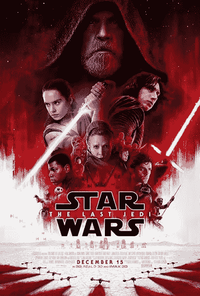

# 为什么以及如何开展数据科学学习项目

> 原文：<https://towardsdatascience.com/learning-projects-e831fa94f09f?source=collection_archive---------9----------------------->


[Stefan Steinbauer](https://unsplash.com/@usinglight?utm_source=medium&utm_medium=referral) on [Unsplash](https://unsplash.com?utm_source=medium&utm_medium=referral)

有很多关于如何创建项目以建立数据科学组合的博客帖子。我推荐[迈克尔·加拉尼克](https://medium.com/u/c07aac64b6e1?source=post_page-----e831fa94f09f--------------------------------)的[这首](/how-to-build-a-data-science-portfolio-5f566517c79c)和[康纳·杜威](/5-resources-to-inspire-your-next-data-science-project-ea6afbe20319)的这首。不幸的是，这种方法现在对我不起作用，因为我的日常工作非常耗时。我需要根据不断变化的需求，在更小的副主题上更快地迭代。

我测试了许多不同的方法来实现这一点。我完成了几个 Udacity 纳米学位，完成了 Coursera 和 Udemy 的课程，参加了网络研讨会，读了一堆 O'Reilly 的书。需要明确的是:所有这些资源都可以为您提供支持，具体取决于您在数据科学之旅中的位置。然而，对我来说最有效的是学习项目。

**学习项目是我为填补技能组合中的特定缺口而做的小型数据科学项目。它们不是为了给招聘人员或潜在雇主留下深刻印象。相反，他们为我提供了量身定制的挑战来提高我的能力。**

在这篇博文中，我与你分享了我现在从想法选择到评估的过程。每次迭代之后，我都会不断地改进它，但是总的模式是成立的。我也给你一个我最近的学习项目作为一个切实的例子。

# 第一步:找到一个你关心的想法

学习项目的灵感到处都在等着。一位同事提到一个你不知道的概念。或者，你听播客，偶然发现一些东西。或者你第 1000 次谷歌某样东西，想把它记在脑子里。长话短说:**想法是你的环境提供给你的，如果你有开放的心态**。

一旦你开始接触这些想法，你所需要的只是一个写下它们的地方。为此，我搭建了一个 Trello 板。我不认为有一个系统适合所有人，所以你可能需要做一些实验。但是，您的系统需要提供两件事情:

1.  它必须随时可以被访问。
2.  获得一个概述必须是简单的。

每当你有一个新的想法，添加一两句话作为一个新的项目来描述它。

当你准备好下一个项目时，检查你的清单。根据两个标准来标记想法:**内在动机**和**专业价值**。如果你目前的工作需要掌握一些东西，那么这就是你的最高优先级。

这里有一点很重要:现在还不要考虑可行性或实际细节。总有办法调整一个想法。数据科学是创造解决方案，而不是过分强调问题。

我最近的一个学习项目开始于我路过一家电影院时，看到了*最后的绝地*的电影海报:



当我看着这张海报的风格时，我想知道这部系列电影的前几部给了它多少设计灵感。由于我是一名数据科学家，所以没过多久，我就决定训练一个 CNN 对一张电影海报的十年进行分类。

# 第二步:做一个快速的可行性检查

数据可用性是所有数据科学的瓶颈。学习项目在这里也不例外。当你决定了你的想法，检查通常的数据来源，看看是否有足够的数据可用。有三种可能的结果:

1.  **你需要的确切数据已经准备好了**。如果是这样的话，对让它变得容易理解的人说声谢谢。享受这一刻。
2.  您找到了与您需要的相似但不完全符合您想法的数据。在这种情况下，考虑一下你是否能在保持核心动机不变的情况下调整你的计划。
3.  **没有有用的数据源。**一般来说，回到你的清单，选择另一个项目。不要删除你的想法。它可能会激发你新的想法，你可能会发现一个新的角度，或者新的数据可能会在某个时候变得可用。

就我而言，我已经知道 Kaggle 上的电影数据集，所以我开始在那里搜索。幸运的是，这个数据集包含了一段时间内成千上万部电影海报的链接。

# 第三步:明确你的学习目标

用`import pandas as pd`等等很容易让人马上开始，但是等等！你有一个想法，你知道有数据可以解决它。但是，你确定你想从中带走什么吗？换句话说:**退一步想想自己的学习目标。**要不要在 Pytorch 建立自己的第一个神经网络？您想了解特定类型数据的缺陷吗？要不要测试一下不同种类的超参数优化([不要脸的自我推销](/how-to-optimize-hyperparameters-of-machine-learning-models-98baec703593))？

如果你的想法与许多不同的学习目标有关，那就专注于对你来说最重要的那一部分。我在攻读博士学位期间学到了一条规则:要么专注于一个新论点、一个新数据集，要么专注于一种新方法。太多的活动部件使得很难得出正确的结论。同样的道理也适用于学习项目。

我的电影海报项目的目标是测试我建立一个从图片输入到预测输出的基本管道有多容易。换句话说，我的主要目标是进行自我评估，找出我需要克服的弱点。

# 第四步:专注于你的学习目标

从现在开始，没有明确的指导方针。然而，记住你的学习目标。例如，当你想比较你的神经网络的两个不同的激活函数时([另一个无耻的自我推销](/gentle-introduction-to-selus-b19943068cd9)，不要在数据探索上花太多时间。

实事求是地说:**把必要的和关键的任务分开**。尽可能做好前面的工作，但不要在这里研究或尝试新事物。相反，把你的大部分时间集中在后面的任务上。再说一次，学习项目并不意味着成为你的正式投资组合的一部分。他们的工作是推动你在学习曲线上走得更远。

# 例子:电影海报按年代分类

我的重点是建立一个基本的 CNN 管道，所以我没有花太多时间准备数据。相反，我删除了所有缺少值的行，而没有考虑是否有系统的原因。我还删除了所有具有非唯一链接的行，没有进一步检查。

从剩余的 24，812 部电影中，我选择了 800 部电影用于训练，200 部电影用于测试，这是从 20 世纪 50 年代开始的 60 年间的事情。随后，我写了一些代码，将相关的电影海报下载到`train`和`test`文件夹中，每个十年都有子文件夹。我意识到有些文件是空的，就额外写了代码删除 0 KB 的文件。完成这些步骤后，我的模型只剩下不到 800/200 个文件:

```
Images in train-folder:
00s: 788
50s: 768
60s: 754
70s: 771
80s: 760
90s: 779
Images in test-folder:
00s: 198
50s: 194
60s: 187
70s: 192
80s: 199
90s: 197
```

为了准备模型构建的文件，我使用了来自`keras.preprocessing.image`的`ImageDataGenerator`及其`flow_from_directory`方法。要了解更多细节，请看[维贾雅布哈斯卡尔 J](https://medium.com/@vijayabhaskar96/tutorial-image-classification-with-keras-flow-from-directory-and-generators-95f75ebe5720)[的这篇优秀的博客文章](https://medium.com/u/2ad7d6a6f8a1?source=post_page-----e831fa94f09f--------------------------------)或 Keras 博客[上的一个例子](https://blog.keras.io/building-powerful-image-classification-models-using-very-little-data.html)。

接下来，我用 Tensorflow 后端在 Keras 构建了一个标准的 CNN 架构。唯一的变化是我使用了 [SELUs 作为激活函数，而不是 ReLUs](/gentle-introduction-to-selus-b19943068cd9) 来反映我当前的知识。

然后，我花足够的时间进行微调，以获得大约 44%的验证准确率:

```
Epoch 1/7
145/144 [==============================] - 134s - loss: 2.6112 - acc: 0.2073 - val_loss: 2.3751 - val_acc: 0.2202
Epoch 2/7
145/144 [==============================] - 127s - loss: 1.6243 - acc: 0.3422 - val_loss: 1.6827 - val_acc: 0.3393
Epoch 3/7
145/144 [==============================] - 126s - loss: 1.2459 - acc: 0.5397 - val_loss: 1.8159 - val_acc: 0.3102
Epoch 4/7
145/144 [==============================] - 125s - loss: 0.8281 - acc: 0.7190 - val_loss: 1.7473 - val_acc: 0.4087
Epoch 5/7
145/144 [==============================] - 125s - loss: 0.4775 - acc: 0.8527 - val_loss: 2.0787 - val_acc: 0.4233
Epoch 6/7
145/144 [==============================] - 127s - loss: 0.2678 - acc: 0.9153 - val_loss: 2.6315 - val_acc: 0.4105
Epoch 7/7
145/144 [==============================] - 129s - loss: 0.1877 - acc: 0.9412 - val_loss: 2.7076 - val_acc: 0.4430
```

这个模型将上面的海报归类为 100%来自 60 年代。

这是一个非常简短的总结，但我相信您已经看到了为什么这不是一个包含在数据科学产品组合中的好选择的许多原因。同样，这不是学习项目的目的！我实现了我的学习目标，因为我意识到了这样一个管道的哪些部分是我最需要做的(图像预处理和生成器方法)。**现在我可以开始另一个学习项目，这个项目是为在下一次迭代中解决这些弱点而定制的。**

# 你完成了一个学习项目——现在呢？

**首先恭喜自己！**您进一步拓展了数据科学知识的范围。更重要的是，你培养了一种不断学习和成长的态度。

第二，确保充分利用你的工作:

1.  写下你可以毫无困难地做的事情。它将帮助你评估你现在作为一名数据科学家的地位。它也显示了当你开始时，你已经从后面走了多远。
2.  在追求你的学习目标的同时，写下你学到的东西。你买了多少？你应用的核心概念和技能是什么？特别注意你完成了多少学习目标，以及它是否符合你的期望。调整你即将到来的项目。
3.  写下**你在这个学习项目中注意到的**弱点。它将帮助你决定哪个想法是下一个学习项目的最佳选择。
4.  **重复。**

你的学习方法是什么？请在评论和 [**Twitter**](https://twitter.com/TimoBohm) **上告诉我什么对你有用，或者在**[**LinkedIn**](https://www.linkedin.com/in/timo-boehm-datascience/)**上联系我。**

**感谢阅读！如果你喜欢这篇文章，留下一些吧👏🏻并在 LinkedIn 或 Twitter 上分享。再次感谢，让我们继续学习！**